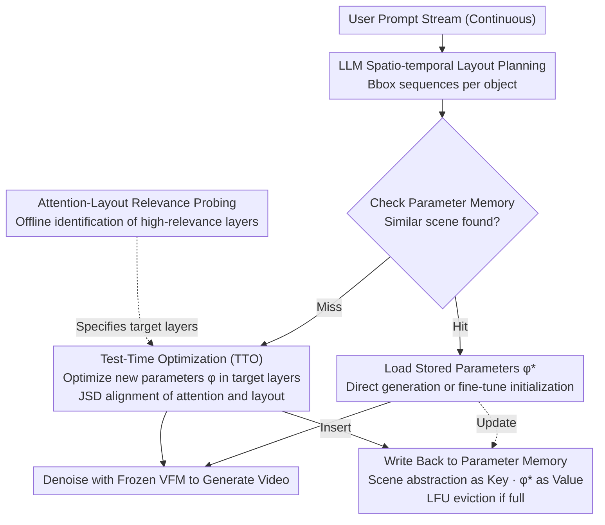

# TTOM: Test-Time Optimization and Memorization for Compositional Video Generation

**Conference**: ICLR 2026  
**arXiv**: [2510.07940](https://arxiv.org/abs/2510.07940)  
**Code**: [https://ttom-t2v.github.io/](https://ttom-t2v.github.io/)  
**Area**: Video Generation / Compositional Reasoning  
**Keywords**: Test-time Optimization, Compositional Video Generation, Parameter Memorization, Spatio-temporal Layout, Attention Alignment

## TL;DR
The TTOM framework is proposed to align the attention of video generation models with LLM-generated spatio-temporal layouts during inference by optimizing newly added parameters. A parameter memorization mechanism is utilized to store historical optimization contexts for reuse, achieving relative improvements of 34% (CogVideoX) and 14% (Wan2.1) on T2V-CompBench.

## Background & Motivation

**Background**: Text-to-Video (T2V) models perform excellently in single-object scenarios but remain significantly under-aligned in compositional scenarios (multiple objects + attributes + motion + spatial relations). Existing methods use LLMs to generate spatio-temporal layouts and guide generation by modifying latents or attention maps.

**Limitations of Prior Work**: (a) Direct intervention in latents or attention maps disrupts feature distributions, leading to flickering or collapse; (b) Independent per-sample processing fails to utilize historical context; (c) Interventions for one sample cannot generalize to others.

**Key Challenge**: The need for fine-grained control over compositional layouts without disrupting the feature distribution of pre-trained models.

**Goal**: To align compositional layouts at test-time in a model-agnostic manner while reusing historical optimization results.

**Key Insight**: Instead of modifying latents, insert and optimize new parameters to align attention with the layout—then store these optimized parameters in memory for future reuse.

**Core Idea**: Optimize parameters rather than latents to align layouts, and use parameter memorization to achieve knowledge accumulation and reuse across samples.

## Method

### Overall Architecture

TTOM addresses the dilemma in compositional video generation of requiring fine-grained layout control without destroying the feature distribution of pre-trained models. It treats this problem within a **streaming service** scenario: a system processes a continuous stream of user prompts and accumulates experience over time.

The method begins with an **offline preparation** step: an "Attention-Layout Relevance Probing" measures which layers in the DiT actually determine object layouts, identifying a small subset of high-relevance layers to target for subsequent optimization. Following this, it enters **online streaming processing**: for each incoming prompt, the pipeline first uses an LLM to translate the prompt into a **spatio-temporal layout** (a sequence of bboxes per object across frames). It then queries the **parameter memory** for similar scenes. If a match occurs (hit), the stored parameters are loaded (with optional fine-tuning); if not (miss), it proceeds to **Test-Time Optimization (TTO)**. TTO optimizes a set of newly inserted parameters only within the high-relevance layers to align the model’s attention with the LLM-provided layout. Finally, the optimized parameters and the abstract scene description are written back to memory for future reuse. The entire process leaves the latents untouched and the original model weights frozen.

### Key Designs

**1. Attention-Layout Relevance Probing: Identifying target layers**

DiT contains many attention layers; optimizing all of them blindly is inefficient and causes interference. TTOM performs offline probing: it generates a video normally, segments objects using GroundingDINO + SAM2 as "pseudo-ground truth layouts," and calculates the mIoU between attention maps and segmentation results for each layer. Results show that relevance varies significantly across layers—only a subset of layers truly determines the final object layout. Subsequent TTO focuses optimization only on these high-relevance layers.

**2. Test-Time Optimization (TTO): Optimizing parameters, not latents**

This is the core distinction between TTOM and "latent guidance" methods. Previous approaches directly modify latents $z_t$ or attention maps to force alignment, which often disrupts feature distributions and causes flickering. TTOM inserts a set of lightweight new parameters $\phi$ into the VFM and optimizes only $\phi$ during inference, allowing the model's attention to learn layout alignment. The alignment objective uses Jensen-Shannon Divergence (JSD) to bring the attention maps $\bar{A}_i$ and Gaussian-smoothed layout masks $\bar{B}_i$ closer as two distributions:

$$L_{align} = \frac{1}{N}\sum_i JSD(\bar{A}_i \| \bar{B}_i)$$

Since external parameters are optimized instead of the latents, the model's feature distribution is preserved, maintaining both alignment and image quality. The authors observe that JSD is more stable than direct L2 alignment.

**3. Parameter Memorization: Turning one-time optimization into reusable knowledge**

Another issue with per-sample optimization is that historical experience is discarded. TTOM equips the system with a parameter memory $\mathcal{M} = \{g(C): \phi^*_C\}$, where the key is the text embedding of a "scene abstraction $C$" through an encoder $g(C)$, and the value is the converged parameter set $\phi^*_C$. This memory supports insert, read, update, and delete operations, using an LFU (Least Frequently Used) policy for eviction. For new requests, parameters from similar scenes can be loaded directly to save time or used as a strong initialization for faster convergence of fine-tuning.

### Loss & Training

The entire process is **unsupervised**: only the alignment loss $L_{align}$ (JSD) is used at test-time to optimize the new parameters, requiring no labels. The LLM-generated layout includes a validation step to ensure consistency. Once a memory hit occurs, parameters can be loaded to skip optimization for immediate inference.

## Key Experimental Results

### Main Results

T2V-CompBench (7 categories of compositional video generation):

| Model | Avg. Score | Motion | Quantity | Spatial |
|-------|------------|--------|----------|---------|
| CogVideoX-5B | Baseline | Low | Low | Low |
| CogVideoX + TTOM | **+34%** | Gain | Gain | Gain |
| Wan2.1-14B | Baseline | Mid | Mid | Mid |
| Wan2.1 + TTOM | **+14%** | Gain | Gain | Gain |

Consistent improvements are also observed on VBench.

### Ablation Study

| Configuration | Description |
|---------------|-------------|
| Latent vs. Parameter Optimization | Parameter optimization yields better quality and avoids collapse |
| With vs. Without Memory | Memory significantly improves efficiency and quality |
| Layer Selection | Optimizing only high-relevance layers performs best |
| Skip Optimization on Hit | Drastically improves efficiency with minimal quality trade-off |
| Transferability | Parameters optimized for one scene generalize to similar scenes |

### Key Findings
- TTOM decouples compositional world knowledge—optimized parameters exhibit strong transferability and generalization.
- Parameter memorization makes streaming inference improve over time as historical patterns are reused for new scenes.
- The method is model-agnostic, proving effective on both CogVideoX and Wan2.1 architectures.
- JSD loss is more stable than direct L2 loss for attention alignment.

## Highlights & Insights
- **Parameter vs. Latent Optimization**: Avoiding direct intervention prevents feature distribution disruption, representing a more elegant control method than "latent guidance."
- **"The More the Better" Nature of Memory**: It transforms test-time optimization from a one-off cost into knowledge accumulation, conceptually similar to human experiential learning.
- **Forward-looking Streaming Setup**: Situating video generation within a continuous service framework rather than isolated requests aligns better with real-world deployment.
- **Attention-Layout Relevance Probing**: This provides an independent analytical value by systematically quantifying the correspondence between DiT attention layers and final layouts for the first time.

## Limitations & Future Work
- TTO requires additional optimization steps, leading to slower cold-start inference.
- Errors in LLM-generated spatio-temporal layouts can propagate to the generation results.
- Scene abstractions (e.g., "<object A> drifts above <object B>") may be too coarse.
- Validated only on T2V, not yet extended to image generation or 3D scenes.
- Memory capacity management and LFU strategies may not be optimal.

## Related Work & Insights
- **vs. LLM-grounded Diffusion (Lian et al., 2023b)**: Those methods optimize latents, causing quality degradation; TTOM avoids this by optimizing new parameters.
- **vs. TTT layers (Sun et al., 2024)**: TTT memory is intra-sample (inter-frame), whereas TTOM focuses on cross-sample parameter memory.
- **vs. Attend-and-Excite**: That method is for image-level attention; TTOM extends this to spatio-temporal attention in video.
- **Inspiration for Video Generation**: The paradigm of parameter-level control combined with cross-sample memory can be generalized to other controlled generation tasks.

## Rating
- Novelty: ⭐⭐⭐⭐⭐ The combination of TTO and parameter memory is highly novel; the streaming setup is forward-looking.
- Experimental Thoroughness: ⭐⭐⭐⭐ Sufficient testing across two benchmarks, multiple VFMs, and various ablations.
- Writing Quality: ⭐⭐⭐⭐⭐ Elegant framework design with a logically progressive motivation.
- Value: ⭐⭐⭐⭐⭐ Provides substantial advancement for compositional video generation with a paradigm that has broad application potential.

<!-- RELATED:START -->

## Related Papers

- [\[CVPR 2026\] VISTA: A Test-Time Self-Improving Video Generation Agent](../../CVPR2026/video_generation/vista_a_test-time_self-improving_video_generation_agent.md)
- [\[CVPR 2025\] One-Minute Video Generation with Test-Time Training](../../CVPR2025/video_generation/one-minute_video_generation_with_test-time_training.md)
- [\[CVPR 2026\] Reasoning Diffusion for Unpaired Test Time Out-of-distribution Text-Image to Video Generation](../../CVPR2026/video_generation/reasoning_diffusion_for_unpaired_test_time_out-of-distribution_text-image_to_vid.md)
- [\[ICLR 2026\] JavisDiT++: Unified Modeling and Optimization for Joint Audio-Video Generation](javisdit_unified_modeling_and_optimization_for_joint_audio-video_generation.md)
- [\[ICLR 2026\] Dual-IPO: Dual-Iterative Preference Optimization for Text-to-Video Generation](dual-ipo_dual-iterative_preference_optimization_for_text-to-video_generation.md)

<!-- RELATED:END -->
