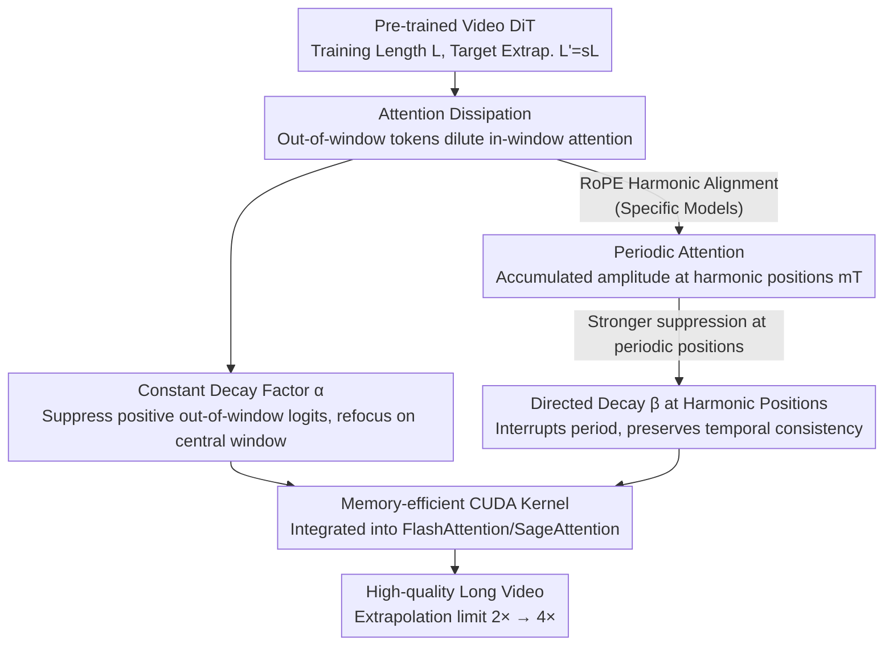

# UltraViCo: Breaking Extrapolation Limits in Video Diffusion Transformers

**Conference**: ICLR 2026  
**OpenReview**: [https://openreview.net/forum?id=fLLCmC53u9](https://openreview.net/forum?id=fLLCmC53u9)  
**Project Page**: [https://thu-ml.github.io/UltraViCo.github.io/](https://thu-ml.github.io/UltraViCo.github.io/)  
**Code**: See Project Page  
**Area**: Video Generation / Diffusion Models  
**Keywords**: Video length extrapolation, attention dissipation, RoPE, training-free, Diffusion Transformer

## TL;DR
This paper identifies that two failure modes—"periodic repetition" and "general quality degradation"—occurring in Video Diffusion Transformers during out-of-distribution length generation both stem from a single mechanism: **attention dissipation** (out-of-window tokens dilute the attention distribution learned within the training window). Based on this, it proposes UltraViCo, a training-free and plug-and-play method: it applies a constant decay factor to the attention logits of out-of-window tokens, pushing the extrapolation limit from 2× to 4× (at 4×, dynamic degree and imaging quality are 233% and 40.5% higher than previous state-of-the-art methods, respectively).

## Background & Motivation
**Background**: Text-to-video models using DiT as a backbone (e.g., Wan, HunyuanVideo, CogVideoX) can synthesize high-fidelity videos but are trained on a **fixed maximum sequence length** (e.g., 5 seconds). Once required to generate videos exceeding the training duration in a single pass—referred to as "video length extrapolation"—performance collapses. This focus is on the model's **intrinsic single-forward-pass** capability, which is orthogonal to inference-time sliding window stitching schemes like FreeNoise or FIFO-Diffusion.

**Limitations of Prior Work**: Two failure modes exist during extrapolation. First is **periodic content repetition**: specific models (HunyuanVideo, CogVideoX) loop short segments indefinitely. Second is **general quality degradation**: spatial details blur and temporal dynamics stagnate (the "frozen" screen), which occurs across all models. Both issues intensify as the extrapolation ratio increases.

**Key Challenge**: Previous works (e.g., RIFLEx) only explained and corrected repetition through **Rotary Positional Embedding (RoPE) periodicity**, ignoring quality degradation. Consequently, extrapolation capabilities remain limited (typically collapsing at 2×~3×). The authors argue that positional encoding is only an **indirect** factor—it influences attention by perturbing queries and keys; the direct determinant of how context is aggregated is the **attention map itself**. Shifting the perspective from positional encoding to the attention map allows for a unified explanation of both failures.

**Goal**: To answer three questions: Why does periodic repetition only appear in specific models? What is the root cause of quality degradation? Is there a unified cause behind these two seemingly independent failures?

**Key Insight**: By directly analyzing the extrapolation attention map $P\in\mathbb{R}^{L'\times L'}$, the authors observed that an intervention designed to fix "repetition" unexpectedly improved **video quality** as well. This clue linked the two failures together.

**Core Idea**: Both failures are unified under "attention dissipation." By **suppressing the attention** of tokens outside the training window and refocusing attention back toward the training window, both repetition and degradation can be cured without training.

## Method

### Overall Architecture
The logic of UltraViCo follows a "diagnose then prescribe" pipeline: first, it locates the cause of **periodic repetition** via attention map analysis (RoPE harmonics → periodic attention → periodic output); next, it discovers that interventions fixing repetition also improve quality, attributing quality degradation to the unified mechanism of **attention dissipation**. Finally, it provides a simple correction using a decay factor for out-of-window attention logits, implemented with a memory-efficient CUDA kernel for deployment on long-sequence large models. The input is a pre-trained video DiT (training length $L$) and a target extrapolation length $L'=sL$. The output is a long video without quality or dynamic collapse, achieved **without changing weights or fine-tuning**.

### Key Designs

**1. Attention Dissipation: Unifying Two Failures into One Root Cause**

This serves as the diagnostic foundation. The authors first deconstruct repetition: in the 4× extrapolation attention map $P$, HunyuanVideo exhibits **row-wise periodicity** $P_{i,j}\approx P_{i,j+T}$ (where $T$ is the observed period) and **relative position invariance** from RoPE $P_{i,j}\approx P_{i+p,j+p}$. Combining these implies the entire row repeats periodically $P_{i+T,j}\approx P_{i,j}$, resulting in $O_{i+T}=\sum_j P_{i+T,j}V_j\approx\sum_j P_{i,j}V_j=O_i$, manifesting as looping content.

The critical turning point: when the authors **masked tokens at harmonic alignment positions $mT$** to break the cycle, not only did repetition disappear, but **image quality improved simultaneously**. Comparison showed this intervention refocused the dissipated attention back to the **central training window**—masking harmonic peaks caused softmax renormalization to proportionally raise the remaining scores and sharpen the distribution. This led to the unified hypothesis: new out-of-window tokens **dilute** the attention learned within the training window (attention dissipation). Spatially, this forces the model to look at distant frames, losing focus on details (blurring); temporally, it mixes local motion with irrelevant motion (freezing). A controlled experiment confirmed: **gradually masking out-of-window attention scores to force centralization monotonically increases imaging quality and dynamic degree**.

**2. Harmonic RoPE Frequencies: Explaining "Why only certain models repeat"**

This addresses the anomaly where repetition occurs in HunyuanVideo/CogVideoX but not in Wan. The authors construct a **statistical row attention** $\bar S(\Delta t)$ (where $\Delta t$ is the frame distance) averaged across layers, heads, and query positions, which can be decomposed into a linear combination of trigonometric functions of RoPE frequencies:

$$\bar S(\Delta t)=\sum_{i=0}^{d/2-1} a_i\cos(\phi_i\Delta t+b_i)+C$$

Proposition 1 provides a periodicity criterion: if and only if all $\phi_i/\phi_{N-1}\in\mathbb{N}^+$ (forming a set of harmonics), $\bar S$ is a periodic function with period $T_{N-1}=2\pi/\phi_{N-1}$. At alignment positions $\Delta t=mT_{N-1}$, the amplitudes coherently sum to a maximum. HunyuanVideo satisfies this harmonic condition, where the dominant frequency $\phi_3$ and its harmonics contribute **79.6%** of the total amplitude, causing strong attention periodicity. In contrast, Wan's frequencies are non-harmonic and spectral power is dispersed (the largest frequency accounts for only 31.6%), resulting in no obvious period.

**3. Constant Decay Factor α + Directed Decay β at Harmonic Positions: One Solution for Two Issues**

To address attention dissipation, UltraViCo applies a position-dependent decay $\lambda_{ij}$ to attention logits $S_{ij}$, resulting in $S'_{ij}=\lambda_{ij}\cdot S_{ij}$:

$$\lambda_{ij}=\begin{cases}1,& |i-j|\le L/2 \ \text{or}\ S_{ij}<0\\ \alpha,& \text{otherwise}\end{cases}$$

The window $|i-j|\le L/2$ is kept at 1 to preserve core dynamics. Outside the window, only **positive** logits are suppressed ($\alpha<1$), as multiplying negative logits by $\alpha<1$ would increase them. The authors found that a constant form is sufficient—**the key is distinguishing between in-window and out-of-window, not the shape of the decay curve**.

For models prone to periodic repetition, harmonic alignment positions $mT$ attract disproportionately high attention. Using a small $\alpha$ uniformly might over-suppress useful context. Thus, **stronger decay** $\beta<\alpha$ is applied to these "risk positions":

$$\lambda_{ij}=\begin{cases}1,& |i-j|\le L/2\ \text{or}\ S_{ij}<0\\ \beta,& (i,j)\in P_{\text{risk}}\\ \alpha,& \text{otherwise}\end{cases}$$

Where $P_{\text{risk}}=\{(i,j)\mid mT-\gamma\le i-j\le mT+\gamma,\ m\in\mathbb{Z}\}$ is the neighborhood of harmonic alignment positions. This pulls attention back to the reliable window context (curing degradation) while precisely eliminating false periodic patterns (curing repetition). Implementation uses $\alpha=0.9$; for HunyuanVideo, $\gamma=4$, with $\beta$ set to 0.6 at 3× and 0.8 at 4×.

**4. Memory-efficient CUDA Kernel: Enabling Real-world Long Sequences**

UltraViCo requires modifying attention logits, but standard PyTorch attention is infeasible for long sequences: at 3× extrapolation, HunyuanVideo has ~200K tokens, and an explicit $200\text{K}\times200\text{K}$ bf16 attention mask would exceed 80GB VRAM. The authors integrated decay logic into Triton-based FlashAttention and SageAttention. Their online-softmax formulation naturally avoids explicit mask matrices, enabling a scalable, memory-saving implementation.

## Key Experimental Results

### Main Results
Evaluated on HunyuanVideo, Wan2.1-1.3B, and CogVideoX-5B using 100 VBench prompts. Metrics include Imaging Quality (Qual.), Dynamic Degree (Dyn.), Overall Consistency (Over.), Consistency (Consist.), NoRepeat score (NoRe., higher is better), and User ranking (User, lower is better). Below are results for HunyuanVideo at 3× / 4× extrapolation:

| Setup | Method | NoRe.↑ | Dyn.↑ | Qual.↑ | Over.↑ | User↓ |
|------|------|--------|-------|--------|--------|-------|
| Train Ref. | Normal. | – | 71 | 69.31 | 26.81 | – |
| 3× | RIFLEx | 73.97 | 17 | 50.57 | 21.22 | 4.67 |
| 3× | **Ours** | **100.0** | **62** | **65.00** | **26.45** | **1.02** |
| 4× | RIFLEx | 52.84 | 11 | 41.02 | 16.47 | 4.69 |
| 4× | **Ours** | **99.87** | **42** | **66.54** | **24.52** | **1.02** |

For Wan2.1-1.3B (no repetition), all baselines collapsed to static videos (Dynamic Degree ≤ 12) at 4× extrapolation, while UltraViCo recovered to 47. The authors claim to push the practical extrapolation limit from **2× to 4×**, achieving a **233%** Gain in Dynamic Degree and a **40.5%** Gain in Imaging Quality over the previous best method at 4×.

### Ablation Study

| Config | Key Finding |
|------|---------|
| Decay Shape (Constant / Linear / Parabolic) | Minimal difference; implies the key is "window separation," not curve shape. |
| Decay Intensity α | $\alpha=0.9$ is optimal. Too small hurts consistency; too large limits gain. |
| $\alpha/\beta$ Sensitivity | Stable at $\alpha\ge0.9$, $\beta\ge0.6$. Consistency drops sharply below these. |
| Masking Ratio (Focus Level) | Monotonic positive correlation: more out-of-window masking leads to better quality. |

### Key Findings
- Intervening on repetition (masking harmonic positions) simultaneously improves quality—this was the key clue for identifying "attention dissipation" as the root cause.
- UltraViCo is orthogonal to sliding window, FreeNoise, and FIFO-Diffusion methods: stacking it (e.g., to 6× extrapolation for 30s video) stabilizes long-term consistency.
- Zero-cost transfer: Applied via VACE, it achieves 3× extrapolation in controllable generation and video editing.

## Highlights & Insights
- **Unified perspective is the biggest highlight**: Solving "periodic repetition" and "quality degradation" through a single "attention dissipation" mechanism, proving the former is just a periodic manifestation of the latter.
- **Shift from positional encoding to attention mapping**: Demonstrating that attention maps are the direct determinant of output aggregation, enabling a solution for both failure modes simultaneously.
- **Extreme simplicity and training-free**: The core fix is just a constant $\alpha$ multiplier for out-of-window logits, yet it doubles the extrapolation limit.
- **Transferable harmonic RoPE analysis**: The trigonometric decomposition of statistical row attention $\bar S(\Delta t)$ provides a diagnostic tool for periodicity in any RoPE-based model.

## Limitations & Future Work
- The decay threshold uses a hard truncation ($|i-j|\le L/2$), which is somewhat mechanical and might suppress useful long-range context in content requiring long-distance dependencies.
- Targeted decay at harmonic positions requires identifying the period $T$ and tuning $\gamma$ and $\beta$, which limits automation for unknown models.
- Verification was primarily on 3×~4× extrapolation; whether constant decay remains stable for more aggressive extrapolation (e.g., 10×+) is not fully explored.
- Evaluation relies on a VBench subset and a 10-person user study; larger-scale evaluation is needed.

## Related Work & Insights
- **vs RIFLEx**: RIFLEx only fixes repetition via RoPE periodicity and suffers quality collapse. UltraViCo addresses the unified root cause, pushing limits from 2× to 4×.
- **vs PI / NTK / YaRN / TASR**: These RoPE-interpolation methods typically collapse to static video beyond 3× extrapolation. UltraViCo maintains fluid motion.
- **vs Post-processing long video schemes**: UltraViCo enhances the **intrinsic** single-forward capability of the model and is complementary to external scheduling schemes.

## Rating
- Novelty: ⭐⭐⭐⭐⭐ Unifies two extrapolation failures under one root cause with solid harmonic analysis.
- Experimental Thoroughness: ⭐⭐⭐⭐ Covers various models and ratios, though user study scale is relatively small.
- Writing Quality: ⭐⭐⭐⭐⭐ Clear logical chain from diagnosis to hypothesis to verification.
- Value: ⭐⭐⭐⭐⭐ Training-free, plug-and-play, doubles extrapolation limits with high practical value.

<!-- RELATED:START -->

## Related Papers

- [\[ICML 2025\] RIFLEx: A Free Lunch for Length Extrapolation in Video Diffusion Transformers](../../ICML2025/video_generation/riflex_a_free_lunch_for_length_extrapolation_in_video_diffusion_transformers.md)
- [\[ICLR 2026\] BWCache: Accelerating Video Diffusion Transformers through Block-Wise Caching](bwcache_accelerating_video_diffusion_transformers_through_block-wise_caching.md)
- [\[CVPR 2025\] PatchVSR: Breaking Video Diffusion Resolution Limits with Patch-Wise Video Super-Resolution](../../CVPR2025/video_generation/patchvsr_breaking_video_diffusion_resolution_limits_with_patch-wise_video_super-.md)
- [\[ICLR 2026\] FastVMT: Eliminating Redundancy in Video Motion Transfer](fastvmt_eliminating_redundancy_in_video_motion_transfer.md)
- [\[CVPR 2026\] VMonarch: Efficient Video Diffusion Transformers with Structured Attention](../../CVPR2026/video_generation/vmonarch_efficient_video_diffusion_transformers_with_structured_attention.md)

<!-- RELATED:END -->
