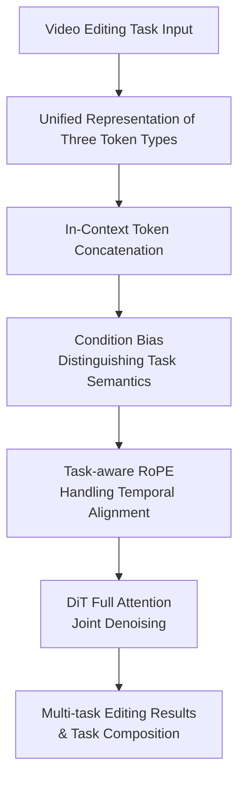

# Unified In-Context Video Editing

**Conference**: ICLR2026  
**OpenReview**: [https://openreview.net/forum?id=Vb4nE3WWf5](https://openreview.net/forum?id=Vb4nE3WWf5)  
**Paper**: [OpenReview](https://openreview.net/forum?id=Vb4nE3WWf5)  
**Code**: Project Page https://zixuan-ye.github.io/UNIC  
**Area**: Video Generation / Video Editing / Diffusion Models  
**Keywords**: in-context video editing, video editing, multi-task unification, DiT, conditional control  

## TL;DR
UNIC represents the source video, multimodal editing conditions, and target video noise latents as a single token sequence. This allows the video DiT to perform ID insertion/replacement/deletion, stylization, first-frame propagation, and re-camera control using native full attention within the context, while mitigating multi-task confusion through Task-aware RoPE and Condition Bias.

## Background & Motivation

**Background**: Video generation models have evolved from simple text-to-video to controllable editing. Real-world editing requirements are often too complex for simple prompts, requiring simultaneous reference to source video motion/scenes, target object images, style images, first-frame edits, and even per-frame camera trajectories. Consequently, video editing tasks naturally manifest as multimodal, multi-task problems with strong temporal constraints.

**Limitations of Prior Work**: Existing approaches generally follow two paths. One involves DDIM inversion of the reference video, incorporating inverted noise or intermediate features into the generation process to preserve structure and motion. These methods are typically slow, and the extra inversion phase splits the workflow into two stages. The other path uses specialized adapters or ControlNets for different conditions—modules for reference videos, ID images, style images, or camera control. While effective for single tasks, adding new conditions increases parameter counts and engineering complexity.

**Key Challenge**: The ideal scenario for video editing is a single model that infers the required task based on the provided context. However, condition modalities vary significantly across tasks. Camera poses align per-frame, while style images impact the entire video; a single image might represent an object ID to be inserted or an artistic style. Simply concatenating all conditions leads to temporal index collisions and task semantic confusion.

**Goal**: The authors aim to consolidate multiple typical video editing tasks into a unified framework rather than training independent structures. This involves three goals: reducing diverse task inputs into a unified token representation; enabling the DiT to model token relationships directly without task-specific control modules; and resolving positional encoding and task identification issues during multi-task unification.

**Key Insight**: The paper draws inspiration from in-context learning in unified image generation/editing. Since DiT is fundamentally a Transformer, conditions do not need to be injected via external adapters; they can participate in attention as part of the input sequence. For video editing, the critical factor is not the existence of condition modules, but whether condition tokens, source video tokens, and target video tokens correctly align within the same attention space.

**Core Idea**: UNIC uses a continuous token sequence to unify the "target noise latent + source video + multimodal conditions." It utilizes Task-aware RoPE and learnable Condition Bias to inform the model which tokens are frame-aligned and which are task slots, transforming various video editing tasks into an in-context conditional generation problem for a single DiT.

## Method

### Overall Architecture
UNIC focuses on generating a target video $V_{tar}$ given a reference video $V_{ref}$ and various conditions $\{C_i\}$, preserving necessary content while satisfying conditions. It eschews DDIM inversion and task-specific control modules. Instead, it tokenizes all inputs and concatenates them along the frame dimension: noisy target video tokens, reference video tokens, and multimodal condition tokens.

During generation, target video latents $z_{tar}$ start from noise; the reference video is encoded into $z_{ref}$ via a 3D VAE; image conditions are similarly encoded via a 3D VAE, text is processed by a T5 tokenizer, and camera poses are projected by an MLP to align with video token dimensions. The final input is $z=[z_{tar};z_{ref};z_{cond}]$, where the DiT's 3D full attention facilitates interaction between the source, conditions, and target in a unified sequence.

This framework shifts "task types" from the network architecture to the context itself. Tasks like ID insertion, replacement, deletion, stylization, propagation, and camera control use the same model with different condition tokens. Providing both an ID image and a style image in the context allows the model to exhibit task composition capabilities.

### Key Designs

**1. Unified Representation: Formatting Video Editing as Conditional Generation**

UNIC categorizes editing inputs into three types. First, noisy tokens represent the current state of the target video latent during the diffusion/flow matching process. Second, reference video tokens, encoded by a 3D VAE, provide motion, scene, and content to be preserved. Third, multi-modal condition tokens include text, ID images, style images, the first frame, and camera poses.

This categorization resolves the "interface inconsistency" problem. For instance, in ID insertion, the reference video provides background and motion, the ID image provides the object, and text describes the semantics. In camera control, the reference video acts as soft guidance while camera poses provide per-frame perspective changes. UNIC treats these as "target noisy tokens reading information from reference and condition tokens," allowing the model to learn editing behavior from context rather than specific adapters.

**2. In-context Token Concatenation: Replacing Specialized Modules with Native Attention**

Traditional adapters encode conditions into features injected via extra modules. UNIC leverages the Transformer's nature: conditions are converted to tokens and placed in the same sequence. Multimodal conditions are represented as $z_{cond}=[z_1;\ldots;z_N]$ and concatenated as $z=[z_{tar};z_{ref};z_{cond}]$. Subsequent 3D self-attention handles interactions across space, time, and conditions.

This design is parameter-efficient and extensible. Adding a condition type only requires a tokenizer (e.g., an MLP for camera poses, VAE for images), without modifying the DiT backbone. It also facilitates task composition naturally, as combining tasks simply involves providing multiple conditions in the context rather than stacking LoRAs or adapters, which reduces control conflicts.

**3. Condition Bias: Identifying Tasks to Prevent Modality Confusion**

Direct token concatenation can cause ambiguity. For example, an image condition might mean "insert this object" in ID insertion or "apply this style" in stylization. Without task identity, same-modality conditions can be misinterpreted.

UNIC adds a learnable task bias to each condition token. For conditions $z_i\in\{z_{ref},z_1,\ldots,z_N\}$, the model applies $b_i\in\mathbb{R}^d$ to get $\tilde{z_i}=z_i+b_i$. This bias is a lightweight task label allowing attention to perceive whether tokens represent IDs, styles, cameras, or reference videos. These biases are zero-initialized to preserve original semantics at the start of training before gradually learning task distinctions.

**4. Task-aware RoPE: Resolving Alignment Conflicts and Length Variations**

Standard 3D RoPE indexes tokens sequentially along the frame dimension. If target, reference, and camera tokens are placed in sequence, frame $t$ of the reference and frame $t$ of the target will have different indices, and boundaries will shift if video length $N$ changes. This disrupts temporal correspondence for frame-aligned conditions.

Task-aware RoPE uses two strategies. For conditions with direct frame correspondence (reference video, camera poses, audio), it reuses indices $0\ldots N-1$ from the target noisy latent, ensuring alignment. For non-frame-aligned conditions (ID images, style images), it applies a base offset $m=N$ followed by task-specific offsets $O_t$ and slot lengths $L_t$, resulting in $Index(t)=(m+O_t)+[0,\ldots,L_t-1]$. This avoids positional collisions while providing stable task slots.

### Loss & Training
The paper adopts a flow matching-based video diffusion Transformer. Training uses real samples $x_1\sim p(x_1)$ and Gaussian noise $x_0\sim\mathcal{N}(0,1)$ to construct $x_t=tx_1+(1-t)x_0$. The model predicts the velocity field:

$$
L_{FM}(\theta)=\mathbb{E}_{t,x_0,x_1}\|v_\theta(x_t,t)-(x_1-x_0)\|_2^2
$$

The sampling ODE is $\frac{dx_t}{dt}=v_\theta(x_t,t)$. The backbone includes multiple DiT blocks with 2D/3D self-attention, cross-attention, and FFNs. 3D VAE and T5 are frozen; only the Transformer and new tokenizers (e.g., camera MLP) are fine-tuned.

Training follows a "hard-to-easy" curriculum. The authors observed that tasks like camera control require ~600k iterations to converge, while ID swap needs only ~80k. Starting with easy tasks or simple joint training causes the model to settle on easy gradients and underperform on difficult tasks. UNIC trains on camera control first, then progressively adds ID, stylization, and propagation tasks. Finetuning starts from a 1B pre-trained model on 32 H800 GPUs for 16k iterations with a batch size of 64.

## Key Experimental Results

### Main Results
A benchmark was constructed covering six tasks: ID Insert, ID Swap, ID Delete, Re-Camera Control, Stylization, and Propagation. 

| Task | Metric | Strong Baseline | UNIC (Ours) | Conclusion |
|------|--------|-----------------|-------------|------------|
| ID Insert | CLIP-I / DINO-I / Aesthetic | Pika: 0.689 / 0.387 / 5.393 | 0.598 / 0.245 / 5.627 | Identity similarity is not always highest, but aesthetic score is better, and one model supports multiple tasks. |
| ID Swap | CLIP-I / DINO-I / CLIP-score | VACE: 0.712 / 0.423 / 0.230 | 0.725 / 0.429 / 0.242 | Outperforms unified baselines and propagation variants in identity and text alignment. |
| ID Delete | PSNR / RefVideo-CLIP / CLIP-score | VideoPainter: 22.987 / 0.920 / 0.212 | 19.171 / 0.900 / 0.217 | Specialized inpainting is stronger in reconstruction; UNIC is better in semantic alignment. |
| Propagation | RefVideo-CLIP / Smoothness / Aesthetic | AnyV2V: 0.812 / 0.935 / 5.136 | 0.840 / 0.966 / 5.565 | Frame alignment and video quality are more stable. |
| Stylization | CSD-score / ArtFID / Aesthetic | StyleMaster: 0.306 / 38.213 / 5.121 | 0.259 / 37.619 / 5.276 | Style similarity is slightly lower than specialized models, but content/quality is competitive. |
| Re-Camera | RotErr / TransErr / Smoothness | ReCamMaster-Wan: 1.454 / 5.695 / 0.917 | 1.275 / 5.667 / 0.933 | Lower camera control error, showing the unified framework does not sacrifice difficult tasks. |

### Ablation Study

| Configuration | Metric | Description |
|---------------|--------|-------------|
| Hard-to-easy Training | ReCam RotErr 1.275, ID CLIP-I 0.725 | Most stable overall performance, especially for camera control. |
| Easy-to-hard Training | ReCam RotErr 1.398, ID CLIP-I 0.726 | Comparable for easy tasks, slightly weaker for difficult ones. |
| Joint Training | ReCam RotErr 2.287, TransErr 9.694 | Learned easy tasks but failed significantly on camera control. |
| Task-Specialist Mods | ID DINO-I 0.449, ReCam RotErr 1.472 | Strong on specific tasks but lacks compositional ability. |
| Unified Model (Ours) | ID DINO-I 0.429, ReCam RotErr 1.275 | No significant degradation compared to specialists; camera metrics improved. |
| No Bias + No RoPE | ReCam TransErr 8.972 | Succeeds on simple tasks but fails complex temporal control. |
| Condition Bias Only | ID CLIP-I 0.723, ReCam TransErr 6.039 | Improved task identification, especially for same-modality conditions. |

### Key Findings
- Unified training does not necessarily sacrifice single-task performance. The B4 unified model outperformed camera-only models in camera metrics, though it showed a minor trade-off between style and content preservation in stylization.
- Condition Bias and Task-aware RoPE solve different problems: semantics and spatio-temporal geometry, respectively. They are highly complementary.
- Task difficulty imbalance is a core issue. Joint training is insufficient for hard tasks like camera control; a curriculum is necessary.
- Knowledge transfer exists: fine-tuning propagation based on ID swap knowledge achieved higher scores in fewer steps than training propagation alone.

## Highlights & Insights
- **Control interface as token interface**: UNIC's value lies in unifying engineering interfaces into token sequences. New tasks become problems of tokenization and slot allocation rather than architectural design.
- **Positional encoding as a key detail**: While simple concatenation works for images, video requires explicit temporal alignment ("which condition aligns with frame $t$"). Task-aware RoPE is a robust solution for this.
- **Task identity beyond text prompts**: Experiments show that using text prompts to indicate tasks can harm video consistency. Condition Bias acts as a low-level structural hint that preserves fidelity.
- **Task composition via unified attention**: Combined tasks are processed in a single attention space, allowing for joint constraints (e.g., changing a subject while modifying a lens and keeping motion) rather than sequential filtering.
- **Unified models require training schedules**: Models prioritize easy tasks with shorter gradient paths. Hard-to-easy scheduling is a critical insight for unified generative models.

## Limitations & Future Work
- Current unification covers six tasks; extending this to lip-sync, FX, or multi-subject interaction remains unproven.
- Computational overhead grows with token count. Future work requires more efficient in-context attention or condition caching.
- It is not yet a "specialist killer." Dedicated models for inpainting or stylization still hold leads in specific metrics like PSNR or style similarity.
- Task-aware RoPE slot allocation is manually designed. Automating slot and bias management is necessary for scalability.

## Related Work & Insights
- **vs DDIM Inversion**: Methods like Video-P2P or AnyV2V provide strong structure binding but are multi-stage. UNIC is faster and simpler but may lack the precise reconstruction of inversion-based methods in extreme cases.
- **vs Adapters (ControlNet)**: UNIC simplifies the architecture by letting DiT full attention handle interactions, sacrificing specialized inductive biases for parameter efficiency and flexibility.
- **vs OmniGen (Unified Image Gen)**: UNIC extends unified in-context image generation to video DiT, addressing the unique temporal alignment issues inherent in video.

## Rating
- Novelty: ⭐⭐⭐⭐☆ Unified in-context tokens for video editing with Task-aware RoPE is a clear and effective design.
- Experimental Thoroughness: ⭐⭐⭐⭐☆ Solid 6-task benchmark and ablations, though user studies are missing.
- Writing Quality: ⭐⭐⭐⭐☆ Logical and detailed.
- Value: ⭐⭐⭐⭐⭐ Highly relevant for unified video models, specifically the tokenization and curriculum training strategies.

<!-- RELATED:START -->

## Related Papers

- [\[ICML 2026\] Lightning Unified Video Editing via In-Context Sparse Attention](../../ICML2026/video_generation/lightning_unified_video_editing_via_in-context_sparse_attention.md)
- [\[ICLR 2026\] EditVerse: Unifying Image and Video Editing and Generation with In-Context Learning](editverse_unifying_image_and_video_editing_and_generation_with_in-context_learni.md)
- [\[ICLR 2026\] UniVideo: Unified Understanding, Generation, and Editing for Videos](univideo_unified_understanding_generation_and_editing_for_videos.md)
- [\[ICLR 2026\] Pixel-Perfect Puppetry: Precision-Guided Enhancement for Face Image and Video Editing](pixel-perfect_puppetry_precision-guided_enhancement_for_face_image_and_video_edi.md)
- [\[ICLR 2026\] Controllable First-Frame-Guided Video Editing via Mask-Aware LoRA Fine-Tuning](controllable_first-frame-guided_video_editing_via_mask-aware_lora_fine-tuning.md)

<!-- RELATED:END -->
