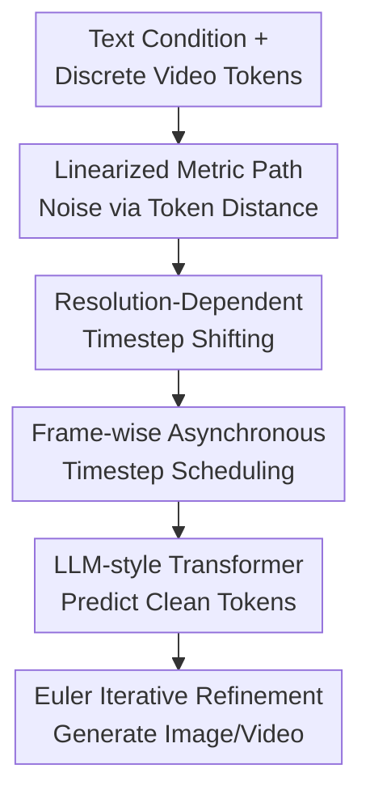

# Uniform Discrete Diffusion with Metric Path for Video Generation

**Conference**: ICLR 2026  
**OpenReview**: [https://openreview.net/forum?id=GFU5yCbILk](https://openreview.net/forum?id=GFU5yCbILk)  
**Paper**: OpenReview  
**Code**: https://github.com/baaivision/URSA  
**Area**: Video Generation / Diffusion Models  
**Keywords**: Discrete Diffusion, Video Generation, metric path, Long Video, Asynchronous Timestep Scheduling

## TL;DR
URSA reformulates image and video generation as a global iterative refinement process on discrete visual tokens. By utilizing a linearized metric path based on token embedding distances, resolution-dependent timestep shifting, and frame-wise asynchronous noise scheduling, it enables discrete diffusion to approach or even match the performance of continuous diffusion models in text-to-video, image-to-video, and high-resolution image generation.

## Background & Motivation
**Background**: Current high-quality visual generation is largely dominated by continuous space diffusion or flow matching. Images and videos are typically encoded into continuous latents and recovered through stepwise denoising, establishing a de facto standard for image quality, semantic alignment, and temporal consistency. Meanwhile, the success of language models has demonstrated the scaling potential of discrete token sequence modeling, leading to the emergence of autoregressive visual token models and masked token generation models.

**Limitations of Prior Work**: The core issue with discrete visual generation is not an inelegant framework, but rather the cumulative errors exposed during high-resolution and long video generation. In autoregressive models, an error in early tokens propagates through the subsequent context. Masked diffusion / MaskGIT methods, while capable of parallel prediction, often lack the global iterative refinement opportunities found in continuous diffusion for tokens that have already been generated or assigned high confidence. Video scenarios are particularly challenging as subjects, backgrounds, and motion must remain consistent across many frames; non-correctable local generation paradigms easily lead to flickering, unnatural movements, or long-context drift.

**Key Challenge**: Discrete tokens facilitate the unification of text and visual sequences and the reuse of LLM architectures. However, traditional discrete generation paths offer coarse control over visual structural perturbations, either solidifying token-by-token or approximating noise intensity via mask ratios. They lack an interpretable and adjustable global refinement trajectory like the SNR/timestep in continuous diffusion. Furthermore, long sequences introduce a contradiction where the same timestep does not represent equivalent corruption for low-resolution short sequences versus high-resolution long videos.

**Goal**: The authors aim to address three specific problems: 1) enabling discrete visual generation to perform global iterative refinement starting from random noise, similar to continuous diffusion; 2) providing controllable perturbation paths for varying resolutions and video lengths; 3) supporting text-to-video, image-to-video, interpolation, extrapolation, and long video generation within a single model without requiring specific conditional forms for each task.

**Key Insight**: URSA observes that visual tokenizer codebooks are not unstructured sets; token embedding distances carry visual similarity. By constructing the path from noise tokens to clean tokens based on these embedding distances—rather than relying solely on mask/unmask or uniform categorical mixing—one can achieve a "gradual distance reduction" process in discrete space that closely mirrors continuous diffusion.

**Core Idea**: Utilize a metric-guided probability path for global iterative refinement on discrete visual tokens, extending this to high-resolution and multi-task video generation through timestep shifting and frame-wise asynchronous scheduling.

## Method

### Overall Architecture
The input to URSA consists of text tokens and discrete spatio-temporal visual tokens obtained from a video tokenizer. The output is the clean image or video tokens within the same discrete vocabulary. During training, real video $x_1$ is encoded into tokens, and noisy tokens $x_t$ are sampled according to the metric path. The model then predicts the original clean tokens given text conditions $e$ and $x_t$. During sampling, it starts from uniform categorical noise $x_0 \sim \mathrm{Unif}([K])^D$, iteratively estimates target tokens, and updates the entire video using a discrete flow matching velocity field.

The primary difference from autoregressive models is that URSA performs global updates on the entire token sequence at each step rather than fixing tokens from left to right. Unlike standard masked diffusion, URSA's noise state is not "some positions masked and others fixed"; instead, every token moves closer to the target along a probability path defined by embedding distances, allowing intermediate states to be constantly refined.

### Key Designs
**1. Linearized Metric Path: Controllable Visual Distance Trajectories**

If a discrete vocabulary is treated as $K$ unordered categories, the path from noise to target fails to describe the degree of visual corruption. URSA utilizes the embedding distance $d(x, x_1)$ between token $x$ and target token $x_1$ from the tokenizer codebook to construct a conditional probability path:

$$
p_t(x \mid x_1)=\mathrm{softmax}(-\beta_t d(x,x_1)).
$$

At $t=0$, $\beta_0=0$, resulting in equal probability for all tokens (uniform noise). As $t \rightarrow 1$, $\beta_t \rightarrow \infty$, and the probability concentrates on the target token itself. Intermediate steps follow the embedding distance. The scheduler is defined as $\beta_t=c(\frac{t}{1-t})^\alpha$, where $c$ and $\alpha$ control the relationship between $t$ and the average perturbation distance $d(x_t,x_1)$.

The significance lies in granting discrete diffusion a continuous scale similar to noise intensity in continuous models. The paper finds that when $t$ is approximately linearly correlated with the embedding distance from the noisy to clean token, the model better learns hierarchical recovery from coarse semantics to fine details.

**2. Resolution-Dependent Timestep Shifting: Consistent Timestep Semantics**

Long videos and high-resolution images contain more visual tokens. A constant $t$ does not cause the same level of corruption across different sequence lengths. URSA maps the original timestep $t$ to $\tilde t$ using a shifting parameter $\lambda$:

$$
\tilde t=\frac{t}{t+\lambda(1-t)}.
$$

For $\lambda>1$, the path is pushed toward stronger perturbation regions (suitable for high-res/long sequences), while $\lambda<1$ ensures milder perturbations. This allows for reallocating training difficulty along an interpretable distance trajectory, which is vital for video; the model must learn global scene organization from noise early on without being overwhelmed by excessive noise across all samples.

**3. Frame-wise Asynchronous Timestep Scheduling: Single-Model Multi-task Support**

Standard video diffusion typically applies the same noise level to an entire video clip. This is limiting for tasks like Image-to-Video (I2V) or interpolation, where some frames should remain clean as conditions. URSA adopts a strategy where each frame $i$ independently samples a timestep $t_i \sim U(0,1)$, forming $T=\{t_1,t_2,\ldots,t_n\}$.

This enables the model to handle videos where different frames are in different noise states. If the first frame is near $t=1$ and subsequent frames start from noise, the model naturally performs I2V. If the start and end frames are clean, it performs interpolation. Sliding context windows can further enable long video extrapolation. This unifies various tasks into one discrete diffusion model without task-specific heads.

**4. LLM Architecture for Discrete Visual Diffusion**

The backbone utilizes the Qwen3 LLM architecture. Text tokens and noisy visual tokens are concatenated as input, and the model outputs logits over the visual codebook. For vision, the Cosmos tokenizer is used ($4\times$ temporal and $8\times8$ spatial compression), while high-res image experiments utilize an IBQ tokenizer ($16\times16$ spatial). Positional encoding uses an enhanced 3D M-RoPE to handle temporal and spatial dimensions.

### Mechanism Example
To generate "a robot arm pours coffee" at $49\times512\times320$: During training, the video is tokenized. URSA samples timesteps for each frame (e.g., $t=0.25$ for early frames, $t=0.88$ for later). Each token is sampled from $p_t(x\mid x_1)$ based on embedding distances. During sampling, if given an image of the first frame, that frame is set to a high $t$ (clean), while the rest start from uniform noise, using a 50-step Euler update to complete the sequence.

### Loss & Training
The objective is cross-entropy loss for predicting clean visual tokens. Given text $e$, target $x_1$, and noisy $x_t$:

$$
L=\mathbb{E}_{t\sim U[0,1],x_1,x_t}\left[-\log p_{1\mid t}(x_1\mid x_t,e)\right].
$$

Sampling uses an Euler solver with a velocity field $u_t$ calculated from current $x_t$ and predicted $\hat{x}_1$. Image generation uses 25 steps; video uses 50. Data includes 16M image-text pairs + 14M FLUX.1 generated images for T2I, and 24M high-quality video-text pairs for T2V.

## Key Experimental Results

### Main Results
| Task / Benchmark | Metric | URSA | Comparison | Conclusion |
|--------|------|------|----------|------|
| Text-to-Video / VBench | Total Score | 82.4 | Emu3 81.0, Wan2.1 83.7 | Significantly outperforms previous discrete models |
| Text-to-Video / VBench | Dynamic Degree | 81.4 | HunyuanVideo 70.8 | High motion degree; avoids "static frame" issues |
| Image-to-Video / VBench++ | Total Score | 86.2 | CogVideoX 86.7 | Competes with specialized I2V models via unified modeling |
| Text-to-Image / DPG-Bench | Overall | 86.0 | Janus-Pro 84.2, Show-o2 86.1 | Top-tier semantic alignment for discrete methods |

### Ablation Study
| Configuration | Key Metric | Description |
|------|---------|------|
| Masked diffusion | VBench ~69 | Quality limited by inability to correct errors in long sequences |
| Mixture path | > Masked diffusion | Discrete diffusion helps, but path shape remains critical |
| $\lambda$ shift3 | VBench 81.2 | Optimal balance for resolution handling |
| 4B model | T2V 80.5 | Scaling primarily improves semantics; quality bottleneck may be the tokenizer |

### Key Findings
- Discrete video generation requires "globally correctable refinement." Metric path uniform diffusion is more stable than masked diffusion for long, redundant video sequences.
- Linearized paths are not just theoretical; they match the distance change behavior of continuous models like SD3, leading to better convergence.
- Timestep shifting is more sensitive in video than images due to the high token count.
- Model scaling improves semantic understanding, but visual fidelity appears limited by the discrete tokenizer's reconstruction capabilities.

## Highlights & Insights
- Transforming "embedding distance" into a diffusion path is the most valuable contribution, allowing discrete space to carry continuous noise semantics.
- Task unification stems from the timestep schedule, not specialized architectures, providing an elegant abstraction for I2V and interpolation.
- URSA identifies "non-correctability" as the primary weakness of autoregressive/masked models in long video generation and addresses it via global iteration.
- Results suggest the tokenizer is the next major bottleneck for discrete video models.

## Limitations & Future Work
- Heavy reliance on the visual tokenizer's reconstruction quality and compression granularity.
- Quantitative evaluation of long-form videos (minutes long) and long-range subject consistency needs further systematic study.
- Path parameters ($c, \alpha$) still require empirical search; automatic estimation through statistics or resolution data is a potential future direction.
- Training cost is high (128 A100s, tens of millions of samples).

## Related Work & Insights
- **vs AR Models (Emu3, VideoPoet)**: AR is strictly sequential; URSA allows global refinement, which is better for temporal consistency.
- **vs Masked Diffusion**: Masked models fix tokens early; URSA keeps all tokens "soft" throughout the probability path.
- **vs Continuous Models (OpenSora, Wan)**: Continuous models still lead in quality, but URSA proves discrete methods can bridge the gap while maintaining unified modeling advantages.

## Rating
- Novelty: ⭐⭐⭐⭐⭐ Reshaping discrete diffusion via metric paths is a clever, effective solution.
- Experimental Thoroughness: ⭐⭐⭐⭐ Solid results across T2V/I2V/T2I, though more long-video complex editing analysis would be beneficial.
- Writing Quality: ⭐⭐⭐⭐ Clear logic; well-mapped formulas and ablations.
- Value: ⭐⭐⭐⭐⭐ Highly significant for the community specializing in discrete visual generation.

<!-- RELATED:START -->

## Related Papers

- [\[ICLR 2026\] Lumos-1: On Autoregressive Video Generation with Discrete Diffusion from a Unified Model Perspective](lumos-1_on_autoregressive_video_generation_with_discrete_diffusion_from_a_unifie.md)
- [\[ICLR 2026\] SteinsGate: Injecting Causality into Diffusion Models with Path Integral for Long Video Generation](steinsgate_adding_causality_to_diffusions_for_long_video_generation_via_path_int.md)
- [\[NeurIPS 2025\] LeMiCa: Lexicographic Minimax Path Caching for Efficient Diffusion-Based Video Generation](../../NeurIPS2025/video_generation/lemica_lexicographic_minimax_path_caching_for_efficient_diffusion-based_video_ge.md)
- [\[ICLR 2026\] Animating the Uncaptured: Humanoid Mesh Animation with Video Diffusion Models](animating_the_uncaptured_humanoid_mesh_animation_with_video_diffusion_models.md)
- [\[ICLR 2026\] Neodragon: Mobile Video Generation Using Diffusion Transformer](neodragon_mobile_video_generation_using_diffusion_transformer.md)

<!-- RELATED:END -->
