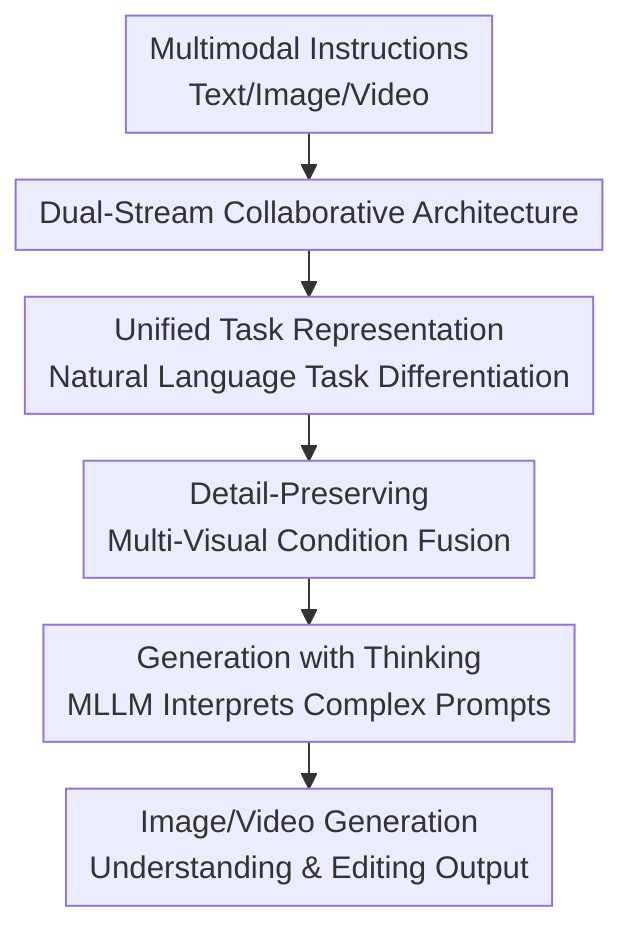

# UniVideo: Unified Understanding, Generation, and Editing for Videos

**Conference**: ICLR2026  
**OpenReview**: [https://openreview.net/forum?id=EDCJTaR9bk](https://openreview.net/forum?id=EDCJTaR9bk)  
**Code**: https://github.com/KlingTeam/UniVideo  
**Area**: Video Generation / Video Editing / Unified Multimodal Understanding and Generation Model  
**Keywords**: Unified Video Model, Video Generation, Video Editing, Multimodal Instructions, In-context Generation

## TL;DR
UniVideo utilizes a frozen MLLM for multimodal understanding and instruction parsing, and an MMDiT for high-fidelity image/video generation. It unifies video understanding, text-to-video, image-to-video, in-context video generation, and mask-free video editing into a single natural language instruction framework, achieving performance comparable to or better than specialized models across multiple video generation and editing tasks.

## Background & Motivation
**Background**: A clear trend of unified multimodal models has emerged in the image domain: a single system can perceive images, understand text, and generate or edit images. Works such as Janus, OmniGen2, BAGEL, and the Show-o series demonstrate that understanding and generative models do not need to be separate tools. With proper training and interface design, a model can complete multiple visual tasks within the same dialogue or instruction paradigm.

**Limitations of Prior Work**: The video domain has not yet reached this level of unification. Mainstream video generation models are mostly trained around text-to-video, typically relying only on text encoders at the input side. When faced with multimodal instructions involving reference images, reference videos, hand-drawn annotations, or complex character replacement relationships, it is difficult for them to first understand "what precisely the user wants to change, keep, or replace" before stably producing a video. Video editing methods often rely on masks, task-specific adapters, condition bias, or multi-stage pipelines—one module per task—which becomes cumbersome when extending to new editing types or combined tasks.

**Key Challenge**: A unified video model must satisfy two requirements simultaneously: on one hand, it needs to understand complex multimodal contexts like an MLLM, retaining text generation and visual QA capabilities; on the other hand, it must preserve detail, identity consistency, and temporal continuity like a strong video diffusion/DiT generator. Compressing video into a few semantic tokens loses detail; feeding only VAE latents to the generator lacks high-level semantic reasoning. UniVideo aims to bridge the gap between these two ends.

**Goal**: The authors aim to build a single video system capable of distinguishing and executing various tasks under a unified input format, including video understanding, T2I, T2V, I2V, multi-reference in-context video generation, reference-based video editing, image editing, and complex visual prompt generation. This system should not require users to switch models for different tasks, nor should it rely on explicit masks for editing.

**Key Insight**: The paper observes that MLLMs and video DiTs have complementary strengths. It is unnecessary to force them into a single native model trained from scratch. Freezing the MLLM preserves existing understanding and linguistic capabilities; retaining a strong MMDiT generator inherits video generation quality. The key is to design an effective connector and conditional input method so that semantic understanding and low-level visual details enter the generation process simultaneously.

**Core Idea**: UniVideo uses a dual-stream architecture to decouple and collaborate "understanding" and "generation": the MLLM provides multimodal semantics and reasoning, while the VAE/MMDiT provides details and video synthesis. Multiple video generation, editing, and understanding capabilities are integrated into a single model through unified instructions and multi-task training.

## Method

### Overall Architecture
The overall architecture of UniVideo consists of two information streams jointly controlling a video generator. The first is the semantic stream: text, image, and video inputs enter the MLLM, and the model outputs the last layer's hidden states, which are aligned to the MMDiT condition space via an MLP connector to inform the generator "what the instruction semantically entails." The second is the visual detail stream: visual inputs such as reference images, reference videos, and condition videos are encoded into latents via a VAE and enter the MMDiT generation stream alongside the noisy latents to preserve subject appearance, pose, local texture, and temporal structure.

At the task level, UniVideo does not add separate adapters or biases for each task. Instead, T2V, I2V, in-context generation, in-context editing, and image editing are formulated as natural language multimodal instructions. The model understands task intent through the MLLM and fuses semantic tokens, condition latents, and noisy video latents within the same self-attention generation framework in the MMDiT.

### Key Designs
**1. Dual-Stream Collaborative Architecture: MLLM for Semantics, MMDiT for Generation**

The critical choice of UniVideo is not to compress everything into a single-stream Transformer but to explicitly distinguish between "reading instructions" and "generating video." The MLLM branch receives text, images, and videos, outputting hidden states containing multimodal semantics; these are mapped to the MMDiT input space via a trainable MLP connector. Simultaneously, visual conditions pass through a VAE to become latents that directly enter the MMDiT generation branch.

This design addresses a common bottleneck in unified video models: relying solely on a semantic encoder often discards fine-grained identity, clothing, object textures, and local motion from reference videos; relying solely on VAE latents makes it difficult for the generator to understand compositional instructions like "add the hat from the reference image onto the woman in the video." The dual-stream structure preserves both high-level semantics and low-level visual conditions, allowing the paper to achieve more stability in in-context generation and mask-free editing than many specialized systems.

**2. Unified Task Representation: Replacing Task-Specific Modules with Natural Language Instructions**

UniVideo unifies different tasks into a "multimodal input + natural language instruction + latent to be generated" format. In T2V, text enters the MLLM while the MMDiT denoises the noisy video latent; in I2V, images and text enter the MLLM simultaneously while image latents serve as conditions for the MMDiT; in in-context generation and editing, multiple reference images, reference videos, source videos, and editing targets are organized through the same set of instructions.

Unlike many video editing methods, UniVideo does not require designing condition biases or independent pipelines for swap, delete, insert, or stylization. Task differences are expressed through instructions and input content, with the model learning to distinguish tasks during Stage 3 multi-task training. This design also explains its ability to perform task combinations, such as deleting one identity while adding another, or combining in-context editing and style transfer in one sentence, without needing a "combination task module."

**3. Detail-Preserving Multi-Visual Condition Fusion: Preventing Visual Conditions from Being Lost in the Semantic Bottleneck**

The difficulty of video in-context tasks lies in the large number of visual conditions, mixed modalities, and varying spatio-temporal dimensions. UniVideo encodes each visual signal with a VAE, pads them to a unified shape, and concatenates them along the temporal dimension, allowing the MMDiT to see reference images, reference videos, and noisy video latents simultaneously in self-attention. To distinguish between "condition latents" and "target video latents," the authors use 3D positional embeddings: spatial coordinates are consistent across different visual inputs, increasing only along the temporal dimension.

This positional encoding detail is crucial. The paper notes that mechanisms like MRoPE in Qwen2-VL shift all axes when adding new visual inputs, which may disrupt spatial correspondence between different references. UniVideo retains spatial indices and only increments temporal indices, making it more suitable for the structure of video generation where "multiple references share spatial semantics but belong to different temporal/conditional segments." In ablations, removing visual inputs to the MMDiT and relying only on the MLLM caused subject consistency to drop from $0.78$ to $0.18$.

**4. Generation with Thinking: Using Frozen MLLM to Interpret Complex Visual Prompts**

UniVideo retains the autoregressive understanding and language generation capabilities of the MLLM, enabling it to handle "visual prompts" that are difficult for standard DiT text encoders. For example, when a user places reference images on a canvas, draws arrows, writes brief notes, or indicates motion directions on an input image, the MLLM can interpret these manual visual prompts into structured plans or dense prompt tokens, which are then sent as semantic embeddings to the MMDiT.

This makes UniVideo more than just a multi-condition version of a video diffusion backbone; it acts as a system that translates user intent for the generator. It avoids the multi-agent approach of calling multiple downstream generators, instead completing the "understand prompt → form generation conditions → synthesize video" cycle within a single model. Qualitative results demonstrate zero-shot visual prompting, showing potential for further scaling with training data.

### Loss & Training
UniVideo adopts a three-stage training strategy, focusing on preserving the capabilities of the two pretrained backbones and only training necessary connections and generative parts. Stage 1 is connector alignment: the MLLM and MMDiT are frozen, and only the MLP connector is trained. Data includes T2I and T2V pretraining samples, as well as an image reconstruction task to teach the MMDiT to utilize visual semantic features from the MLLM. This stage involves $15K$ steps with a learning rate of $1 \times 10^{-4}$.

Stage 2 is T2I/T2V fine-tuning: the MLLM remains frozen while the connector and MMDiT are trained using a small-scale, high-quality T2I/T2V dataset to recover the generative capabilities of the original HunyuanVideo backbone. Stage 3 is multi-task training: with the MLLM still frozen, the connector and MMDiT are trained on a combined dataset of in-context generation, in-context video editing, image editing, I2V, and the previous T2I/T2V. Both Stage 2 and Stage 3 use a $2.0 \times 10^{-5}$ learning rate for $5K$ and $15K$ steps, respectively, with EMA $0.9999$.

Implementation-wise, the paper uses Qwen2.5-VL-7B as the MLLM and HunyuanVideo-T2V-13B as the MMDiT. The two text encoders of the original HunyuanVideo are removed and replaced by Qwen2.5-VL as a unified multimodal embedder. The MLP connector uses $4\times$ expansion to align feature dimensions. Since the MLLM is frozen, UniVideo is more accurately described as a post-trained unified multimodal generation system rather than a native any-to-any video model trained from scratch.

## Key Experimental Results

### Main Results
The experiments cover understanding, standard video generation, in-context video generation, in-context video editing, zero-shot generalization, generation with thinking, and various ablations. The overall conclusion is that UniVideo approaches the understanding capability of frozen MLLMs and the generation quality of specialized video backbones, while exhibiting extra advantages in multi-reference generation and mask-free editing.

| Task | Metric | UniVideo | Representative Comparison | Conclusion |
|------|--------|----------|---------------------------|------------|
| Visual Understanding | MMBench | 83.5 | BAGEL 85.0 / OmniGen2 79.1 | Preserves strong MLLM capabilities |
| Visual Understanding | MMMU | 58.6 | BAGEL 55.3 / OmniGen2 53.1 | Top performer among unified models |
| Visual Understanding | MM-Vet | 66.6 | BAGEL 67.2 / OmniGen2 61.8 | Matches strongest unified image models |
| Text-to-Video | VBench T2V | 83.48 | Wan2.1 84.70 / HunyuanVideo 83.24 | Close to specialized generation backbones |

| In-context Video Gen | Setting | UniVideo | Strongest/Representative | Key Advantage |
|----------------------|---------|----------|---------------------------|---------------|
| Subject Consistency | Single Ref | 0.88 | Kling1.6 0.68 / Pika2.2 0.45 | Significantly better subject retention |
| Prompt Following | Single Ref | 0.93 | Kling1.6 0.95 | Comparable to commercial models |
| Video Quality | Single Ref | 0.95 | Kling1.6 0.88 | Highest human-rated quality |
| Subject Consistency | Multi Ref | 0.81 | Kling1.6 0.73 / Pika2.2 0.71 | More stable multi-ID conditions |
| Prompt Following | Multi Ref | 0.75 | VACE 0.53 / Kling1.6 0.45 | Clear advantage in multi-ID instructions |
| Aesthetic | Multi Ref | 6.128 | Kling1.6 6.034 | Highest aesthetic score |

| Mask-free Editing | Metric | UniVideo | Comparison Method | Conclusion |
|-------------------|--------|----------|-------------------|------------|
| Insert | CLIP-I | 0.693 | Pika2.2 0.692 / Kling1.6 0.632 | Highest identity alignment without mask |
| Insert | Aesthetic | 6.031 | Kling1.6 5.798 / UNIC 5.627 | Better insertion quality |
| Swap | CLIP-I | 0.728 | UNIC 0.725 / Kling1.6 0.707 | Slightly better identity swapping |
| Swap | Smoothness| 0.973 | Kling1.6 0.995 / UNIC 0.971 | Temporal smoothness near strong baseline |
| Delete | PSNR | 17.980 | VideoPainter 22.987 | Underperforms in deletion reconstruction |
| Stylization | Aesthetic | 6.281 | StyleMaster 5.121 / UNIC 5.045 | Significantly higher stylized quality |

### Ablation Study
| Configuration | Avg PF | Avg SC | Avg VQ | Note |
|---------------|--------|--------|--------|------|
| Single-task | 0.64 | 0.67 | 0.79 | Cannot fully share image/video editing experience |
| UniVideo | 0.80 | 0.78 | 0.85 | Balanced gains across all metrics after unified training |
| UniVideo w/o Visual for MMDiT | 0.66 | 0.18 | 0.71 | Identity retention collapses without direct visual input to DiT |

### Key Findings
- Multi-task training benefits are not uniform; they are particularly significant in editing tasks. For instance, PF for in-context swap improved from $0.53$ to $0.91$, and for delete from $0.32$ to $0.52$, indicating transferable capabilities between image editing, identity tasks, and video generation.
- Visual conditions entering the MMDiT are critical for identity preservation. Relying solely on the semantic flow results in an average SC of $0.18$, proving that fine-grained details in reference signals cannot be replaced by low-dimensional semantic representations.
- Despite not being trained on general free-form video editing data, UniVideo achieves zero-shot modifications of materials, weather, environment, and clothing color, suggesting that image editing capabilities partially migrate to the video domain. However, success rates remain lower than in the image domain.
- On standard T2V, UniVideo does not strictly outperform all specialized models (e.g., VBench score of $83.48$ vs Wan2.1's $84.70$). It prioritizes "unified capabilities while maintaining strong generation" rather than becoming a single-metric leaderboard leader.

## Highlights & Insights
- The dual-stream architecture is a pragmatic choice: unified video models do not strictly require native any-to-any training from scratch yet. Leveraging frozen strong MLLMs + strong MMDiTs with a connector and multi-task training is cost-effective and avoids catastrophic forgetting of understanding capabilities.
- Unification is realized at the task interface level rather than being just a conceptual slogan. All tasks—T2V, I2V, multi-reference generation, insertion, swapping, deletion, and stylization—are organized via natural language, providing a mechanism for task composition.
- The use of 3D positional embeddings is insightful: multi-reference video generation is not just about token concatenation; the positional encoding determines if the model treats multiple visual conditions as distinct temporal/conditional segments.
- "Generation with Thinking" points to a promising direction: future prompts may not be long text but sketches, arrows, storyboards, and collages. Allowing the MLLM to interpret these visual prompts to guide the DiT is more natural than requiring users to write script-like text.
- The value of a unified model lies in reducing model switches and custom tool glue. For creative workflows, keeping understanding, generation, and local/compositional editing in the same context is often more valuable than marginal gains on a single benchmark.

## Limitations & Future Work
- UniVideo sometimes fails to strictly follow editing instructions and may excessively modify unrelated areas. Localized constraints and non-target region preservation remain difficult in mask-free settings.
- Constrained by the HunyuanVideo backbone, motion preservation in original videos is still insufficient. Background reconstruction and motion trajectory continuity in deletion or replacement tasks lag behind specialized mask-based methods like VideoPainter.
- Free-form video editing relies on image editing transfer, with a lower success rate. Larger-scale, high-quality, instruction-rich video editing data would significantly improve modifications of materials, weather, and local attributes.
- The system is currently an "assembled" unified model. Future work could explore natively trained end-to-end unified video models where understanding and generation components evolve under a shared objective.
- Evaluation still relies heavily on qualitative visualization, especially for generation with thinking and zero-shot visual prompting. Systematic benchmarks for visual prompting and failure case analyses are needed for robustness.

## Related Work & Insights
- **vs OmniGen2 / BAGEL / Janus series**: These works drive unified understanding and generation in the image domain. UniVideo extends these ideas to video, focusing on multi-reference generation, video editing, and task composition. It covers more video tasks but may not lead in fine-grained image metrics.
- **vs HunyuanVideo / Wan2.1 / Kling**: These are strong video generators but lack a unified interface for multimodal instruction and editing. UniVideo is not the absolute strongest in T2V but offers a unified model for understanding, generation, and editing.
- **vs VACE / UNIC / AnyV2V / VideoPainter**: These are specialized video editing systems relying on masks or task-specific pipelines. UniVideo differs by being mask-free and instruction-driven, gaining composition capabilities through unified training, though it may lose on specific reconstruction metrics like PSNR.
- **Insights**: For next-generation video creation assistants, treating "multimodal understanding as a generation controller" is a key design principle. Reference video detail streams, unified task interfaces, and visual prompt interpretation should be considered collectively.

## Rating
- Novelty: ⭐⭐⭐⭐☆ Dual-stream MLLM+MMDiT is not entirely new, but the systematic extension to unified video understanding/generation/editing with task composition is a solid contribution.
- Experimental Thoroughness: ⭐⭐⭐⭐☆ Covers a wide range of tasks and ablations; however, visual prompting and free-form editing remain largely qualitative.
- Writing Quality: ⭐⭐⭐⭐☆ Clear structure and dense experimental tables. Task settings and data construction details are best understood alongside the appendix.
- Value: ⭐⭐⭐⭐⭐ Highly relevant for video creation models, specifically the "understanding branch + detail generation branch + unified instruction training" roadmap.

<!-- RELATED:START -->

## Related Papers

- [\[ICLR 2026\] Unified In-Context Video Editing](unified_in-context_video_editing.md)
- [\[ICML 2026\] Lightning Unified Video Editing via In-Context Sparse Attention](../../ICML2026/video_generation/lightning_unified_video_editing_via_in-context_sparse_attention.md)
- [\[ICLR 2026\] EditVerse: Unifying Image and Video Editing and Generation with In-Context Learning](editverse_unifying_image_and_video_editing_and_generation_with_in-context_learni.md)
- [\[CVPR 2025\] VEU-Bench: Towards Comprehensive Understanding of Video Editing](../../CVPR2025/video_generation/veu-bench_towards_comprehensive_understanding_of_video_editing.md)
- [\[ICLR 2026\] Video-As-Prompt: Unified Semantic Control for Video Generation](video-as-prompt_unified_semantic_control_for_video_generation.md)

<!-- RELATED:END -->
