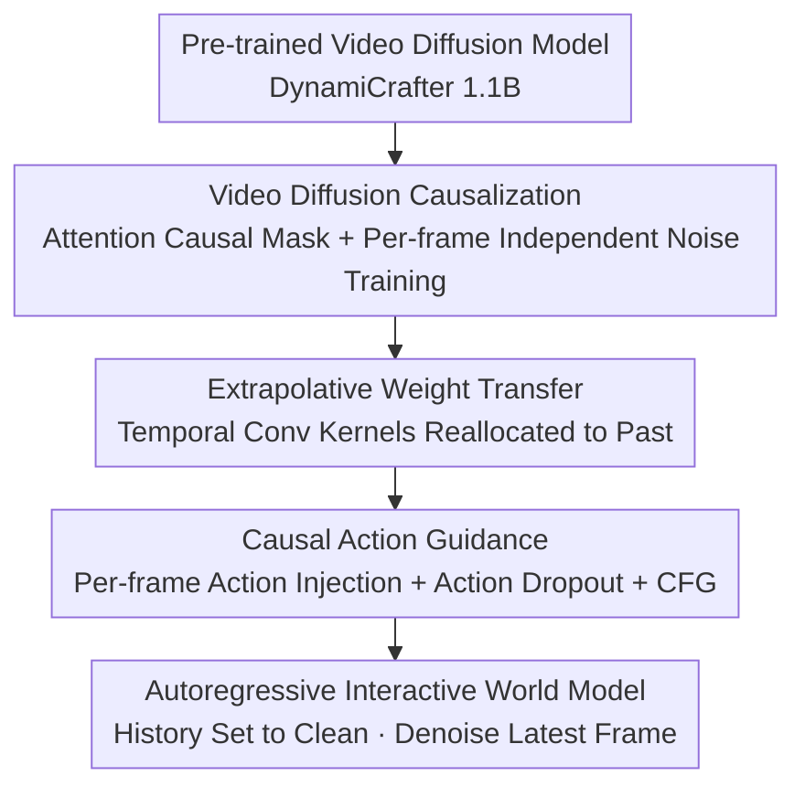

# Vid2World: Crafting Video Diffusion Models to Interactive World Models

**Conference**: ICLR 2026  
**OpenReview**: [https://openreview.net/forum?id=pFyzqbUiF9](https://openreview.net/forum?id=pFyzqbUiF9)  
**Code**: https://knightnemo.github.io/vid2world/ (Available)  
**Area**: Video Understanding / Diffusion Models / World Models  
**Keywords**: World Models, Video Diffusion, Causalization, Autoregressive Generation, Action-Conditioning

## TL;DR
This paper proposes Vid2World, which systematically transforms a full-sequence, non-causal video diffusion model pre-trained on internet-scale videos into an interactive world model capable of autoregressive rollout and frame-by-frame action control through "causalization modification + causal action guidance." It outperforms existing transfer methods and specialized world models in robot manipulation, 3D game simulation, and open-world navigation.

## Background & Motivation
**Background**: World models are used to predict future states $p_\theta(o_{t+1}\mid o_{\le t}, a_{\le t})$ from historical observations and actions. They are core components of sequential decision-making and have seen progress in game simulation, autonomous driving, and robotics. However, mainstream world models are almost exclusively trained on in-domain, action-labeled data.

**Limitations of Prior Work**: Action-labeled data is expensive and labor-intensive to collect. Furthermore, models trained this way often produce coarse predictions with poor physical realism, making them unusable in complex environments. Recent works attempt to mitigate this by pre-training on broader cross-domain action-labeled data, but the high cost of such data remains, and generation fidelity has not fundamentally improved—simply scaling action-labeled data does not solve the root issue.

**Key Challenge**: The most critical data missed by world models is exactly what they should leverage: internet-scale "action-free" videos. This data is massive, easy to collect, and rich in real-world priors. However, it lacks action labels and is not generated causally (standard video diffusion models use bidirectional denoising, where future frames influence past ones), making it unsuitable for direct use as an interactive world model.

**Goal**: Instead of focusing on data-level manipulation, this work shifts to model-level transfer—directly transforming a **video diffusion model**, which has already learned physical priors and generation capabilities from internet videos, into an interactive world model. This requires overcoming two hurdles: (1) enabling causal generation (current frames must not depend on the future); (2) enabling fine-grained, frame-by-frame action conditioning.

**Core Idea**: Perform a two-stage "causalization + action guidance" operation on the pre-trained video diffusion model. This involves modifying both the architecture (attention with causal masks, temporal convolution kernels with causal weight transfer) and the training objective (per-frame independent noise + action dropout). This transforms a passive, full-sequence video generator into an active, autoregressive world model with per-frame action control, while maximizing the preservation of pre-trained capabilities.

## Method

### Overall Architecture
Vid2World uses a pre-trained video diffusion model (the 1.1B parameter DynamiCrafter U-Net is used in experiments) as a base. The goal is to convert it from a passive generator that "denoises a whole video at once using bidirectional context" into an interactive world model that "rolls out autoregressively frame-by-frame, with the current frame only looking at the past." The pipeline consists of two steps: first, **video diffusion causalization**, where the architecture and training objectives are converted to causal versions to allow autoregressive generation; second, **causal action guidance**, where frame-by-frame action signals are injected and action controllability is enhanced using Classifier-Free Guidance (CFG). The most difficult part of causalization is the temporal convolution layers—since their symmetric kernels aggregate past and future frames, the authors design **extrapolative weight transfer** to smoothly move weights acting on the future back to the past.

During training, noise levels are sampled independently for each frame (Diffusion Forcing), and actions are randomly dropped with a fixed probability. During inference rollout, historical frames are set to clean, only the latest frame is denoised, and guidance is applied to the current action.

### Key Designs

**1. Video Diffusion Causalization: Converting Architecture and Objective to Causal Forms**

Base video diffusion models typically use bidirectional temporal context for sequence-wide denoising, where future frames affect past frames. This fundamentally conflicts with autoregressive world models where "current observations cannot depend on future observations/actions." This paper addresses this from both architecture and training perspectives. Architecturally, **temporal attention layers** are naturally compatible with variable-length sequences because they are based on query-key dot products; adding a causal mask to restrict the receptive field to past frames is sufficient and **requires no parameter changes**. For the training objective, the authors adopt the per-frame independent noise from Diffusion Forcing (Chen et al. 2024): noise levels $k_t\sim U([0,K])$ are sampled independently for each frame rather than using a uniform level. This exposes the model to various "inter-frame noise combinations," naturally unlocking the autoregressive inference mode where historical frames are clean (noise level 0) and only the latest frame is iteratively denoised.

**2. Extrapolative Weight Transfer: Maximizing Reuse of Pre-trained Weights for Causal Kernels**

Causalizing **temporal convolution layers** is much harder than attention: they use symmetric kernels $\{w_t\}_{t=-m}^{m}$ to aggregate past and future frames. Naive modifications waste pre-trained weights. This paper compares three weight transfer schemes. **Shift**: Shifts the entire kernel $m$ steps into the past to get $\{w'_t\}_{t=-2m}^{0}$. This preserves all weights but introduces temporal misalignment—the $i$-th kernel position now aggregates features from time $\{i-m\}$, which does not guarantee similar representations. **Masked**: Retains only weights for the past and current frames $\{w_t\}_{t=-m}^{0}$ and zeros the rest. This enforces causality during initialization but discards useful information in future weights. The proposed **Extrapolative** method is more principled: it assumes future frame features can be approximated by linear extrapolation of the past $p$ frames $z_{t+k}\approx\sum_{j=0}^{p-1}\gamma_{k,j}\,z_{t-j}+\beta_k$. It then requires the output of the new causal convolution to be as close as possible to the original non-causal convolution output $\sum_{i=-m}^{m} w_i z_{t+i}=\sum_{j=-2m}^{0} w'_j z_{t+j}$. Accordingly, weights originally acting on future frames $\{w_i\}_{i>0}$ are **redistributed to the past part of the kernel** based on linear feature relationships: $w'_j = \mathbb{1}_{[j\ge -m]}\cdot w_j + \mathbb{1}_{[-p+1\le j\le 0]}\cdot\sum_{i=1}^{m}\gamma_{i,-j}w_i$. This is strictly causal and maximizes the preservation of the original representation; in ablations, it outperforms Shift and Masked.

**3. Causal Action Guidance: Action Injection + Action Dropout for CFG**

Causalization only solves "autoregressive rollout," but the model still lacks counterfactual reasoning—predicting how different actions change the future. Video diffusion models typically accept only coarse, video-level conditions (e.g., text), which are neither frame-by-frame nor compatible with interactive scenarios where actions arrive online. This paper first performs **causal action injection**: when predicting $o_t$, the previous action $a_{t-1}$ is encoded via a lightweight MLP and added to the model's latent representation at temporal position $t$, ensuring each frame is directly conditioned on its preceding action in a temporally aligned manner. It then implements **causal action guidance**: borrowing from Classifier-Free Guidance (CFG), the model learns both a conditional score $\epsilon_{\text{cond}}$ and an unconditional score $\epsilon_{\text{ucond}}$ where the recent action is masked. **Action dropout** is added to the training objective—actions are replaced with $\varnothing$ at a fixed probability $p$, forcing the model to learn a score function valid for all subsets of the action sequence. During inference, guidance is amplified as $\epsilon_{\text{guided}}=(1+\lambda)\,\epsilon_{\text{cond}}-\lambda\,\epsilon_{\text{ucond}}$, where larger $\lambda$ emphasizes action alignment. Theorem 4.1 in the paper proves that linear combination in this score space is equivalent to sampling from a posterior distribution weighted by an "action alignment" term $\big(p(x_t\mid a_{t-1},H_t)/p(x_t\mid H_t)\big)^{\omega}$ ($\omega\propto 1+\lambda$). The guidance term acts as an implicit classifier pushing generation toward regions consistent with the user's recent action; $\lambda$ provides a flexible test-time knob for "response strength to action changes."

### Loss & Training
The unified training objective overlays action dropout on the per-frame noise sampling of Diffusion Forcing:

$$\mathcal{L}(\theta)=\mathbb{E}_{[k_\tau],\epsilon,[x^0_\tau],[\tilde a_\tau]}\Big[\textstyle\sum_{t=0}^{T}\big\|\epsilon_t-\epsilon_\theta([x^{k_\tau}_\tau]_{\le t},[\tilde a_\tau]_{<t},[k_\tau]_{\le t})\big\|^2\Big],\quad \tilde a_t=\begin{cases}\varnothing,& \text{prob } p\\ a_t,& \text{otherwise}\end{cases}$$

The base model is DynamiCrafter with a 1.1B U-Net; on RT-1, it is trained for 100k steps after extrapolative weight transfer (approx. 7 days on 4×A100). Two inference variants: Vid2World-NAR (uniform noise for all frames, one-time non-autoregressive denoising, aligned with traditional video diffusion) and Vid2World (per-frame autoregressive denoising + action guidance).

## Key Experimental Results

### Main Results
World modeling quality was evaluated across three domains (FVD/FID/SSIM/LPIPS/PSNR/DreamSim). The table below shows representative comparisons:

| Domain/Dataset | Model | FVD ↓ | FID ↓ | SSIM ↑ | LPIPS ↓ |
|------|------|------|------|------|------|
| Robot RT-1 | Pre-trained Base | 237.6 | 5.432 | 0.712 | 0.228 |
| Robot RT-1 | Action-Conditioned (Strong Baseline) | 24.2 | 2.965 | 0.852 | 0.134 |
| Robot RT-1 | Vid2World-NAR (NAR) | 18.7 | 5.871 | 0.856 | 0.140 |
| Robot RT-1 | **Vid2World (AR)** | **18.5** | 5.806 | 0.842 | 0.152 |
| 3D Game CS:GO | DIAMOND-HQ | 368.5 | 87.2 | 0.447 | 0.510 |
| 3D Game CS:GO | **Vid2World** | **106.6** | **17.5** | **0.481** | **0.404** |
| Navigation RECON | NWM (1B, Single-step) | 31.2 | 34.1 | 0.389 | 0.295 |
| Navigation RECON | **Vid2World (AR)** | 59.4 | 42.9 | **0.481** | 0.324 |

- On RT-1, Vid2World leads in FVD/FID even under the **autoregressive** setting which other baselines cannot handle. On CS:GO, it achieves a **79.9% relative improvement in FID and 71.1% in FVD** over the strongest baseline.
- On RECON, Vid2World remains competitive with the single-step SOTA model NWM despite autoregressive error accumulation, and it outperforms NWM variants co-trained on Ego4D in 4/6 metrics. Its total context length of 20 (4 history + 16 predicted) exceeds its training horizon of 16, showing temporal generalization.
- Real2Sim Policy Evaluation: Using Vid2World as an autoregressive simulator reliably distinguishes the success rates of RT-1 policies at different training stages (Begin/15%/Converged), matching real-world trends.

### Ablation Study
Table 2 (uniform 30k step training due to compute limits) validates Weight Transfer (WT) and Action Guidance (AG):

| Configuration | Weight Transfer | Action Guidance | FVD ↓ | FID ↓ | SSIM ↑ | PSNR ↑ |
|------|------|------|------|------|------|------|
| Vid2World | Shift | ✗ | 29.9 | 7.85 | 0.799 | 21.5 |
| Vid2World | Masked | ✗ | 29.4 | 7.07 | 0.824 | 22.9 |
| Vid2World | Extrapolative | ✗ | 28.6 | 7.52 | 0.832 | 23.4 |
| Vid2World | Masked | ✓ | 25.8 | 6.84 | 0.840 | 23.9 |
| Vid2World | **Extrapolative** | **✓** | **22.4** | **6.16** | 0.839 | 23.9 |

### Key Findings
- **Action Guidance contributes significantly**: Regardless of the weight transfer method, adding action guidance (training with action dropout) improves metrics significantly over the baseline (e.g., Extrapolative FVD drops from 28.6 to 22.4).
- **Weight Transfer ranking**: Masked and Extrapolative both outperform Shift, with Extrapolative performing slightly better than Masked—confirming that redistributing future weights via linear extrapolation preserves pre-trained representations better than simple shifting or hard truncation.
- **Guidance Scale $\lambda$ is not "the larger the better"** (Fig. 8, CS:GO): Increasing $\lambda$ initially improves metrics by strengthening action alignment, but excessive values cause quality degradation due to over-sharpening artifacts.

## Highlights & Insights
- Repositions "action-free internet video" as the most critical foundation in the world model data pyramid. The approach shifts from "data-level utilization" to "model-level transfer"—avoiding the exorbitant cost of training from scratch on massive video datasets.
- Extrapolative weight transfer is a highly reusable trick: it can be applied to any scenario requiring the conversion of "symmetric/bidirectional kernels" to "causal kernels" without losing pre-trained weights (e.g., audio, time-series, streaming video).
- Per-frame independent noise from Diffusion Forcing naturally supports the "clean history + noisy current" autoregressive mode, elegantly bridging "full-sequence denoisers" and "autoregressive world models."
- Extends Classifier-Free Guidance from "video-level text conditions" to "frame-by-frame action conditions" and provides theoretical grounding through Theorem 4.1, ensuring action controllability is principled rather than just engineering stitching.

## Limitations & Future Work
- The base model is only 1.1B parameters and training compute was limited (ablations only for 30k steps); whether gains scale with larger models or longer training remains to be verified.
- Autoregressive rollout naturally suffers from error accumulation; Vid2World's FVD/FID on RECON is still inferior to the single-step NWM. Stability over long horizons needs improvement.
- Extrapolative weight transfer relies on the assumption that "future features can be linearly extrapolated from the past," which may not hold in scenarios with extreme motion or highly non-linear dynamics.
- Evaluation focuses mainly on video prediction fidelity and a single Real2Sim policy test; more downstream decision-making experiments are needed to prove end-to-end value in planning/control loops.

## Related Work & Insights
- **vs. Conditional Image-based World Models (DIAMOND, etc.)**: These view world modeling as "frame-by-frame generation conditioned on a fixed-length historical window"; while autoregressive, context is limited and long-range reasoning is difficult. Vid2World inherits the strong temporal priors of video diffusion, significantly outperforming DIAMOND on CS:GO.
- **vs. Full-sequence Video World Models**: These provide temporal consistency but only generate fixed blocks, lacking interactivity. Vid2World's causalization fills this gap to enable interaction.
- **vs. NWM (Navigation World Model)**: NWM explicitly conditions on a prediction step $t$, allowing single-step distant prediction to bypass error accumulation, and it uses much more compute. Vid2World matches it even under autoregressive constraints, demonstrating the efficiency of transferring priors from action-free videos.
- **vs. Transfer works adding action modules/adapters (e.g., AVID)**: These often overlook interactivity and temporal causality. Vid2World makes causalization and action guidance systematic, yielding superior transfer results on RT-1.

## Rating
- Novelty: ⭐⭐⭐⭐⭐ First to systematically study transferring full-sequence non-causal video diffusion to autoregressive interactive world models. Extrapolative weight transfer and causal action guidance are original.
- Experimental Thoroughness: ⭐⭐⭐⭐ Covers three domains + Real2Sim + comprehensive ablations, though base model size and downstream decision-loop experiments are limited.
- Writing Quality: ⭐⭐⭐⭐⭐ Problem decomposition is clear, methodology is logically layered, and theory aligns with ablation results.
- Value: ⭐⭐⭐⭐⭐ Points toward a scalable, low-data-cost path for building world models using internet video priors; tricks are highly transferable.

<!-- RELATED:START -->

## Related Papers

- [\[ICLR 2026\] Animating the Uncaptured: Humanoid Mesh Animation with Video Diffusion Models](animating_the_uncaptured_humanoid_mesh_animation_with_video_diffusion_models.md)
- [\[ICLR 2026\] Geometry Forcing: Marrying Video Diffusion and 3D Representation for Consistent World Modeling](geometry_forcing_marrying_video_diffusion_and_3d_representation_for_consistent_w.md)
- [\[ICLR 2026\] Target-Aware Video Diffusion Models](target-aware_video_diffusion_models.md)
- [\[ICLR 2026\] DrivingGen: A Comprehensive Benchmark for Generative Video World Models in Autonomous Driving](drivinggen_a_comprehensive_benchmark_for_generative_video_world_models_in_autono.md)
- [\[ICLR 2026\] LikePhys: Evaluating Intuitive Physics Understanding in Video Diffusion Models via Likelihood Preference](likephys_evaluating_intuitive_physics_understanding_in_video_diffusion_models_vi.md)

<!-- RELATED:END -->
