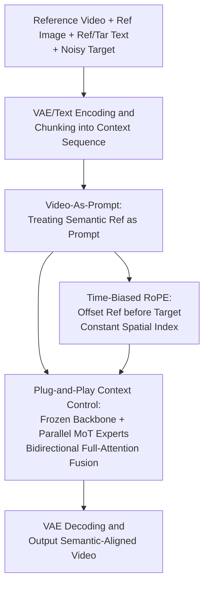

# Video-As-Prompt: Unified Semantic Control for Video Generation

**Conference**: ICLR 2026  
**OpenReview**: [https://openreview.net/forum?id=8FihPljvWf](https://openreview.net/forum?id=8FihPljvWf)  
**Code**: https://bytedance.github.io/Video-As-Prompt/ (Project Page)  
**Area**: Video Generation / Diffusion Models  
**Keywords**: Semantically Controllable Video Generation, In-Context Generation, Mixture-of-Transformers, Reference Video Prompt, Zero-Shot Generalization

## TL;DR
This paper reformulates "semantically controllable video generation" as **in-context generation**: directly utilizing a reference video containing target semantics as a "video prompt." This is achieved through a plug-and-play Mixture-of-Transformers (MoT) expert running in parallel with a frozen backbone, combined with a time-biased RoPE to eliminate spurious pixel alignment priors. This enables a **unified model** to handle four semantic control types (concept, style, motion, and camera) and enables zero-shot transfer to unseen semantics, achieving a 38.7% human preference rate that approaches commercial closed-source models.

## Background & Motivation
**Background**: Controllable video generation is broadly categorized into two types. The first is **structural control**, where conditions (depth maps, poses, optical flow, masks) are pixel-aligned with the target video. The mainstream approach utilizes an adapter branch and residual addition to inject conditions into the DiT, leveraging this pixel-mapping prior. This area is relatively mature. The second is **semantic control**, where conditions share semantics with the target but **lack pixel correspondence** (e.g., concept transformation, Ghibli style, specific motion, or Hitchcock zoom). This area remains fragmented and lacks a unified, generalizable framework.

**Limitations of Prior Work**: Directly applying structural control methods to semantic control causes issues. Methods like VACE assume pixel alignment; injecting a "semantically identical but pixel-misaligned" reference video via residual addition forces the replication of the reference's appearance and layout, creating copy-and-paste artifacts (e.g., a frog standing like a dog). Existing semantic control methods fall into two traps: (1) **Condition-Specific Overfitting**: Fine-tuning the backbone or training a LoRA for each specific semantic condition (e.g., dedicated Ghibli style or zoom), which is costly and requires one model per condition. (2) **Task-Specific Design**: Customizing modules or inference strategies for specific categories (style/motion/camera), encoding same-semantic videos into specialized spaces. Both approaches only fit narrow distributions, lack unification, and fail in zero-shot generalization.

**Key Challenge**: Semantic control naturally **lacks pixel-mapping priors**. Existing paradigms either force a non-existent pixel prior (structural methods) or bypass unification through "per-condition/per-task specialized training" (overfitting or specialized design). The former introduces artifacts, while the latter sacrifices generalization.

**Goal**: To process heterogeneous semantic conditions with a unified model and enable zero-shot transfer to semantics unseen during training.

**Key Insight**: Recent progress in image generation and structural video generation shows that DiTs natively support strong **in-context control** capabilities. Thus, semantic control can be reformulated as in-context generation: feeding a reference video with target semantics as a prompt, allowing the model to retrieve and transfer those semantics. This perspective naturally avoids assuming pixel alignment and removes the need for per-condition modeling.

**Core Idea**: **Replace "pixel prior injection / per-condition fine-tuning" with "reference video as prompt" to achieve unified semantic control.** The backbone DiT remains frozen, while a parallel trainable MoT expert interprets the reference video. Time-biased RoPE is used to correct the temporal relationship between reference and target, stripping away spurious spatial mappings.

## Method

### Overall Architecture
VAP aims to transfer "semantics from a reference video" to a new subject determined by a reference first frame and text description, without pixel alignment priors. The process concatenates the reference and target sides into an in-context token sequence $[\text{Ref}_{text}, \text{Ref}_{video}, \text{Tar}_{text}, \text{Tar}_{video}]$. The reference side is processed by a **trainable expert Transformer**, while the target side is handled by the **frozen pre-trained DiT backbone**. Both exchange information per layer via bidirectional full attention. Simultaneously, a fixed temporal bias is added to the reference side's RoPE, placing it before the target on the timeline while maintaining the spatial index.

Input consists of four components: the reference video (providing semantics), the reference image (the first frame of the reference video, providing initial appearance/subject by inheriting I2V backbone capabilities), text descriptions (assisting in locating semantic signals to transfer), and target-side noise (inference) or noisy target video (training). Reference and target videos are encoded into latents via VAE, concatenated with text tokens, and flow into the expert branch and frozen backbone, respectively. They are fused layer-by-layer via MoT blocks, and finally, the target video is decoded by the VAE.

### Key Designs

**1. Video-As-Prompt: Unified Representation for Heterogeneous Semantic Conditions**

The pain point lies in the diversity of semantic control conditions (concept, style, motion, camera). VAP treats the "reference video with target semantics" as a task-agnostic prompt. Formally, let the set of condition types be $C=\bigcup_{i=1}^{n} C_i$ with $m$ specific conditions. Previous methods required $n$ (per task) or $m$ (per condition) models, whereas VAP trains a single unified model $u_\Theta$ for the joint distribution $p(x \mid c)$ for any $c \in C$. Text descriptions $(P_{ref}, P_{tar})$ are also input to help the model locate shared semantic signals. This unified representation allows the model to treat new, out-of-distribution semantic references as prompts during inference, enabling zero-shot generalization.

**2. Plug-and-Play Context Control: Parallel MoT Experts to Prevent Catastrophic Forgetting**

Naively fine-tuning the DiT on sequences like $[\text{Ref}_{text}, \text{Ref}_{video}, \text{Tar}_{text}, \text{Tar}_{video}]$ leads to **catastrophic forgetting** due to limited data and the lack of pixel alignment. VAP utilizes **Mixture-of-Transformers (MoT)**: the original Video DiT is frozen, and a **parallel trainable expert**, initialized from backbone weights, is attached. The expert only processes the reference side $[t_{\hat c}, \hat c]$, while the frozen backbone processes the target side $[t_x, x]$. Both retain independent Q/K/V projections, FFN, and LayerNorm, but perform **full attention** on concatenated Q/K/V per layer. This "shapes" the reference as a prompt dependent on the current generative state, routing guidance into the frozen backbone while leaving its generative capacity intact.

**3. Time-Biased RoPE: Correcting Positional Relationships and Removing Spurious Pixel Priors**

Sharing the same RoPE positional encoding imposes a **non-existent pixel-wise spatio-temporal mapping prior**, leading to artifacts. VAP shifts the temporal indices of the reference prompt by a fixed bias $\Delta$, placing them before all target noise tokens, while **keeping spatial indices unchanged**. This achieves three things: removes the spurious pixel prior, aligns the temporal sequence with in-context generation (reference then target), and preserves spatial consistency for utilizing spatial semantic changes. Ablations show that adding a width bias (placing reference to the left of the target) increases difficulty in spatial referencing and degrades performance.

### Loss & Training
The model is trained using Flow Matching. A noise sample $x_0 \sim \mathcal{N}(0,1)$ follows the path $x_t = t x_1 + (1-(1-\sigma_{min})t)x_0$ ($\sigma_{min}=10^{-5}$). The model $u$ predicts velocity $V_t = x_1 - (1-\sigma_{min})x_0$, with the loss being the Mean Squared Error:

$$L = \mathbb{E}_{t,x_0,x_1,C}\,\lVert u_\Theta(x_t, t, C) - (x_1 - (1-\sigma_{min})x_0)\rVert$$

Training was conducted on CogVideoX-I2V-5B and Wan2.1-I2V-14B. For parameter parity: the expert in CogVideoX is a full replica of the backbone, while in Wan2.1, it is a replica distributed over 1/4 of the layers (both ~5B parameters). Videos are scaled to 480×720(832) at 49 frames @16fps, using AdamW (LR $1\times10^{-5}$) for ~20k steps on 48 A100 GPUs.

## Key Experimental Results

### Main Results
Evaluation used 24 semantic conditions across 4 categories. Metrics included text alignment (CLIP Score), video quality (smoothness/dynamics/aesthetics), semantic alignment (Gemini-2.5-pro grading), and human preference.

| Model | CLIP↑ | Motion Smoothness↑ | Dynamics↑ | Aesthetics↑ | Semantic Align↑ | Preference (%)↑ |
|-------|-------|--------------------|-----------|-------------|-----------------|-----------------|
| VACE (Original Video) | 5.88 | 97.60 | 68.75 | 53.90 | 35.38 | 0.6 |
| VACE (Optical Flow) | 22.65 | 97.56 | 79.17 | 57.34 | 46.71 | 1.8 |
| CogVideoX-I2V | 22.82 | 98.48 | 72.92 | 56.75 | 26.04 | 6.9 |
| CogVideoX-I2V (LoRA, per cond) | 23.59 | 98.34 | 70.83 | 54.23 | 68.60 | 13.1 |
| Kling / Vidu (Commercial, Specialized) | 24.05 | 98.12 | 79.17 | **59.16** | **74.02** | **38.2** |
| **VAP (Ours, Unified)** | **24.13** | **98.59** | 77.08 | 57.71 | 70.44 | 38.7 |

VACE performed poorly as the pixel alignment assumption collapsed in semantic control. Per-condition LoRA showed strong semantic alignment but damaged base quality and lacked generalization. VAP, as a **single unified model**, outperformed open-source baselines and approached commercial models.

### Ablation Study

| Configuration | CLIP↑ | Semantic Align↑ | Description |
|---------------|-------|-----------------|-------------|
| Single-branch Full Fine-tuning | — | — | Catastrophic forgetting |
| Single-branch LoRA | 23.12 | 69.08 | Backbone preserved but limited capacity |
| Unidirectional cross-attn | 22.96 | 67.16 | Poor alignment without bidirectional sync |
| Unidirectional Residual Addition| 22.37 | 55.99 | Mismatched pixel mapping prior |
| Shared RoPE | 23.17 | 68.98 | Spurious pixel alignment artifacts |
| Temporal + Spatial Bias | 23.45 | 69.05 | Spatial bias hinders referencing |
| **VAP (MoX + Time-Biased RoPE)**| **24.13** | **70.44** | Full model |

### Key Findings
- **MoT Bidirectional Fusion is Critical**: Compared to unidirectional cross-attn or residual addition, MoT's synchronized adaptation improved semantic alignment significantly.
- **RoPE Bias (Time Only)**: Shared RoPE imposes false priors; adding spatial (width) bias makes spatial referencing harder. Only the temporal bias is essential.
- **High Scalability**: KPIs scaled monotonically with data (1K to 100K samples), benefiting from the prompt-based unified format and preserved backbone capacity.
- **Architecture Transferability**: Plugging into Wan2.1-14B yielded better aesthetics and dynamics, though lower reference alignment due to sparse expert insertion (1/4 layers).
- **Zero-Shot Generalization**: VAP successfully transferred unseen semantic patterns (e.g., Crumble, Melt, Levitate) during inference.

## Highlights & Insights
- **Paradigm Shift**: Reformulating semantic control from "condition injection" to "in-context generation" neatly bypasses the lack of pixel priors while natively supporting zero-shot transfer.
- **MoT for Capability Expansion**: The use of a parallel expert with synchronized bidirectional attention provides a template for adding new capabilities to frozen large models without forgetting.
- **Temporal Position Trick**: In in-context multimodal tasks where semantic relation exists without spatial correspondence, offsetting the reference on the temporal axis only is a simple but effective strategy.
- **Dataset Contribution**: VAP-Data, featuring 100K+ paired videos across 100 conditions synthesized via commercial templates and community LoRAs, is the largest paired dataset for this task.

## Limitations & Future Work
- **Synthetic Data**: VAP-Data inherits biases and artifacts from the source models (templates/LoRAs). Large-scale real-world semantic control data is needed.
- **Prompt Sensitivity**: Quality depends on text descriptions. Instruction-based captions (e.g., "follow the Ghibli style") might be more effective than standard video descriptions.
- **Wan2.1 Implementation**: The trade-off between expert insertion density and alignment quality in larger models requires further investigation.

## Related Work & Insights
- **vs VACE**: VACE assumes pixel alignment; VAP removes this assumption using in-context prompt learning, leading to better semantic alignment at the cost of precise spatial control.
- **vs LoRA/Overfitting**: VAP provides a single unified model that generalizes to unseen semantics, unlike per-condition models.
- **vs Task-Specific Design**: VAP avoids task-specific bottlenecks (e.g., motion-only encoders) by using the unified reference video format.
- **vs LoRA-MoE (Mao et al., 2025)**: While LoRA-MoE unifies conditions via expert mixtures, it still relies on overfitted subsets and fails to generalize zero-shot. VAP's video-as-prompt design overcomes this.

## Rating
- Novelty: ⭐⭐⭐⭐⭐ Elegant reformulation of semantic control as in-context generation.
- Experimental Thoroughness: ⭐⭐⭐⭐⭐ Extensive ablations, cross-architecture validation, and human studies.
- Writing Quality: ⭐⭐⭐⭐ Clear logic, though some implementation details are relegated to the appendix.
- Value: ⭐⭐⭐⭐⭐ High practical value due to unification and zero-shot capabilities.

<!-- RELATED:START -->

## Related Papers

- [\[ICLR 2026\] EchoMotion: Unified Human Video and Motion Generation via Dual-Modality Diffusion Transformer](echomotion_unified_human_video_and_motion_generation_via_dual-modality_diffusion.md)
- [\[ICLR 2026\] JavisDiT++: Unified Modeling and Optimization for Joint Audio-Video Generation](javisdit_unified_modeling_and_optimization_for_joint_audio-video_generation.md)
- [\[ICLR 2026\] Lumos-1: On Autoregressive Video Generation with Discrete Diffusion from a Unified Model Perspective](lumos-1_on_autoregressive_video_generation_with_discrete_diffusion_from_a_unifie.md)
- [\[ICLR 2026\] Learning Video Generation for Robotic Manipulation with Collaborative Trajectory Control](learning_video_generation_for_robotic_manipulation_with_collaborative_trajectory.md)
- [\[ICCV 2025\] Prompt-A-Video: Prompt Your Video Diffusion Model via Preference-Aligned LLM](../../ICCV2025/video_generation/prompt-a-video_prompt_your_video_diffusion_model_via_preference-aligned_llm.md)

<!-- RELATED:END -->
