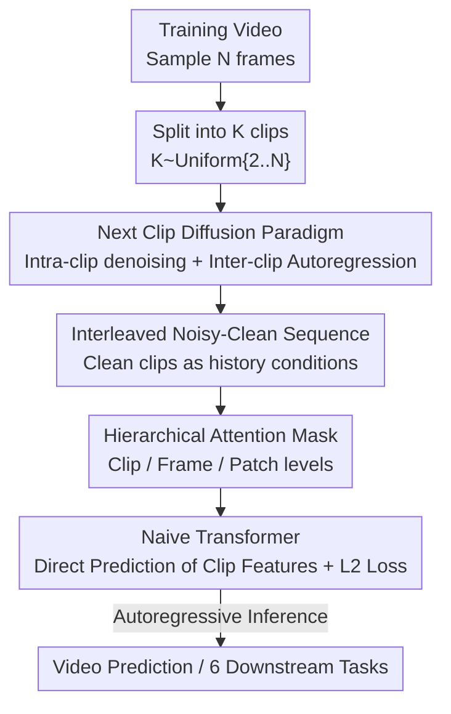

# Video-GPT via Next Clip Diffusion

**Conference**: ICLR 2026  
**OpenReview**: [https://openreview.net/forum?id=E0ZAcqy9TB](https://openreview.net/forum?id=E0ZAcqy9TB)  
**Code**: Paper promises open source (repository link not yet provided)  
**Area**: Video Generation / Diffusion Models / World Models  
**Keywords**: Generative Video Pre-training, next clip diffusion, autoregressive-diffusion hybrid, world models, video prediction

## TL;DR
By analogizing a "clip in a video" to a "word in language," this paper proposes the "next clip diffusion" pre-training paradigm—using parallel diffusion denoising within clips and autoregressive conditioning between clips. This allows a naive Transformer to perform self-supervised pre-training on 70 million unlabeled videos, significantly outperforming Kling (23.64) and Wan (20.89) with a score of 34.97 on the Physics-IQ world modeling benchmark, while transferring to 6 downstream video generation and understanding tasks.

## Background & Motivation

**Background**: GPT has achieved remarkable generalization through self-supervised pre-training on web-scale text using next token prediction. However, while language excels at high-level abstraction, it struggles to describe the rich spatiotemporal details of the visual world—concepts like "how to tie a knot" are difficult to explain in text but are naturally recorded in video at various resolutions. A natural question arises: can "video be treated as a new language" for visual world modeling?

**Limitations of Prior Work**: Current approaches have distinct drawbacks. Pure video diffusion (noise-to-denoise) offers high image quality but struggles with long-range future prediction, which is crucial for world models. Pure autoregressive video modeling (discretizing video into tokens for next token prediction) handles long contexts well but lags significantly behind state-of-the-art diffusion models in generation quality. Some works attempt to unify diffusion and autoregression within a Transformer, but most remain in the image domain and lack insightful analogies between language and video.

**Key Challenge**: There is a trade-off between the "high-quality parallel denoising" of diffusion and the "long-range temporal extrapolation" of autoregression. Fusing them at the frame level (next frame) or image level often sacrifices either range or quality, and fails to answer the fundamental question: what unit in video corresponds to a "word" in language?

**Goal**: To design a concise video foundation model capable of both high-quality short-term generation and long-range prediction, relying solely on self-supervised pre-training on video (without text labels), similar to GPT.

**Key Insight**: The authors observe that a "clip (multi-frame segment)" plays a similar role to a "word"—both describe local temporal information within their respective sequences. Thus, the fused unit is set at the clip level: diffusion is used within a clip (parallel, bidirectional, high quality), while autoregression is used between clips (maintaining temporal causality and enabling extrapolation).

**Core Idea**: Replace next token prediction with next clip diffusion—autoregressively "denoising the next noisy clip based on clean clips in history." This allows the model to inherit the self-supervised long-range capabilities of GPT and the short-term synthesis quality of diffusion.

## Method

### Overall Architecture

The training of Video-GPT involves splitting a video into multiple clips. Each clip is noised to create a "noisy clip," and then "noisy clips" and "clean clips" are interleaved chronologically into a sequence fed into a naive Transformer. Through a hierarchical attention mask, each noisy clip can only see the clean clips in its history, allowing it to be denoised and reconstructed, supervised by an L2 loss. During inference, the process is reversed: the model's previously denoised clips are treated as clean history to autoregressively denoise the next clip, achieving long-video prediction. The entire pipeline uses no text labels and relies purely on video self-supervision.

### Key Designs

**1. Next clip diffusion: Clips as words, diffusion internally, autoregression externally**

This design directly addresses the conflict of how and at what granularity to fuse diffusion and autoregression. After sampling $N$ frames, the video is split into $K$ clips ($K \sim \text{Uniform}\{2,3,\dots,N\}$), where each clip acts as a "visual word." For the $k$-th clip, each frame is compressed via a continuous VAE (from SDXL) and patched to obtain latent $\Phi(k,i)$. Forward noising is then applied via flow matching:

$$\Psi(k,i,\alpha_k) = \alpha_k\,\Phi(k,i) + (1-\alpha_k)\,\varepsilon_{k,i}$$

where weights $\alpha_k \sim \text{Uniform}[0,1]$ and noise $\varepsilon_{k,i}\sim\mathcal{N}(0,I)$. Crucially, all frames within the same clip share the same $\alpha_k$, allowing multi-frame denoising within a clip to be parallel and bidirectional (the advantage of diffusion). Meanwhile, strict temporal causality is maintained between clips (the advantage of autoregression). By elevating the unit from "frame/image" to "multi-frame clip," the model retains the high-quality parallel synthesis of diffusion while utilizing autoregression for long-range extrapolation.

**2. Interleaved noisy-clean sequences: Conditioning on "clean" history instead of "noisy" history**

To perform autoregressive denoising, the input sequence must be ordered, and the model must know what constitutes the historical condition. Each clip enters the sequence in two forms: clean clips wrapped with boundary tokens $CL(k,i)=[\langle\text{img}\rangle,\ \Phi(k,i),\ \langle/\text{img}\rangle]$, and noisy clips with denoising prompt tokens and timesteps $NS(k,i)=[\langle\text{diff}\rangle,\ \alpha_k,\ \Psi(k,i,\alpha_k)]$. These pairs are then interleaved:

$$\text{Input}=[NS(1,:),\,CL(1,:),\,\dots,\,NS(k,:),\,CL(k,:),\,\dots,\,NS(K,:)]$$

Unlike prior works that condition on noisy historical clips, this approach insists that the $k$-th noisy clip depends on the previous $(k-1)$ **clean** clips. This ensures that the denoising process is guided by accurate, noise-free temporal context, preventing historical noise from misguiding the results—a core stability factor for next clip diffusion extrapolation.

**3. 3-level Hierarchical Attention Mask: Expressing clip causality, frame dependency, and patch spatial relations**

The sequence contains inter-clip temporal causality, intra-clip frame dependencies, and intra-frame patch dependencies. A standard causal mask cannot represent this complex structure, leading to the design of a clip/frame/patch nested mask. **Clip level**: Clean clips depend on themselves and prior clean clips; noisy clips depend on themselves and historical $(k-1)$ clean clips (but not noisy ones). **Frame level**: Clean frames are causal within a clip (frame $i$ sees frame $1$ to $i$ + all frames of historical clean clips); noisy frames are **bidirectional** within the same clip (plus historical clean frames). Since iterative denoising eventually converts noisy clips into clean history, bidirectional masks for noisy frames improve generation quality without affecting subsequent inference. **Patch level**: Prompt tokens ($\langle\text{img}\rangle/\langle\text{diff}\rangle$) follow causality, while patch tokens within the same frame describing spatial relations are fully connected. This allows a naive Transformer to learn "temporal causality and spatial global visibility" within a single sequence.

**4. Direct clip prediction + Progressive training: Simplifying training objectives and compute**

To keep the pre-training setup simple and transferable, the model predicts clean clip features directly rather than noise or velocity, using an L2 loss. To handle the quadratic growth of attention with frame count, the authors use progressive training (Tab. 1): starting from 16 frames with 1 frame per clip (next-frame), then gradually scaling the total frames (16→48→80) and the frames per clip to learn short-term then long-range dynamics. Additionally, to bridge the distribution shift between clean history $CL$ and the model's denoised output $DNS$ during inference, slight noise is injected into clean frames during training: $\Phi(k,i)=(\beta+\gamma_{k,i})\Phi(k,i)+(1-\beta-\gamma_{k,i})\epsilon_{k,i}$ ($\beta=0.9$).

### Mechanism Example

To predict the 3rd clip during inference: given the 1st clean clip $DNS(1,:)$ as a starting point → the model iteratively denoises $NS(2,:)$ for $T$ steps to get $DNS(2,:)$ → using $DNS(1,:)$ and $DNS(2,:)$ as clean historical conditions, it denoises $NS(3,:)$ to get $DNS(3,:)$. The formula is $DNS(k{+}1,:)=\text{Video-GPT}\big(DNS(1,:),\dots,DNS(k,:),NS(k{+}1,:)\big)$. When exceeding the context window, standard sliding windows are used to support infinite video extrapolation.

## Key Experimental Results

### Main Results

Pre-trained on unlabeled Panda-70M using SDXL VAE and a Phi-3-mini backbone on 320 H20 GPUs.

| Dataset | Metric | Video-GPT (Ours) | Prev. SOTA | Note |
|--------|------|-----------|----------|------|
| Physics-IQ | Phys-IQ Score↑ | **34.97** | 29.50 (VideoPoet) / 23.64 (Kling1.6) / 20.89 (Wan2.1) | Deterministic physical prediction; >5 pts over 2nd place |
| Physics-IQ | Spatial-Temporal↑ | **0.240** | 0.208 (Seine) | Best spatiotemporal consistency |
| Physics-IQ | Weighted MSE↓ | **0.007** | 0.010 (VideoPoet) | Lowest error |
| Kinetics-600 | FVD(5000)↓ | **89.44** | 91.08 (Seine) | Stochastic human action prediction; Naive Transformer is optimal |
| UCF-101 (class→video, finetune) | FVD↓ | **53** | 57 (LARP/FAR) | SOTA at high resolution with 2D VAE |

Video-GPT leads in both "deterministic physics" (Physics-IQ) and "high-uncertainty human action" (Kinetics-600) prediction. The fact that it outperforms U-Net/DiT models on Kinetics-600 using a naive Transformer directly validates the effectiveness of the next clip diffusion paradigm.

### Ablation Study

| Configuration | Phys-IQ Score | Note |
|------|---------------|------|
| Next Token Prediction | 21.59 | Reverting to next token paradigm |
| **Next Clip Diffusion** | **34.94** | Ours; Gain of 13+ pts |
| Inference: 1 frame per clip | 0.00 | Nearly unusable with too few parallel frames |
| Inference: 16 frames per clip | 32.86 | Quality rises significantly with more parallel frames |
| Inference: 32 frames per clip | **34.94** | Validates clip-level generation advantage |
| Pre-train: 16 frames | 22.06 | Short temporal window |
| Pre-train: 80 frames | **34.94** | Better world modeling with longer window |
| No noise on clean clips | 33.09 | — |
| Noise on clean clips ($\beta{=}0.9$) | **34.94** | Bridging train/inference gap |
| Data: 1M (OpenVid) | 23.16 | Small data |
| Data: 70M (Panda) | **33.09** | Clear data scaling dividend |

### Key Findings
- **The paradigm shift provides the largest gain**: Switching from next token prediction to next clip diffusion jumps the Physics-IQ score from 21.59 to 34.94, far exceeding gains from hyperparameter or data tuning. "Clip as word + intra-clip diffusion" is the core.
- **More parallel frames within a clip are better**: Scores increase from 0 (1 frame) to 34.94 (32 frames) during inference, showcasing the value of parallel bidirectional denoising within diffusion clips.
- **Infinite data scaling**: Similar to GPT, this requires no labels. Scaling from 1M to 70M data increased the score from 23.16 to 33.09, suggesting significant headroom with more web-scale video.
- **Downstream transferability**: Features are usable across 6 tasks (class/text→video, image animation, classification, retrieval, segmentation). For instance, UCF-101 linear probing reached 58.9% (vs VideoMAEv2's 56.4%), and MSR-VTT zero-shot retrieval R@1 reached 22.8 (vs VideoCLIP's 10.4).

## Highlights & Insights
- **"Clip = word" is the true insight**: While other hybrids struggle with frame or image granularity, this paper places the fusion at the "multi-frame clip" level, allowing diffusion and autoregression to complement rather than compromise each other.
- **Conditioning on "clean" history**: A crucial choice that ensures autoregressive extrapolation isn't contaminated by historical noise, enabling stable long-range prediction.
- **"Temporal causal, spatial global" via hierarchical masking**: By embedding complex dependencies into a single mask, a naive Transformer can represent video without specialized architectures, enhancing transferability.
- **Direct clip prediction**: Simplifying the objective makes it easier to adapt the same pre-trained model to both generative and discriminative downstream tasks.

## Limitations & Future Work
- Pre-training is currently limited to the video modality; future work involves multi-modal pre-training and reinforcement-driven world interaction.
- High compute/scale requirements (3.8B parameters, 320 H20 GPUs) and reliance on a 2D VAE (SDXL) limit spatiotemporal compression and long-video quality.
- Quantitative evidence for image animation generalization is relatively thin due to lack of standard benchmarks.
- Scores across benchmarks (deterministic vs. stochastic) are not directly comparable and must be interpreted within their respective task settings.

## Related Work & Insights
- **vs. Pure Video Diffusion (Wan / Sora)**: These have high quality within clips but lack self-supervised long-range prediction (Physics-IQ ~20s). This work introduces autoregressive conditioning for better world modeling (34.97).
- **vs. Pure Autoregressive (LVM / VideoWorld)**: Those use next token prediction with lower generation quality. This work uses diffusion within clips to regain quality.
- **vs. Frame-level Hybrids (Self-Forcing / APT2)**: These fuse at the "frame" level. By elevating to "clips," this work allows more efficient parallel processing and adheres to a GPT-style unlabeled pre-training paradigm.

## Rating
- Novelty: ⭐⭐⭐⭐⭐ The "clip as word" analogy is powerful and validated by drastic gains in ablation.
- Experimental Thoroughness: ⭐⭐⭐⭐⭐ Covers two prediction benchmarks, 6 downstream tasks, and extensive ablations on paradigm, frames, and data scale.
- Writing Quality: ⭐⭐⭐⭐ Clear narrative, though the hierarchical mask and symbols are dense for initial reading.
- Value: ⭐⭐⭐⭐⭐ Provides a scalable, transferable self-supervised paradigm for the "video as language" world model route.

<!-- RELATED:START -->

## Related Papers

- [\[CVPR 2026\] Video-as-Answer: Predict and Generate Next Video Event with Joint-GRPO](../../CVPR2026/video_generation/video-as-answer_predict_and_generate_next_video_event_with_joint-grpo.md)
- [\[CVPR 2026\] TempoMaster: Efficient Long Video Generation via Next-Frame-Rate Prediction](../../CVPR2026/video_generation/tempomaster_efficient_long_video_generation_via_next-frame-rate_prediction.md)
- [\[CVPR 2025\] Motion Modes: What Could Happen Next?](../../CVPR2025/video_generation/motion_modes_what_could_happen_next.md)
- [\[ICLR 2026\] Vid2World: Crafting Video Diffusion Models to Interactive World Models](vid2world_crafting_video_diffusion_models_to_interactive_world_models.md)
- [\[ICLR 2026\] Geometry Forcing: Marrying Video Diffusion and 3D Representation for Consistent World Modeling](geometry_forcing_marrying_video_diffusion_and_3d_representation_for_consistent_w.md)

<!-- RELATED:END -->
