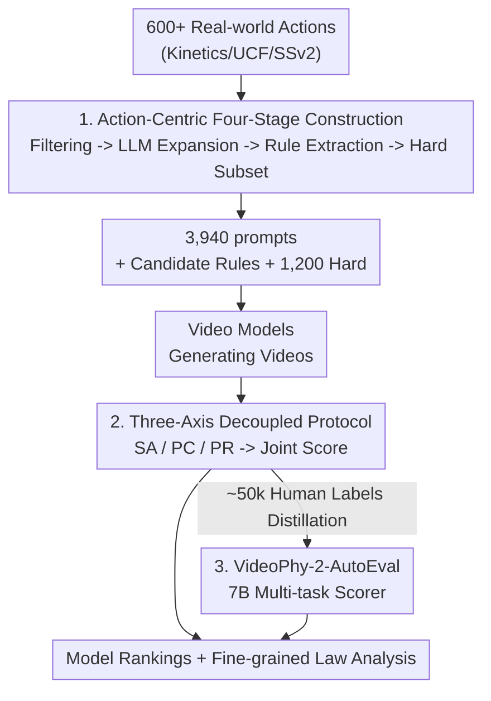

# VideoPhy-2: A Challenging Action-Centric Physical Commonsense Evaluation in Video Generation

**Conference**: ICLR 2026  
**OpenReview**: [https://openreview.net/forum?id=HA8KSQW7SO](https://openreview.net/forum?id=HA8KSQW7SO)  
**Code**: https://videophy2.github.io/  
**Area**: Video Generation / Evaluation Benchmark  
**Keywords**: Physical Commonsense, Video Generation Evaluation, Action-Centric, Automatic Evaluator, Human Annotation

## TL;DR
VideoPhy-2 utilizes 3,940 multi-event prompts derived from 197 real-world actions. Generated videos from modern text-to-video models are scored by humans across three axes: Semantic Adherence, Physical Commonsense, and Physical Rules. The results reveal that even the strongest model, Wan2.2-27B-A14B, achieves only $47.7\%$ joint performance on the hard subset. Furthermore, a 7B VideoPhy-2-AutoEval evaluator was trained to reduce human evaluation costs.

## Background & Motivation

**Background**: Large-scale video generation models are expected to become "general physical world simulators" capable of serving downstream tasks such as embodied strategy learning, autonomous driving, and gaming. This requires generated videos to strictly adhere to physical commonsense—for example, a tennis ball should follow a parabolic trajectory after being hit, and a hammer should not deform when swung. Systematically measuring this "physical plausibility" remains an open challenge.

**Limitations of Prior Work**: Existing evaluations possess significant drawbacks. Benchmarks based on ground-truth physical simulation comparisons (e.g., Physics-IQ) rely on continuing the first few frames of real videos, which may not align with human judgment and struggle to scale to complex multi-event scenarios. PhyGenBench contains only 160 manual prompts, limiting its scale and extensibility. More critically, these works often strictly bind a single prompt to a single physical law (e.g., "stone on water" linked to buoyancy). In reality, model semantic adherence is often imperfect; if a model fails to depict "placing on water" and instead shows "dropping from a height," gravity becomes the relevant law, rendering the one-to-one binding invalid.

**Key Challenge**: Semantic Adherence (whether the video fits the text) and Physical Commonsense (whether the video follows physical laws) are two entangled dimensions that must be decoupled. Evaluating them together (as in the original VideoPhy, where annotators viewed the prompt while judging physics) introduces bias. Conversely, hard-coding physical laws to prompts leads to misjudgment when the model's semantic performance is substandard.

**Goal**: To construct a large-scale, action-diverse benchmark with fine-grained physical rule annotations and difficulty partitioning. This benchmark aims to precisely expose the physical deficiencies of video models while enabling automated evaluation to lower costs.

**Key Insight**: Data should be organized around "real-world actions" (e.g., playing tennis, backflipping, breaking an object), as these actions naturally contain rich physical interactions. Humans can judge physical plausibility based on daily experience without formal physics training. Additionally, physical rules should be established based on "captions of the generated video itself" rather than inferred from the prompt in isolation, ensuring rules are aligned with actual video content.

**Core Idea**: Use actions as seeds for LLMs to generate multi-event prompts and employ VLMs in the loop to extract candidate physical rules. Combined with a decoupled three-axis human evaluation protocol, this creates a challenging physical commonsense benchmark and facilitates the distillation of a multi-task automatic evaluator.

## Method

### Overall Architecture

VideoPhy-2 is not a generation method but an evaluation framework comprising dataset construction, an evaluation protocol, and an automatic evaluator. The pipeline takes real-world actions as input and outputs quantitative physical scores for any text-to-video model. The pipeline consists of three components: ① A four-stage dataset construction—filtering 197 actions from over 600, expanding each into 20 multi-event prompts (3,940 total), extracting physical rules via VLM captions, and identifying a 1,200-prompt hard subset. ② A three-axis decoupled human evaluation protocol—allowing humans to score Semantic Adherence (SA), Physical Commonsense (PC), and Physical Rules (PR) independently to calculate a joint metric. ③ Distilling approximately 50,000 human labels into a 7B video-language model, VideoPhy-2-AutoEval, for rapid automated scoring.

### Key Designs

**1. Action-Centric Four-Stage Dataset Construction: Ensuring Diversity and Extensibility**

**Stage 1: Seed Actions**: Over 600 actions were gathered from Kinetics, UCF-101, and SSv2. Two groups of STEM students independently labeled them for "suitability for physical evaluation," filtering out actions with negligible motion (e.g., typing). 197 consolidated actions (143 object interactions + 54 physical/body activities) were finalized after deduplication using Gemini-2.0-Flash-Exp. **Stage 2: LLM Prompt Expansion**: LLMs generated 20 prompts per action, encouraging "multi-event" descriptions to increase difficulty (e.g., "Archer pulls bow -> releases arrow -> arrow flies straight -> hits target"). A Mistral-NeMo-12B upsampler then expanded these into dense captions (averaging 138 tokens) to add visual detail without altering semantics. **Stage 3: Candidate Physical Rules**: Rules are rooted in actual video content by generating video captions via Gemini-2.0-Flash-Exp and then deriving three applicable physical rules from those captions. **Stage 4: Hard Subset**: CogVideoX-5B was used as a reference model to identify 60 actions where the joint performance was zero, resulting in a 1,200-prompt hard subset focusing on momentum transfer, state changes, and complex motion.

**2. Three-Axis Decoupled Evaluation Protocol: Decoupling Semantics from Physics**

The evaluation is split into three independent dimensions. **Semantic Adherence (SA)** uses a 1–5 Likert scale to evaluate if the video faithfully represents entities and actions. **Physical Commonsense (PC)** also uses a 1–5 scale, but annotators **only view the video, not the prompt**, to avoid text-induced bias. **Physical Rules (PR)** involve binary/trinary judgments on whether candidate rules are violated (0), obeyed (1), or Cannot Be Determined (CBD, 2). The primary metric is **joint performance**: the percentage of videos where $SA \geq 4$ and $PC \geq 4$.

**3. VideoPhy-2-AutoEval: Distilling Human Knowledge into a 7B Model**

Using VideoCon-Physics as a backbone, VideoPhy-2-AutoEval was fine-tuned on ~50,000 human labels (costing \$3,515 to collect) via **multi-task** distillation. The model simultaneously learns SA scoring (1–5), PC scoring (1–5), and PR classification (0–2). Evaluations use Pearson correlation with ground-truth human scores to measure evaluator quality.

## Key Experimental Results

### Main Results

Human evaluation joint performance ($SA \geq 4$ and $PC \geq 4$, %):

| Model | Type | All | Hard | Physical Activities (PA) | Object Interactions (OI) |
|------|------|------|------|------|------|
| Wan2.2-27B-A14B | Open | **55.4** | **47.7** | 54.5 | 58.6 |
| Wan2.1-14B | Open | 32.6 | 21.9 | 31.5 | 36.2 |
| CogVideoX-5B | Open | 25.0 | 0.0 | 24.6 | 26.1 |
| Cosmos-Diff-7B | Open | 24.1 | 10.9 | 22.6 | 27.4 |
| Hunyuan-13B | Open | 17.2 | 6.2 | 17.6 | 15.9 |
| VideoCrafter-2 | Open | 10.5 | 2.9 | 10.1 | 13.1 |
| Sora | Closed | 23.3 | 5.3 | 22.2 | 26.7 |

Even the strongest model, Wan2.2-27B-A14B, scores only $55.4\%$ on the full set and drops to $47.7\%$ on the hard subset. Closed-source models (Sora, Ray2) do not significantly outperform leading open-source models, suggesting physical common sense is not guaranteed by proprietary status.

Auto-Evaluator vs. Off-the-shelf Models (Pearson Correlation $\times 100$):

| Evaluator | Avg | SA | PC |
|------|------|------|------|
| VideoCon-Physics | 28.5 | 32.0 | 25.0 |
| Gemini-2.5-Flash-Exp | 20.5 | 31.0 | 10.0 |
| **VideoPhy-2-AutoEval** | **42.0** | **47.0** | **37.0** |

### Ablation Study

| Analysis Dimension | Key Findings |
|------|---------|
| Physical Law Violations | Conservation of Mass and Momentum have the highest violation rates ($\approx 40\%$). |
| Reflection / Buoyancy | Violation rates are lower ($<20\%$), indicating better model mastery. |
| PA vs. OI | Physical Activities (sports) generally score lower than Object Interactions. |
| Correlation | PC scores have near-zero correlation with Aesthetic scores ($0.09$) or Motion scores ($0.002$). |

### Key Findings
- **Conservation Laws are the Weakest Link**: High violation rates in mass and momentum conservation indicate that video models struggle with constraints like "momentum transfer after collision" or "objects not appearing/disappearing."
- **Hard Subset Efficacy**: CogVideoX-5B's joint performance dropping to zero on the hard subset demonstrates the effectiveness of the reference-model-based filtering strategy.
- **Independence of Physics and Aesthetics**: Physical common sense cannot be improved simply by optimizing visual quality or increasing the magnitude of motion.

## Highlights & Insights
- **Rooting Rules in Video Captions**: Generating rules from video captions rather than prompts bypasses the problem of "semantic adherence failure" rendering prompt-based rules irrelevant.
- **Prompt-Blind Physics Evaluation**: Hiding the prompt from annotators during PC evaluation is a simple yet crucial design to decouple "description alignment" from "physical possibility."
- **Strict Joint Metric**: Using $SA \geq 4 \cap PC \geq 4$ prevents models with poor semantic adherence from achieving misleadingly high posterior physical scores.

## Limitations & Future Work
- **Duration Constraint**: Videos are limited to under 6 seconds; long-term physical consistency (e.g., full gymnastic routines) is not covered.
- **Closed-Source Transparency**: Evaluation of Sora and other closed models is limited by API availability and sample sizes.
- **Evaluator Correlation Gap**: While VideoPhy-2-AutoEval outperforms GPT/Gemini, a Pearson correlation of $37$ on PC shows that automatic physical judgment remains a difficult task.

## Related Work & Insights
- **vs. VideoPhy**: This version expands the scale from 688 to 3,940 prompts and introduces the three-axis decoupled evaluation and physical rule/law annotations.
- **vs. PhyGenBench**: Unlike the 160 manual prompts in PhyGenBench, VideoPhy-2 uses LLM-assisted expansion and roots rules in video captions rather than static prompt mapping.

## Rating
- Novelty: ⭐⭐⭐⭐ 
- Experimental Thoroughness: ⭐⭐⭐⭐⭐ 
- Writing Quality: ⭐⭐⭐⭐ 
- Value: ⭐⭐⭐⭐⭐ 

<!-- RELATED:START -->

## Related Papers

- [\[ICLR 2026\] NarrLV: Towards a Comprehensive Narrative-Centric Evaluation for Long Video Generation](narrlv_towards_a_comprehensive_narrative-centric_evaluation_for_long_video_gener.md)
- [\[CVPR 2026\] HandWorld: Hand-Centric Unified Video Action Generation](../../CVPR2026/video_generation/handworld_hand-centric_unified_video_action_generation.md)
- [\[ICLR 2026\] $PhyWorldBench$: A Comprehensive Evaluation of Physical Realism in Text-to-Video Models](phyworldbench_a_comprehensive_evaluation_of_physical_realism_in_text-to-video_mo.md)
- [\[ICLR 2026\] AUHead: Realistic Emotional Talking Head Generation via Action Units Control](auhead_realistic_emotional_talking_head_generation_via_action_units_control.md)
- [\[ICLR 2026\] The Quest for Generalizable Motion Generation: Data, Model, and Evaluation](the_quest_for_generalizable_motion_generation_data_model_and_evaluation.md)

<!-- RELATED:END -->
