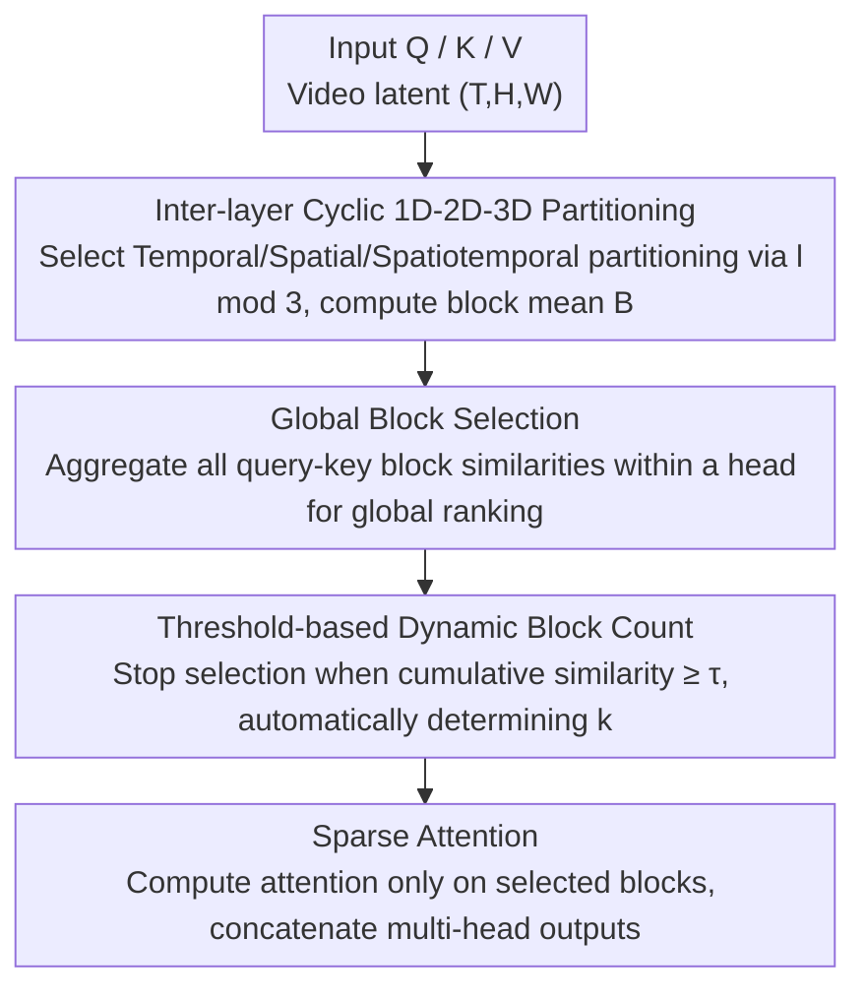

# VMoBA: Mixture-of-Block Attention for Video Diffusion Models

**Conference**: ICLR 2026  
**OpenReview**: [https://openreview.net/forum?id=oQaRElUdmh](https://openreview.net/forum?id=oQaRElUdmh)  
**Code**: https://github.com/KwaiVGI/VMoBA  
**Area**: Video Generation / Diffusion Models / Sparse Attention  
**Keywords**: Video Diffusion Models, Sparse Attention, Block Attention, Spatiotemporal Locality, Training Acceleration

## TL;DR
To address the quadratic complexity bottleneck of full attention in Video Diffusion Models (VDMs), VMoBA transforms the text-oriented MoBA block attention into a sparse attention mechanism tailored for video spatiotemporal characteristics. By employing "inter-layer cyclic 1D-2D-3D partitioning + global block selection + threshold-based dynamic block count," it achieves $2.92\times$ FLOPs reduction and $1.48\times$ training acceleration on long sequences ($93\times 576\times 1024$), while maintaining or even improving generation quality compared to full attention.

## Background & Motivation

**Background**: To generate long-duration, high-resolution videos, VDM backbones generally rely on full attention. However, the computational cost of full attention grows quadratically with the number of tokens. For instance, the latent of a 720p video can exceed 76,000 tokens, making attention the primary bottleneck for training and inference. To mitigate this, various sparse attention mechanisms have been proposed to allow each query to interact with only a subset of keys and values.

**Limitations of Prior Work**: Existing sparse attention methods for video (e.g., DiTFastAttn, SparseVideoGen, SpargeAttn) are mostly **training-free inference accelerators** that are applied directly to pre-trained models without retraining, which often compromises performance. Sparse attention mechanisms that can effectively accelerate **training** remain largely unexplored. A natural intuition is to adapt MoBA (Mixture of Block Attention), successfully validated in LLMs, to VDM training. However, the authors found that direct porting performs poorly: the VBench Score plummeted from 68.25 (full attention) to 56.88.

**Key Challenge**: MoBA was designed for **text**—it flattens latents into 1D sequences and partitions them uniformly, assuming locality exists only in 1D. However, video locality is **3D spatiotemporal**. Forcing 3D latents into 1D blocks separates tokens that are spatially adjacent, causing the "block mean" to lose representativeness and fundamentally breaking spatiotemporal locality. Furthermore, MoBA selects a fixed number of blocks for each query using a fixed Top-K, ignoring the facts that query importance is non-uniform and attention concentration varies significantly across different heads in video models.

**Key Insight**: The authors conducted a task-specific analysis of the attention maps of a pre-trained video DiT (Wan 2.1 1.3B), leading to three key observations: (1) Full attention maps exhibit 1D/2D/3D spatiotemporal local patterns, with preferences varying by layer (e.g., Layer 27 favors the temporal axis, Layer 3 favors intra-frame spatial, and Layer 20 favors 3D spatiotemporal neighborhoods); (2) Query importance varies greatly, with a wide gap in top similarity scores; (3) Concentration levels differ across heads, where some heads focus most similarity on a few blocks while others are more diffuse. These observations correspond directly to the mismatch points in MoBA.

**Core Idea**: Replace MoBA's text-oriented fixed partitioning and fixed Top-K with "video-aware spatiotemporal partitioning + adaptive block selection," creating VMoBA, the **first hybrid block sparse attention specifically designed for VDM training**.

## Method

### Overall Architecture

VMoBA modifies the internal structure of an attention layer through a three-step process: **partition keys and calculate block means → select the most salient key blocks for each head → compute sparse attention only on the selected blocks**. It replaces full attention entirely, taking $Q/K/V$ as input and producing attention results consistent with the original dimensions (implemented using FlashAttention for equivalent efficiency).

These steps involve three key designs: first, partitioning is not fixed but **cycles through 1D/2D/3D modes across layers** (Observation 1); second, block selection is no longer independent per query but aggregates all query-key block similarities within a head into a **global pool** for ranking (Observation 2); third, the number of selected blocks is not a fixed Top-K but is **automatically determined by a threshold $\tau$** based on cumulative similarity (Observation 3).

### Key Designs

**1. Inter-layer Cyclic 1D-2D-3D Partitioning: Aligning Block Structure with Video Spatiotemporal Locality**

This directly addresses the issue where MoBA's 1D partitioning destroys spatiotemporal locality. VMoBA defines three partitioning modes: **Temporal (1D)** aggregates tokens from adjacent frames; **Spatial (2D)** aggregates tokens at the same spatial position across all frames; **Spatiotemporal (3D)** partitions the latent into local 3D patches. Crucially, these modes are **switched cyclically per layer**—the $l$-th layer uses a mode based on $l \bmod 3$ ($0$ for 1D, $1$ for 2D, $2$ for 3D). Formally, $K \in (T, H, W)$ is rearranged and averaged to obtain the block tensor $B = \mathrm{mean}(K')$.

This is effective because Observation 1 shows that different layers naturally prefer different spatiotemporal neighborhoods. Cyclic partitioning allows the model to **automatically learn** the appropriate attention pattern for each layer during training. Compared to SparseVideoGen, which runs a small pilot attention per layer for online classification (increasing overhead significantly for long sequences), VMoBA avoids this cost. Furthermore, compared to uniform 3D partitioning across all layers, the cyclic scheme reduces the total block count and ensures that semantically related tokens are more likely to fall into the same block.

**2. Global Block Selection: Allocating Sparsity by Interaction Intensity Instead of Per-Query Allocation**

Addressing Observation 2—where query importance varies significantly—MoBA's independent fixed-count selection per query allocates insufficient budget to strong queries and wastes budget on weak ones. VMoBA instead calculates the similarity matrix for **all** queries and **all** key blocks within each head, picking the top pairs from this **global pool**. Formally, $M_i = \mathrm{TopkMask}(q_i b_i^{T}, k)$, where $q_i \in \mathbb{R}^{s \times d}$ represents all queries in head $i$ and $b_i \in \mathbb{R}^{N_b \times d}$ represents all key blocks in that head.

This ensures sparsity is allocated based on "collective interaction signals"—important queries automatically receive more blocks via global ranking, while weak queries are not forced to take a quota. It shifts the perspective from local per-query selection to a global head-level view.

**3. Threshold-based Dynamic Block Count: Adapting Block Counts to Head Concentration**

Observation 3 noted that similarity concentration varies across heads (e.g., some heads concentrate 50% of similarity in far fewer query-block pairs than others). MoBA's uniform Top-K is inefficient. VMoBA uses a threshold: after sorting global similarities in descending order, it **accumulates normalized similarities until the sum exceeds threshold $\tau$**, dynamically determining $k$:

$$k=\min\Big\{k' \mid \sum_{j=1}^{k'}\mathrm{Sorted}(\hat S_j)\ge \tau\Big\},\quad \hat S=q_i b_i^{T}$$

Essentially, $\tau$ controls the "proportion of similarity quality preserved" rather than the number of blocks. This allows VMoBA to compress each head adaptively based on its information content, approximating full attention more accurately. By default, $\tau=0.25$.

### Loss & Training
VMoBA introduces no additional training objectives and follows the native training loss of video diffusion. Key hyperparameters include $\tau = 0.25$ and block counts (e.g., "8-48-72" for 1D/2D/3D). Following prior work, **full attention is retained for the first 25% of denoising steps**. Training experiments were conducted for 2000 steps using Wan 2.1 1.3B as the base.

## Key Experimental Results

### Main Results

Training Acceleration (Table 2, VBench metrics + Efficiency, Base: Wan 2.1, Training time in GPU hours):

| Video Size | Method | Sparsity | Dynamic↑ | ImageQual↑ | SubConsist↑ | FLOPs↓ | Training Time↓ |
|----------|------|--------|----------|-----------|-------------|--------|-----------|
| 93×576×1024 (55K) | FullAttn | - | 61.58% | 69.49% | 90.86% | 705.02T (1.00×) | 276h (1.00×) |
| 93×576×1024 (55K) | MoBA | 0.25 | 5.80% | 63.73% | 94.30% | 282.69T (2.49×) | 226h (1.22×) |
| 93×576×1024 (55K) | **VMoBA** | **0.19** | 56.91% | 67.45% | 96.76% | **248.68T (2.83×)** | **187h (1.48×)** |
| 141×480×832 (56K) | FullAttn | - | 43.01% | 64.36% | 92.58% | 724.97T (1.00×) | 262h (1.00×) |
| 141×480×832 (56K) | MoBA | 0.25 | 11.97% | 65.07% | 93.40% | 289.16T (2.51×) | 209h (1.25×) |
| 141×480×832 (56K) | **VMoBA** | **0.18** | 31.36% | **67.66%** | 93.78% | **248.39T (2.92×)** | **182h (1.44×)** |

On spatially extended resolutions, VMoBA's VBench average (68.34) slightly exceeds full attention (68.25), while training took only 187 GPU hours ($1.48\times$ speedup). Comparatively, MoBA's Dynamic Degree is extremely low (5.80%/11.97%), producing nearly static videos and proving its 1D partitioning fails to capture motion.

Training-free Inference (Table 1, directly applied to pre-trained models):

| Video Size | Method | Sparsity | PSNR↑ | FLOPs↓ | Latency↓ |
|----------|------|--------|-------|--------|----------|
| 81×720×1280 (76K) | FullAttn | - | - | 1246.78T | 406s |
| 81×720×1280 (76K) | MoBA | 0.25 | 20.46 | 457.20T (2.73×) | 360s (1.13×) |
| 81×720×1280 (76K) | **VMoBA** | 0.31 | 18.80 | 519.75T (2.40×) | **300s (1.35×)** |

VMoBA achieves $1.35\times$ inference speedup on long sequences, outperforming MoBA's $1.13\times$ because MoBA's 1D partitioning generates excessive blocks that hinder latency.

### Ablation Study

| Configuration | Dynamic↑ | ImageQual↑ | SubConsis↑ | Training Time↓ | Description |
|------|----------|-----------|------------|-----------|------|
| 1-2-3D (Full) | 56.91% | 67.45% | 94.72% | 187h | Default partitioning |
| 1-3D (No 2D) | 28.57% | 66.71% | 91.34% | 187h | No spatial; Dynamic degree collapses |
| 1-2D (No 3D) | 55.49% | 58.51% | 86.12% | 176h | No spatiotemporal; Large drop in ImageQual |
| 2-3D (No 1D) | 57.01% | 66.02% | 94.75% | 202h | Higher quality but training time rises |
| threshold + global (Full) | 56.91% | 67.45% | 94.72% | - | Optimal selection strategy |
| topk + global | 55.29% | 64.58% | 92.86% | - | Switching to fixed Top-K degrades all metrics |
| threshold + local | 55.19% | 65.31% | 92.43% | - | Dropping global pool degrades results |
| topk + local (≈MoBA) | 54.87% | 65.59% | 91.64% | - | Worst performance |

### Key Findings
- **All three partitioning modes are essential**: Removing 1D partitioning increases training time from 187h to 202h, indicating 1D primarily contributes to **efficiency**. Removing 3D partitioning causes the sharpest drop in ImageQual (58.51%) and SubConsis (86.12%), highlighting its role in quality and consistency.
- **Global + Threshold strategies are complementary**: The "threshold + global" strategy is optimal; removing either leads to degradation. Returning to "topk + local" (MoBA style) results in the worst performance.
- **Threshold $\tau$ is a quality-cost knob**: Increasing $\tau$ from 0.15 to 0.50 steadily improves quality but increases training time from 162h to 378h. $\tau=0.25$ provides the best balance.
- **Direct MoBA porting fails for video**: The resulting static videos (Dynamic: 5.80%) prove that text-oriented 1D partitioning cannot capture spatiotemporal motion.

## Highlights & Insights
- **Analysis-driven Design**: The three innovations directly address observed patterns in pre-trained DiTs (locality modes, query variance, head concentration), making the motivation concrete and verifiable.
- **Thresholding is more fundamental than Top-K**: Replacing "picking $k$ items" with "preserving proportion $\tau$ of quality" allows sparsity to adapt to information distribution—a concept applicable to any sparse attention (e.g., long-context LLMs).
- **Trading Time for Structure**: Instead of online classification of heads, model training allows the system to learn within cyclic partitioning, avoiding the massive online overhead of methods like SparseVideoGen.
- **Sparse Attention may exceed Full Attention**: VMoBA occasionally outperforms full attention in prompt alignment and image quality, suggesting that sparsification might act as a form of regularization or denoising in long sequences.

## Limitations & Future Work
- Lower PSNR in training-free inference (18.80 for 76K tokens), indicating that pixel-wise similarity to full attention is low. While quality is high, it might not suit tasks requiring exact replication of full-attention outputs.
- Experiments were conducted only on Wan 2.1 1.3B; generalizability to larger models or different architectures remains to be fully verified.
- The cyclic period is fixed at 1-2-3D, and the partitioning type per layer is hardcoded via $l \bmod 3$ rather than being truly adaptive. $\tau$ and block counts remain manually tuned hyperparameters.
- The decision to keep full attention for the first 25% of denoising steps leaves potential acceleration on the table.

## Related Work & Insights
- **vs. MoBA**: MoBA is for text (1D partitioning + local Top-K); VMoBA is for video (cyclic 1D-2D-3D + global threshold). Porting MoBA directly destroys video dynamics.
- **vs. SparseVideoGen (SVG)**: SVG classifies heads but requires expensive online pilot attention; VMoBA learns spatiotemporal patterns via training and cyclic partitioning, avoiding online costs.
- **vs. DiTFastAttn**: Both provide inference acceleration, but VMoBA also accelerates training and can meet or exceed full attention quality after training.
- **vs. Linear Attention / SSMs**: While linear attention achieves linear complexity, it is harder to swap seamlessly with full attention. Block-sparse attention (MoBA/NSA/VMoBA) offers better compatibility and smoother transitions.

## Rating
- Novelty: ⭐⭐⭐⭐ (First block-sparse attention for VDM training; analysis-driven innovations, though based on the MoBA framework.)
- Experimental Thoroughness: ⭐⭐⭐⭐ (Covers training/inference and spatial/temporal extensions; complete ablations; limited to a single base model.)
- Writing Quality: ⭐⭐⭐⭐⭐ (Clear logic connecting observations to innovations; well-explained charts.)
- Value: ⭐⭐⭐⭐ (Addresses long video training costs; $1.48\times$ training acceleration with high quality; open-sourced.)

<!-- RELATED:START -->

## Related Papers

- [\[ICLR 2026\] MoGA: Mixture-of-Groups Attention for End-to-End Long Video Generation](moga_mixture-of-groups_attention_for_end-to-end_long_video_generation.md)
- [\[ICLR 2026\] Mixture of Contexts for Long Video Generation](mixture_of_contexts_for_long_video_generation.md)
- [\[ICLR 2026\] SANA-Video: Efficient Video Generation with Block Linear Diffusion Transformer](sana-video_efficient_video_generation_with_block_linear_diffusion_transformer.md)
- [\[ICLR 2026\] BWCache: Accelerating Video Diffusion Transformers through Block-Wise Caching](bwcache_accelerating_video_diffusion_transformers_through_block-wise_caching.md)
- [\[ICLR 2026\] BLADE: Block-Sparse Attention Meets Step Distillation for Efficient Video Generation](blade_block-sparse_attention_meets_step_distillation_for_efficient_video_generat.md)

<!-- RELATED:END -->
