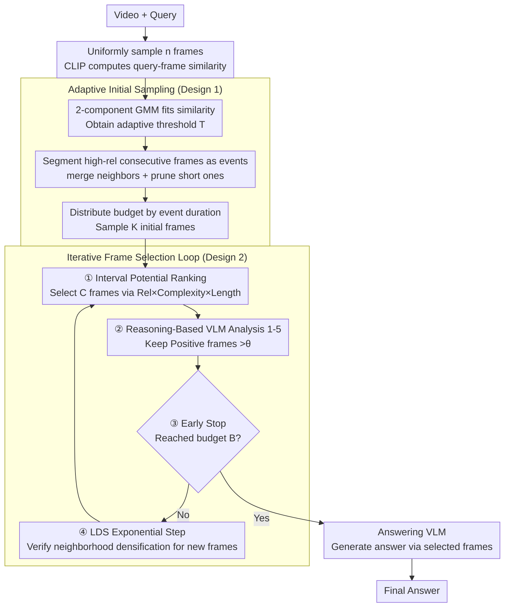

# A.I.R.: Adaptive, Iterative, and Reasoning-based Frame Selection For Video Question Answering

**Conference**: ICLR 2026  
**arXiv**: [2510.04428](https://arxiv.org/abs/2510.04428)  
**Code**: [https://ucf-air.github.io/](https://ucf-air.github.io/)  
**Area**: Video Understanding  
**Keywords**: video QA, frame selection, VLM, iterative search, computational efficiency

## TL;DR
Ours proposes A.I.R., a training-free adaptive-iterative-reasoning-driven frame selection framework. It addresses the dual dilemma of inaccurate similarity in lightweight models (CLIP) and explosive costs of VLM analysis in VideoQA through a two-stage strategy (GMM adaptive initial sampling + iterative VLM fine-grained analysis). Even in the worst-case scenario, it only requires analyzing 72 frames (vs. the 128-frame baseline) while significantly improving performance across multiple long-video benchmarks.

## Background & Motivation
**Background**: Frame selection is critical in VideoQA as complete videos are too long to process entirely. Existing methods fall into two categories: (1) Lightweight models (CLIP) that select frames after calculating similarity, which are fast but inaccurate for complex queries; (2) VLMs that analyze frames one by one, which are accurate but suffer from explosive computational costs (128 frames $\approx$ 162 seconds).

**Limitations of Prior Work**: CLIP treats queries as bags-of-words and fails to understand temporal reasoning (e.g., "after the introduction of tofu") and complex semantics, leading to similarity scores that do not reflect true relevance. Conversely, analyzing all frames with a VLM is infeasible.

**Key Challenge**: Accurate frame selection requires deep semantic understanding (VLM), but the cost of the VLM's frame-by-frame analysis grows linearly with the number of frames. How can VLM calls be reduced without sacrificing quality?

**Goal**: Make the deep analysis of VLMs computationally feasible by analyzing only a small number of frames with the highest potential rather than all frames.

**Key Insight**: A two-stage approach—first using CLIP for coarse-grained screening (fast but rough), then using VLM for fine-grained analysis of high-potential frames (accurate but expensive), iteratively discovering new frames.

**Core Idea**: Use an iterative loop to let the VLM analyze only small batches of high-potential frames, coupled with localized dense sampling to discover adjacent important frames.

## Method

### Overall Architecture
A.I.R. addresses the dilemma in VideoQA frame selection where CLIP is fast but struggles with temporal semantics, while VLM is accurate but too expensive for frame-by-frame analysis. Mechanism involves assigning specific roles to each: CLIP performs a cheap coarse pass over the entire video, while the expensive VLM analysis is reserved for a "small number of high-potential frames." The process is divided into three stages: **Adaptive Initial Sampling** fits CLIP similarity distributions using GMM to extract K initial frames based on event intervals; **Iterative Frame Selection** is a loop consisting of "interval potential ranking $\rightarrow$ VLM reasoning/scoring $\rightarrow$ early stopping judgment $\rightarrow$ local densification," which tightens the candidate pool and extracts truly relevant frames; finally, selected frames are sent to an Answering VLM. The same VLM is reused for both analysis and answering, and the entire process is training-free.

### Key Designs

**1. Adaptive Initial Sampling: Automatically aligning starting frames with query-related regions instead of uniform distribution**

The issue with uniform sampling is that the budget is spread across all time points, where redundant frames in long videos dilute key events. A.I.R. first calculates CLIP similarity for $n$ uniformly sampled frames, then uses a 2-component GMM to fit these scores into "high-relevance" and "low-relevance" clusters. Based on this, an adaptive threshold $T = \max(\mu_1,\mu_2) - \gamma \cdot \max(\sigma_1,\sigma_2)$ is defined to segment the frames. Since the threshold emerges from each video's own score distribution, the criteria adapt automatically. Continuous segments identified as high-relevance are treated as "events," followed by two cleanup steps—merging proximate events and pruning excessively short ones. Finally, the sampling budget is distributed proportionally to event durations to pick $K$ initial frames. This ensures initial points cluster around query-relevant regions.

**2. Iterative Frame Selection: A four-step loop for deep VLM reasoning on small batches of high-potential frames**

This is the core mechanism that decomposes the "expensive VLM" bottleneck. Each round performs four actions. First, **Interval Potential Ranking**: The video is segmented by currently selected frames, and the "potential" of each interval is calculated using three factors: Relevance $\times$ Complexity $\times$ Length. Intervals with higher relevance, complexity, and span are more likely to contain uncovered key frames. Second, **Reasoning-Based VLM Analysis**: The VLM analyzes these $C$ frames, provides justifications, and gives a score of 1-5; only "Positive" frames with scores above $\theta$ are retained. Third, **Early Stop**: Once the cumulative selected frames reach the adaptive budget $B$, the process terminates immediately. Fourth, **Localized Density Sampling (LDS)**: Within the temporal neighborhood of each VLM-verified frame, new frames are discovered using exponential step sizes (denser sampling near verified frames, sparser further away). These frames are added to the candidate pool for the next round. LDS allows the design to recover frames missed by CLIP—for example, a "Buddhist temple" frame with a low CLIP score of 0.4 might be initially filtered out, but if it is temporally adjacent to a VLM-confirmed frame, LDS will bring it back for VLM review.

**3. Efficiency Guarantee: Capping worst-case overhead at a controllable upper bound**

Since the VLM only runs on $C$ candidates per round, the cost no longer expands linearly with video length. In the best case, one iteration suffices (analyzing $C$ frames); in the worst case, it runs for $I_{max}$ rounds, totaling $C \times I_{max}$ frames. With defaults $C=12, I_{max}=6$, the maximum is 72 frames, which is still lower than methods like Frame-Voyager or VideoTree that analyze a fixed 128 frames. Furthermore, Early Stop typically triggers in 2-3 rounds in practice, making actual costs far lower than the upper bound.

### Loss & Training
Training-free. It is plug-and-play and compatible with VLMs such as VILA, Qwen-VL, InternVL-3, and LLaVA-OneVision, using the same VLM for both analysis and answering tasks.

## Key Experimental Results

### Main Results (Multiple benchmarks, comparison with frame selection methods)

| VLM | Method | #Frames | Video-MME | MLVU | LVB |
|-----|------|-----|-----------|------|-----|
| VILA-1.5-8B | Uniform | 8 | 48.9 | 44.7 | 47.9 |
| | MDP3 | 8 | 53.3 | 52.3 | 52.3 |
| | **A.I.R.** | 8 | **53.7** | **54.2** | **52.9** |
| QwenVL-2.5-7B | Uniform | 32 | 60.8 | 59.3 | 58.1 |
| | MDP3 | 32 | 63.8 | 66.2 | 60.0 |
| | **A.I.R.** | 32 | **High** | **High** | **High** |

### Efficiency Comparison

| Method | VLM Analysis Frames | Adaptability |
|------|------------|--------|
| Frame-Voyager | 128 (Fixed) | No |
| VideoTree | 128 (Fixed) | No |
| **A.I.R.** | **12-72 (Adaptive)** | **Yes** |

### Key Findings
- A.I.R. consistently outperforms all frame selection baselines on Video-MME, MLVU, and LVB, and is compatible with 4 different VLM backbones.
- The advantage is most pronounced in long videos (MLVU +10% vs. uniform sampling), as long videos contain more redundant frames that need to be skipped.
- The LDS step is critical: it discovers frames with low CLIP scores that the VLM deems relevant (e.g., a "Buddhist temple" frame with a 0.4 CLIP score but being the correct answer).
- Improvements are seen even on short video benchmarks (EgoSchema, NextQA), demonstrating the generality of the method.

## Highlights & Insights
- **"Coarse-to-Fine" Philosophy**: Using inexpensive CLIP for the first round of filtering and expensive VLM for precise verification—a classic yet effective multi-level filtering concept.
- **Signal Processing Perspective in Interval Potential Ranking**: Assessing intervals rather than single frames using the Rel $\times$ Complexity $\times$ Length factors captures the information density of temporal regions.
- **LDS Exponential Step Design**: Sampling is denser the closer it is to a verified frame and sparser further away, aligning with the temporal locality hypothesis.

## Limitations & Future Work
- The initial similarity from CLIP remains the foundation—if CLIP completely misses an event region, even LDS will find it difficult to recover.
- Multiple hyperparameters ($\gamma, d_{min}, l_{min}, C, I_{max}, \alpha, \beta, D, c_{len}$) require tuning.
- Using the same model for both the Analysis VLM and Answering VLM might not be optimal, as requirements for analysis and answering tasks differ.
- Evaluation was limited to multiple-choice QA; applicability to open-ended generation tasks is yet to be verified.

## Related Work & Insights
- **vs. MDP3/Q-Frame (CLIP-based)**: A.I.R. uses fine-grained VLM analysis to compensate for CLIP's inaccuracy, showing clear advantages in complex queries.
- **vs. Frame-Voyager/VideoTree (VLM-based)**: These analyze 128 frames at once, whereas A.I.R. analyzes 72 at most and often terminates early via Early Stop.
- **vs. Training-based methods (SeViLA)**: A.I.R. requires no training and can be plugged into any VLM immediately.

## Rating
- Novelty: ⭐⭐⭐⭐ The combination of iterative frame selection and LDS is creative.
- Experimental Thoroughness: ⭐⭐⭐⭐⭐ Evaluated across 4 VLMs, 5 benchmarks, multiple baselines, and efficiency analysis.
- Writing Quality: ⭐⭐⭐⭐⭐ Clear motivation, intuitive pipeline diagrams, and rigorous efficiency analysis.
- Value: ⭐⭐⭐⭐ A practical frame selection framework, though frame selection might eventually be superseded by future long-context VLMs.

<!-- RELATED:START -->

## Related Papers

- [\[CVPR 2026\] HERBench: A Benchmark for Multi-Evidence Integration in Video Question Answering](../../CVPR2026/video_understanding/herbench_a_benchmark_for_multi-evidence_integration_in_video_question_answering.md)
- [\[NeurIPS 2025\] Tool-Augmented Spatiotemporal Reasoning for Streamlining Video Question Answering Task](../../NeurIPS2025/video_understanding/toolaugmented_spatiotemporal_reasoning_for_streamlining_vide.md)
- [\[CVPR 2026\] Wavelet-based Frame Selection by Detecting Semantic Boundary for Long Video Understanding](../../CVPR2026/video_understanding/wavelet-based_frame_selection_by_detecting_semantic_boundary_for_long_video_unde.md)
- [\[CVPR 2025\] M-LLM Based Video Frame Selection for Efficient Video Understanding](../../CVPR2025/video_understanding/m-llm_based_video_frame_selection_for_efficient_video_understanding.md)
- [\[CVPR 2026\] DIvide, then Ground: Adapting Frame Selection to Query Types for Long-Form Video Understanding](../../CVPR2026/video_understanding/divide_then_ground_adapting_frame_selection_to_query_types_for_long-form_video_u.md)

<!-- RELATED:END -->
