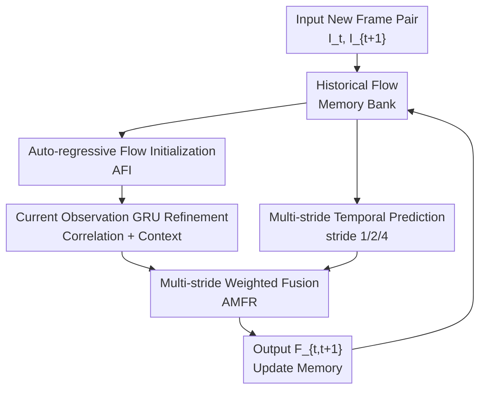

# ARFlow: Auto-regressive Optical Flow Estimation for Arbitrary-Length Videos via Progressive Next-Frame Forecasting

**Conference**: ICLR 2026  
**OpenReview**: [https://openreview.net/forum?id=iJ7cyttpVj](https://openreview.net/forum?id=iJ7cyttpVj)  
**Code**: Not yet confirmed  
**Area**: Video Understanding / Optical Flow Estimation  
**Keywords**: Auto-regressive optical flow, multi-frame optical flow, long-video modeling, temporal Transformer, motion prediction  

## TL;DR
ARFlow transforms multi-frame optical flow estimation from "one-time estimation within a fixed-length clip" to "step-by-step auto-regressive prediction of next-frame flow." By using historical flow to initialize current estimates and fusing short-term and long-term motion cues through multi-stride temporal forecasting, it improves accuracy on benchmarks like Sintel, KITTI, and Spring with nearly constant memory usage.

## Background & Motivation
**Background**: Optical flow estimation, which predicts the 2D displacement of each pixel between adjacent frames, is a fundamental module for tasks such as video completion, dynamic scene reconstruction, autonomous driving perception, and video generation. In recent years, mainstream methods have evolved from CNNs, pyramid matching, and RAFT-style iterative updates to Transformer or diffusion-based modeling. However, many powerful methods remain inherently pairwise, outputting a flow map based on two input frames.

**Limitations of Prior Work**: Pairwise methods naturally lack the temporal continuity of motion over longer periods. Information from just two frames is often insufficient, especially in cases of occlusion, out-of-bounds movement, small fast-moving objects, and motion boundaries. Multi-frame methods attempt to bridge this gap, but most approach the problem by segmenting videos into fixed-length clips (e.g., 3, 4, or 5 frames). While this introduces local temporal context, it breaks the continuity of long videos.

**Key Challenge**: Long-term context is beneficial for optical flow, but feeding many frames simultaneously into a network leads to rapid growth in memory consumption for feature extraction, correlation construction, and intermediate states. Conversely, using only short clips loses information exchange across groups. Existing multi-frame methods are caught between "seeing long enough" and "calculating efficiently."

**Goal**: The authors aim to design a multi-frame optical flow framework capable of processing arbitrary-length videos. It needs to retain only limited historical states when a new frame arrives without re-processing earlier frames, while ensuring historical motion truly participates in the current flow estimation rather than serving as a shallow warm-start.

**Key Insight**: Continuous optical flow in a video can be viewed as an auto-regressively predictable sequence. Historical flow itself encodes motion trends, occlusion changes, and dynamic information of local boundaries. Thus, like next-frame forecasting in video generation, past flow steps can be used to predict the next flow step.

**Core Idea**: A fixed-length memory bank stores historical low-resolution optical flow. An auto-regressive Transformer predicts the initial flow for the current frame pair, which is then refined by combining current observations with multi-stride historical forecasts. This extends multi-frame optical flow to videos of arbitrary length.

## Method

### Overall Architecture
ARFlow takes a video sequence $I_1, I_2, \ldots, I_L$ as input and outputs the optical flow $F_{1,2}, F_{2,3}, \ldots, F_{L-1,L}$ between adjacent frames. Unlike methods that process fixed clips, ARFlow receives one new frame $I_{t+1}$ at a time. It predicts the flow for the current pair $(I_t, I_{t+1})$ based on a historical flow memory bank and then writes the result back to the bank for the next step.

The pipeline comprises two core modules: Auto-regressive Flow Initialization (AFI) first predicts an initial flow $f_{t,t+1}$ from the historical sequence to provide a starting point closer to the ground truth; Auto-regressive Multi-stride Flow Refinement (AMFR) then combines current image matching features, GRU updates, and historical forecasts at strides 1, 2, and 4 to produce the final flow $F_{t,t+1}$. Since the memory bank length is fixed and historical flow is stored at $1/16$ resolution, memory usage does not grow linearly with the number of frames.

### Key Designs
**1. Auto-regressive Flow Initialization: Turning Historical Trends into Current Starting Points**

Traditional RAFT-like methods usually iterate from zero flow or a simple warm-start. This works when changes between frames are small, but in cases of occlusion, fast motion, or cumulative changes, an initialization far from the truth places excessive pressure on subsequent refinements. ARFlow’s AFI reads the $T$ most recent historical flows $\{F_{i,i+1}\}_{i=t-T}^{t-1}$. A temporal Transformer models these motion fields, and the final token predicts the initial flow $f_{t,t+1}$.

The key design is treating historical estimates as a predictable motion sequence. Motion of dynamic objects, camera movement, and occlusion boundaries often exhibit inertia; past flow fields already contain these trends. AFI uses $\mathrm{Trans}^{(1)}$ to aggregate the historical sequence and projects it via a lightweight convolution $\phi(\cdot)$ to obtain $f_{t,t+1}$, providing a temporal prior before image matching begins.

**2. Fixed-length Low-resolution Memory: Preventing Memory Disasters in Long Videos**

ARFlow handles arbitrary-length videos by using "recursive states" instead of "caching all frame features." The memory bank only stores the $T$ most recent predicted flows at $1/16$ resolution; as new flow is generated, the oldest is discarded via a sliding window. Each step depends only on a fixed number of historical flow tokens, making complexity and memory dependent on $T$, feature resolution, and the current frame pair rather than total video length.

This differs significantly from group-wise multi-frame methods like MemFlow or StreamFlow, which perform multi-frame estimation within fixed clips with limited inter-clip information exchange. In ARFlow, history is compressed into a flow memory, treating the process as online processing. Consequently, the reported inference memory is constant (~2.1GB) even for 1080p Spring sequences with 8 frames of context.

**3. Multi-stride Temporal Refinement: Utilizing Short-term Details and Long-term Motion**

Using only stride-1 historical flow prediction biases the model toward short-term smoothness, which may miss slower, long-range motion patterns. AMFR constructs three temporal granularity branches (stride 1, 2, and 4) after the GRU refinement. Specifically, the model uses a stride-1 Transformer to get $\mathrm{Feat}^{(1)}$, and cascades $\mathrm{Trans}^{(2)}$ and $\mathrm{Trans}^{(4)}$ on downsampled tokens to predict $f^{(2)}_{t,t+1}$, $f^{(4)}_{t,t+1}$, and fused features.

The final output is not a simple average but a weighted sum using a learned weight $w_{t,t+1}$ between the GRU output $f^K_{t,t+1}$ and the fused multi-stride prediction $f_{\mathrm{fuse}}$: $F_{t,t+1}=w_{t,t+1}f^K_{t,t+1}+(1-w_{t,t+1})f_{\mathrm{fuse}}$. This allows the model to choose between image-matched details and long/short-term historical motion priors based on the scene.

**4. Division of Labor Between GRU and Historical Prediction: Direction First, Evidence Second**

ARFlow does not rely solely on historical extrapolation. For the current frame pair, it extracts ResNet-FPN features, constructs a correlation volume $V(u,v)=\langle E_t(u), E_{t+1}(v)\rangle$, and uses RAFT/GMA-style GRU blocks. The difference lies in the input: the GRU begins with the AFI-predicted $f_{t,t+1}$ rather than zero, and each iteration produces a residual $\Delta f^k_{t,t+1}$ based on current correlation and context. Historical prediction provides the general direction ("where the motion is going"), while current image matching corrects extrapolation errors and restores pixel-level details.

### Loss & Training
The training follows the mixture-of-Laplace (MoL) loss from SEA-RAFT with deep supervision on RAFT-style refinement steps. For $T$ time steps and $K$ refinements, the total loss is $L=\frac{1}{T}\sum_{t=1}^{T}\sum_{k=0}^{K}\gamma^{K-k}L^{t,k}_{\mathrm{MoL}}$, where $\gamma=0.85$ emphasizes later refinements. Supervision is also applied to AFI predictions, multi-stride predictions, and the final fused output to ensure the branches learn reasonable forecasting.

The training pipeline consists of pre-training on TartanAir (225k steps), FlyingThings3D (120k steps), and a combined dataset (FlyingThings, Sintel, KITTI, HD1K) for 225k steps, followed by fine-tuning on specific benchmarks like Sintel, KITTI-15, and Spring. The default configuration uses $T=6$ and $K=6$.

## Key Experimental Results

### Main Results
ARFlow achieves small but consistent improvements over strong multi-frame baselines on Sintel, KITTI-15, and Spring, emphasizing high accuracy with low memory.

| Dataset | Metric | ARFlow | Prev. SOTA | Gain |
|--------|------|--------|------------|------|
| Sintel Final test | All EPE ↓ | 1.78 | StreamFlow 1.87 / MEMFOF 1.91 | -0.09 vs StreamFlow |
| Sintel Clean test | All EPE ↓ | 0.96 | MEMFOF 0.96 | Tied for Best |
| KITTI-15 test | All ↓ | 2.85 | MEMFOF 2.94 | -0.09 |
| KITTI-15 test | Non-Occ ↓ | 1.91 | MEMFOF 1.97 | -0.06 |
| Spring test (fine-tuned) | EPE ↓ | 0.353 | MEMFOF 0.355 / DPFlow 0.340 | Best among low-memory |
| Spring test (fine-tuned) | Fl ↓ | 1.212 | MEMFOF 1.238 | -0.026 |

Efficiency on Spring 1080p highlights ARFlow's scalability: it uses 8 context frames with 2.10GB memory and 403ms runtime, whereas StreamFlow uses 18.97GB for 4 frames.

### Ablation Study
Ablations confirm both AFI and AMFR are critical. Removing AFI degrades initialization, increasing EPE on Sintel and KITTI. Removing AMFR maintains the history-based start but loses multi-stride fusion, leading to consistently worse results.

| Configuration | Sintel Clean ↓ | Sintel Final ↓ | KITTI EPE ↓ | KITTI F1-all ↓ | Description |
|------|----------------|----------------|-------------|----------------|------|
| w/o AFI | 0.95 | 2.15 | 3.05 | 10.11 | No historical flow initialization |
| w/o AMFR | 0.91 | 2.13 | 3.00 | 9.73 | No multi-stride temporal refinement |
| Full ARFlow | 0.88 | 2.07 | 2.86 | 9.21 | Default with both modules |

Multi-stride analysis shows that using any single stride (1, 2, or 4) is inferior to the 1+2+4 combination. Performance gains saturate when memory length $T$ reaches 7 or 8, making $T=6$ an optimal balance.

### Key Findings
- **AFI's contribution** lies in providing a "better starting point," significantly helping stable estimation at occlusions and motion boundaries.
- **AMFR's contribution** comes from scale complementarity: stride 1 captures local details while strides 2/4 provide longer-range trends.
- **Scalability** is the most significant engineering value: ARFlow maintains constant memory (2.10GB) while processing long sequences via recursive flow memory.
- **Compatibility** experiments show that ARFlow's logic can be integrated into different baselines (SEA-RAFT, DPFlow, etc.), yielding relative gains of 5% to 11.6%.

## Highlights & Insights
- The most clever aspect is treating "historical flow" as an auto-regressive sequence rather than stacking "historical image features." This preserves motion trends while keeping costs within a fixed window.
- The division of labor is clear: AFI solves the initialization problem, AMFR addresses single-timescale limitations, and the GRU performs pixel-level corrections.
- The approach is highly suitable for online video perception (e.g., autonomous driving, robotics), where systems cannot wait for a full clip and must maintain constant memory.
- The multi-stride temporal modeling concept could be transferred to other dense prediction tasks like future frame segmentation or dynamic 3D reconstruction.

## Limitations & Future Work
- **Error Propagation**: Being auto-regressive, systematic bias in early frames could propagate through the memory bank, despite GRU corrections.
- **Window Size**: The fixed $T$ window means extremely long-period motion patterns are eventually discarded. 
- **Reliability of History**: In cases of extreme motion blur or weak textures, the historical flow itself might be unreliable. Confidence estimation for memory could be a future improvement.
- **Robustness**: Further evaluation is needed for real-world issues like frame drops, variable frame rates, or camera cuts.

## Related Work & Insights
- **vs RAFT**: Inherits the refinement strength of RAFT but moves beyond the pairwise paradigm by incorporating temporal priors.
- **vs MemFlow / MEMFOF**: Improves upon these by emphasizing auto-regressive prediction of the next frame's flow rather than just utilizing memory for the current frame.
- **vs StreamFlow**: Offers much better memory efficiency by avoiding in-batch multi-frame processing.
- **Insight**: Compressing history into a predictable output state (flow) rather than raw features is an efficient route for long-term video context.

## Rating
- Novelty: ⭐⭐⭐⭐⭐ 
- Experimental Thoroughness: ⭐⭐⭐⭐⭐ 
- Writing Quality: ⭐⭐⭐⭐☆ 
- Value: ⭐⭐⭐⭐⭐ 

<!-- RELATED:START -->

## Related Papers

- [\[CVPR 2026\] FlowFM: Advancing Dark Optical Flow Estimation with Flow Matching](../../CVPR2026/video_understanding/flowfm_advancing_dark_optical_flow_estimation_with_flow_matching.md)
- [\[CVPR 2026\] U2Flow: Uncertainty-Aware Unsupervised Optical Flow Estimation](../../CVPR2026/video_understanding/u2flow_uncertainty_aware_unsupervised_optical_flow_estimation.md)
- [\[ICLR 2026\] What Happens Next? Anticipating Future Motion by Generating Point Trajectories](what_happens_next_anticipating_future_motion_by_generating_point_trajectories.md)
- [\[ICCV 2025\] MEMFOF: High-Resolution Training for Memory-Efficient Multi-Frame Optical Flow Estimation](../../ICCV2025/video_understanding/memfof_high-resolution_training_for_memory-efficient_multi-frame_optical_flow_es.md)
- [\[CVPR 2026\] From Contrast to Consistency: Rethinking Event-based Continuous-Time Optical Flow Estimation](../../CVPR2026/video_understanding/from_contrast_to_consistency_rethinking_event-based_continuous-time_optical_flow.md)

<!-- RELATED:END -->
