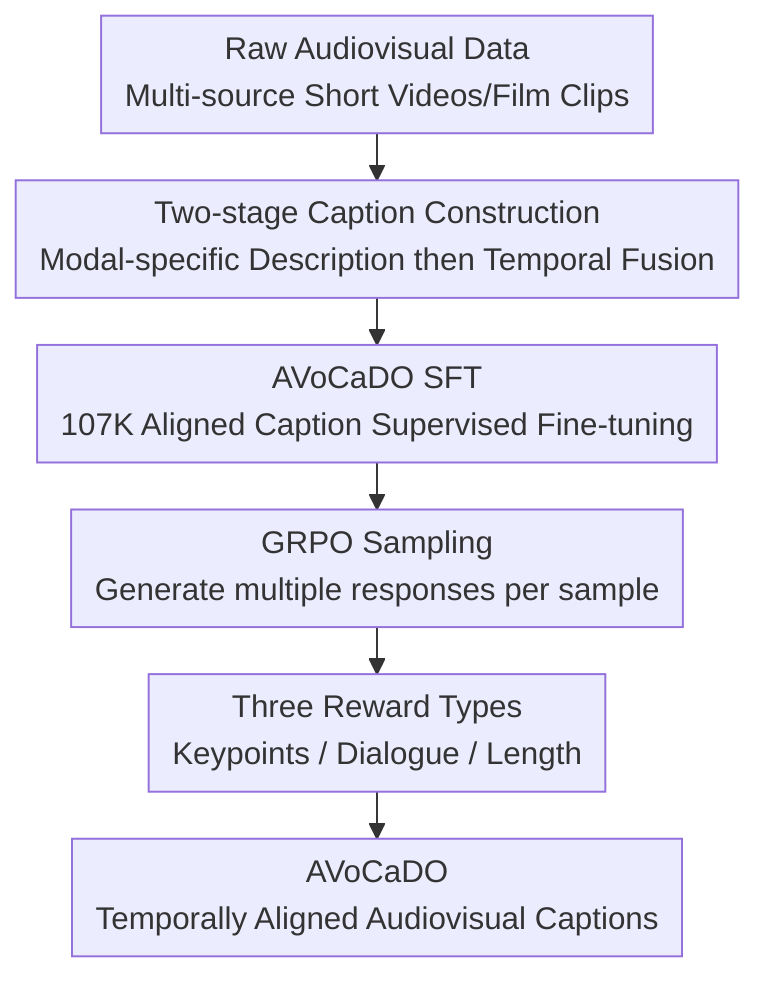

# AVoCaDO: An Audiovisual Video Captioner Driven by Temporal Orchestration

**Conference**: ICLR 2026  
**OpenReview**: [https://openreview.net/forum?id=vjEl1PuIDE](https://openreview.net/forum?id=vjEl1PuIDE)  
**Related Papers**: [Project Page](https://avocado-captioner.github.io/)  
**Code**: Expected to be open-sourced; the paper states model/code will be released  
**Area**: Video Understanding / Audiovisual Captioning  
**Keywords**: Audiovisual Captioning, Temporal Alignment, Multimodal Large Language Model, GRPO, Dialogue Transcription

## TL;DR
AVoCaDO, based on Qwen2.5-Omni, undergoes SFT using 107K high-quality temporally aligned audiovisual captioning data, followed by GRPO reward fine-tuning focused on key events, dialogue, and length. This enables the 7B audiovisual captioner to outperform existing open-source models on multiple benchmarks, with some metrics matching or exceeding the Gemini-2.5 series.

## Background & Motivation
**Background**: Video captioning has evolved from early short-sentence descriptions to fine-grained, multi-event, long-text narratives. VideoLLMs increasingly utilize high-quality captions as a semantic intermediate layer for video understanding and generation. Methods such as Tarsier, OwlCap, and AuroraCap primarily focus on visual frames, actions, shots, and static details to construct training data or rewards, aiming for more complete visual descriptions.

**Limitations of Prior Work**: Real-world videos are not purely visual signals. In short videos, interviews, film clips, advertisements, and instructional videos, speech dialogue, narration, music, and sound effects often directly explain the events. Relying solely on vision may identify "a person speaking in front of a flag" but fail to capture the spoken content. Simple concatenation of independent audio and visual captions loses temporal relationships, such as "which person, subtitle, or shot corresponds to this specific sentence."

**Key Challenge**: Audio and vision are not two sources of description that can be added post-hoc; instead, they jointly form a narrative that progresses over time. Visual events provide characters, actions, and scenes, while audio events provide dialogue, tone, music, and ambient sound. Downstream tasks often require answering "which visual moment corresponds to which sound" or "who said what in which state." Existing vision-centric captioners and separate-then-concat workarounds lack this fine-grained cross-modal temporal orchestration.

**Goal**: The authors aim to train a captioner specifically for audiovisual video captioning. The generated long captions must satisfy three criteria: coverage of visual details, accurate description of audio (especially dialogue), and alignment of both according to the video timeline. The objective is not merely to increase caption length but to enable the text caption to serve as a reliable multimodal proxy for subsequent QA, understanding, and generation tasks.

**Key Insight**: Key observations from a Daily-Omni pilot experiment show that using Gemini-2.5-Pro to generate captions for audio and vision separately and then concatenating them results in lower performance compared to joint generation. The latter is 15.8% higher on caption-based QA and 27.8% higher in the AV Event Alignment category. This indicates that "orchestrating sound and visuals into the same narrative over time" is a performance bottleneck.

**Core Idea**: Post-train an omni-modal base model using "high-quality temporally aligned data construction + GRPO rewards focused on audiovisual key events." This ensures the model not only hears and sees but also narrates sounds and visuals as a complete, time-ordered narrative.

## Method
### Overall Architecture
AVoCaDO utilizes Qwen2.5-Omni-7B as the base model, as it can align video frames and audio signals using interleaved token sequences. The primary contribution is a post-training pipeline specialized for audiovisual captioning. Training consists of two steps: supervised fine-tuning (SFT) with 107K high-quality audiovisual captions to learn time-aligned fusion, followed by GRPO on 2K samples from the SFT data using three rewards to improve key event coverage, dialogue accuracy, and generation stability.

In the data construction phase, Gemini-2.5-Pro generates separate video frame and audio captions. These descriptions, along with the raw video, are input back into Gemini-2.5-Pro to merge them into a coherent audiovisual caption, preserving information from both modalities in chronological order. A quality checker filters out low-quality samples (e.g., abnormal length, repetition collapse), and GPT-4.1 scores the synthesis completeness from 1 to 5, retaining only samples with a score of 4 or higher.

The GRPO phase decomposes a "good audiovisual caption" into three optimizable dimensions: coverage of five types of fine-grained keypoints, accurate dialogue transcription with correct speaker identity, and appropriate output length without repetition collapse. The final reward is defined as $R = R_C + R_D + R_L$.

### Key Designs
**1. Two-stage caption construction: Preserving unimodal information before temporal fusion**

Directly generating joint audiovisual captions often leads to information loss in one modality. AVoCaDO decomposes the task by first generating visual frame descriptions (focusing on people, clothing, actions, text, and camera movement) and audio descriptions (focusing on dialogue, tone, music, and sound effects). This "unrolls" the information streams before fusion, reducing data loss.

The second step merges the visual caption, audio caption, and raw video using Gemini-2.5-Pro to reorder and fuse sentences chronologically. This ensures that visual actions and corresponding sounds appear simultaneously in the text. As shown in Fig. 1, joint AV captions allow QA judges to correctly identify dialogue corresponding to specific visual appearances (e.g., LCpl Browning).

**2. Checklist-based reward: Transforming completeness into verifiable keypoint coverage**

Video captions are long, making it difficult to judge completeness with a coarse score. Keypoints $K = \{k_1, k_2, \ldots, k_n\}$ are extracted from ground-truth captions and organized into five categories: cross-modal narrative logic, dynamic actions/interactions, auditory elements, spatio-temporal/cinematic language, and static entity descriptions.

For a generated caption $S_{gen}$, the checklist reward is:

$$
R_C(S_{gen} \mid K) = \frac{1}{|K|}\sum_{i=1}^{|K|} Judge(S_{gen}, k_i),
$$

where $Judge(S_{gen}, k_i) \in \{0, 1\}$ indicates if the judge model identifies the keypoint in the generated text. This explicitly includes auditory elements and narrative logic. Ablation studies show that adding $R_C$ reduces Total error on the video-SALMONN-2 testset from 41.3 to 37.3.

**3. Dialogue-based reward: Constraining dialogue quality through content matching and speaker consistency**

Dialogue is a critical semantic carrier. AVoCaDO extracts dialogue into a sequence $D = [(s_1,c_1), (s_2,c_2), \ldots]$, where $s_i$ is the speaker and $c_i$ is the content. Generated sequences $D_{gen}$ and reference sequences $D_{gt}$ are matched using normalized edit distance:

$$
Sim(c_i^{gen}, c_j^{gt}) = 1 - \frac{edit\ distance(c_i^{gen}, c_j^{gt})}{\max(len(c_i^{gen}), len(c_j^{gt}))}.
$$

Dynamic programming (similar to LCS) identifies the highest-similarity ordered subsequence, allowing only units with similarity above $\gamma=0.6$. Speaker similarity $S_{speaker}$ is then assessed by Gemini-2.5-Pro. The combined metric provides precision, recall, and F1 for $R_D$. Adding $R_D$ improved the dialogue F1 on Daily-Omni from roughly 74 to 76.1.

**4. Length-regularized reward: Avoiding repetition and excessive length**

To prevent repetition collapse and maintain efficiency, AVoCaDO applies a piecewise length reward $R_L$. It provides a reward of 1 below $\tau_1=2048$ tokens, decreases linearly between $2048$ and $4096$, and drops to 0 beyond $\tau_2=4096$.

$$
R_L =
\begin{cases}
1.0, & len(S_{gen}) < \tau_1 \\
1 - \frac{len(S_{gen}) - \tau_1}{\tau_2 - \tau_1}, & \tau_1 \le len(S_{gen}) < \tau_2 \\
0.0, & otherwise
\end{cases}.
$$

The limits are based on observating that 100-second captions rarely exceed roughly 4000 tokens. Adding $R_L$ reduced repetition collapse on the video-SALMONN-2 testset from 3.9% to 0.4%.

### Loss & Training
SFT is conducted for 2 epochs with a batch size of 128 and a learning rate of $2 \times 10^{-5}$. GRPO uses 2K samples for 1 epoch with a batch size of 64, learning rate of $1 \times 10^{-5}$, and 8 sampled responses per query ($\beta=0.04$). Video and audio encoders are frozen; only the adapter and LLM backbone are updated.

GRPO computes the relative reward of $G$ responses:

$$
A_i = \frac{r_i - mean(\{r_1, r_2, \ldots, r_G\})}{std(\{r_1, r_2, \ldots, r_G\})}.
$$

This optimization includes a clipped policy ratio and KL penalty relative to the reference policy, enabling long-form quality optimization without an external critic.

## Key Experimental Results

### Main Results

| Benchmark | Metric | AVoCaDO | Best OS/Baseline | Gemini-2.5-Pro | Conclusion |
|--------|------|------|----------|------|------|
| video-SALMONN-2 testset | Total error ↓ | 37.3 | 38.8 (video-SALMONN-2) | 31.3 | Best among OS; commercial models still lead |
| UGC-VideoCap | Avg. ↑ | 73.2 | 72.5 (Qwen3-Omni-Cap) | 72.6 | Exceeds Gemini-2.5-Pro and OS models |
| Daily-Omni by caption | Accuracy ↑ | 50.1 | 29.9 (video-SALMONN-2) | 60.2 | 20.2 points higher than best OS |
| WorldSense by caption | Accuracy ↑ | 25.7 | 18.2 (video-SALMONN-2) | 33.8 | 7.5 points higher than best OS |

| Model | Size | Modality | video-SALMONN-2 Total ↓ | UGC-VideoCap Avg. ↑ | Daily-Omni ↑ | WorldSense ↑ |
|------|------|----------|--------------------------|-----------------|--------------|--------------|
| Qwen2.5-Omni | 7B | A + V | 57.1 | 57.7 | 13.4 | 8.6 |
| AVoCaDO | 7B | A + V | 37.3 | 73.2 | 50.1 | 25.7 |

### Ablation Study
| Config | v-SALMONN-2 Total ↓ | v-SALMONN-2 Dlg. F1 ↑ | RepCol ↓ | Daily-Omni Avg. ↑ | Daily-Omni Dlg. F1 ↑ |
|------|---------|---------|---------|---------|---------|
| Qwen2.5-Omni | 57.1 | 7.1 | 7.1% | 13.4 | 16.9 |
| AVoCaDO-SFT | 41.4 | 74.4 | 3.5% | 48.1 | 73.6 |
| + $R_D$ | 41.3 | 76.5 | 2.4% | 49.5 | 76.1 |
| + $R_D + R_C$ | 37.3 | 75.9 | 3.9% | 49.5 | 75.2 |
| + $R_D + R_C + R_L$ | 37.3 | 76.9 | 0.4% | 50.1 | 76.2 |

### Key Findings
- **Data construction is the primary source of performance**: SFT brings the largest gain (e.g., Daily-Omni score jumps from 13.4 to 48.1), indicating aligned data is more critical than the base model itself.
- **GRPO gains come from reward design**: Continuing SFT on the same 2K samples without GRPO rewards resulted in negligible or negative gains.
- **Reward specialization**: $R_D$ improves dialogue, $R_C$ improves event coverage, and $R_L$ stabilizes length and prevents repetition.
- **Audio capability extends beyond speech**: Performance on MUSIC-AVQA-v2.0 improved from 29.2 to 45.8, showing benefits in general sound scenarios.

## Highlights & Insights
- Captions are treated as concrete intermediate representations for video understanding. Temporal alignment allows the text to carry cross-modal evidence for QA.
- The two-stage data construction (Separate then Merge) is highly practical and transferable to domains like medical or egocentric video where sensor details must be preserved.
- The dialogue reward is more sophisticated than simple ASR matching by incorporating speaker consistency, which is vital for interview or film content.
- The length reward serves as a necessary constraint to prevent the model from drifting into repetition while attempting to satisfy completeness checklists.

## Limitations & Future Work
- Data construction relies heavily on expensive closed-source models (Gemini-2.5-Pro, GPT-4o), potentially inheriting their biases.
- While the 107K samples are diverse, generalization to long-form meetings, medical videos, or strong accents requires further validation.
- Dialogue rewards depend on LLM extraction, which may be unstable in overlapping speech or mismatched off-screen narration.
- The current system does not solve latency for real-time applications; token compression is noted as a future direction.
- Evaluation relies on LLM judges; incorporating human evaluation or task-based downstream metrics would strengthen findings.

## Related Work & Insights
- **vs video-SALMONN-2**: While both explore AV captioning, AVoCaDO focuses more on narrative orchestration and dialogue accuracy through SFT + GRPO, achieving better open-source results.
- **vs UGC-VideoCaptioner**: AVoCaDO shows superior cross-modal reasoning evidence in QA-based evaluations.
- **vs Tarsier/AuroraCap**: These are vision-centric; AVoCaDO shifts the focus to how sound emerges and modifies the narrative.
- **Insight**: For multimodal generation, training objectives should focus on decomposing the evidence required for downstream tasks rather than just mimicking reference text.

## Rating
- **Novelty**: ⭐⭐⭐⭐☆ Combines temporal alignment, data construction, and GRPO rewards into a systematic framework.
- **Experimental Thoroughness**: ⭐⭐⭐⭐⭐ Extensive coverage across multiple benchmarks, including audio-only and visual-only scenarios.
- **Writing Quality**: ⭐⭐⭐⭐☆ Clear narrative and convincing visualizations; some dependence on LLM judge reliability.
- **Value**: ⭐⭐⭐⭐⭐ Significant utility for video understanding, indexing, and multimodal QA.

<!-- RELATED:START -->

## Related Papers

- [\[ICML 2026\] Foresee-to-Ground: From Predictive Temporal Perception to Evidence-Driven Reasoning](../../ICML2026/video_understanding/foresee-to-ground_from_predictive_temporal_perception_to_evidence-driven_reasoni.md)
- [\[ICLR 2026\] Invert4TVG: A Temporal Video Grounding Framework with Inversion Tasks Preserving Action Understanding Ability](invert4tvg_a_temporal_video_grounding_framework_with_inversion_tasks_preserving_.md)
- [\[ICLR 2026\] HiTeA: Hierarchical Temporal Alignment for Training-Free Long-Video Temporal Grounding](hitea_hierarchical_temporal_alignment_for_training-free_long-video_temporal_grou.md)
- [\[CVPR 2026\] SpikeTrack: A Spike-driven Framework for Efficient Visual Tracking](../../CVPR2026/video_understanding/spiketrack_a_spike-driven_framework_for_efficient_visual_tracking.md)
- [\[ICLR 2026\] OmniSTVG: Toward Spatio-Temporal Omni-Object Video Grounding](omnistvg_toward_spatio-temporal_omni-object_video_grounding.md)

<!-- RELATED:END -->
