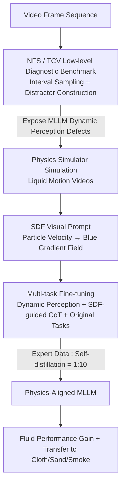

# Beyond Static Vision: Scene Dynamic Field Unlocks Intuitive Physics Understanding in Multi-modal Large Language Models

**Conference**: ICLR2026  
**OpenReview**: [https://openreview.net/forum?id=Ax02eR2c3d](https://openreview.net/forum?id=Ax02eR2c3d)  
**Code**: https://github.com/andylinx/Scene-Dynamic-Field  
**Area**: Video Understanding / Multi-modal VLM  
**Keywords**: Intuitive Physics, Multi-modal Large Language Models, Physics Simulator, Visual Prompt, Multi-task Fine-tuning

## TL;DR
This paper first reveals that current MLLMs fail to understand intuitive physics dynamics for continua (such as fluids) using two "low-level" diagnostic tasks: Next Frame Selection (NFS) and Temporal Coherence Verification (TCV). It then proposes Scene Dynamic Field (SDF)—mapping particle velocities calculated by a physics simulator into blue gradient maps as visual prompts. Combined with multi-task fine-tuning, this improves Qwen2-VL / GLM-4.1V performance on fluid tasks by up to 20.7%, with successful transfer to unseen physical domains like cloth, sand, and smoke.

## Background & Motivation
**Background**: Multi-modal Large Language Models (MLLMs) have achieved high proficiency in image and video understanding. Recent works aim to evaluate their "understanding of the physical world." However, existing physics benchmarks (e.g., ContPhy, PhysBench) focus on "high-level physics reasoning"—testing models through complex tasks such as QA, counterfactual prediction, and spatial relation analysis.

**Limitations of Prior Work**: These benchmarks **entangle** multiple capabilities: a single problem may simultaneously test vision, language, common sense, logic, and physics. Consequently, SOTA MLLMs perform near random guess on these benchmarks, making it impossible to determine whether the failure stems from "deficiencies in physics" or "other cognitive bottlenecks." Furthermore, mainstream training methods (treating videos as sequences of frames for image encoders) fail to capture low-level dynamics essential for physics; video encoders are mostly trained unsupervised on human-centric datasets, lacking dynamics for continuum objects like liquids or cloth.

**Key Challenge**: The "foundation" of physical reasoning is **intuitive physics perception** (the ability to accurately perceive changes in motion over time). However, existing benchmarks focus on high-level reasoning "upstairs" without isolating this foundational layer. Without diagnosing the foundation, reasoning deficiencies cannot be addressed effectively.

**Goal**: Split the problem into two sub-questions: (1) How can intuitive physics perception be **decoupled** from other cognitive abilities for isolated evaluation? (2) How can this underlying capability be further **enhanced**?

**Key Insight**: Drawing on curriculum learning, MLLMs should undergo "curriculum-based evaluation," starting from the most fundamental step. The authors select fluid dynamics as the primary domain due to its ubiquity and rich continuous dynamics, making it an ideal testbed for continuum physics.

**Core Idea**: Use two low-level tasks (NFS / TCV) to quantify intuitive physics perception and expose defects. Then, use a physics simulator to generate "velocity-to-color" intermediate representations (SDF) as visual prompts. Through multi-task fine-tuning, physics knowledge from the simulator is "distilled" into MLLMs, bypassing expensive architectural modifications.

## Method

### Overall Architecture
The work is divided into two halves: **establishing a diagnostic benchmark** and **proposing an enhancement method**. For diagnostics, a unified "interval sampling + distractor construction" pipeline is used to segment videos into intervals, creating true successor frames and plausible distractors for two tasks: NFS (4-choice next frame selection) and TCV (identifying incoherent frames in a sequence). For enhancement, the core is **SDF**: Blender + Flip Fluids engines simulate various liquid motions, projecting each particle's velocity into the camera direction and converting it into blue channel intensity to create a "depth-of-blue represents velocity" dynamic field map. This map serves as a visual prompt for a **multi-task fine-tuning framework** (dynamic perception tasks + SDF-guided CoT tasks + original NFS/TCV tasks), trained with a 1:10 mix of expert data and self-distillation data.

### Key Designs

**1. NFS + TCV: Isolating Intuitive Physics from the "Cognitive Medley"**

To address the issue of entangled capabilities in existing benchmarks, the authors design two complementary low-level tasks with a unified distractor construction process. Given a sequence $F=\{f_t\}_{t=1}^T$ of $T$ frames, it is sliced into non-overlapping intervals $\{I_i\}$ with step size $s$. For each interval, frames within a temporal buffer $\delta$ are excluded to form a candidate set $D_i$. SigLIP embeddings are used to calculate cosine similarity, filtering candidates too similar to the ground truth $f_{gt}$: $D_i'=\{f_t\in D_i \mid \mathrm{sim}(f_t,f_{gt})<\tau\}$, ensuring distractors are semantically distinct but plausible. **NFS** is 4-choice: 3 distractors are sampled from $D_i'$, and the model must score the true successor higher than all distractors: $\mathrm{Acc}_{NFS}=\frac1N\sum_i \mathbb{I}\big(p_{model}(f_{gt}|I_i)>\max_j p_{model}(d_j|I_i)\big)$. **TCV** is a binary task: an unnatural frame is randomly inserted into a sequence, and the model must judge if the sequence is coherent. These tasks focus purely on "dynamics," excluding language/common sense/logic. Experiments confirm severe defects—Qwen2.5-VL achieves only 32.73% on NFS (random baseline 25%).

**2. SDF Visual Prompt: Visualizing Simulator Velocity Fields**

To address the limitations of pure language reasoning in capturing spatiotemporal physical relationships, the authors use a representation-layer bridge: visualizing particle velocities from a physics engine as visual prompts. For camera position $c$, the projection magnitude of particle velocity $v_i$ along the line of sight is $v_{proj,i}=\|v_i\|\cos\theta_i=(v_i\cdot\hat r_i)$, where $\hat r_i=\frac{c-p_i}{\|c-p_i\|}$ is the unit vector towards the camera. The blue channel density is modeled as a line integral along the observable domain $\Omega$:
$$D_B(c)=\kappa\int_\Omega \frac{\|v_i\|}{1+\alpha\|c-p_i\|^2}\,d\Omega$$
where $\kappa$ scales velocity to color intensity and $\alpha$ controls spatial attenuation. Particles with higher velocities contribute more to the blue intensity via the $\|v_i\|$ term, mapping dynamics to "blue gradients of varying depth." This works because simulators, while imprecise in fine details, **capture dynamic trends consistent with real-world physics**. Abstracting these trends into intuitive color maps leverages the existing visual understanding of MLLMs.

**3. Multi-task Fine-tuning: Perceiving and Reasoning with Dynamic Fields**

To fix the lack of intuitive physics in standard video pre-training, three task types are used. **Task 1: Dynamic Perception**: Given an RGB video and $N$ candidate maps (one true SDF, others distractors), the model must identify the SDF corresponding to the last frame, forcing an alignment between RGB dynamics and velocity field colors. **Task 2: SDF-guided Chain-of-Thought**: SDF frames are inserted into input sequences $F_{CoT}=[f_1^{RGB},\dots,f_t^{RGB},f_t^{SDF}]$. A three-step CoT is used—analyzing fluid dynamics in frames, integrating the SDF of the last frame, and selecting the next frame—explicitly encoding the dynamic field into the reasoning chain. **Original NFS/TCV tasks** are also included.

**4. Expert Data + Self-distillation in a 1:10 Mix: Stabilizing Training**

For CoT data, demonstrations are generated by stronger models (e.g., Gemini-2.5-Pro) or via self-distillation. The authors observe that expert models are not always optimal, whereas self-distillation minimizes distribution shift during training. These are mixed at a **1:10 ratio (Expert:Self-distillation)**—using self-distillation for stability while injecting expert guidance on utilizing SDF visual prompts. This ratio balances high-quality demonstrations with the avoidance of performance degradation due to distribution shift.

### Loss & Training
Both standard Finetuning and SDF-Ours use the SWIFT framework for **full-parameter supervised fine-tuning**, with a learning rate of $1\times10^{-5}$ for 3 epochs on 4× A100 40G GPUs. For fair comparison, the Finetune baseline uses the **same number** of training samples as the SDF method. Evaluation is performed on NFS/TCV datasets containing real-world videos to test sim-to-real transfer.

## Key Experimental Results

### Main Results
Zero-shot diagnostics (Table 1) show that mainstream MLLMs perform poorly on intuitive physics, with NFS scores mostly near the random baseline:

| Model | Params | NFS Acc (stride 4) | TCV Acc (stride 4) |
|------|------|------|------|
| InternVL2.5 | 8B | 20.19 | 52.31 |
| Qwen2.5-VL | 7B | 30.00 | 56.63 |
| GPT-4o | — | 39.79 | 69.91 |
| Gemini-2.5-Flash | — | 31.37 | 70.06 |
| Random Baseline | — | 25.0 | 50.0 |

With SDF enhancement (Figure 4A, Fluid Benchmark NFS Score), performance improves significantly over zero-shot and outperforms Finetune/CoT with equivalent data:

| Setting | Qwen2-VL NFS | GLM-4.1V NFS |
|------|------|------|
| Zero-Shot | 26.8 | 25.4 |
| CoT (inference only) | 29.8 | 29.2 |
| Finetune | 30.2 | 32.0 |
| **SDF-Ours** | **41.2 (+14.4)** | **46.1 (+20.7)** |

SDF also increased TCV scores from 70.1 to 80.2.

### Ablation Study

| Configuration | Key Observation | Explanation |
|------|---------|------|
| Model Scaling (InternVL2.5 2B→26B) | NFS 25.33 → 20.60 (Decrease) | Parameters alone do not solve dynamic physics understanding |
| Model Scaling (Qwen2-VL 3B→72B) | NFS 24.40 → 28.13 (Marginal) | Scaling gains are incremental and insufficient |
| + CoT / Thinking | GLM-4.1V thinking +11.77(NFS)/+25.06(TCV) | Linguistic reasoning helps but is not enough |
| Transfer: Finetune (Cloth, Qwen2-VL) | 23.64 vs. Zero-Shot 22.42 | Minimal improvement indicates in-domain memorization |
| Transfer: SDF-Ours | Consistently gains on Cloth/Sand/Smoke | Learns generalized physical dynamics |

### Key Findings
- **Scaling is insufficient**: InternVL2.5 dropped from 25.33% to 20.60% when scaled from 2B to 26B, indicating intuitive physics defects cannot be fixed by scale alone; targeted training is required.
- **Language reasoning has a ceiling**: CoT/thinking helps, but remains unsatisfactory, confirming that "pure language reasoning cannot capture spatiotemporal physics."
- **SDF learns real physics, not just memory**: The transfer experiments provide the strongest evidence: while pure Finetuning regresses to zero-shot levels on cloth/sand/smoke, SDF maintains improvements across all transfer domains.

## Highlights & Insights
- **Curriculum-based evaluation is highly effective**: Instead of concluding that models fail "inexplicably" on complex benchmarks, simple tasks like NFS/TCV isolate the root cause in the foundational physical perception layer.
- **Simulators as "cheap teachers" rather than "precise ground truth"**: The authors leverage the "correct dynamic trends" of simulators while abstracting them into a representation (color gradients) that MLLMs can easily process.
- **Velocity-to-color mapping is a transferable trick**: Encoding any physical field into perception-friendly visual prompts for VLM learning is a strategy extensible to optical flow, force fields, or temperature fields.
- **Counter-intuitive 10:1 Self-distillation/Expert ratio**: This suggests that "distribution stability" might be more important than "demonstration quality" in distilling reasoning data.

## Limitations & Future Work
- **Reliance on simulator coverage**: SDF data relies on specific liquid simulations; the method may struggle with phenomena difficult to simulate (complex multi-phase coupling, rigid-soft mixtures).
- **Primary focus on continua/fluids**: While transfer to cloth, sand, and smoke was shown, robustness for discrete physical state changes (rigid body collisions, articulated objects) remains untested.
- **SDF as a 2D projection**: Projecting velocity into 2D loses depth/3D info, which might be insufficient in scenarios with heavy occlusion or multi-view requirements.
- **Synthetic bias in evaluation**: While real-world web videos were included for testing, training is entirely simulation-based, leaving room for further sim-to-real robustness validation.

## Related Work & Insights
- **vs. ContPhy / PhysBench**: These focus on high-level reasoning with entangled capabilities. This paper uses decoupled low-level NFS/TCV tasks to isolate physical perception failures.
- **vs. V-JEPA (Garrido et al. 2025)**: V-JEPA relies on self-supervised pre-training for "emergent" intuitive physics. This paper supplements MLLMs with explicit visual prompts from simulators at a lower cost.
- **vs. GNN / Symbolic Physics Engines**: Those methods focus on multi-step logical deduction or state-vector prediction. This paper targets the missing "foundational perception" by injecting visual dynamic cues directly into base models.

## Rating
- Novelty: ⭐⭐⭐⭐ Visual prompts for simulator distillation and the decoupled diagnostic perspective are fresh.
- Experimental Thoroughness: ⭐⭐⭐⭐ Covers zero-shot diagnosis, scaling analysis, SDF enhancement, and cross-domain transfer with confidence intervals.
- Writing Quality: ⭐⭐⭐⭐ Theory and motivation are clear; however, some key figures require careful reading to extract specific values.
- Value: ⭐⭐⭐⭐ Identifies a critical gap in MLLM intuitive physics and provides a scalable, low-cost enhancement path.

<!-- RELATED:START -->

## Related Papers

- [\[ICLR 2026\] LLaVAction: Evaluating and Training Multi-modal Large Language Models for Action Understanding](llavaction_evaluating_and_training_multi-modal_large_language_models_for_action_.md)
- [\[CVPR 2026\] Beyond Static Frames: Temporal Aggregate-and-Restore Vision Transformer for Human Pose Estimation](../../CVPR2026/video_understanding/beyond_static_frames_temporal_aggregate-and-restore_vision_transformer_for_human.md)
- [\[ICCV 2025\] 4D-Bench: Benchmarking Multi-modal Large Language Models for 4D Object Understanding](../../ICCV2025/video_understanding/4d_bench_benchmarking_multimodal_llms_for_4d_object_understanding.md)
- [\[NeurIPS 2025\] FastVID: Dynamic Density Pruning for Fast Video Large Language Models](../../NeurIPS2025/video_understanding/fastvid_dynamic_density_pruning_for_fast_video_large_languag.md)
- [\[CVPR 2025\] VoCo-LLaMA: Towards Vision Compression with Large Language Models](../../CVPR2025/video_understanding/voco-llama_towards_vision_compression_with_large_language_models.md)

<!-- RELATED:END -->
