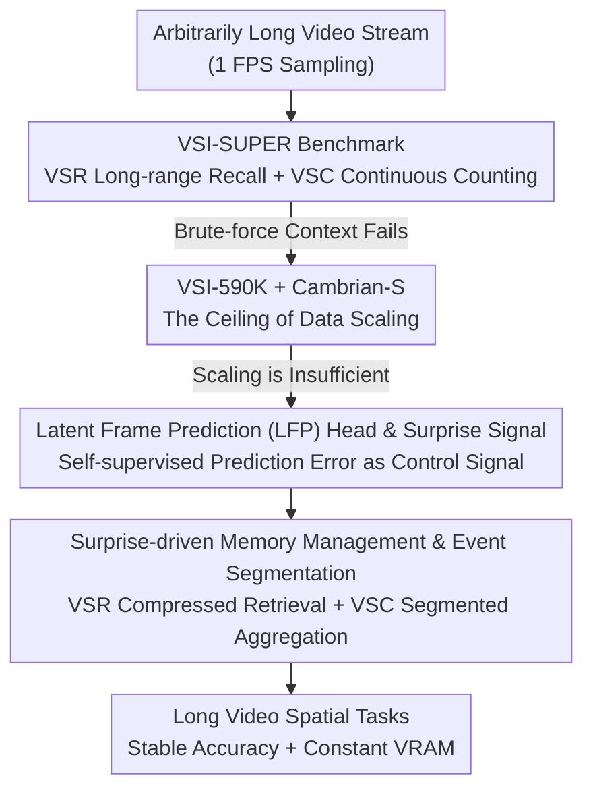

# Cambrian-S: Towards Spatial Supersensing in Video

**Conference**: ICLR2026  
**OpenReview**: [https://openreview.net/forum?id=rBFDvZu6pb](https://openreview.net/forum?id=rBFDvZu6pb)  
**Code**: TBD  
**Area**: Video Understanding / Multimodal VLM  
**Keywords**: Spatial Supersensing, Video MLLM, Predictive Sensing, Surprise Signal, Streaming Memory

## TL;DR
This paper proposes "spatial supersensing," a paradigm shift from passive task-driven sensing to active world modeling. It first proves via the VSI-SUPER benchmark that brute-force context expansion (including Gemini-2.5 and the self-trained Cambrian-S) fails completely on spatial recall and counting tasks in arbitrarily long videos. It then introduces a self-supervised "Latent Frame Prediction" head that uses prediction error ("surprise") as a control signal to drive memory management and event segmentation, significantly outperforming strong commercial baselines on long-video spatial tasks.

## Background & Motivation
**Background**: Current Multimodal Large Language Models (MLLMs) have advanced rapidly through "strong image encoders + language models," treating videos as sparse samples of frames. These models primarily measure semantic perception and language understanding similar to "image captioning."

**Limitations of Prior Work**: The authors conduct diagnostic experiments revealing that mainstream video benchmarks (VideoMME, EgoSchema, LongVideoBench, VideoMMMU, Perception Test, etc.) rely heavily on language priors. An image MLLM without any video post-training can exceed random baselines by 10–30% using only single frames or even text-only captions. This suggests they test the "ability to infer from text summaries" rather than genuine visual-spatial perception.

**Key Challenge**: Video is essentially "a continuous high-bandwidth signal of a hidden, evolving 3D world projected onto pixels," yet existing paradigms treat it as a sequence of tokens that can be stacked infinitely. Streaming video is "infinite input, infinite output," which will overwhelm any fixed context window. Humans, however, rely on **selectively retaining a minimal fraction of sensory input** (while cone cells transmit ~1.6 Gbits/s, the brain uses only ~10 bits/s to guide behavior), organizing attention and memory through prediction and surprise.

**Goal**: (1) Define an ability hierarchy beyond "pure language understanding" and create a benchmark that exposes the weaknesses of current paradigms; (2) Verify whether spatial perception is merely a data scaling issue; (3) Provide a new path that does not rely solely on scaling.

**Key Insight**: Multimodal intelligence is divided into five levels: 0 pure language understanding, 1 semantic perception, 2 streaming event cognition, 3 implicit 3D spatial cognition, and 4 predictive world modeling. Existing models are stuck at levels 1–2, and benchmarks only test these levels, leaving level 4 entirely unexamined.

**Core Idea**: Instead of continuing to scale data, parameters, or context, the model should learn to "predict what it will see next." The "surprise" signal from prediction errors is used to actively filter, organize, and memorize experiences—replacing passive context accumulation with predictive sensing.

## Method

### Overall Architecture
The work is not a single model but a three-part argumentation: "proposing the problem → testing the limits of existing paradigms → presenting a new paradigm." Part one (§2) establishes metrics: after auditing existing benchmarks, the VSI-SUPER benchmark is proposed, which is immune to brute-force long context. It demonstrates that even Gemini-2.5-Flash hits a context wall on two-hour videos. Part two (§3) pushes "spatial perception as a data problem" to the limit: the VSI-590K dataset is constructed to train Cambrian-S in four stages, achieving SOTA on VSI-Bench (+30% absolute improvement) but still failing on VSI-SUPER, proving scaling is insufficient. Part three (§4) introduces the new paradigm: a self-supervised Latent Frame Prediction (LFP) head using prediction error as a "surprise" signal to drive memory management (for VSR) and event segmentation (for VSC).

### Key Designs

**1. VSI-SUPER Benchmark: Pushing Brute-force Long Context to the Limit with Editable Needles and Cross-scene Counting**

The authors address the language prior bias by designing tasks that require "continuous spatial sensing." VSI-SUPER consists of two parts. VSR (Visual Spatial Recall) adapts "Needle in a Haystack" (NIAH): an image editing model (Gemini) embeds a salient object (e.g., a teddy bear) into four specific frames and spatial locations within an indoor walkthrough video. These are then concatenated with other walkthrough videos into an arbitrarily long stream. The model must recall the positions of these objects in order—a multi-hop reasoning task where the "needle" is an in-frame edit rather than an irrelevant frame insertion, preserving realism. VSC (Visual Spatial Counting) concatenates multiple walkthrough segments, requiring the model to accumulate the total count of target objects across viewpoint shifts, revisits, and scene transitions, with streaming queries at multiple timestamps (where correct answers change dynamically). Both tasks offer durations of 10/30/60/120/240 minutes. Their key property is being constructed to exceed any fixed context window, exposing the computational unsustainability of frame-by-frame tokenization.

**2. VSI-590K and Cambrian-S: Reaching SOTA via Data Scaling to Prove its Limits**

To test if spatial perception is strictly a data issue, the authors upgrade Cambrian-1 with a stronger base (SigLIP2-SO400m vision encoder, Qwen2.5 LM, 2-layer MLP connector) and build VSI-590K—an instruction-tuning corpus for visual-spatial understanding with 12 question types. Data sources include "annotated real videos, simulated data, and pseudo-labeled images." An ablation shows the effectiveness ranking as **annotated real videos > simulated data > pseudo-labeled images**, indicating that temporal continuity and multi-view diversity are key to robust spatial representations. Cambrian-S is trained in four stages: stages 1–2 establish image understanding; stage 3 performs general video instruction tuning on Cambrian-S-3M; stage 4 performs spatial perception tuning on VSI-590K mixed with general video data (to prevent generalization degradation). Consequently, Cambrian-S-7B achieves 67.5% on VSI-Bench, outperforming Gemini-2.5-Pro by over 16 points. However, on VSI-SUPER, VSR accuracy drops from 38.3% at 10 minutes to 0.0% beyond 60 minutes, and VSC completely fails—confirming that data alone cannot save the brute-force paradigm.

**3. Latent Frame Prediction (LFP) Head and "Surprise" Signal: Self-supervised Error as a Control Signal**

This is the core of the new paradigm. A lightweight two-layer MLP, the Latent Frame Prediction (LFP) head, is added in parallel to the language head. It predicts the latent representation of the next video frame during instruction tuning. Two auxiliary losses measure the gap between the "predicted latent features" and the "next frame ground truth features": Mean Squared Error (MSE) and Cosine Distance. A weight coefficient balances the LFP loss with the primary next-token prediction objective. LFP utilizes a 290K video subset from VSI-590K, sampled uniformly at 1 FPS. During stage 4 tuning, the connector, language model, language head, and LFP head are trained end-to-end, while the SigLIP encoder is frozen. During inference, the model predicts the next latent feature for every incoming frame; the cosine distance between the prediction and ground truth is the "surprise" (or Violation-of-Expectation). High surprise indicates a deviation from learned expectations (e.g., new objects or scene changes). This self-supervised signal acts as a control switch for downstream tasks without additional annotation.

**4. Surprise-driven Memory Management and Event Segmentation: A Single Signal for VSR and VSC**

The surprise signal is applied to two case studies. For VSR (Case Study I), a surprise-driven memory system is built: incoming frames are encoded using sliding window attention; the LFP assigns a "surprise level" to each frame's KV cache. Frames with surprise below a threshold are compressed by $2 \times$ and pushed to long-term memory. To maintain constant VRAM, long-term memory is constrained by a "consolidation function" that discards or merges frames based on surprise scores. Upon a query, the model calculates cosine similarity between the query and stored frame features to retrieve the top-$K$ relevant frames. Cambrian-S (with memory) outperforms Gemini-1.5-Flash across all durations with near-constant VRAM. For VSC (Case Study II), surprise is used for event segmentation: frame features accumulate in an event buffer; once a high-surprise frame is detected (e.g., a scene transition, similar to the "doorway effect" in psychology), the buffer is summarized into a segment-level answer and cleared. Final outputs aggregate all segment answers. Ablations show that "prediction error as surprise" consistently outperforms "adjacent SigLIP2 feature difference as surprise," proving predictive modeling captures spatio-temporal dynamics better than static similarity.

### Loss & Training
The primary objective is the next-token prediction loss for instruction tuning. The LFP head adds two auxiliary losses:
$$ \mathcal{L}_{LFP} = \lambda_{MSE} \mathcal{L}_{MSE} + \lambda_{cos} \mathcal{L}_{cos} $$
In Stage 4, the connector, language model, language head, and LFP head are trained end-to-end; the SigLIP vision encoder is frozen. LFP data uses a 290K video subset sampled at 1 FPS.

## Key Experimental Results

### Main Results

| Task / Model | Duration | Metric | Cambrian-S | Comparison Baseline |
|------|------|------|------|----------|
| VSI-Bench | — | Acc | **67.5** (7B) | Gemini-2.5-Pro 51.5 |
| VSI-Bench-Debiased | — | Acc | 59.9 (7B) | Still exceeds commercial models |
| VSR (with memory) | 10–240 min | Acc | Superior to Gemini-1.5-Flash | Gemini-2.5-Flash fails >60min |
| VSC (Surprise Seg) | 10–120 min | MRA | Stable Lead | Gemini-1.5-Flash near 0 |
| VSC Streaming | 10 / 120 min | MRA | 38% / ~28% | Gemini-Live, GPT-Realtime <15% → ~0 |

The collapse of vanilla Cambrian-S (no new paradigm) on VSI-SUPER proves scaling is insufficient:

| Setting | VSR 10min | VSR 60min | VSR 120min | VSC 30min+ |
|------|-----------|-----------|------------|-----------|
| 1 FPS Streaming | 38.3 | 6.0 | 0.0 | 0.0 |
| Uniform 128 frames | 26.7 | 23.3 | 30.0 | 0.0 |

### Ablation Study

| Configuration | Key Finding | Explanation |
|------|---------|------|
| VSI-590K Source | Real Vid > Sim > Pseudo Image | Full Mix is optimal; video is better for spatial reps |
| Pure VSI-590K vs Mixed | Pure in-domain loses general ability | Mixed data mitigates generalization decay |
| Surprise Metric | Pred. Error > Adjacent Feat. Diff | Valid for both VSR and VSC tasks |
| GT Seg vs Surprise Seg (VSC) | GT slightly higher (Upper Bound) | Surprise segmentation approaches ideal boundaries |

### Key Findings
- **Brute-force context hits a hard wall**: even with ~1.048M tokens, Gemini-2.5-Flash goes Out of Context (OOM) on two-hour videos; even when 60-minute videos fit, VSR/VSC performance is poor (41.5 / 10.9).
- **Counting does not scale with object number**: commercial models' counts saturate at small constants, indicating reliance on training distribution priors rather than true spatial cognition.
- **Prediction error is more robust than frame difference**: as a "surprise" signal, self-supervised prediction error identifies new objects and scene changes more accurately than static feature similarity.

## Highlights & Insights
- **Surprise as a computable, reusable control signal**: the same LFP prediction error drives memory compression/consolidation (VSR) and event segmentation (VSC), leveraging one self-supervised signal for multiple downstream tasks.
- **Benchmark design as a core contribution**: VSI-SUPER uses in-frame editing to maintain realism and cross-scene counting to test continuous accumulation, specifically designed to be "immune to brute-force context expansion."
- **Honest "proof-of-concept" framing**: the authors admit predictive sensing is a prototype, yet provide compelling evidence via ablations and strong baseline comparisons that this path is viable.
- **Transferability**: the concept of using prediction error as surprise to allocate memory or partition events is transferable to embodied AI, long-range video QA, and streaming agents.

## Limitations & Future Work
- **Predictive sensing is still a prototype**: memory compression, consolidation, and retrieval rely on manually set thresholds and windows rather than end-to-end learning.
- **VSI-SUPER is a synthetic benchmark**: while reflecting real challenges, it uses edited insertions and concatenations, leaving a gap compared to real continuous sensory streams.
- **Surprise threshold tuning**: both surprise metrics in the VSC ablation were optimized via hyperparameter tuning, indicating a lack of adaptive mechanisms.
- **Future Directions**: upgrade rules for memory consolidation and event segmentation to learnable modules; extend LFP from "next latent frame prediction" to long-range world state prediction to approach Level 4 "predictive world modeling."

## Related Work & Insights
- **vs. Long-context/Brute-force Scaling (Gemini, etc.)**: these rely on stuffing entire videos into context; this paper proves this hits a wall with "infinite input." Ours uses selective memory and surprise filtering for constant VRAM and stable accuracy.
- **vs. Streaming Video Memory (MovieChat, Flash-VStream, etc.)**: while prior long-video architectures exist, this work differs by using **prediction error (surprise)** as a unified control signal instead of frame similarity or fixed rules.
- **vs. VSI-Bench**: VSI-Bench initiated spatial cognition testing but with short, single-scene videos. VSI-SUPER extends this to arbitrarily long, multi-scene, streaming scenarios, explicitly targeting Level 4 capabilities.
- **Conceptual Roots**: aligns with JEPA/V-JEPA, world models, and Free Energy/Active Inference (Friston)—applying predictive coding from cognitive science to video MLLMs.

## Rating
- Novelty: ⭐⭐⭐⭐⭐ Proposing spatial supersensing hierarchy + unified surprise signal is original.
- Experimental Thoroughness: ⭐⭐⭐⭐ Benchmarks, data, models, and two case studies form a closed loop, though the new paradigm is still a limited-scale prototype.
- Writing Quality: ⭐⭐⭐⭐⭐ Clear argumentation structure; honestly presented as a proof-of-concept.
- Value: ⭐⭐⭐⭐⭐ Directs long-video/streaming multimodal research from passive accumulation to active prediction; VSI-SUPER has long-term value.

<!-- RELATED:START -->

## Related Papers

- [\[ICLR 2026\] TAPTRv3: Spatial and Temporal Context Foster Robust Tracking of Any Point in Long Video](taptrv3_spatial_and_temporal_context_foster_robust_tracking_of_any_point_in_long.md)
- [\[CVPR 2026\] T2SGrid: Temporal-to-Spatial Gridification for Video Temporal Grounding](../../CVPR2026/video_understanding/t2sgrid_temporal-to-spatial_gridification_for_video_temporal_grounding.md)
- [\[ICLR 2026\] Divid: Disentangled Spatial-Temporal Modeling within LLMs for Temporally Grounded Video Understanding](divid_disentangled_spatial-temporal_modeling_within_llms_for_temporally_grounded.md)
- [\[CVPR 2025\] STOP: Integrated Spatial-Temporal Dynamic Prompting for Video Understanding](../../CVPR2025/video_understanding/stop_integrated_spatial-temporal_dynamic_prompting_for_video_understanding.md)
- [\[CVPR 2025\] VideoRefer Suite: Advancing Spatial-Temporal Object Understanding with Video LLM](../../CVPR2025/video_understanding/videorefer_suite_advancing_spatial-temporal_object_understanding_with_video_llm.md)

<!-- RELATED:END -->
