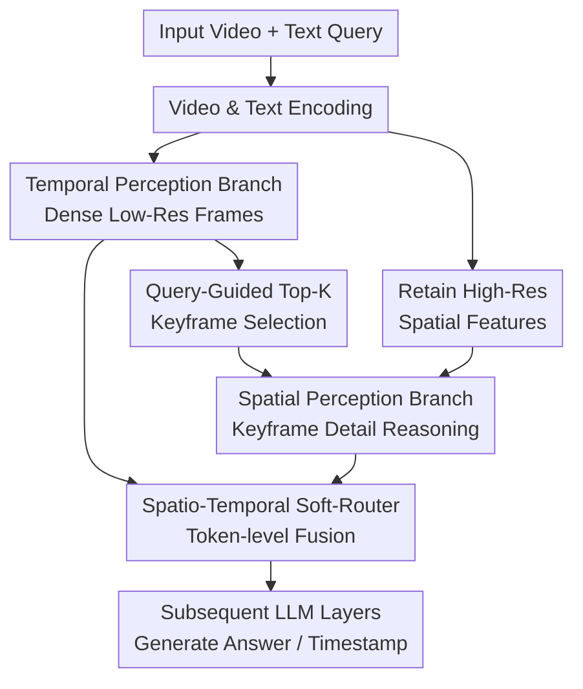

# Divid: Disentangled Spatial-Temporal Modeling within LLMs for Temporally Grounded Video Understanding

**Conference**: ICLR 2026  
**OpenReview**: [https://openreview.net/forum?id=mrViXFfrsU](https://openreview.net/forum?id=mrViXFfrsU)  
**Code**: Not yet public  
**Area**: Video Understanding / Temporally Grounded Video Understanding  
**Keywords**: Temporal Grounding Video Understanding, Video LLM, Spatio-temporal Disentanglement, Keyframe Selection, Grounded VideoQA  

## TL;DR
Divid explicitly disentangles temporal and spatial branches within the Video LLM decoder. It utilizes temporal attention to select high-resolution keyframes for queries and fuses information via a token-level soft-router. Combined with the 559K timestamp-supervised dataset TempGCap, it improves both accuracy and computational efficiency in temporal grounding and evidenced VideoQA.

## Background & Motivation
**Background**: Video LLMs in long video understanding typically use a visual encoder to transform multi-frame videos into visual tokens, which are then fed into the LLM alongside text queries. While this "flatten-then-concatenate" paradigm is effective for short videos or coarse-grained QA, temporally grounded video understanding requires the model to not only answer questions but also provide corresponding start and end timestamps. The model must locate segments perfectly aligned with linguistic instructions within videos ranging from dozens of seconds to several minutes.

**Limitations of Prior Work**: The core challenge in long video understanding is the difficulty of maintaining both temporal coverage and spatial detail. Densely sampling and retaining high-resolution features leads to an explosion of visual tokens, causing context length and computational cost issues. Conversely, compression or sparse sampling to save tokens often results in the loss of critical actions, object interactions, and detailed evidence. Slow-Fast methods extract dense low-resolution temporal tokens and sparse high-resolution spatial tokens separately, but these are usually still simply concatenated and processed in the same attention space after entering the LLM.

**Key Challenge**: This paper argues that the problem is not just "too many tokens in the LLM," but that spatial and temporal modeling lack a true division of labor inside the LLM. Temporal grounding requires identifying which video segment is relevant to the question, while spatial understanding requires clearly seeing objects, actions, and relationships within those relevant segments. If both types of information are always flattened together, the model tends to substitute temporal reasoning with local appearance cues or mistake cue segments in the prompt for answer evidence.

**Goal**: The authors aim to construct a Video LLM that achieves both dense temporal coverage of long videos and retention of spatial details in keyframes. Specifically, it seeks to: first, capture long-range temporal dynamics at a lower cost; second, drive high-resolution spatial frame selection by language queries rather than fixed uniform sampling; third, allow each text token to dynamically decide whether to rely more on temporal or spatial cues when generating answers or timestamps.

**Key Insight**: Divid's observation is intuitive: when humans watch a long video to answer "when did an event occur," they typically scan the overall action changes quickly and then return to a few key moments for details. The paper integrates this process into the LLM decoder rather than just performing Slow-Fast diversion on the visual encoder side, allowing the temporal branch's attention to directly guide the spatial branch's keyframe selection.

**Core Idea**: Replace traditional flattened visual token concatenation with "Internal Spatio-Temporal Dual-Branch + Query-Conditional Keyframe Selection + Token-Level Soft-Routing." This enables the long-video model to locate time first, then supplement spatial details, dynamically fusing both types of evidence at each layer.

## Method
### Overall Architecture
Divid takes a video and a text query as input and outputs temporal boundaries, evidence-based QA answers, or descriptions of specified segments. It first extracts high-resolution features for each frame using a visual encoder while obtaining low-resolution temporal tokens through spatial pooling. Inside the LLM decoder, the temporal branch processes dense sequences and generates text-to-video attention; the spatial branch selects Top-K high-resolution keyframes based on this attention; finally, a soft-router fuses the temporal and spatial representations at each text token.

Formally, given $T$ video frames, the visual encoder and MLP yield high-resolution features $X \in \mathbb{R}^{T \times H \times W \times d}$. Spatial pooling per frame produces low-resolution features $X' \in \mathbb{R}^{T \times H' \times W' \times d}$, effectively one temporal token per frame. The text query is encoded as $X_{text} \in \mathbb{R}^{L \times d}$. Each decoder layer contains temporal perception attention, spatial perception attention, and a spatio-temporal soft-router.

### Key Designs
**1. Internal Spatio-Temporal Disentanglement: Splitting "Finding Segments" and "Seeing Details" into Two Attention Branches**

The issue with traditional Slow-Fast Video LLMs is that although visual tokens are split into fast and slow categories, they are concatenated into a single sequence in the LLM. The self-attention mechanism does not explicitly know which tokens are responsible for global timing and which for local details. Divid shifts this disentanglement into the decoder layer: the temporal branch receives densely sampled, low-resolution tokens to cover long spans with a small token budget, while the spatial branch views a few high-resolution keyframes for fine-grained evidence.

The key benefit is avoiding the compression of all long-video spatial details into a single attention space. The temporal branch learns "which moments the text tokens should attend to," and the spatial branch then clarifies actions and objects at those moments. For temporally grounded tasks, this is closer to the task structure than providing all frame details initially: localization precedes visual discrimination.

**2. Temporal Attention-Guided Top-K Keyframe Selection: Binding Spatial Frames to the Query**

The spatial branch cannot simply use uniform sampling because the question might relate to a very short segment. For example, if asked "When did the man set up the tent?", uniform sampling might capture irrelevant walking or waiting. Divid extracts the text-to-video cross-modal attention $A^{T2V}_{temp} \in \mathbb{R}^{L \times T}$ from the temporal branch, averages it across all text tokens, and derives an importance score $s_{t2v} \in \mathbb{R}^{T}$ for each frame.

The model then selects the highest-scoring $k$ frames: $I_{key}=TopK(s_{t2v}, k)$, and retrieves $X_{key} \in \mathbb{R}^{k \times H \times W \times d}$ from the original high-resolution features. This converts the temporal branch's language-relevant localization into an input filter for the spatial branch, preventing computational waste on query-irrelevant frames. Ablations show Top-K is more robust than Uniform, Weighted, Segment, or Importance sampling because it retains the most salient frames for the current query.

**3. Token-Level Spatio-Temporal Soft-Router: Custom Information Ratios for Different Words**

Having two branches is insufficient; the model must know "when to trust the temporal branch and when to trust the spatial branch." Divid uses a spatio-temporal soft-router: for each text token, a binary softmax gate is calculated using the original text representation $X_{text}$ before fusion: $G=Softmax(X_{text}W_g+b_g) \in \mathbb{R}^{L \times 2}$. For the $i$-th token, the representations from both branches are fused as $Z_i^{text}=g_i^{(1)}H_i^{temp}+g_i^{(2)}H_i^{spat}$.

This design is more granular than simple addition. Words like "when," "then," and "start" naturally depend more on temporal order and use more temporal features. Words like "dog," "lady," and "holding" require identifying specific details and use more spatial features. Visualizations of routing weights in the appendix demonstrate that the soft-router learns these semantically relevant allocation patterns.

**4. TempGCap Data: Enhancing Temporal Supervision with Timestamp-Guided Captions**

Since Divid generates timestamps directly, training data must provide precise boundary supervision. The authors constructed TempGCap, a 559K timestamp-guided captioning dataset where the model describes specific segments given start/end times. This trains the model to align linguistic descriptions with specific temporal windows.

TempGCap is derived from three sources: Sub1 uses existing manual boundaries or action detection data, using Tarsier to generate fine-grained captions; Sub2 back-references short video captions to original untrimmed contexts, refining boundaries via visual similarity; Sub3 synthesizes pseudo-long videos by concatenating short clips to introduce distractor content around the target clip. This aligns with Divid’s goal: the model must distinguish target segments from adjacent irrelevant segments in longer contexts.

### Loss & Training
Divid does not introduce extra regression heads or loss terms (like box or timestamp regression). All tasks are unified as conditional text generation: given the video and prompt, the model autoregressively generates answer tokens and timestamp tokens. The training objective is standard next-token negative log-likelihood:

$$
\mathcal{L}=-\frac{1}{N}\sum_{n=1}^{N}\frac{1}{|\mathcal{T}^{(n)}|}\sum_{t\in\mathcal{T}^{(n)}}\log p_{\theta}(y_t^{(n)}\mid y_{<t}^{(n)},x^{(n)}).
$$

Implementation-wise, the visual encoder is EVA-CLIP ViT-g/14, and the LLM is Qwen2-7B. Training involves two stages: Stage 1 utilizes LLaVA-558K and WebVid for pre-training, updating multimodal projectors; Stage 2 involves instruction tuning on a mixture of TempGCap (559K), DideMo, and ActivityNet Captions (77K timestamped samples), alongside VideoQA data like LLaVA-Video-178K. The temporal branch uses $T=128$ frames with $4\times4$ pooling, while the spatial branch selects $k=32$ keyframes with $8\times8$ resolution.

## Key Experimental Results

### Main Results
The paper evaluates temporal grounding (Charades-STA) and grounded VideoQA (CG-Bench, NExT-GQA, ReXTime).

| Dataset / Task | Metric | Divid 7B | Strong Baseline | Gain / Comparison |
|--------|------|------|----------|------|
| Charades-STA / Grounding | R@0.5 / R@0.7 / mIoU | 59.5 / 31.3 / 51.3 | VideoMind 7B: 59.1 / 31.2 / 50.2 | mIoU +1.1 |
| Charades-STA / Grounding | mIoU | 51.3 | Qwen2.5-VL 72B: 50.9 | ~10x fewer params, mIoU +0.4 |
| CG-Bench / Grounded QA | mIoU / R@IoU / A@IoU | 5.74 / 8.36 / 4.11 | GPT-4o: 5.62 / 8.30 / 4.38 | Higher localization, slightly lower joint |
| NExT-GQA / Grounded QA | Acc@GQA / mIoU / mIoP | 34.5 / 40.8 / 29.2 | VideoMind 7B: 31.4 / 39.0 / 28.2 | Acc +3.1, mIoU +1.8 |
| ReXTime / Grounded QA | R@0.5 / mIoU / Acc@IoU | 31.05 / 35.78 / 22.26 | VideoMind 7B: 25.52 / 27.61 / 20.20 | mIoU +8.17 |

Divid 1.5B also performs impressively. On Charades-STA, it achieves 51.4 R@0.5 and 47.3 mIoU, surpassing several 7B models like Momentor and TimeChat. On ReXTime, the 1.5B model achieves 29.71 mIoU, higher than VideoMind 1.5B (24.83). This suggests gains stem from the architecture and data rather than just scale.

### Ablation Study
| Configuration | Key Metrics | Description |
|------|---------|------|
| Full | Charades-STA mIoU 47.76, ReXTime 30.16 | All high-res frames in LLM; highest accuracy, highest cost |
| Slow-Fast | Charades-STA mIoU 46.71, ReXTime 29.49 | Visual-side split, but concatenated inside LLM |
| Divid (Ours) | Charades-STA mIoU 47.33, ReXTime 29.71 | ~63% lower TFLOPs than Full, near-Full accuracy |
| Uniform keyframe | Charades-STA mIoU 46.27, ReXTime 27.61 | Selection without query relevance |
| Top-K keyframe | Charades-STA mIoU 47.33, ReXTime 29.71 | Temporal attention-based selection; best performance |
| Soft-Router | Charades-STA mIoU 47.33, ReXTime 29.71 | Dynamic token-level weighting for time/space |
| TempGCap | Charades-STA mIoU 47.33, ReXTime 29.71 | Higher quality timestamp supervision yields gains |

### Key Findings
- **Value of Divid**: Ours does not necessarily seek to exceed the "Full" model's limit but aims to maintain or exceed Slow-Fast performance while drastically reducing TFLOPs. Ours achieves higher mIoU than Slow-Fast with only 10.5 TFLOPs.
- **Top-K Importance**: The jump from Uniform (27.61 mIoU) to Top-K (29.71) on ReXTime proves grounded VideoQA is highly sensitive to selecting the correct evidence segments.
- **Soft-Router Interpretability**: Different text tokens rely on different branches. Routing weights confirm that "when" tokens favor temporal features, while action/object tokens favor spatial ones.
- **Data over Scale**: TempGCap (559K) outperforms Momentor-10M, suggesting boundary precision and task formatting (segment description) are more effective than raw volume.

## Highlights & Insights
- Divid advances Slow-Fast intuition from visual token construction to the LLM decoder's internal mechanism. It asks "how the LLM should process time and space separately" at every layer.
- Query-driven keyframe selection is natural and practical. Compared to pre-sampling, it allows the language query to actively influence which high-resolution evidence is viewed.
- TempGCap demonstrates that grounded Video LLMs cannot rely on standard captions. Training the model to "describe content given a time segment" strengthens the alignment between boundaries and language.
- This approach is transferable to other long-context multimodal tasks, such as movie-level plot QA or robotic egocentric video retrieval, which benefit from "low-cost global scanning followed by high-resolution detail checking."

## Limitations & Future Work
- **Attention Bias**: Divid relies on temporal branch attention; if the LLM has biases toward certain language cues, the spatial branch might be misdirected.
- **Hard Selection**: Top-K is a hard selection. If an answer requires multiple scattered segments or far-apart events, $k=32$ might be insufficient.
- **Latency**: While theoretical TFLOPs are reduced by ~35.2% compared to Slow-Fast, actual latency (1397ms vs 1311ms) is slightly higher, indicating a need for engineering optimization of dual-branch scheduling.
- **Reasoning Gaps**: Failure cases show errors in "before/after" reasoning. Future data needs more supervision for non-overlapping cue/answer segments to resolve causal and temporal sequences.

## Related Work & Insights
- **vs LITA / SlowFast-VideoLLM**: These concatenate tokens at the input. Ours splits them within the decoder layers and uses temporal attention to guide spatial selection.
- **vs VideoExpert**: VideoExpert uses MoE to separate spatio-temporal capabilities; Ours uses a dual-branch fused via a soft-router at each token without extra heads.
- **vs MASH-VLM**: MASH-VLM uses mask-disentangled attention but faces issues with position encoding compatibility. Ours uses dual branches with shared parameters, creating mergable information flows.
- **Insight**: Long videos are not just large image sequences; they require both coarse scanning and fine-grained verification. Future Video LLMs should move toward "intra-layer structured reasoning" rather than just input token compression.

## Rating
- **Novelty**: ⭐⭐⭐⭐☆ Moves spatio-temporal disentanglement into the decoder and uses temporal attention for keyframe selection—a clear advancement over standard Slow-Fast.
- **Experimental Thoroughness**: ⭐⭐⭐⭐⭐ Comprehensive coverage across grounding and QA benchmarks, with robust ablations on architecture, sampling, and data.
- **Writing Quality**: ⭐⭐⭐⭐☆ Logical flow; however, some tables are dense and require the appendix for full clarity on engineering trade-offs.
- **Value**: ⭐⭐⭐⭐⭐ Highly valuable for long-video grounding research, inspiring future Video LLMs to adopt structured spatio-temporal reasoning within the LLM itself.

<!-- RELATED:START -->

## Related Papers

- [\[ICLR 2026\] Measure Twice, Cut Once: A Semantic-Oriented Approach to Video Temporal Localization with Video LLMs](measure_twice_cut_once_a_semantic-oriented_approach_to_video_temporal_localizati.md)
- [\[ICCV 2025\] Factorized Learning for Temporally Grounded Video-Language Models](../../ICCV2025/video_understanding/factorized_learning_for_temporally_grounded_video-language_models.md)
- [\[CVPR 2026\] T2SGrid: Temporal-to-Spatial Gridification for Video Temporal Grounding](../../CVPR2026/video_understanding/t2sgrid_temporal-to-spatial_gridification_for_video_temporal_grounding.md)
- [\[ICLR 2026\] Cambrian-S: Towards Spatial Supersensing in Video](cambrian-s_towards_spatial_supersensing_in_video.md)
- [\[ICCV 2025\] TOGA: Temporally Grounded Open-Ended Video QA with Weak Supervision](../../ICCV2025/video_understanding/toga_temporally_grounded_open-ended_video_qa_with_weak_supervision.md)

<!-- RELATED:END -->
