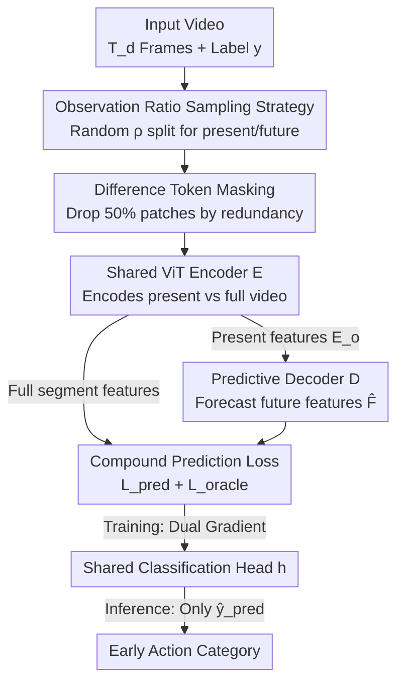

# EAST: Early Action Prediction Sampling Strategy with Token Masking

**Conference**: ICLR2026  
**OpenReview**: [https://openreview.net/forum?id=3Genv8DQgf](https://openreview.net/forum?id=3Genv8DQgf)  
**Code**: https://github.com/ivasovic/east  
**Area**: Video Understanding / Early Action Prediction  
**Keywords**: Early Action Prediction, Observation Ratio Sampling, Token Masking, ViT Video Encoder, Predictive Decoder

## TL;DR
EAST introduces a training strategy that randomly samples the observation ratio $\rho$, allowing a **single model** to perform early action prediction across all observation ratios. Combined with a "dual classification compound loss (present + future)" and "difference masking" that discards half of the tokens based on temporal redundancy, it outperforms previous state-of-the-art methods by 10.1, 7.7, and 3.9 percentage points on NTU60, SSv2, and UCF101, respectively, while halving training memory and time.

## Background & Motivation
**Background**: Early action prediction requires models to categorize an action after seeing only a small initial segment of the video (observation ratio $\rho$, e.g., seeing only the first 10% or 30% of frames). This is critical for real-time applications like surveillance alerts, human-robot interaction, and autonomous driving. Prevailing methods rely on auxiliary tasks such as motion prediction, future residual estimation, or graph-based future state modeling.

**Limitations of Prior Work**: Two persistent issues exist. First, auxiliary objectives (e.g., optical flow prediction, feature alignment) do not always directly improve classification accuracy. Second, and more critically, **recent methods require training a separate model for every observation ratio**. A standard evaluation across $\rho$ from 0.1 to 0.9 (step 0.1) requires training 9 different models, leading to explosive training costs and the need to know the current observation ratio during deployment to select the correct model.

**Key Challenge**: Traditional action recognition models rely heavily on **full temporal context**, failing when provided with only truncated segments. While "ratio-specific models" mitigate this, they treat what should be a generalization problem across arbitrary lengths as 9 independent tasks.

**Goal**: (1) Enable a single model to seamlessly cover all observation ratios; (2) Directly optimize prediction accuracy rather than auxiliary tasks; (3) Reduce training memory and time to allow execution on affordable GPUs.

**Key Insight**: Instead of complex "future prediction" designs, the authors suggest exposing the model to **various observation lengths during training** by treating the observation ratio itself as a dimension for random data augmentation.

**Core Idea**: During training, the "observed/unobserved" split point is randomly sampled. The same model simultaneously classifies "partially observed predicted features" and "full-video oracle features," while applying a difference token mask to save computational resources.

## Method

### Overall Architecture
EAST aims to classify actions seeing only the first $\rho$ segment. The approach splits a video into "present" (observed) and "future" (unobserved) halves based on a randomly sampled ratio. A **shared-parameter ViT encoder $E$** encodes both the present frames and the full video. Present features pass through a **predictive decoder $D$** to forecast future features $\hat{F}$. A **shared classification head $h$** scores both the "predicted features" and the "full-video oracle features," with the combined losses trained end-to-end. At inference, only the present path ($\hat{y}_{\text{pred}}$) is used, making the model agnostic to the test observation ratio. **Difference token masking** is added to remove 50% of patches based on temporal redundancy, halving training memory and time.

Formalization: For a video of $T_d$ frames, the observation ratio $\rho \in (0,1)$ controls the visible frames $\rho \cdot T_d$. During training, the model sees all $T_d$ frames and label $y$; during inference, it sees only $\rho \cdot T_d$ frames, with a unified model handling all 9 values of $\rho$.

### Key Designs

**1. Observation Ratio Sampling Strategy: One Model for All $\rho$**

This core design addresses the pain point of training 9 models. Instead of a fixed observation length, $\rho$ is **randomly sampled** from $\{0.1, 0.2, \dots, 0.9\}$ during training. Based on this, $T$ frames of the observed segment $V_o \in \mathbb{R}^{T\times H\times W\times C}$ and $T$ frames of the unobserved segment $V_u$ are selected such that $V_o$ occurs before $\rho \cdot T_d$ and $V_u$ after, forming a concatenated sequence $V = V_o \Vert V_u$ of $2T$ uniformly sampled frames. Crucially, $V_o$'s last frame and $V_u$'s first frame are **adjacent** in the original video to maintain temporal consistency.

**Mechanism**: Randomizing $\rho$ exposes the model to various context lengths, forcing it to adapt to "variable temporal context." Preliminary experiments showed that models trained on fixed ratios performed poorly on other ratios, while standard recognition models failed early prediction due to reliance on full context. This strategy accelerates training by $9\times$ and removes the need for ratio-specific info at inference.

**2. Predictive Decoder on MAE Features: Forecasting from Observed Features**

The encoder $E$ is a ViT with spatiotemporal positional encoding, consisting of a tokenizer $\mathcal{T}$ (slicing segments into tubelets of size $d\times p\times p$, $p=16, d=2$) and a transformer encoder $\mathcal{V}$: $E(V_o) = \mathcal{V}\circ\mathcal{T}(V_o) = E_o$. The decoder $D$ takes present features $E_o$ (after spatial global average pooling $P_s$ to get one token per timestep) and forecasts future features: $D(E_o) = \mathcal{F}\circ P_s(E_o) = \hat{F}$.

The authors compared three decoder types: identity mapping (decoder-free baseline), autoregressive transformer, and a **direct transformer** that prepends $E_o$ to $[\text{MASK}]$ tokens for a single forward pass. Direct decoding outperformed autoregressive by 0.6 pp on average. Both encoder and decoder are initialized with VideoMAE pre-training, ensuring the token masking does not cause distribution shift.

**3. Compound Prediction Loss: Dual Supervision from Present and Oracle**

Optimizing only predicted features is insufficient; the encoder features must be both discriminative and predictive. The model performs an additional forward pass on the full sampled segment to obtain oracle features $E = P_s\circ E(V)$. The **same classification head $h$** generates two sets of logits: $\hat{y}_{\text{pred}} = h\circ P_t(\hat{F})$ from present prediction and $\hat{y}_{\text{oracle}} = h\circ P_t(E)$ from the full video. The total loss is:

$$\mathcal{L} = \mathcal{L}_{\text{pred}} + \mathcal{L}_{\text{oracle}} = \mathcal{L}_{\text{NLL}}(\hat{y}_{\text{pred}}, y) + \mathcal{L}_{\text{NLL}}(\hat{y}_{\text{oracle}}, y).$$

The gradient of $\mathcal{L}_{\text{pred}}$ optimizes early prediction, while $\mathcal{L}_{\text{oracle}}$ ensures discriminative features when full context is available. No L2 feature alignment loss is used between present and oracle, as experiments showed L1/L2 alignment tends to ignore critical temporal patterns.

**4. Difference Token Masking: Removing Temporally Static Patches**

To reduce computation in attention layers, temporally redundant tokens are discarded. For each tubelet $p_{t,i,j}$, the L1 pixel distance from the corresponding patch in the next tubelet is calculated:

$$r_{t,i,j}(V) = \Vert p_{t,i,j}[0] - p_{t+1,i,j}[d-1]\Vert_1,$$

Only the tokens with the highest variation (above quantile $k$) are kept at each spatial location $(i,j)$. Setting $k=50\%$ removes half the tokens, termed **difference masking**. Masking is applied **independently** to $V_o$ and $V_u$ during training to prevent unobserved information leakage. This reduces training memory and time by approximately $2\times$ with negligible accuracy loss.

### Loss & Training
The total objective is the compound loss $\mathcal{L} = \mathcal{L}_{\text{pred}} + \mathcal{L}_{\text{oracle}}$. The backbone is ViT-B/16 pre-trained on K400 via VideoMAE. $T=8$ frames are sampled per path. Augmentations include 224×224 random cropping and MixUp. Optimization uses AdamW (base LR $1\times10^{-3}$, WD 0.05, cosine decay). Batch size is 96 for SSv2/NTU60/EK-100 and 128 for SSsub21/UCF101. FlashAttention combined with $M^d_{k=0.5}$ masking allows training on 20GB GPUs.

## Key Experimental Results

### Main Results
EAST achieves new SOTAs across four benchmarks using **one single model across all 9 observation ratios**.

| Dataset | Metric | EAST | Prev. SOTA | Avg. Gain |
| :--- | :--- | :--- | :--- | :--- |
| NTU60 | top-1 acc (RGB only) | $\rho{=}0.5$: 86.2 | TemPr 70.1 | +6.8 pp (max +19.2 at $\rho{=}0.3$) |
| SSv2 | top-1 acc | $\rho{=}0.5$: 49.0 | TemPr | +28.3 pp |
| SSsub21 | top-1 acc | $\rho{=}0.5$: 66.4 | Early-ViT 52.4 | +22.7 pp |
| UCF101 (MoViNet backbone) | top-1 acc | $\rho{=}0.5$: 95.5 | TemPr 95.4 | +3.9 pp (vs ERA +1.3) |

On NTU60, RGB-only EAST outperforms multi-modal methods using skeleton/depth. On UCF101, it maintains SOTA with MoViNet, proving the gains stem from the training strategy, not just the ViT backbone. On EK-100, EAST significantly beats TemPr at low ratios ($\rho{=}0.1$ All Action 20.4 vs 7.4).

### Ablation Study

| Configuration | SSv2 Avg top-1 | Note |
| :--- | :--- | :--- |
| VideoMAE (Standard Training) | — | Only 9.9% at $\rho{=}0.1$, fails without full context |
| EAST$_E$ (Sampling only, encoder-only, $\mathcal{L}_{\text{pred}}$ only) | 44.8 | Jumps to 23.9% at $\rho{=}0.1$, exceeding prior SOTA |
| + $\mathcal{L}_{\text{oracle}}$ (encoder-only) | 46.3 | Compound loss adds +1.5 pp |
| Full EAST (Encoder-decoder + compound loss) | 46.9 | Adds another +0.6 pp |

**Difference Masking ($M^d$)** at $k{=}0.5$ (NTU60 avg acc: 74.3%) outperforms random masking (71.3%) and MAR-based masking. It matches unmasked performance (75.1%) while reducing peak memory from 36.7GB to 19.2GB and TFLOPs from 1.1 to 0.5.

### Key Findings
- **Sampling Strategy is the Primary Driver**: EAST$_E$ (no decoder) achieves a massive performance jump at $\rho{=}0.1$, proving the bottleneck in early prediction is not the "future prediction module" but the exposure to truncated segments during training.
- **Oracle Loss Empowers Encoder-only Models**: Simply adding full-video classification supervision provides more gain (+1.5 pp) than adding a complex decoder.
- **Difference Masking is Superior**: Keeping patches with high temporal variance is better than random or motion-based pruning, saving 50% resources with zero drop.

## Highlights & Insights
- **Observation Ratio as a Dimension for Augmentation**: Instead of specific models, randomizing $\rho$ solves both the generalization issue and the $9\times$ training cost. This "sampling over specialization" logic applies to any task with variable conditions.
- **Oracle Supervision as a Free Lunch**: Using the same classification head for full video features provides discriminative signals without new modules—a useful trick for any privileged information setup.
- **Physical Intuition of Difference Masking**: Using L1 distance between tubelets mirrors Moravec corner detection for video tokens—static backgrounds are pruned while moving subjects are retained.

## Limitations & Future Work
- **Ceiling Effects**: On EK-100 at high ratios, performance is capped by the VideoMAE ViT-B recognition ceiling (33.7% vs SlowFast 38.5%), indicating the method's strength is primarily in "low information" zones.
- **Single-Seed Evaluation**: Results are reported from single runs; variance across multiple seeds is not provided.
- **Fixed Masking Ratio**: The $k{=}0.5$ ratio is a manual trade-off. Content-adaptive masking (dropping more for static scenes, less for fast motion) remains unexplored.

## Related Work & Insights
- **vs TemPr**: TemPr uses multi-tower transformers but requires **dedicated models per ratio**; EAST is a single, ratio-agnostic model with higher efficiency.
- **vs Early-ViT**: Early-ViT learns action prototypes; EAST achieves better results on SSsub21 without prototypes, relying purely on sampling and discriminative loss.
- **vs AA-GAN / DBDNet**: These rely on reconstructing future motion/flow; EAST avoids the misalignment between reconstruction and classification by using a dual classification objective.

## Rating
- Novelty: ⭐⭐⭐⭐ Randomizing observation ratio as an augmentation is simple but transformative; other components are standard but well-integrated.
- Experimental Thoroughness: ⭐⭐⭐⭐ Four datasets plus detailed ablations, though lack of variance and backbone bottlenecks on EK-100 are present.
- Writing Quality: ⭐⭐⭐⭐ Clear motivation, well-structured methodology, and precise formulas.
- Value: ⭐⭐⭐⭐ Significantly reduces training/deployment complexity for early action prediction with a strong SOTA improvement.

<!-- RELATED:START -->

## Related Papers

- [\[CVPR 2026\] EarlyTom: Early Token Compression Completes Fast Video Understanding](../../CVPR2026/video_understanding/earlytom_early_token_compression_completes_fast_video_understanding.md)
- [\[CVPR 2026\] ProgTrack: A Multi-Object Tracking Algorithm with Progressive Matching Strategy](../../CVPR2026/video_understanding/progtrack_a_multi-object_tracking_algorithm_with_progressive_matching_strategy.md)
- [\[CVPR 2026\] Cluster-Wise Spatio-Temporal Masking for Efficient Video-Language Pretraining](../../CVPR2026/video_understanding/cluster-wise_spatio-temporal_masking_for_efficient_video-language_pretraining.md)
- [\[ICLR 2026\] EgoBrain: Synergizing Minds and Eyes For Human Action Understanding](egobrain_synergizing_minds_and_eyes_for_human_action_understanding.md)
- [\[ICLR 2026\] Video-KTR: Reinforcing Video Reasoning via Key Token Attribution](video-ktr_reinforcing_video_reasoning_via_key_token_attribution.md)

<!-- RELATED:END -->
