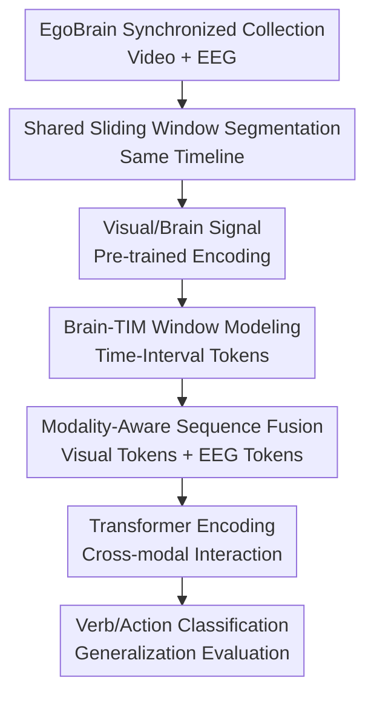

# EgoBrain: Synergizing Minds and Eyes For Human Action Understanding

**Conference**: ICLR2026  
**OpenReview**: [https://openreview.net/forum?id=DGcoJINQ7P](https://openreview.net/forum?id=DGcoJINQ7P)  
**Code**: https://github.com/ut-vision/EgoBrain  
**Area**: Video Understanding / Egocentric Action Understanding / Brain-Vision Multimodality  
**Keywords**: Egocentric Video, EEG, Action Recognition, Multimodal Fusion, Brain-TIM  

## TL;DR
EgoBrain constructs the first large-scale dataset synchronizing egocentric video with 32-channel EEG for daily actions and proposes Brain-TIM, which utilizes a time-aware Transformer to fuse visual and brain signals, improving the visual baseline from 63.40% to 66.70% in cross-subject and cross-scene 29-category action recognition.

## Background & Motivation
**Background**: Egocentric video understanding has established datasets like EPIC-KITCHENS, Ego4D, HoloAssist, and the Assembly series, which effectively record what a person sees, what their hands are doing, and how objects are manipulated. Another line of research involves EEG and BCI, which excels at capturing internal neural activities such as attention, motor intention, and decision preparation, though common settings are still biased toward laboratory screen stimuli, static images, or controlled motor imagery tasks.

**Limitations of Prior Work**: These two lines of research have long been disconnected. Egocentric video datasets only observe external behavioral outcomes without knowing the subject's cognitive state; traditional EEG datasets observe neural responses but rarely involve real interaction with objects in authentic environments. Consequently, models learn either "the world seen by the eyes" or "responses in brain signals," making it difficult to study how external perception and internal intention jointly determine actions.

**Key Challenge**: Many errors in daily action understanding arise precisely from visual invisibility or visual ambiguity. For example, "writing" and "drawing" in an egocentric view may both appear as a hand moving a pen on paper; "drinking" and "eating snacks" might share identical tabletop contexts when occluded. Vision excels at spatial details and object cues, while EEG excels at temporal resolution and implicit cognitive cues. The two are complementary, provided there is strictly synchronized data and a fusion model capable of handling a shared timeline.

**Goal**: The authors aim to solve two problems simultaneously. First, to establish a synchronized brain-vision dataset in real daily activity scenarios, allowing researchers to observe egocentric video and EEG on the same timeline. Second, to provide a reproducible baseline model to verify whether EEG can indeed provide gains for egocentric action recognition, especially in more realistic deployment settings like cross-subject and cross-environment scenarios.

**Key Insight**: The paper does not treat EEG as a standalone signal replacing vision, but rather as an internal state channel that complements visual blind spots. This perspective is reasonable: egocentric video provides scenes, objects, and hand movements, while EEG may carry signals related to attention, action preparation, swallowing, or visuospatial planning. As long as the two are aligned in time, the model has the opportunity to make judgments using brain signals when vision is ambiguous.

**Core Idea**: Utilize the synchronized EgoBrain dataset to place "visually perceived actions" and "brain signals during action participation" on the same timeline, and then use Brain-TIM to explicitly model time intervals, modal identities, and cross-modal interactions to enhance egocentric action understanding.

## Method
### Overall Architecture
The overall contribution consists of two parts: the dataset and the model. On the data side, EgoBrain uses a head-mounted GoPro to record 1080P/30Hz egocentric video while capturing brain activity with a 32-channel wireless EEG headset at 256Hz, with 40 subjects completing 29 categories of daily activities. On the model side, Brain-TIM segments video and EEG into shared time windows, extracts features using pre-trained encoders, and feeds time-aware and modality-aware tokens into a Transformer for verb and action classification.

From the data flow perspective, the raw video stream $V^{raw}$ and EEG sequence $B^{raw}$ share the same time interval $[0, T]$. The model uniformly divides the entire sequence into $Q$ query intervals, where each query predicts the verb category or fine-grained action category within the corresponding period. The key here is not simply concatenating two features, but letting the model know which time interval each token covers, which modality it comes from, and which query it corresponds to.

### Key Designs
**1. EgoBrain Synchronized Collection: Placing Egocentric Behavior and Brain Signals on the Same Timeline**

The most significant infrastructure contribution is the dataset itself. Subjects wore a head-mounted GoPro and a 32-channel Emotiv FLEX 2 EEG headset to complete actions in a controlled yet near-daily workbench environment. The video records objects, hands, and screens from the human perspective, while the EEG records simultaneous brain activity. Since they are collected synchronously, the model does not need to guess "which frame the brain signal corresponds to" but can segment windows directly on the same timeline.

The action design also serves this goal. The 29 fine-grained actions are organized under four high-level activities: Work, Play, Learn, and Consume, with Play further divided into sub-types like screen games, object games, and mobile games. This is not to complicate the label hierarchy but to ensure that actions have both visual similarities and differences in cognitive and motor loads. For instance, taking notes, tracing, and drawing may all involve pen movement on paper but have different internal task intentions; eating snacks, drinking water, and drinking bitter melon juice all involve orofacial movements but involve different objects and contexts.

**2. Brain-TIM Time-Window Modeling: Aligning Video and EEG Dynamics with Overlapping Windows**

Video is at 30Hz while EEG is at 256Hz; their sampling rates differ, so point-by-point alignment is meaningless. Brain-TIM adopts a sliding window with length $\Delta t$ and stride $\delta t$ to segment both video and EEG into $N=\lfloor (T-\Delta t)/\delta t \rfloor+1$ aligned segments. Each video window contains $N_v=f_v\cdot\Delta t$ frames, and each EEG window contains $N_b=f_b\cdot\Delta t$ sampling points.

This design solves two problems. First, it converts raw signals of different sampling rates into window-level feature sequences of consistent quantity, facilitating Transformer processing. Second, the paper emphasizes that $\delta t$ is smaller than potential sub-second synchronization biases; adjacent windows overlap significantly, so slight timestamp errors do not cause a critical action to be lost instantly. The same moment is covered by multiple windows, creating natural temporal redundancy.

**3. Time and Modality-Aware Tokens: Letting the Transformer Know "When" and "From Where"**

Brain-TIM does not simply concatenate VideoMAE and LaBraM features. Visual segments are first encoded into window-level features $E_v$ by VideoMAE; EEG segments yield $E_b$ through filtering, downsampling, LaBraM encoding, and channel-wise average pooling. Subsequently, both features are projected into the same $D$-dimensional space via learnable embedding layers $g_v$ and $g_b$, resulting in visual tokens and EEG tokens.

Temporal information is generated by a Time-Interval MLP. For the $i$-th feature window, the TIM receives the start/end times of $[t_i, t_i+\Delta t)$ and outputs a time embedding $e_i^f$; for the $j$-th query, the TIM receives $[(j-1)T/Q, jT/Q]$ and outputs a query time embedding $e_j^q$. Modality identity is represented by two learnable vectors $m_v$ and $m_b$, added to the visual and EEG related tokens respectively. The final sequence consists of visual feature blocks, brain signal feature blocks, visual CLS tokens, and EEG CLS tokens, with a length of $2N+2Q$, where each element carries content, time, and modality information.

**4. Cross-Subject and Cross-Scene Evaluation: Testing Brain-Vision Synergy under Real Generalization Pressure**

The paper does not only prove model effectiveness on random splits but designs two more diagnostic settings. "Cross-subject-only" requires the model to generalize to unseen subjects in the same physical environment; "Cross-subject & Cross-scene" further moves the test set to new environments with new backgrounds and different object configurations to examine whether the model relies on fixed tabletops and static visual contexts.

This evaluation design is crucial. If EEG were merely memorizing noise from certain subjects or scenes, it would not provide stable gains in cross-subject and cross-scene settings. Experiments show that the multimodal model brings even larger absolute improvements in action recognition in the more difficult cross-scene setting, indicating that EEG serves more as a compensatory signal for visual domain shift and occlusion rather than accidental gains from increased parameters.

### Loss & Training
Pre-trained encoders in Brain-TIM are frozen during the feature extraction stage: video uses VideoMAE pre-trained on EPIC-KITCHENS-100, outputting 1024-dimensional segment features; EEG uses LaBraM pre-trained on 2500 hours of EEG data, outputting channel-level brain features, which are then pooled into window-level representations.

After the Transformer output, the model extracts query CLS tokens from the visual and EEG branches and feeds them into classification heads. The training objective provided in the supplement is the weighted sum of the visual branch cross-entropy $L_v$ and the EEG branch cross-entropy $L_b$: $L=L_v+\lambda\cdot L_b$. High-level semantic categories (Work, Play, Learn, Consume) are used only to organize the dataset and are not used as training labels; the actual training involves verb classification and 29-category action classification.

## Key Experimental Results

### Main Results
The main experiments compare "Brain only," "Visual only," and "Visual + Brain" inputs, reporting Top-1 accuracy over 5 random seeds under two generalization protocols. While visual unimodality is already strong, adding EEG improves results in both protocols—notably, 29-category action recognition improves from 63.40% to 66.70% in the cross-subject and cross-scene setting.

| Protocol | Modality | Verb Acc. | Action Acc. | Key Insight |
| :--- | :--- | :--- | :--- | :--- |
| Cross-subject only | Brain only | 21.53 ± 0.99 | 8.44 ± 2.25 | Above random but much weaker than vision |
| Cross-subject only | Visual only | 88.95 ± 0.80 | 78.44 ± 0.71 | Ego-vision already captures most external actions |
| Cross-subject only | Visual + Brain | 90.11 ± 1.10 | 80.16 ± 1.67 | Action Gain: 1.72 percentage points |
| Cross-subject & Cross-scene | Brain only | 19.41 ± 1.57 | 9.36 ± 0.52 | Remains above majority-class baseline under scene changes |
| Cross-subject & Cross-scene | Visual only | 81.67 ± 1.89 | 63.40 ± 0.95 | Vision significantly affected by new environments |
| Cross-subject & Cross-scene | Visual + Brain | 83.43 ± 0.41 | 66.70 ± 0.83 | Action Gain: 3.30 percentage points |

A point of note is that parameter count does not explain all gains. The LaBraM branch has only 5.8M parameters, while the VideoMAE visual backbone has approximately 305.0M; the "Visual + Brain" total is about 310.8M. Thus, multimodal gains primarily stem from the additional information provided by EEG rather than model scaling.

### Ablation Study
Ablation studies examine the contributions of the embedding layers, Time Interval MLP, and modality embeddings. Results show these components are generally positive in "Brain only" and "Visual + Brain" settings; however, in the "Visual only" setting, the extra structure may introduce unnecessary complexity.

| Configuration | Action Acc. | Description |
| :--- | :--- | :--- |
| Brain only, w/o embedding / TIM | 7.44 ± 0.39 | Near majority-class random level with raw brain features |
| Brain only, embedding + TIM | 9.36 ± 0.52 | Time-interval modeling and projection layers significantly improve EEG decoding |
| Visual only, w/o embedding / TIM | 64.94 ± 3.64 | Visual unimodality is strong on its own |
| Visual only, embedding + TIM | 63.40 ± 0.95 | Extra modules are not necessary for pure vision and may cause slight drops |
| Visual & Brain, w/o 3 components | 65.71 ± 0.43 | Simple multimodality already shows benefits |
| Visual & Brain, complete Brain-TIM | 66.70 ± 0.83 | Full Brain-TIM performs best |

### Key Findings
- EEG gains are not uniform; they are more likely to occur in cases of visual ambiguity, occlusion, or categories with different task intentions but similar appearances. For example, "Play(I)" verb recognition improved from 0.46 to 0.64, and "Drink" from 0.87 to 0.94.
- EEG can also introduce noise. In case studies, "utilizing PowerPoint" was misclassified as "Drawing Pictures" by the multimodal model, possibly because UI operations activate visuospatial strategies similar to drawing, blurring semantic boundaries in brain signals.
- In cross-scene settings, the visual model dropped from 78.44% to 63.40%, showing significant domain shift in egocentric action recognition; the multimodal model improved by 3.30 percentage points here, more than the 1.72-point gain in the same-scene cross-subject setting.
- While the "Brain only" model (9.36% action accuracy) exceeds the majority-class baseline (7.02%), it remains far from practical recognition; EEG is currently better suited as a complementary signal rather than a visual replacement.

## Highlights & Insights
- **Introducing Brain Signals to Egocentric Action Data**: This is not just a backbone change but fills a missing internal cognitive channel in prior egocentric video datasets. It expands the research question from "what action is seen" to "how visual and neural cues jointly explain an action."
- **Evaluation Settings More Valuable than Random Splits**: Cross-subject & Cross-scene settings expose whether the model merely memorizes static backgrounds. Multimodality shows higher gains here, supporting the argument for EEG as a compensatory signal.
- **Restrained Brain-TIM Design**: The authors avoid overly complex brain-vision large models, instead adding time-interval MLPs, modality embeddings, and Transformer sequence fusion atop pre-trained encoders. This baseline is clear and easy for future researchers to build upon.
- **Case Analysis Provides Interpretable Success/Failure Boundaries**: "Drinking bitter melon juice" benefits from EEG when the cup is occluded; "drawing" and "writing" are distinguished via internal task intentions. However, when cognitive strategies overlap, EEG can lead the model astray.

## Limitations & Future Work
- Data collection is still restricted to seated tabletop activities in controlled environments. While more realistic than screen stimuli, it does not yet cover free-moving real-life scenes; EEG noise in walking, outdoor environments, and social interactions will be more complex.
- The number of participants (40) and total duration (61 hours) are still small relative to individual EEG differences. Training stronger brain signal representations may require more subjects and cross-device collection.
- Signal-to-noise ratios (SNR) for consumer-grade or portable EEG headsets are limited, resulting in low "Brain only" performance. Current conclusions suggest EEG "complements" vision rather than replaces it for complex daily tasks.

## Related Work & Insights
- **vs. EPIC-KITCHENS / Ego4D**: These offer large-scale video and task labels for studying human-object interaction; EgoBrain differs by adding synchronized EEG to study internal neural states, though at a smaller scale.
- **vs. EEG2Video / EEG-image decoding**: These often focus on decoding visual stimuli from EEG, usually from controlled screen inputs; EgoBrain treats EEG as a complementary modality for real-world action recognition.
- **vs. TIM**: Originally used for time-interval modeling in audio-visual action recognition, Brain-TIM migrates this to brain-vision fusion. The insight is that when sampling rates differ across modalities sharing a timeline, explicit time-interval embeddings are more natural than simple position encodings.

## Rating
- Novelty: ⭐⭐⭐⭐⭐ First large-scale synchronized EEG-video dataset for egocentric action understanding; the problem definition is pioneering.
- Experimental Thoroughness: ⭐⭐⭐⭐ Main experiments, ablations, fusion methods, and case studies are complete, though data scale and scene diversity are still limited.
- Writing Quality: ⭐⭐⭐⭐ Structure is clear, with comprehensive descriptions of methodology and dataset.
- Value: ⭐⭐⭐⭐⭐ The dataset and baseline are excellent starting points for future brain-vision multimodal research, potentially moving egocentric understanding from external behavior to internal state modeling.

<!-- RELATED:START -->

## Related Papers

- [\[CVPR 2026\] MoVie: Broaden Your Views with Human Motion for Action Detection](../../CVPR2026/video_understanding/movie_broaden_your_views_with_human_motion_for_action_detection.md)
- [\[ICLR 2026\] Go Beyond Earth: Understanding Human Actions and Scenes in Microgravity Environments](go_beyond_earth_understanding_human_actions_and_scenes_in_microgravity_environme.md)
- [\[NeurIPS 2025\] Grounding Foundational Vision Models with 3D Human Poses for Robust Action Recognition](../../NeurIPS2025/video_understanding/grounding_foundational_vision_models_with_3d_human_poses_for_robust_action_recog.md)
- [\[ICLR 2026\] V2P-Bench: Evaluating Video-Language Understanding with Visual Prompts for Better Human-Model Interaction](v2p-bench_evaluating_video-language_understanding_with_visual_prompts_for_better.md)
- [\[CVPR 2025\] H-MoRe: Learning Human-centric Motion Representation for Action Analysis](../../CVPR2025/video_understanding/h-more_learning_human-centric_motion_representation_for_action_analysis.md)

<!-- RELATED:END -->
