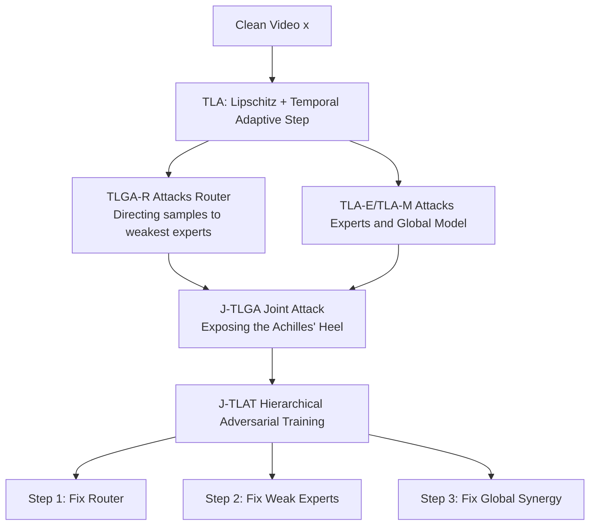

# Exposing and Defending the Achilles' Heel of Video Mixture-of-Experts

**Conference**: ICLR 2026  
**OpenReview**: [https://openreview.net/forum?id=8voly42rKo](https://openreview.net/forum?id=8voly42rKo)  
**Code**: [https://github.com/DeepSota/J-TLAT](https://github.com/DeepSota/J-TLAT)  
**Area**: Video Understanding / MoE Adversarial Robustness  
**Keywords**: Video MoE, Adversarial Attack, Adversarial Training, Lipschitz Constraint, Router Attack, Component-level Robustness  

## TL;DR
This paper systematically deconstructs the component-level adversarial vulnerabilities of Video MoE for the first time. It proposes the J-TLGA attack, which exposes the "Achilles' Heel" by first directing the router toward the weakest experts and then jointly perturbing both the router and experts. Accompanying this is J-TLAT, a hierarchical adversarial training method that repairs these weaknesses layer by layer, significantly enhancing robustness while maintaining over 60% inference computational savings.

## Background & Motivation
**Background**: Mixture-of-Experts (MoE) uses a router to sparsely activate a small subset of expert sub-networks, achieving massive model capacity with nearly constant inference costs. It performs exceptionally well in video understanding tasks like action recognition and video-language modeling, as videos inherently possess complex spatio-temporal structures and long-range dependencies that align well with the MoE's dynamic expert selection per frame.

**Limitations of Prior Work**: The security of Video MoE has received little attention. Existing adversarial attacks and Adversarial Training (AT) methods treat MoE as a **monolithic black box**, overlooking its modular "router + experts" internal structure. Such "global attacks" fail to expose the router's independent vulnerabilities or the synergy failures between components. Furthermore, the few works focused on image MoE do not transfer well to the video domain due to the added temporal dimension and more complex features.

**Key Challenge**: The power of MoE stems from the "divide and conquer" synergy between components, but **synergy is a double-edged sword**. If an attacker can manipulate routing decisions to lead samples toward the most fragile experts and then overlay perturbations on those experts, the destructive power is exponentially amplified. Traditional monolithic defense strategies are completely oblivious to these component-level threats.

**Goal**: To answer two questions: (Q.A) What specific vulnerabilities can adversarial attacks expose in Video MoE? (Q.B) Based on these, how can effective adversarial training be designed for defense?

**Core Idea**: **Component-level + Joint + Hierarchical**. The paper utilizes Lipschitz-guided temporal attacks to target routers and experts separately, then uses joint attacks to expose the "Achilles' Heel." Finally, it employs a three-step hierarchical adversarial training to repair the exposed vulnerabilities layer by layer.

## Method

### Overall Architecture
A Video MoE takes input $x \in \mathbb{R}^{C \times T \times H \times W}$ and feeds it to a router $R(\cdot)$ to produce expert weights $R(x) = (w_1, \dots, w_M)$. The final prediction is a weighted sum of expert outputs $F(x) = \sum_i w_i(x)E_i(x)$. The paper first introduces the **Temporal Lipschitz-Guided Attack (TLGA)** family to attack routers, experts, and the global model separately. After identifying weaknesses, the joint attack J-TLGA is used to expose synergistic vulnerabilities, followed by **Hierarchical Adversarial Training (J-TLAT)** for defense. Both sides share a common key: the Lipschitz constant—maximized in attacks to amplify sensitivity and minimized in defense to smooth decision boundaries.

### Key Designs

**1. Temporal Lipschitz Attack (TLA): Sharpening attacks via Lipschitz constants and temporal adaptive steps.** The Lipschitz constant measures a function's sensitivity to input perturbations; more fragile models have larger constants. The authors formulate it as a differentiable finite difference: $\mathcal{L}_{\text{Lip}} = \frac{\ell_{\text{MSE}}(g(x), g(x+\delta))}{\ell_{\text{MSE}}(x, x+\delta)}$, where $g$ can be the global model $F$, the router $R$, or an expert $E_i$. **Maximizing this searches for the direction in the input space where the output changes most drastically.** For the temporal dimension of video, TLA accumulates historical gradient norms using temporal momentum $V_{t+1} = \beta V_t + \|\nabla_x \ell(t)\|_2$ and assigns adaptive steps per frame: $\alpha^* = \frac{\alpha \cdot \epsilon}{1 + \log(1 + \sqrt{V^*})}$. This intelligently tilts the perturbation budget towards more sensitive frames. The overall attack loss is $\ell_{\text{MoE}} = \ell_{\text{CE}}(F(x+\delta), y) + \lambda \cdot \mathcal{L}_{\text{Lip}}$.

**2. TLGA-R: Deceiving the router toward the weakest expert.** Observation shows that experts assigned with high confidence by the router are usually stronger, while those with low confidence are more fragile. Thus, a guidance term is added to the router attack loss to **proactively push samples toward the lowest-confidence expert** $\hat{y}_R$: $\ell^*_{\text{Router}} = \ell_{\text{Router}} - \gamma_1 \cdot \ell_{\text{CE}}(R(x+\delta_R), \hat{y}_R)$. This ensures the attack doesn't just "collapse" the routing decision but precisely routes samples to the experts most easily breached. Experiments show that attacking only the router via TLGA-R outperforms standard PGD-R by nearly 24%, dropping the robust accuracy of an AT-trained MoE from 42% to 16% (**Insight 1: Router-only attacks can severely threaten traditionally AT-trained MoEs**).

**3. J-TLGA: Synergy amplification via Router × Global attack.** Since component synergy improves performance, can attacks also synergize? J-TLGA combines "directing samples to weak experts via TLGA-R" with "disrupting global output via TLA": $\ell^\star_{\text{MoE}} = \ell_{\text{MoE}} + \gamma_2 \cdot \ell^*_{\text{Router}}$. By forcing the router to select the most vulnerable experts while simultaneously perturbing those experts, the cumulative effect of weaknesses causes destruction to skyrocket—dropping robust MoE accuracy to just 2.54% under $\epsilon = 14/255$, far exceeding standard attacks and exposing the "Achilles' Heel" (**Insight 2: Component weaknesses have cumulative effects, making joint attacks the most destructive**).

**4. J-TLAT: Three-step hierarchical adversarial training to repair weaknesses.** Traditional end-to-end AT struggles to fine-tune component-level weaknesses. J-TLAT performs hierarchical training within each epoch: **Step 1** trains the router $\min_{\theta_R} \max_{x_{adv}} \ell_{\text{Router}}$ for routing consistency under perturbation; **Step 2** identifies weak experts $\mathcal{I} = \text{Top-2}(\text{Router}(x_{adv}))$ using TLGA-R and performs weighted AT on them: $\ell_{\text{Expert}} = \sum_{i \in \mathcal{I}} w_i [\ell_{\text{CE}}(E_i(x+\delta), y) + \lambda \cdot \mathcal{L}_{\text{Lip}}]$; **Step 3** applies AT to the entire MoE to reinforce synergistic robustness. These steps consolidate the model from component to global levels (**Insight 3: Hierarchical AT can sequentially fix vulnerabilities discovered by component-level attacks**). Minimizing $\mathcal{L}_{\text{Lip}}$ also theoretically lowers the global Lipschitz upper bound of the MoE.

## Key Experimental Results

### Main Results Table (UCF-101, 3D ResNet Experts, Selected $\epsilon$)

| Method | CLEAN | PGD@8 | Robustness under J-TLGA | GFLOPs ↓ | Lips-R ↓ |
| :--- | :--- | :--- | :--- | :--- | :--- |
| AT-D (Dense) | 54.51 | 24.84 | — | 4.790 | — |
| AT-M (MoE+AT) | 49.23 | 19.23 | Weak | 1.831 | 261.8 |
| OUD-M | 51.67 | 15.16 | 2.64% under J-TLGA | 19.94 | 1389 |
| AAT-M | 49.67 | 23.08 | Collapses to 0% | 1.831 | 953.3 |
| TLAT | 51.65 | 30.22 | Relatively Strong | 1.831 | 3.500 |
| **J-TLAT** | **54.29** | **36.37** | **Strongest** | **1.831** | **0.823** |

J-TLAT outperforms AAT-M by nearly 34% under the strongest joint attack (J-TLGA), while GFLOPs remain at 1.831 (over 60% savings compared to the 4.790 GFLOPs of dense AT-D), with a Lipschitz constant as low as 0.823.

### Attack Strength Table (UCF-101, Robust Accuracy %; lower is stronger)

| $\epsilon$ | PGD-R | TLA-R | TLGA-R | PGD | TLA-M | J-TLA | J-TLGA |
| :--- | :--- | :--- | :--- | :--- | :--- | :--- | :--- |
| 8/255 | 42.20 | 23.52 | 18.13 | 22.09 | 15.05 | 7.03 | **4.95** |
| 14/255 | 39.34 | 21.65 | 15.82 | 14.84 | 11.10 | 4.73 | **2.54** |

### Key Findings
- **The Router is the Weakest Link**: TLGA-R alone reduces AT-M robust accuracy from 42% to 16%, proving ~24% more effective than PGD-R.
- **Joint Attacks Maliciously Amplify**: J-TLGA suppresses almost all baselines (except J-TLAT) to single digits or 0%, proving synergistic weaknesses are real and exploitable.
- **Zero Supplementary Inference Cost on Defense**: J-TLAT's robust gains do not come at the cost of inference computation; GFLOPs remain equal to lightweight MoE, and it maintains a high clean accuracy of 54.29%.

## Highlights & Insights
- **Perspective Innovation**: For the first time, Video MoE robustness is decomposed into "independent router weakness + router × expert synergistic weakness," providing a more profound attack paradigm than "monolithic black-box" strategies.
- **Unified Attack and Defense**: Using the same differentiable Lipschitz loss for both maximization (attack) and minimization (defense) provides logical self-consistency with theoretical upper-bound support.
- **Temporal Adaptive Steps**: Assigning perturbation budgets based on frame-wise gradient differences is a critical augmentation for video-domain attacks over image-domain ones.
- **Engineering Friendly**: The method is plug-and-play, saves over 60% computation, and prevents clean accuracy drops, making it attractive for deployment.

## Limitations & Future Work
- The entire framework is evaluated in a **white-box** setting (known architecture/parameters/gradients). Although the authors argue white-box defenses generalize to gray/black-box scenarios, direct empirical evidence of black-box transferability is lacking.
- Experiments are focused on classic action recognition datasets (UCF-101 / HMDB-51) with small-scale MoEs (Top-1/4 experts). Scalability to massive video-language MoEs or larger Top-k settings remains to be validated.
- The assumption that "low-confidence experts are weak experts" is empirical; it may not hold under certain routing distributions, potentially impacting TLGA-R's guidance accuracy.
- J-TLAT's three-step hierarchical training optimizes three times per epoch, leading to higher training overhead compared to end-to-end AT. A comparison of training time costs was not provided.

## Related Work & Insights
- **Video Adversarial Attacks**: Includes 3D sparse perturbations, keyframe selection, and spatio-temporal redundancy compression, but none were designed for MoE architectures—this paper fills that gap.
- **MoE Robustness**: Existing works either decompose MoE robustness generally or are limited to CNN/image domains; this is the first systematic framework for Video MoE.
- **Insight**: For any "dynamic routing + modular" architecture (including LLM MoE or dynamic networks), the "manipulate route then attack weak module" joint attack strategy is a critical threat to monitor. Hierarchical reinforcement based on attack-exposed weaknesses is a finer-grained paradigm than end-to-end AT.

## Rating
- **Novelty**: ⭐⭐⭐⭐ First systematic deconstruction of component-level + synergistic robustness in Video MoE; the "mislead route → attack weak expert → hierarchical repair" paradigm is clear and theoretically grounded.
- **Experimental Thoroughness**: ⭐⭐⭐ Covers multiple datasets, backbones, and baselines. Main tables and ablation studies are complete, but limited by scale and white-box settings.
- **Writing Quality**: ⭐⭐⭐⭐ The narrative is driven by three progressive questions (Q1-3) and three insights, with clear formulas and framework diagrams.
- **Value**: ⭐⭐⭐⭐ Reveals "synergy as a vulnerability" in MoE, providing a plug-and-play solution with 60%+ computational efficiency that is highly relevant for secure video applications.

<!-- RELATED:START -->

## Related Papers

- [\[CVPR 2026\] VidPrism: Heterogeneous Mixture of Experts for Image-to-Video Transfer](../../CVPR2026/video_understanding/vidprism_heterogeneous_mixture_of_experts_for_image-to-video_transfer.md)
- [\[ICML 2026\] Unified Multimodal Visual Tracking with Dual Mixture-of-Experts](../../ICML2026/video_understanding/unified_multimodal_visual_tracking_with_dual_mixture-of-experts.md)
- [\[CVPR 2026\] Joint Learning of General and Diverse Patterns with Mixture of Memory Experts for Weakly-Supervised Video Anomaly Detection](../../CVPR2026/video_understanding/joint_learning_of_general_and_diverse_patterns_with_mixture_of_memory_experts_fo.md)
- [\[ECCV 2024\] Occluded Gait Recognition with Mixture of Experts: An Action Detection Perspective](../../ECCV2024/video_understanding/occluded_gait_recognition_with_mixture_of_experts_an_action_detection_perspectiv.md)
- [\[CVPR 2026\] M4-SAM: Multi-Modal Mixture-of-Experts with Memory-Augmented SAM for RGB-D Video Salient Object Detection](../../CVPR2026/video_understanding/m4-sam_multi-modal_mixture-of-experts_with_memory-augmented_sam_for_rgb-d_video_.md)

<!-- RELATED:END -->
