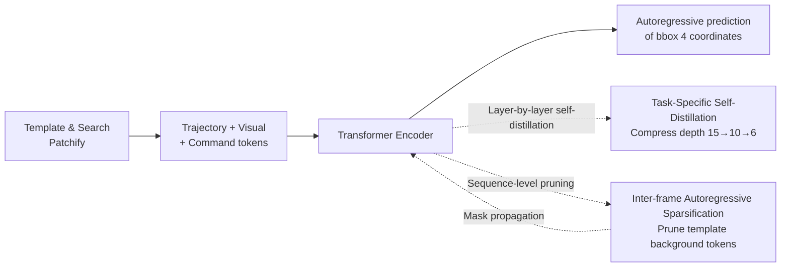

# FARTrack: Fast Autoregressive Visual Tracking with High Performance

**Conference**: ICLR 2026  
**OpenReview**: [https://openreview.net/forum?id=lq7Zfr8kAS](https://openreview.net/forum?id=lq7Zfr8kAS)  
**Code**: [https://github.com/MIV-XJTU/FARTrack](https://github.com/MIV-XJTU/FARTrack)  
**Area**: Visual Object Tracking / Efficient Models  
**Keywords**: Visual Tracking, Autoregressive, Self-distillation, Token Sparsification, Real-time Tracking, ViT  

## TL;DR
FARTrack "slims down" the autoregressive generative tracking framework of the ARTrack series. It utilizes **Task-Specific Self-Distillation** to compress model depth layer-by-layer and **Inter-frame Autoregressive Sparsification** to prune redundant background tokens in templates. Achieving 70.6% AO on GOT-10k while reaching speeds of 343 FPS on GPU and 121 FPS on CPU, it balances high performance with real-time efficiency.

## Background & Motivation
**Background**: Visual Object Tracking (VOT) aims to continuously localize arbitrary targets in video sequences, with speed and accuracy as the two core metrics. The ARTrack series models target trajectories as discrete token sequences and uses a Transformer Encoder to predict coordinates autoregressively. Due to its emphasis on the temporal nature of trajectories, it achieves high accuracy; however, it suffers from "deep layers, many parameters, and high bandwidth requirements," making it slow on edge devices.

**Limitations of Prior Work**: Existing mainstream approaches to balance speed and accuracy have major flaws. One is **cross-layer distillation**, where a shallow student mimics the visual features of a deep teacher—but this relies on **manually specified teacher-student layer correspondences**. Without a prior, such manual pairing disrupts the hierarchical structure of feature extraction, and the distillation target focuses on current-frame visual features, losing the temporal information of the trajectory sequence. The second is **runtime token sparsification**, which gradually discards unimportant tokens during inference—but the process of "deciding which tokens to discard" incurs additional computational cost, actually slowing down the speed, and only optimizes the current frame without reaching a temporal global optimum.

**Key Challenge**: How to maintain the autoregressive framework's ability to characterize temporal information while slimming down a deep, heavy model and pruning template redundancy without introducing additional runtime overhead.

**Goal**: Propose a fast and strong multi-template autoregressive tracking framework that executes efficiently across GPU/CPU/NPU.

**Key Insight**: **Self-distillation replaces cross-layer distillation + sequence-level sparsification replaces runtime sparsification**. Distillation is performed only as layer-by-layer self-distillation on "task-specific tokens (trajectory sequences)," allowing adjacent layers to serve as teacher/student to avoid manual pairing while preserving temporal info. Sparsification is designed as sequence-level post-processing in autoregressive propagation, where one decision is propagated to all subsequent frames with zero additional runtime cost.

## Method

### Overall Architecture
FARTrack follows the generative base of ARTrack: it converts all templates and search images into patches, projects them into tokens, and uses a shared vocabulary to map cross-frame target positions into a unified coordinate system to form **trajectory tokens**. These are concatenated with visual tokens and four **command tokens** (representing the four coordinates of the predicted bbox) and fed into a Transformer Encoder, where preceding trajectory tokens autoregressively drive the generation of subsequent coordinates. To improve accuracy, a **multi-template** design is adopted with a linear update strategy, ensuring the updated template set always contains the first and previous frames to prevent temporal loss during occlusion or disappearance. Two orthogonal modules are added to this base: Task-Specific Self-Distillation for "compressing layers and reducing depth," and Inter-frame Autoregressive Sparsification for "pruning template background."

### Key Designs

**1. Task-Specific Self-Distillation: Adjacent layers serve as teacher and student, allowing trajectory temporal info to "backflow" and slim the model.** Cross-layer distillation requires manual assignment of student to teacher layers; mismatching disrupts the hierarchy. FARTrack instead makes **layer n-1 the student and layer n the teacher**, establishing a layer-by-layer self-distillation chain to naturally avoid manual pairing. The distillation target is not the entire visual feature but specifically the **task-specific tokens** representing the trajectory sequence: the student layer fits the trajectory sequence features of the teacher layer by minimizing KL divergence. This allows temporal information to propagate backward through the hierarchy, enabling the model to be distilled to a very shallow depth (15 layers → 10 → 6) with negligible accuracy loss. Ablations comparing this to the deep-to-shallow manual deletion of MixFormerV2 (10 layers deleting [0,3,6,9,12]) show that layer-by-layer achieved 69.9% AO vs. 67.8% at 10 layers, validating the value of "self-pairing" in avoiding semantic mismatch.

**2. Inter-frame Autoregressive Sparsification: Template pruning as a sequence-level single decision with autoregressive propagation.** Template images contain persistent background and noise alongside the target. After the attention layer computation, FARTrack calculates the **attention weights of template tokens relative to search tokens and the four command tokens**. The former reflects the correlation between the template and search area, while the latter reflects the correlation with predicted coordinates. These weight sets are summed, and tokens with the highest weights are kept according to a preset retention rate to obtain a template token mask (default 75% in the paper). Crucially, the sparsification result calculated for the current frame is **saved and propagated to subsequent frames in an autoregressive manner**, learning a "temporally global optimal" strategy rather than recalculating per frame. This eliminates the extra overhead of runtime sparsification, resulting in higher speed and more stable performance. One detail is that masked tokens during training are excluded from LayerNorm statistics (only normalizing valid tokens) to avoid statistical shift; during inference, LayerNorm is applied to all tokens as usual since template sparsification is pre-completed.

**3. Loss & Training: Three-phase training + composite loss.** Training follows three steps: first, frame-level pre-training on COCO2017; second, task-specific self-distillation to slim the model; and third, inter-frame autoregressive sparsification to further increase speed. It maintains the frame-level + sequence-level training paradigm of ARTrack. The total loss is $\mathcal{L} = \mathcal{L}_{CE} + \lambda_1 \mathcal{L}_{SIoU} + \lambda_2 \mathcal{L}_{KL}$, where $\mathcal{L}_{CE}$ is the cross-entropy of coordinate tokens, $\mathcal{L}_{SIoU}$ characterizes the spatial correlation between predicted and ground truth boxes using SIoU loss, and $\mathcal{L}_{KL}$ is the KL divergence for self-distillation. Ablations show that both trajectory sequence loss ($\mathcal{L}_{traj}=\mathcal{L}_{CE}+\mathcal{L}_{SIoU}$) and KL loss are indispensable: removing the former leads to deep feature degradation, while removing the latter causes shallow feature "collapse," resulting in a catastrophic drop in tracking ability.

## Key Experimental Results

### Main Results
Comparison with SOTA efficient trackers on GOT-10k / TrackingNet / LaSOT (higher FPS is faster, higher AO/AUC is more accurate):

| Method | GPU FPS | CPU FPS | GOT-10k AO(%) | TrackingNet AUC(%) | LaSOT AUC(%) |
|------|---------|---------|---------------|--------------------|--------------|
| HiT-Base | 116 | 30 | 64.0 | 80.0 | 64.6 |
| MixformerV2 | 133 | 31 | 61.9 | 75.8 | 60.6 |
| PromptVT | 104 | 30 | 68.2 | 78.0 | 63.7 |
| AsymTrack-T | 145 | 55 | 62.3 | 76.2 | 60.8 |
| AsymTrack-B | 135 | 32 | 67.7 | 80.0 | 64.7 |
| **FARTrackpico** | **343** | **121** | 62.8 | 75.6 | 58.6 |
| **FARTracknano** | 210 | 77 | 69.9 | 79.1 | 61.3 |
| **FARTracktiny** | 135 | 53 | **70.6** | **80.7** | 63.2 |

- FARTracktiny (15 layers) achieves 70.6% AO, outperforming AsymTrack-B by 2.9% with similar GPU speed and 53 FPS on CPU.
- FARTrackpico (distilled to 6 layers) achieves 62.8% AO, 0.9% higher than MixFormerV2-S, but with nearly 3x GPU speed and nearly 4x CPU speed.

Model variants (ViT-Tiny backbone, input [112,224], 5 templates):

| Variant | Layers | MACs(G) | Params(M) |
|------|------|---------|-----------|
| FARTracktiny | 15 | 2.65 | 6.82 |
| FARTracknano | 10 | 1.78 | 4.59 |
| FARTrackpico | 6 | 1.08 | 2.81 |

### Ablation Study
Distillation & Sparsification methods (GOT-10k):

| Experiment | Configuration | AO(%) | Notes |
|------|------|-------|------|
| Distillation | layer-by-layer (10 layers) | **69.9** | Ours |
| Distillation | deep-to-shallow (10 layers) | 67.8 | MixFormerV2 manual deletion |
| Sparsification | Sequence-level (Ours) | **70.6** | 2.65G MACs / GPU 135 |
| Sparsification | Runtime | 69.5 | 3.14G MACs / GPU 114 (Slower & Worse) |

Token retention rate sensitivity (GOT-10k):

| Retention Rate | MACs(G) | CPU FPS | GPU FPS | AO(%) |
|--------|---------|---------|---------|-------|
| 100% | 2.99 | 49 | 128 | 70.0 |
| **75%** | 2.65 | 53 | 135 | **70.6** |
| 50% | 2.35 | 56 | 139 | 68.3 |
| 25% | 2.01 | 58 | 140 | 67.3 |
| 10% | 1.82 | 63 | 141 | 62.3 |

### Key Findings
- **75% is the sweet spot**: Pruning 25% of template tokens not only maintains but increases AO from 70.0% (at 100%) to 70.6%, indicating that background noise was effectively removed; significant performance drops only begin at 50% and below.
- **Sequence-level sparsification outperforms runtime sparsification**: It has lower MACs (2.65G vs. 3.14G), higher GPU speed (135 vs. 114), and higher AO (70.6 vs. 69.5), confirming the dual benefits of "eliminating runtime decision overhead + achieving temporal global optimality."
- **Distillation only works on trajectories**: Ablations show that directly distilling search/template features or joint distillation of visual features disrupts the hierarchy and drops performance; only trajectory sequences, due to their autoregressive nature, allow knowledge to flow smoothly from deep to shallow layers.
- **Consistent cross-device speedup**: FARTrackpico achieves 101 FPS on NPU (Ascend 310B), proving that layer compression and sparsification provide acceleration regardless of hardware architecture.

## Highlights & Insights
- **Alignment of "Compression" and "Pruning" with the temporal nature of autoregression**: Self-distillation only affects trajectory tokens, and sparsification results propagate autoregressively across frames. Both modules serve the primary goal of "preserving temporal information" rather than being disconnected engineering tricks.
- **Ingenuity of "Self-pairing" in self-distillation**: Making adjacent layers teacher/student pairs avoids the most challenging manual layer alignment problem in cross-layer distillation, eliminating the "performance killer" of semantic mismatch.
- **Zero-cost sparsification as post-processing**: Traditional sparsification repeatedly calculates "what to discard" during inference; FARTrack shifts this to the training phase via a fixed mask learned for inference, resolving the paradox of "spending computation to save computation."
- **Single framework with three variants**: By varying distillation layers (15/10/6), the model can shift from a high-accuracy mode to an ultra-fast mode, allowing deployment flexibilty based on device capacity.

## Limitations & Future Work
- **Accuracy-speed trade-off**: The ultra-fast pico variant (343 FPS) has a significantly lower AO (62.8%) than the tiny variant (70.6%). On LaSOT long-term tracking, pico's AUC is only 58.6%, indicating decreased long-term robustness under extreme compression.
- **Fixed retention rate**: The 75% rate is a global value tuned on GOT-10k. In scenarios with extreme target size variations (tiny vs. large objects), a fixed rate may not be optimal, suggesting adaptive retention rates as a future direction.
- **Dependence on ARTrack base**: The method is essentially an efficient transformation of ARTrack/ARTrackV2; framework novelty is constrained by the original generative paradigm. On VastTrack, the tiny variant only matches MixFormerV2-B, leaving room for improvement in large-scale category generalization.
- **Multi-stage training**: The three-phase serial training process is lengthy; whether end-to-end joint optimization can provide further improvements remains to be verified.

## Related Work & Insights
- **ARTrack / ARTrackV2** (Direct predecessors of autoregressive generative tracking): Modeled trajectories as discrete sequences and used shared vocabularies for prediction. FARTrack inherits their temporal modeling while solving deployment bottlenecks.
- **MixFormerV2 / AVTrack** (Cross-layer distillation trackers): Represent the deep-to-shallow distillation route using manual layer pairing. FARTrack proves that "self-pairing" is superior.
- **DynamicViT / OSTrack** (Token sparsification): The former uses lightweight predictors to prune tokens, the latter removes background regions early; both are runtime methods. FARTrack evolves this into sequence-level post-processing.
- **Insight**: For any "autoregressive/temporal-sensitive" efficiency task, rather than compressing visual features, it is better to align compression/pruning decisions with the temporal nature of the task. Propagating info along the model structure or frame sequence typically yields greater speedups with fewer performance drops.

## Rating
- **Novelty**: ⭐⭐⭐⭐ —— Both the "adjacent-layer self-pairing" distillation and "sequence-level autoregressive propagation" sparsification directly address structural flaws in existing routes.
- **Experimental Thoroughness**: ⭐⭐⭐⭐ —— Tested on 7 benchmarks with three variants across GPU/CPU/NPU. Extensive ablations on distillation targets, losses, retention rates, and sparsification methods.
- **Writing Quality**: ⭐⭐⭐⭐ —— Logic from motivation to method and experiment is smooth. Illustrations are effective.
- **Value**: ⭐⭐⭐⭐ —— High demand for real-time tracking on edge devices. 343 FPS GPU / 121 FPS CPU is highly practical; offers methodological insights for efficient autoregressive models.

<!-- RELATED:START -->

## Related Papers

- [\[CVPR 2026\] Adaptive Capacity Autoregressive Visual Tracking](../../CVPR2026/video_understanding/adaptive_capacity_autoregressive_visual_tracking.md)
- [\[CVPR 2026\] SpikeTrack: High-performance and Energy-efficient Event-Based Object Tracking with Spiking Neural Network](../../CVPR2026/video_understanding/spiketrack_high-performance_and_energy-efficient_event-based_object_tracking_wit.md)
- [\[CVPR 2026\] EVATok: Adaptive Length Video Tokenization for Efficient Visual Autoregressive Generation](../../CVPR2026/video_understanding/evatok_adaptive_length_video_tokenization_for_eff.md)
- [\[CVPR 2026\] Drift-Resilient Temporal Priors for Visual Tracking](../../CVPR2026/video_understanding/drift-resilient_temporal_priors_for_visual_tracking.md)
- [\[ICML 2026\] Unified Multimodal Visual Tracking with Dual Mixture-of-Experts](../../ICML2026/video_understanding/unified_multimodal_visual_tracking_with_dual_mixture-of-experts.md)

<!-- RELATED:END -->
