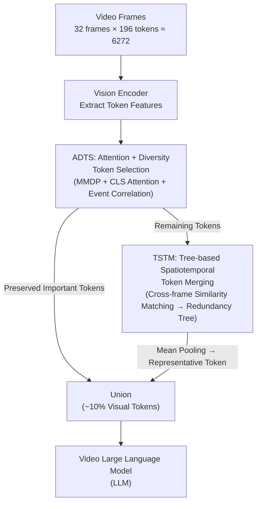

# FlashVID: Efficient Video Large Language Models via Training-free Tree-Based Spatiotemporal Token Merging

**Conference**: ICLR 2026 Oral  
**arXiv**: [2602.08024](https://arxiv.org/abs/2602.08024)  
**Code**: [https://github.com/Fanziyang-v/FlashVID](https://github.com/Fanziyang-v/FlashVID)  
**Area**: Video Understanding / LLM Efficiency / Multimodal VLM  
**Keywords**: Visual Token Compression, Spatiotemporal Redundancy, Token Merging, Video Large Language Models, Training-free Acceleration

## TL;DR
FlashVID is proposed as a training-free inference acceleration framework for Video Large Language Models (VLLMs). By jointly modeling spatial and temporal redundancy through Tree-based Spatiotemporal Token Merging (TSTM), it maintains 99.1% of LLaVA-OneVision's performance while retaining only 10% of visual tokens. Furthermore, it enables a 10x increase in input frame capacity for Qwen2.5-VL.

## Background & Motivation

**Background**: Video Large Language Models (VLLMs) demonstrate superior performance in video understanding tasks but require processing a massive number of visual tokens (e.g., 32 frames × 196 tokens/frame = 6272 tokens). Since attention computational complexity scales quadratically with sequence length, inference overhead is substantial.

**Limitations of Prior Work**: Existing acceleration methods (FastV, VisionZip, PruneVID) typically compress spatial and temporal redundancies independently, overlooking the intrinsic coupling of spatiotemporal relationships. Specifically, Temporal Token Merging (TTM) assumes that semantically similar tokens in adjacent frames reside at the same spatial coordinates, which is violated by object movement, deformation, and scaling in videos.

**Key Challenge**: The fixed spatial correspondence of TTM does not hold in dynamic videos—the most relevant visual features in adjacent frames may not occupy the same spatial position. Forced merging introduces noise and distorts video representations.

**Goal**: How to jointly model spatial and temporal redundancy for efficient compression without training, while simultaneously adapting to the dynamic nature of video?

**Key Insight**: Spatial and temporal redundancies are coupled (redundant regions in one frame often persist across multiple frames), and temporal redundancy is not bound to fixed spatial locations.

**Core Idea**: Replace fixed-coordinate inter-frame token correspondence with a hierarchical spatiotemporal redundancy tree, matching the most similar tokens rather than those in identical positions for merging.

## Method

### Overall Architecture
FlashVID addresses the inference bottleneck caused by long sequences of visual tokens in video VLLMs (e.g., ~6272 tokens for 32 frames). It implements a training-free compression step before tokens enter the LLM, consisting of two modules: first, ADTS selects a small subset of "important and non-redundant" tokens to be preserved exactly; second, the remaining majority of tokens enter TSTM to find semantically similar counterparts across frames, clustering into redundancy trees where each tree collapses into a single representative token. Finally, the "preserved important tokens" and "aggregated representative tokens" are concatenated and fed into the LLM. These two modules provide complementary synergy by selecting what should stay and compressing what should be merged.

### Key Designs

**1. Attention + Diversity Token Selection (ADTS): Identifying Representative Tokens per Frame**

ADTS is placed at the beginning of the pipeline because constructing redundancy trees directly from raw video features might allow noisy or low-information tokens to dominate the trees, causing critical visual information to be lost. ADTS filters out "tokens that must be preserved" in each frame. It models token selection as a Max-Min Diversity Problem (MMDP) solved on the cosine distance matrix $D^{(f)}$ of each frame, aiming to select a subset where tokens are maximally dispersed to cover diverse features.

To prevent missing high-information tokens, ADTS incorporates two calibration terms: the CLS attention weights $A_{[CLS]}$ (marking tokens most attended by the vision encoder) and event correlation $\bar{S}_e$ (calculated as the correlation between each token and the frame-level embedding obtained via global average pooling). The final subset $\mathcal{I}=\text{MMDP}(D, A_{[CLS]}, \bar{S}_e)$ ensures broad coverage without missing key information. Ablation studies confirm that ADTS significantly outperforms selection based solely on attention (ATS) or diversity (DTS).

**2. Tree-based Spatiotemporal Token Merging (TSTM): Global Similarity Matching**

Remaining tokens after ADTS are processed by TSTM. This step addresses the flaw in existing TTM methods which assume semantically similar tokens in adjacent frames share spatial positions. In dynamic scenes, features shift, and position-based merging introduces noise.

TSTM allows tokens to match freely across space: it calculates a cosine similarity matrix $S^{(f)}$ between tokens in adjacent frames. Each token is connected to the **most similar token in the previous frame** if the similarity exceeds a threshold $T_\tau$. These edges progressively grow into cross-frame redundancy trees. All tokens within a single tree are aggregated into one representative token via mean pooling. This approach naturally absorbs displacement caused by object motion. Experiments shows that TSTM merges more tokens than TTM at the same threshold while maintaining higher average intra-cluster similarity.

### Mechanism Example
Processing a 32-frame input for LLaVA-OneVision (approx. 6272 tokens) with a 10% target retention (approx. 627 tokens): 
1. ADTS solves the MMDP with CLS and event calibration per frame to select the most representative "preserved" tokens. 
2. Remaining tokens enter TSTM, forming redundancy trees across adjacent frames via similarity-based matching (exceeding $T_\tau$). Each tree collapses into one token. 
3. The union of preserved tokens and tree-aggregated tokens is sent to the LLM. 
A redundant background region persisting across frames is collapsed into one token, while a moving foreground object is either tracked via TSTM's free matching or preserved by ADTS, preventing erroneous merging due to position shifts.

### Loss & Training
The framework requires no training and serves as a plug-and-play module directly embedded into the inference workflow of existing VLLMs.

## Key Experimental Results

### Main Results
Average performance across 5 video understanding benchmarks using LLaVA-OneVision (32 frames):

| Method | Retention Rate | VideoMME | EgoSchema | LongVideoBench | MVBench | Average | Relative Accuracy |
|--------|----------------|----------|-----------|----------------|---------|---------|-------------------|
| Vanilla | 100% | 58.5 | 60.3 | 56.6 | 58.3 | 58.4 | 100.0% |
| FastV | 10% | 51.5 | 51.2 | 52.3 | 52.3 | 51.8 | 88.7% |
| VisionZip | 10% | 51.6 | 55.6 | 50.1 | 50.3 | 51.9 | 88.9% |
| FastVID | 10% | 55.5 | 56.1 | 55.5 | 57.7 | 56.2 | 96.2% |
| **FlashVID** | **10%** | **57.2** | **59.5** | **56.0** | **57.7** | **57.9** | **99.1%** |

### Qwen2.5-VL Frame Expansion Experiment

| Setting | Frames | VideoMME | MLVU | Gain |
|---------|--------|----------|------|---------|
| Vanilla | 16 | 65.7 | 67.6 | baseline |
| FlashVID | 160 | 69.9 | 74.5 | +8.6% |

### Ablation Study

| Configuration | VideoMME | EgoSchema | Average |
|---------------|----------|-----------|---------|
| Full FlashVID (ADTS+TSTM) | 57.2 | 59.5 | 57.9 |
| w/o TSTM (ADTS only) | 56.2 | 58.0 | 56.7 |
| w/o ADTS (TSTM only) | 56.5 | 59.1 | 57.0 |
| TTM replacing TSTM | 55.5 | 57.8 | 56.5 |

### Key Findings
- TSTM is the primary contributor, providing a ~1.2 point improvement over ADTS alone.
- Replacing TSTM with TTM leads to a significant performance drop, validating the importance of dynamic spatial correspondence.
- FlashVID maintains 99.1% performance at a 10% token retention rate, significantly outperforming FastV (88.7%) and VisionZip (88.9%).
- On Qwen2.5-VL, increasing input frames 10x yields an 8.6% performance gain under the same computational budget.

## Highlights & Insights
- **Tree-based Dynamic Matching**: The core insight is simple yet effective—related tokens in adjacent frames are not at the same position. Replacing fixed matching with global similarity matching is a transferable concept for any cross-frame correspondence task.
- **Training-free and Plug-and-play**: No retraining is required, making it adaptable to any VLLM with high practical engineering value.
- **Frame Expansion Application**: By "exchanging" saved computation for more input frames, the efficiency gain is cleverly converted into a performance capability boost.

## Limitations & Future Work
- The merging threshold is a hyperparameter; optimal thresholds likely vary by video, suggesting a need for adaptive threshold strategies.
- For ultra-long videos or high-resolution inputs, the cost of constructing similarity matrices in TSTM may become non-negligible.
- Compression is limited to the inference phase only; training-time efficiency was not addressed.
- Variations in compression effectiveness between high-redundancy (static) and low-redundancy (highly dynamic) scenes require further analysis.

## Related Work & Insights
- **vs FastV (Chen et al., 2024)**: FastV prunes via text-to-visual attention within the LLM (Inner-LLM); FlashVID utilizes a hybrid strategy.
- **vs PruneVID (Huang et al., 2025)**: PruneVID performs spatiotemporal merging but relies on fixed-position TTM; FlashVID employs dynamic matching.
- **vs ToMe (Bolya et al., 2023)**: While ToMe pioneered image token merging, FlashVID extends this to the video spatiotemporal domain.

## Rating
- Novelty: ⭐⭐⭐⭐ The tree-based spatiotemporal merging is elegant, though the framework combines some existing components.
- Experimental Thoroughness: ⭐⭐⭐⭐⭐ Comprehensive evaluation across 3 VLLMs, 5 benchmarks, and multiple compression ratios.
- Writing Quality: ⭐⭐⭐⭐ Clear motivation, intuitive diagrams, and complete algorithmic descriptions.
- Value: ⭐⭐⭐⭐⭐ High practical utility due to training-free, plug-and-play nature with minimal performance loss.

<!-- RELATED:START -->

## Related Papers

- [\[CVPR 2026\] Token Reduction via Local and Global Contexts Optimization for Efficient Video Large Language Models](../../CVPR2026/video_understanding/token_reduction_via_local_and_global_contexts_optimization_for_efficient_video_l.md)
- [\[ICML 2026\] OmniSIFT: Modality-Asymmetric Token Compression for Efficient Omni-modal Large Language Models](../../ICML2026/video_understanding/omnisift_modality-asymmetric_token_compression_for_efficient_omni-modal_large_la.md)
- [\[ICLR 2026\] LLaVAction: Evaluating and Training Multi-modal Large Language Models for Action Understanding](llavaction_evaluating_and_training_multi-modal_large_language_models_for_action_.md)
- [\[CVPR 2026\] Unified Spatiotemporal Token Compression for Video-LLMs at Ultra-Low Retention](../../CVPR2026/video_understanding/unified_spatiotemporal_token_compression_for_video-llms_at_ultra-low_retention.md)
- [\[ICLR 2026\] A Training-Free Framework for Long Video Understanding via Video-Query-Options Similarity](a_training-free_framework_for_long_video_understanding_via_video-query-options_s.md)

<!-- RELATED:END -->
