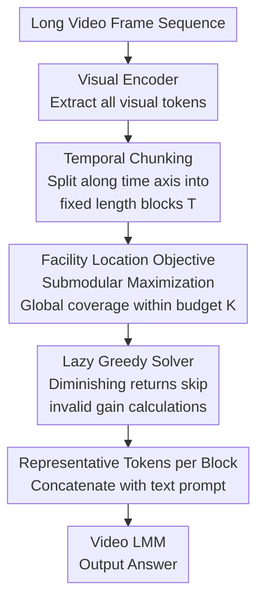

# FLoC: Facility Location-Based Efficient Visual Token Compression for Long Video Understanding

**Conference**: ICLR 2026  
**arXiv**: [2511.00141](https://arxiv.org/abs/2511.00141)  
**Code**: None  
**Area**: Video Understanding / Visual Token Compression  
**Keywords**: Long Video Understanding, Token Compression, Facility Location, Submodular Optimization, Training-free

## TL;DR

Ours proposes FLoC, a visual token compression framework based on the facility location function. By employing submodular optimization, it rapidly selects a subset of tokens that are both representative and diverse under a given budget. FLoC achieves training-free, model-agnostic, and query-independent token compression for long video understanding.

## Background & Motivation

**Visual Token Explosion in Long Videos**: As video length increases, the number of visual tokens grows exponentially, far exceeding the context window limits of Large Multimodal Models (LMMs) (typically 4K-32K tokens). This severely restricts long video understanding capabilities.

**Limitations of Prior Work**:
   - Sampling/pooling methods ignore semantic importance and discard information indiscriminately.
   - Clustering methods (e.g., k-means) primarily select representative elements from dense regions, easily missing sparse but critical tokens (e.g., small objects, detailed text).
   - Query-aware methods require prior knowledge of the query, lacking flexibility for general scenarios and necessitating re-compression for every query.
   - Trainable methods depend on specific model architectures and large amounts of annotated data.

**Key Challenge (Representativeness vs. Diversity)**: While many tokens are redundant in simple scenes, critical but sparse visual cues (e.g., a "key" token in a "finding keys" scenario) appear infrequently yet are vital. There is a need to ensure both representativeness and diversity simultaneously.

**Goal**: Applications like CCTV surveillance, smart glasses, and mobile robots require efficient, general, and plug-and-play compression solutions.

## Method

### Overall Architecture

FLoC aims to solve the visual token explosion problem when feeding long videos into Video-LMMs: given a token budget $K$, it selects a representative subset that covers the entire scene without missing sparse critical cues. The entire pipeline relies solely on the cosine similarity between token embeddings, making it fully decoupled from upstream visual encoders and downstream LMMs. Consequently, it is training-free, model-agnostic, and query-independent, serving as a plug-and-play module between any encoder and any LMM.

**Mechanism**: Video frames are first processed by a visual encoder to extract all visual tokens. These tokens are divided into temporal chunks of fixed length $T$ along the time axis. Within each chunk, selecting which tokens to keep is formulated as a facility location submodular maximization objective. This is solved via a lazy greedy algorithm to find a representative subset within budget $K$. Finally, the selected tokens from each chunk are concatenated with the text prompt and fed into the Video-LMM.

The "zero requirements" (training-free, model-agnostic, query-independent) constitute the direct practical value of FLoC while simultaneously constraining the design of each step (must use embedding similarity and run at inference time).

### Key Designs

**1. Temporal Chunking: Narrowing Search Space and Enabling Streaming**

In long videos, distant frames are often unrelated. Computing a global selection over the entire video is computationally wasteful and destroys temporal locality. FLoC avoids global selection by first cutting tokens into small chunks of fixed length $T$ along the temporal axis. Submodular optimization is then performed independently within each chunk. This reduces the candidate size for each optimization step, significantly lowering computation. Furthermore, independent processing within chunks fits streaming scenarios naturally; tokens in the buffer can be compressed and sent as soon as a chunk is full without waiting for the entire video. $T=32$ is used as a robust default.

**2. Facility Location Objective: Balancing Representativeness and Diversity**

Clustering methods (like k-means) tend to assign budgets to elements in dense regions, often drowning out sparse but critical cues. FLoC uses the facility location objective to formulate the selection as a submodular maximization problem under budget constraints: $S^* = \arg\max_{S \subseteq V,\, |S| \leq K} f(S)$, where $f(S) = \sum_{v \in V} \max_{u \in S} \mathrm{sim}(v, u)$, with $\mathrm{sim}$ representing cosine similarity. This objective finds a representative in the chosen subset $S$ for every original token $v$. The sum is maximized only when $S$ covers all areas of the scene, including sparse ones, naturally balancing representativeness (covering all tokens) and diversity (avoiding redundant neighbors). Submodularity ensures a greedy solution with a $(1-1/e) \approx 0.632$ approximation guarantee.

**3. Lazy Greedy Solver: Skipping Computations via Diminishing Returns**

Solving the facility location objective exactly is NP-hard. A naive greedy approach requires recalculating marginal gains for all candidates every time a token is added, resulting in $O(nK)$ complexity, which is too slow for long videos. FLoC leverages the submodular property of diminishing marginal returns: for any $A \subseteq B \subseteq V$ and token $v$, the gain satisfies $f(A \cup \{v\}) - f(A) \geq f(B \cup \{v\}) - f(B)$. By maintaining a priority queue ordered by previous gain upper bounds, FLoC only recalculates the exact gain for the top candidate. If the recalculated value remains higher than the bounds of other candidates, it is guaranteed to be the optimal choice for the current step. This accelerates the process by an order of magnitude.

**4. Triple "Zero-Requirement": Training-free, Model-agnostic, and Query-independent**

The method relies purely on cosine similarity of embeddings, decoupling it from specific architectures. Since the compressed subset is query-independent, a video only needs to be compressed once to be reused for any subsequent questions, saving the overhead of repeated compression inherent in query-aware methods.

## Key Experimental Results

### Main Results

Comparison on Qwen2.5-VL-7B (Compression Ratio $2^{-3}$):

| Method | Video-MME | MLVU | LVB | EgoSchema | Average |
|------|-----------|------|-----|-----------|------|
| No Compression (ratio=1) | 66.33 | 70.31 | 60.51 | 61.40 | 64.64 |
| TS-LLaVA | 61.15 | 67.57 | 55.20 | 59.60 | 60.88 |
| LongVU | 62.19 | 66.61 | 55.42 | 59.40 | 60.91 |
| DyCoke | 62.11 | 67.53 | 55.12 | 59.60 | 61.09 |
| **FLoC (Ours)** | **63.33** | **68.81** | **58.12** | **60.00** | **62.57** |

On InternVL3-8B (Compression Ratio $2^{-3}$):

| Method | Video-MME | MLVU | LVB | EgoSchema | Average |
|------|-----------|------|-----|-----------|------|
| No Compression | 66.63 | 72.68 | 59.39 | 70.00 | 67.18 |
| LongVU | 64.70 | 69.50 | 55.35 | 69.20 | 64.69 |
| **FLoC (Ours)** | **64.93** | **71.57** | **56.69** | **69.40** | **65.65** |

### Ablation Study

Extended temporal input scenario (1 FPS, up to 7200 frames, Qwen2.5-VL-7B):

| Max Frames | Method | Video-MME | MLVU | LVB | Average |
|----------|------|-----------|------|-----|------|
| 768 | No Compression | 66.33 | 70.31 | 60.51 | 65.82 |
| 7200 | TS-LLaVA | 65.07 | 72.40 | 62.08 | 66.52 |
| 7200 | DyCoke | 65.78 | 71.30 | 62.98 | 66.69 |

FLoC maintains best performance at higher compression ratios ($2^{-4}$): average accuracy of 60.09% (Qwen2.5-VL), surpassing all baselines.

### Key Findings

1. **FLoC significantly outperforms clustering and other compression methods across all ratios**, with the most prominent advantage on LongVideoBench (58.12% vs 55.42% second best at 8x compression).
2. **Processing speed far exceeds traditional clustering**: FLoC is superior to k-means and spectral clustering in both accuracy and speed, often with lower processing time by an order of magnitude.
3. **Cross-model Generality**: Consistent leads across Qwen2.5-VL-7B, InternVL3-8B, Qwen2-VL, and LLaVA-Next-Video.
4. **Complementary to Extended Temporal Input**: Works effectively in 7200-frame scenarios, maintaining performance comparable to or better than no compression.
5. **Importance of Diversity**: Unlike clustering which favors dense regions, the facility location objective in FLoC ensures sparse but important tokens are preserved.

## Highlights & Insights

- **Introduction of Classical Combinatorial Optimization to Visual Token Compression**: Facility location functions have succeeded in document and video summarization; Ours applies them to LMM visual token selection with both theoretical guarantees and practical effectiveness.
- **Triple "Zero-Requirement" Design**: Training-free, model-agnostic, and query-independent features make FLoC one of the most deployable compression schemes.
- **Single Compression for Multiple Queries**: Unlike query-aware methods that re-compress for every query, FLoC only needs one compression pass to handle arbitrary subsequent questions, saving computation and VRAM.
- **Real-time Viability**: The acceleration from lazy greedy makes online compression for long videos possible.

## Limitations & Future Work

1. **Similarity-based selection might miss semantically important tokens with non-salient embeddings**: Facility location focuses on embedding space coverage rather than explicit semantics.
2. **Boundary Effects from Temporal Chunking**: Long-range temporal dependencies across chunks might be severed.
3. **Similarity Metric Selection**: Cosine similarity might not be optimal for all token types (objects, actions, text).
4. **Fixed Budget $K$**: Optimal compression ratios may vary based on video complexity; adaptive budget selection could offer improvements.
5. **Task Scope**: Primarily evaluated on QA tasks; performance on generative tasks (video captioning, summarization) remains to be verified.

## Related Work & Insights

- **TS-LLaVA / LongVU**: Methods based on temporal redundancy filtering—FLoC's diversity mechanism better preserves sparse critical information.
- **DyCoke**: Dynamic clustering compression—FLoC surpasses simple clustering via global coverage objectives in facility location.
- **PruneVid / Scissor**: Trainable compression—often performs worse than FLoC, suggesting that training-induced model bias might negatively impact generality.
- The submodular optimization approach can be extended to image token compression (high-res understanding) and multimodal retrieval.

## Rating

- **Novelty**: ⭐⭐⭐⭐ Clever cross-domain transfer of facility location to token compression, though lazy greedy is a classic algorithm.
- **Experimental Thoroughness**: ⭐⭐⭐⭐⭐ Comprehensive evaluation across 4 benchmarks, 4 models, various ratios, and detailed speed comparisons.
- **Writing Quality**: ⭐⭐⭐⭐ Clear problem definition and persuasive comparison with clustering methods.
- **Value**: ⭐⭐⭐⭐⭐ High practical value due to training-free and plug-and-play characteristics; significant contribution to the long video understanding community.

<!-- RELATED:START -->

## Related Papers

- [\[CVPR 2026\] StreamingTOM: Streaming Token Compression for Efficient Video Understanding](../../CVPR2026/video_understanding/streamingtom_streaming_token_compression_for_efficient_video_understanding.md)
- [\[ICLR 2026\] FOCUS: Efficient Keyframe Selection for Long Video Understanding](focus_efficient_keyframe_selection_for_long_video_understanding.md)
- [\[CVPR 2026\] An Efficient Token Compression Framework for Visual Object Tracking](../../CVPR2026/video_understanding/an_efficient_token_compression_framework_for_visual_object_tracking.md)
- [\[AAAI 2026\] APVR: Hour-Level Long Video Understanding with Adaptive Pivot Visual Information Retrieval](../../AAAI2026/video_understanding/apvr_hour-level_long_video_understanding_with_adaptive_pivot.md)
- [\[CVPR 2026\] EarlyTom: Early Token Compression Completes Fast Video Understanding](../../CVPR2026/video_understanding/earlytom_early_token_compression_completes_fast_video_understanding.md)

<!-- RELATED:END -->
