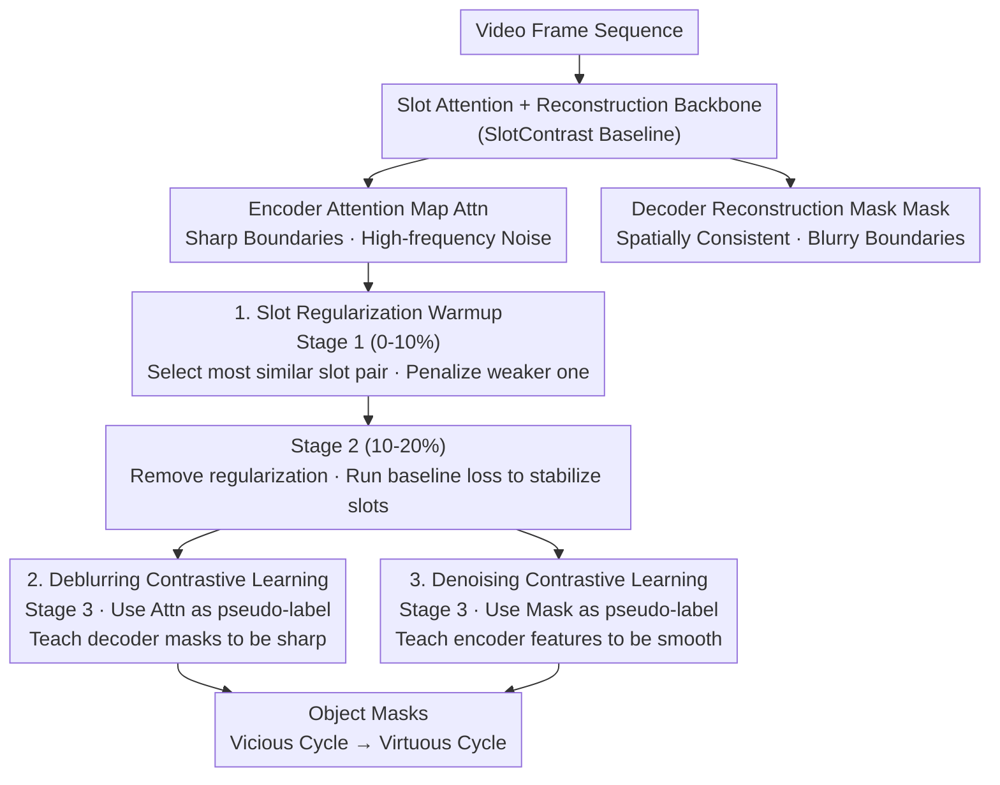

# From Vicious to Virtuous Cycles: Synergistic Representation Learning for Unsupervised Video Object-Centric Learning

**Conference**: ICLR 2026  
**arXiv**: [2602.03390](https://arxiv.org/abs/2602.03390)  
**Code**: [https://github.com/hynnsk/SRL](https://github.com/hynnsk/SRL)  
**Area**: Video Understanding / Self-supervised Learning / Object Discovery  
**Keywords**: Object-centric learning, slot attention, contrastive learning, encoder-decoder alignment, unsupervised segmentation

## TL;DR
This work identifies a vicious cycle in slot-based object-centric learning between the encoder (producing sharp but noisy attention maps) and the decoder (producing spatially consistent but blurry reconstruction masks). It proposes synergistic contrastive learning objectives and a slot regularization warmup strategy to transform this into a virtuous cycle, significantly improving object discovery performance on MOVi and YouTube-VIS.

## Background & Motivation

**Background**: Object-Centric Learning aims to decompose videos into independent object representations (slots) in an unsupervised manner. Mainstream methods are based on the slot attention + reconstruction paradigm. Recent works utilize DINOv2 features to enhance the quality of object segmentation.

**Limitations of Prior Work**: A vicious cycle exists between the encoder and the decoder: (a) the attention maps produced by the encoder (DINOv2) are sharp but contain high-frequency noise, leading to an ill-posed reconstruction task for the decoder, which can only produce blurry reconstruction masks; (b) the MSE reconstruction loss acts as a low-pass filter, and the gradients fed back to the encoder lack high-frequency information, failing to assist in denoising.

**Key Challenge**: The noise problem of the encoder and the blurriness problem of the decoder reinforce each other—"neither knows what the other is saying, yet they can only learn from each other."

**Goal**: How to break the vicious cycle between the encoder and decoder so that they improve each other rather than degrading each other?

**Key Insight**: Leverage the respective strengths of the encoder and decoder—the encoder's attention maps have sharp boundaries despite the noise, while the decoder's reconstruction masks are spatially consistent despite being blurry—and design cross-contrastive learning objectives to complement each other.

**Core Idea**: Use the decoder's spatially consistent masks to "denoise" the encoder attention, while using the encoder's sharp attention to "deblur" the decoder reconstruction, forming a virtuous cycle.

## Method

### Overall Architecture
SRL aims to break the vicious cycle between the encoder and decoder in slot-based learning. The encoder (DINOv2) provides sharp attention boundaries but carries high-frequency noise, while the decoder is forced into ill-posed reconstruction resulting in blurry masks, and the MSE loss filters out high-frequency information. Using the standard slot attention + reconstruction baseline (SlotContrast) as the backbone, SRL modifies only the training objectives without changing the network structure, allowing the encoder and decoder to use each other's strengths as pseudo-labels. This is implemented through a three-stage schedule: first, slot regularization warmup to specialize slots and avoid collapse; second, a transition period with only baseline loss to stabilize slots; and finally, bidirectional contrastive learning to turn the vicious cycle into a "you denoise me, I deblur you" virtuous cycle.

### Key Designs

**1. Slot Regularization Warmup: Let slots specialize individually to avoid overcrowding same objects**

The premise of contrastive learning is that different slots correspond to different objects. If two slots compete for the same object, the subsequent positive/negative sample partitioning becomes distorted. Slot collapse is a common issue in object-centric learning. In the first 10% of training (Stage 1), SRL iteratively identifies the slot pair $(i,j)$ with the highest cosine similarity. It then uses the KL divergence between their attention distributions and a uniform distribution to determine which is "less specialized" (closer to uniform implies it hasn't captured a specific object). Regularization is applied to the weaker slot's attention to push it away. This select-and-penalize process is repeated $M=\lfloor S/2 \rfloor$ times per step ($S$ is the number of slots), effectively tidying all slots in pairs and forcing them to disperse across different objects.

**2. Deblurring Contrastive Learning (Deblurring CL): Use sharp encoder attention as pseudo-labels to sharpen decoder masks**

Standard MSE focuses only on pixel reconstruction accuracy and lacks constraints on the spatial resolution of masks, resulting in blurry decoder masks. SRL leverages the sharp boundaries of encoder attention (despite its noise) to supervise the decoder in Stage 3. It constructs a three-level hierarchical contrastive objective: positive samples are the patch's own encoder-decoder pair, semi-positive samples are patches assigned to the same slot by the encoder attention, and negative samples are the remaining patches. This ranking-style contrastive loss pulls decoder features together within the same slot and pushes them apart across slots, directly optimizing mask discriminability instead of indirectly approximating it through reconstruction.

**3. Denoising Contrastive Learning (Denoising CL): Use spatially consistent decoder masks as pseudo-labels to smooth encoder features**

This objective is symmetric to Deblurring CL but in the opposite direction. While decoder masks are blurry, they are spatially consistent—they do not misinterpret isolated noise patches as foreground. This consistency suppresses the encoder's high-frequency noise. Activated also in Stage 3, its structure mirrors Deblurring CL: positive samples are chosen from Top-K neighbors in the DINOv2 feature space, semi-positive samples are patches assigned to the same slot by the decoder mask, and the same hierarchical contrastive loss is applied. Together, they allow the encoder and decoder to treat each other's strengths as "teachers."

### Loss & Training
The three-stage schedule corresponds to the activation of the components described above: Stage 1 (0–10%) performs only slot regularization warmup; Stage 2 (10–20%) removes regularization and runs baseline loss to stabilize slots; Stage 3 (20–100%) activates both deblurring and denoising contrastive losses simultaneously. The weights for both contrastive losses are set to 0.1.

## Key Experimental Results

### Main Results

| Method | MOVi-C FG-ARI | MOVi-C mBO | MOVi-E FG-ARI | YTVIS FG-ARI | YTVIS mBO |
|------|-------------|-----------|-------------|-------------|----------|
| STEVE | 36.1 | 26.5 | 50.6 | 15.0 | 19.1 |
| VideoSAUR | 64.8 | 38.9 | 73.9 | 28.9 | 26.3 |
| SlotContrast | 70.4 | 31.7 | 80.9 | 36.2 | 32.9 |
| **SRL (Ours)** | **74.3** | **34.5** | **81.9** | **42.9** | **35.6** |

### Ablation Study

| Deblurring CL | Denoising CL | Slot Reg. | FG-ARI | mBO |
|---------|--------|----------|--------|-----|
| - | - | - | 70.8 | 31.4 |
| Y | - | - | 70.0 | 33.2 |
| - | Y | - | 72.2 | 31.2 |
| - | - | Y | 70.7 | 35.1 |
| Y | Y | Y | **74.2** | **33.2** |

### Key Findings
- Compared to the SlotContrast baseline, FG-ARI on YouTube-VIS improved by 18.5% (36.2 -> 42.9), indicating gains beyond synthetic data.
- The three components are complementary—using Deblurring CL alone actually decreases FG-ARI (70.0 vs 70.8); it must be paired with Denoising CL or regularization.
- Slot regularization contributes most to mBO (31.4 -> 35.1), suggesting slot collapse is the primary cause of low mBO.
- In cross-dataset transfer to DAVIS 2017, Jaccard improved by 11.7 points.

## Highlights & Insights
- **Diagnosis of Vicious Cycles**: Clear identification of the causal feedback loop between encoder noise and decoder blurriness; this root-cause analysis is highly instructive.
- **Symmetric Design**: Deblurring and denoising are symmetric—utilizing each other's pseudo-labels for mutual learning. This "you help me denoise, I help you deblur" paradigm is elegant.
- **Three-stage Training Schedule**: Stabilizing slots before introducing contrastive learning prevents incorrect gradients caused by slot collapse in early training.
- **Transfer to Static Images**: Improvements observed on COCO demonstrate the method is not limited to video.

## Limitations & Future Work
- The addition of two hierarchical contrastive losses may increase computational overhead, though training time comparisons were not reported.
- The three-stage training introduces additional hyperparameters (stage ratios, regularization strength); sensitivity analysis shows some dependence on training ratios.
- In scenarios with extremely many objects (e.g., MOVi-E with 23 objects), the performance gain from slot regularization is limited.
- Pseudo-label quality directly affects contrastive learning; early-stage pseudo-labels may be inaccurate.

## Related Work & Insights
- **vs SlotContrast**: The direct baseline; SRL adds bidirectional contrastive learning and slot regularization.
- **vs VideoSAUR**: A pioneering work using DINO features for slots; SRL further addresses the noise issues in DINO features.
- **vs STEVE**: A slot method for pixel-space reconstruction; SRL's performance in feature space significantly exceeds it.

## Rating
- Novelty: ⭐⭐⭐⭐⭐ The diagnosis of the vicious cycle and the symmetric mutual learning design are profound.
- Experimental Thoroughness: ⭐⭐⭐⭐⭐ MOVi-C/E + YTVIS + DAVIS + COCO, with comprehensive ablations.
- Writing Quality: ⭐⭐⭐⭐⭐ The narrative of vicious/virtuous cycles is clear and persuasive.
- Value: ⭐⭐⭐⭐ Provides an effective methodology for self-supervised object discovery.

<!-- RELATED:START -->

## Related Papers

- [\[ICLR 2026\] UniTrack: Differentiable Graph Representation Learning for Multi-Object Tracking](unitrack_differentiable_graph_representation_learning_for_multi-object_tracking.md)
- [\[CVPR 2025\] Temporally Consistent Object-Centric Learning by Contrasting Slots](../../CVPR2025/video_understanding/temporally_consistent_object-centric_learning_by_contrasting_slots.md)
- [\[CVPR 2026\] Reconstruction-Guided Slot Curriculum: Addressing Object Over-Fragmentation in Video Object-Centric Learning](../../CVPR2026/video_understanding/reconstruction-guided_slot_curriculum_addressing_object_over-fragmentation_in_vi.md)
- [\[CVPR 2025\] H-MoRe: Learning Human-centric Motion Representation for Action Analysis](../../CVPR2025/video_understanding/h-more_learning_human-centric_motion_representation_for_action_analysis.md)
- [\[CVPR 2026\] Scene-Centric Unsupervised Video Panoptic Segmentation](../../CVPR2026/video_understanding/scene-centric_unsupervised_video_panoptic_segmentation.md)

<!-- RELATED:END -->
