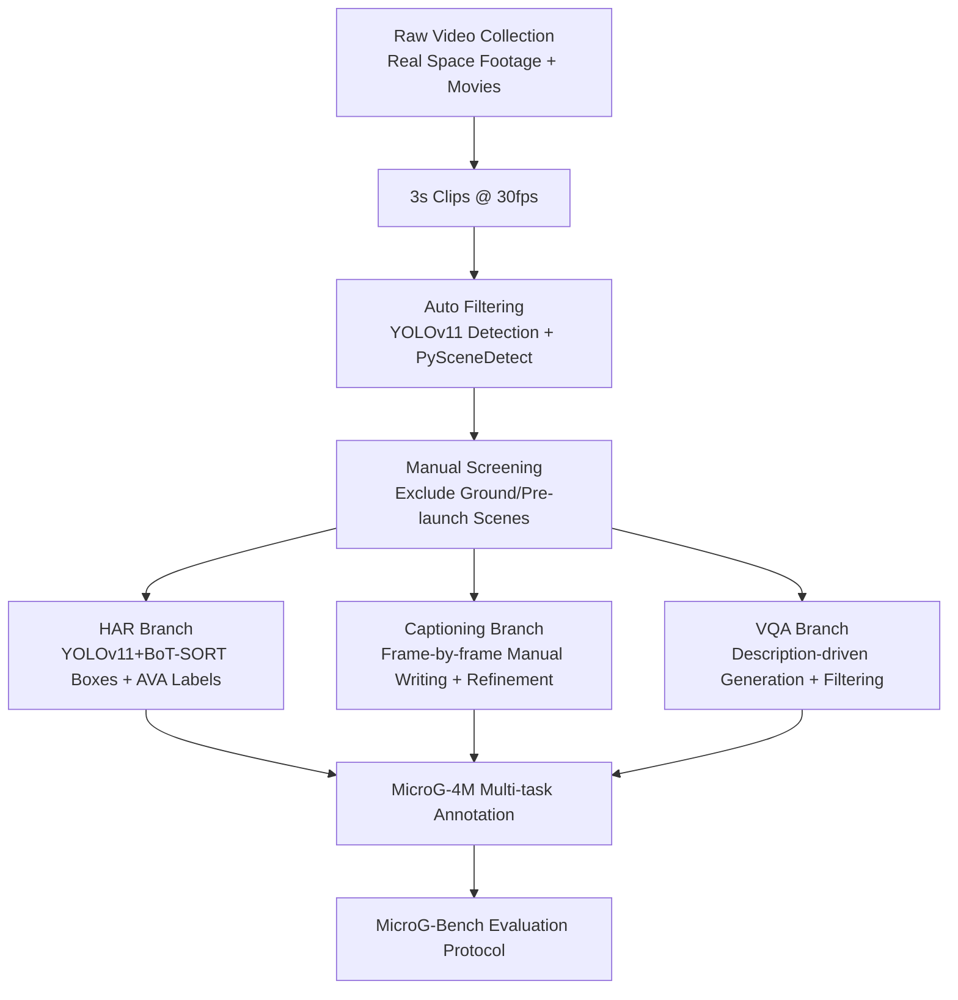

# Go Beyond Earth: Understanding Human Actions and Scenes in Microgravity Environments

**Conference**: ICLR 2026  
**OpenReview**: [https://openreview.net/forum?id=gygGCVXeh3](https://openreview.net/forum?id=gygGCVXeh3)  
**Code**: [https://github.com/lei-qi-233/MicroG-4M](https://github.com/lei-qi-233/MicroG-4M)  
**Area**: Video Understanding / Datasets & Benchmarks  
**Keywords**: Microgravity, Video Understanding, Action Recognition, Video Captioning, Visual Question Answering, Domain Shift Benchmark  

## TL;DR
This paper introduces **MicroG-4M**, the first video benchmark for spatial-temporal and semantic understanding of human activities in microgravity (zero-gravity space) environments. It contains 4,759 real/cinematic clips, 13,261 action annotations, 1,238 captions, and 7,000+ Q&A pairs, covering fine-grained action recognition, video captioning, and visual question answering. The proposed MicroG-Bench systematically quantifies the significant performance collapse of Earth-trained models in space scenarios.

## Background & Motivation
- **Background**: Video understanding (Action Recognition, Video Captioning, VQA) has achieved significant progress on large-scale benchmarks like Kinetics, AVA, and ActivityNet, becoming a core capability for intelligent human-robot collaboration. With long-term space station residence and the surge in future manned missions, intra-vehicular robots assisting astronauts to ensure safety and operational efficiency have become a practical necessity.
- **Limitations of Prior Work**: Almost all existing datasets are recorded under Earth's gravity, implying assumptions such as "gravity-aligned directional priors, reliable support surfaces, and Earth-based object dynamics." Microgravity completely breaks these assumptions—standing becomes direction-independent, movement relies on pulling/pushing structures rather than gait, and operations often involve releasing/grabbing floating objects, leading to severe degradation of Earth-trained HAR models in orbit.
- **Key Challenge**: Space-safety-critical applications urgently require robust video understanding, but there is **neither data in the microgravity domain nor diagnostic tools to measure "gravity-induced failure modes,"** making it impossible to fairly evaluate and improve space-adapted models.
- **Goal**: Construct the first microgravity video understanding benchmark supporting fine-grained multi-label action recognition, temporal video captioning, and visual question answering, providing standard partitions and evaluation protocols to quantify the Earth $\rightarrow$ Space domain gap.
- **Core Idea**: **[Dataset + Diagnostic Benchmark]** Collect clips from real mission recordings and high-fidelity space movies. Reuse the AVA action label system (keeping the label space unchanged for fair Earth $\rightarrow$ Space comparison) and overlay captions and Q&A pairs collaboratively annotated by humans and MLLMs. This turns the "collapse of ground models in weightlessness" into a quantifiable and comparable standardized ruler.

## Method

### Overall Architecture
MicroG-4M is a data engineering project rather than a new model; its contribution lies in an "acquisition $\rightarrow$ assembly $\rightarrow$ filtering $\rightarrow$ annotation $\rightarrow$ quality control" pipeline involving automation and human collaboration, alongside a multi-task evaluation protocol. The "4M" name summarizes four features: **Multi-source** (real mission footage + physically plausible movies), **Multimodal** (RGB + text annotations), **Multi-task** (HAR / Captioning / VQA), and **Microgravity**. The three sub-tasks share the same batch of 3-second clips, but captions and VQA are constrained to real microgravity content to ensure semantic fidelity.

### Key Designs

**1. Multi-source Collection and Purification: Filtering "True Weightlessness" from Noise.** Data is collected from public YouTube recordings of the ISS, Tiangong, intra-vehicular, and extra-vehicular activities, as well as selected high-fidelity space movies to expand scene diversity. Raw videos are cut into 3-second, 30fps clips for temporal consistency; short segments are discarded. Auto-filtering uses YOLOv11 for human detection and PySceneDetect for transition detection to remove empty or disjointed clips. Crucially, as a final step, **manual segment-by-segment review** excludes ground scenes (e.g., pre-launch prep, ground training) to ensure every clip clearly presents human activity under actual microgravity. This step is the foundation of the benchmark's "diagnostic value." Approximately 4,759 clips were finalized, primarily from real space station recordings.

**2. Microgravity Action Classification Reusing AVA Label Space: Enabling Fair Earth $\rightarrow$ Space Comparison.** The action taxonomy is adapted from AVA's 80 atomic actions—removing physically impossible actions (e.g., wading, ground-based motions), merging synonyms, and performing context-aware semantic fine-tuning to retain 50 actions. These are grouped into: Object Manipulation (4,986 annotations, 37.60%), Person Interaction (4,288, 32.34%), and Person Movement (3,987, 30.07%). Each 3-second clip is treated as a self-contained unit, with up to 5 visible or inferable action labels per detected individual. **Deliberately retaining AVA class names while re-anchoring their semantics to microgravity** allows for zero-shot transfer comparison from AVA to MicroG-4M without changing the label space, cleanly isolating "gravity domain differences" from "implementation differences." Box annotations are auto-generated via YOLOv11+BoT-SORT, totaling approximately 390,000 boxes and 13,261 action annotations (9,610 real + 3,651 simulated).

**3. Caption Annotation via Manual Writing + Aerospace Verification + MLLM Refinement: Ensuring Factual Fidelity.** 1,238 captions were written by annotators through frame-by-frame visual inspection (30fps). They describe not only core actions and objects but also explicitly encode unique visual features like astronaut identity, module layout, fine-grained hand-body-object interactions, equipment appearance, and orientations (e.g., helmet/suit status). Factual content was cross-verified against official crew lists, aerospace agency (NASA/CNSA/ESA) biographies, module diagrams, mission reports, and onboard video transcripts. MLLMs were then used to refine grammatical fluency and vocabulary diversity, with final validation by annotators. This "human-first, data-verified, MLLM-polished" sequence ensures semantic fidelity over mere fluency.

**4. Description-Driven Two-Stage VQA Generation and Filtering: Anchoring Answers to Visual Evidence.** VQA employs a two-stage generation and filtering pipeline anchored by captions. Given each refined caption, an MLLM generates candidate Q&A pairs covering standard Wh-questions, foreground vs. background, coarse vs. fine-grained actions, identity/location/equipment, and temporal/causal reasoning. An unanswerable question is optionally inserted for each clip. Filtering removes candidates relying on sound, latent intent, or non-visual cues. The remaining Q&As are ranked by the MLLM for consistency, fluency, and information value; annotators then review top-ranked pairs to remove hallucinations, rewrite prompts, and verify that all retained questions are either visually localizable or explicitly marked as "Not mentioned." Each clip ultimately retains 6 diverse Q&As, totaling 7,428 pairs.

## Key Experimental Results

### Main Results: Fine-Granular Action Recognition (After MicroG-4M Fine-tuning)
All models were pre-trained on Kinetics400 and then fine-tuned on MicroG-4M. Results show mAP peaking around 47% on the test set, far lower than ground training levels. Furthermore, **common rankings were inverted**—CNNs with Non-Local (NLN) modules lead in mAP/AUROC, suggesting that when movement lacks gravity consistency, local spatial encoding and structured receptive fields offer more advantages.

| Model | TC | Backbone | #Params(M) | Test mAP(%) | Test F1(%) | Test AUROC(%) |
|------|----|----------|-----------|------------|-----------|--------------|
| C2D NLN | 8x8 | R50 | 30.97 | 44.64 | 28.30 | 89.40 |
| I3D | 8x8 | R50 | 27.33 | 46.41 | 26.37 | 88.79 |
| I3D NLN | 8x8 | R50 | 34.68 | **47.12** | 28.07 | 88.52 |
| Slow | 4x16 | R50 | 31.74 | 46.37 | **28.72** | 88.30 |
| SlowFast | 8x8 | R50 | 33.76 | 43.02 | 22.63 | 88.51 |
| MViTv2 | 16x4 | S | 34.27 | 15.14 | 8.16 | 78.61 |
| X3D | 16x5 | L | 4.37 | 18.70 | 9.15 | 78.27 |

> Transformer-based models (MViT) and lightweight X3D lag significantly behind CNNs in this domain, further confirming the advantages of local encoding and the need for longer temporal windows under microgravity.

### Ablation Study: Isolating the Gravity Domain Gap (AVA Zero-shot Transfer)
Under matched AVA fine-tuning settings, AVA $\rightarrow$ MicroG-4M significantly underperforms AVA $\rightarrow$ JHMDB, cleanly isolating the gap driven by physics (weightlessness) rather than ordinary ground-based domain shifts.

| Model | TC | Backbone | Test Set | mAP(%) | AUROC(%) |
|------|----|----------|--------|--------|----------|
| SlowFast | 32×2 | R101 | JHMDB | **47.50** | 83.98 |
| SlowFast | 32×2 | R101 | MicroG-4M | **23.81** | 77.83 |
| Slow | 8×8 | R50 | JHMDB | 34.24 | 76.96 |
| Slow | 8×8 | R50 | MicroG-4M | 16.24 | 73.83 |

> For the same model, simply changing the test domain results in nearly halved mAP (47.50 $\rightarrow$ 23.81), proving that ground-based assumptions regarding orientation, support, and object dynamics are extremely fragile in weightlessness; naive fine-tuning cannot bridge this.

### Key Findings
- **Gravity Priors Cause Systematic Misjudgment**: Models trained on AVA often misjudge floating or inverted postures as "Bend/Bow" or "Sit," whereas MicroG-4M models correctly predict "Stand," reflecting a correction of gravity-induced bias.
- **More Frames Are Not Always Better**: Increasing sampling frames within a fixed 3-second window does not stably improve VQA—Gemini 1.5 Pro achieved top S-VQA using only 3 frames, suggesting that extracting semantically salient cues is more critical than temporal redundancy.
- **Decoupling of Lexical vs. Semantic Metrics**: Qwen2.5-VL scored only 0.65 on BLEU-4 but obtained the highest S-VQA in its class, reflecting that MicroG-4M questions often have multiple semantically equivalent but differently phrased answers.

## Highlights & Insights
- **First Microgravity Video Understanding Benchmark**: Fills a long-standing gap where video understanding was confined to Earth's gravity, providing real-world value for space-safety-critical applications.
- **Diagnostic Rather Than Pure Data Mining**: The clever use of AVA label spaces and matched transfer protocols (AVA $\rightarrow$ MicroG-4M vs. AVA $\rightarrow$ JHMDB) allows for **cleanly isolating the "gravity domain gap,"** quantifying failure modes into researchable objects.
- **Integrated Multi-source, Multi-modal, Multi-task**: Supports spatial-temporal detection, fine-grained recognition, caption generation, and VQA within a single dataset, facilitating the unified evaluation of spatial localization and semantic reasoning.
- **Unexpected Model Ranking Reversal**: CNNs with NLN modules outperformed Transformers in weightlessness, providing valuable empirical signals for the design of "space-adapted architectures."

## Limitations & Future Work
- **Short Clips and Limited Sources**: 3-second clips struggle to cover long-range tasks (e.g., complex intra-vehicular procedures); real footage comes mainly from public platforms, and movie clips, while high-fidelity, are simulations with distribution biases.
- **Relatively Small Scale**: The captions (1,238) and VQA (7,428) are smaller compared to large-scale Earth benchmarks, potentially limiting the training of data-driven methods.
- **Benchmark Without Architecture**: The paper provides a diagnostic ruler but does not propose a new "space-adapted" architecture—it is a thermometer, not a prescription.
- **Residual Semantic Ambiguity**: Models still misidentify floating tools as "Carry/Hold"; temporal coherence and intent modeling are clear future directions.

## Related Work & Insights
- **Space/Microgravity Vision**: Early SLAM was unreliable in orbit, leading to robust solutions like visual-inertial fusion and CAD constraints (validated on Astrobee); however, high-level semantic understanding (astronaut actions/intents) remained a blank space, which this work fills.
- **Benchmarks**: From Kinetics and AVA to ActivityNet and VQA v2.0, existing work is Earth-oriented. MicroG-4M extends this trajectory to weightless environments.
- **Insight**: This serves as an excellent paradigm for a "domain shift diagnostic benchmark"—isolating a single variable (gravity) by maintaining label spaces and using matched transfer protocols. This methodology can be transferred to other "anti-ground-prior" scenarios like underwater or low-gravity celestial bodies.

## Rating
- **Novelty**: ⭐⭐⭐⭐⭐ First microgravity video understanding benchmark with a unique problem definition and clever diagnostic design.
- **Experimental Thoroughness**: ⭐⭐⭐⭐ Covers three major tasks with multiple CNN/Transformer/VLM models and cross-domain transfer protocols, though clip lengths and text scales are modest.
- **Writing Quality**: ⭐⭐⭐⭐ Clear arguments on how weightlessness breaks ground priors; well-described pipeline and findings.
- **Value**: ⭐⭐⭐⭐⭐ Essential for space-safety-critical applications; provides a standardized ruler for quantifying gravity domain gaps.

<!-- RELATED:START -->

## Related Papers

- [\[ICML 2026\] AVTrack: Audio-Visual Tracking in Human-centric Complex Scenes](../../ICML2026/video_understanding/avtrack_audio-visual_tracking_in_human-centric_complex_scenes.md)
- [\[CVPR 2026\] Beyond Static Frames: Temporal Aggregate-and-Restore Vision Transformer for Human Pose Estimation](../../CVPR2026/video_understanding/beyond_static_frames_temporal_aggregate-and-restore_vision_transformer_for_human.md)
- [\[CVPR 2026\] First Frame Is the Place to Go for Video Content Customization](../../CVPR2026/video_understanding/first_frame_is_the_place_to_go_for_video_content_customization.md)
- [\[CVPR 2026\] OpenMarcie: Dataset for Multimodal Action Recognition in Industrial Environments](../../CVPR2026/video_understanding/openmarcie_dataset_for_multimodal_action_recognition_in_industrial_environments.md)
- [\[ICLR 2026\] Beyond Static Vision: Scene Dynamic Field Unlocks Intuitive Physics Understanding in Multi-modal Large Language Models](beyond_static_vision_scene_dynamic_field_unlocks_intuitive_physics_understanding.md)

<!-- RELATED:END -->
