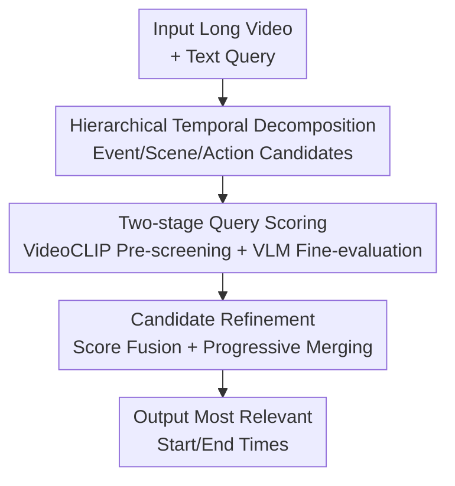

# HiTeA: Hierarchical Temporal Alignment for Training-Free Long-Video Temporal Grounding

**Conference**: ICLR 2026  
**OpenReview**: [https://openreview.net/forum?id=vIecIscDJf](https://openreview.net/forum?id=vIecIscDJf)  
**Code**: https://github.com/camellia517/HiTea  
**Area**: Video Understanding  
**Keywords**: Long-video temporal grounding, training-free, hierarchical temporal decomposition, video-language models, candidate refinement  

## TL;DR
HiTeA utilizes hierarchical temporal decomposition across event-scene-action levels to generate multi-granularity candidates for long videos. It then employs frozen VideoCLIP and Qwen2.5-VL for query matching and candidate refinement, significantly improving long-video temporal grounding without any task-specific training.

## Background & Motivation
**Background**: Video Temporal Grounding (VTG) aims to identify the start and end times of segments in untrimmed videos based on a natural language query. Recently, high-performance methods have mostly adopted fully supervised training, requiring dense temporal boundary annotations. Another category of weakly-supervised, unsupervised, or zero-shot methods reduces annotation requirements but often still requires model training on target tasks or pseudo-labels.

**Limitations of Prior Work**: In long-video scenarios, the problem is more challenging than in short videos. Real-world videos typically contain significant redundant segments, repetitive actions, event structures spanning several minutes, and key actions lasting only a few seconds. Using uniform sampling or fixed-window scanning results in long segments diluting key content and short segments lacking context. Furthermore, passing all candidates to a VLM for scoring causes computational costs to spiral out of control.

**Key Challenge**: Frozen VLMs excel at determining "what" happens in a segment but do not naturally know "when" it happens. The key to long-video grounding is not just semantic matching but first decomposing the video into a temporal structure suitable for searching. Without an explicit temporal scaffold, the strong semantic capabilities of the VLM are hindered by the quality and quantity of candidates.

**Goal**: The authors aim to construct a completely training-free long-video temporal grounding framework: independent of task annotations and model fine-tuning, while capable of handling coarse-grained events, scene/shot changes, and fine-grained action boundaries, all while keeping the number of candidates within an efficiently evaluable range for the VLM.

**Key Insight**: HiTeA observes that humans searching for an event in long videos do not perform a brute-force scan of every frame. Instead, they first roughly locate relevant events and then narrow down to scenes and actions. The paper explicitly incorporates this coarse-to-fine search process into the candidate generation stage, allowing the frozen VLM to focus on its strength: semantic discrimination.

**Core Idea**: Establish an event-scene-action candidate structure for long videos using hierarchical temporal decomposition. Subsequently, use frozen video-language models for query-conditioned scoring and candidate merging. This transforms training-free VLM application from "blindly scanning long videos" into "precise retrieval within structured candidates."

## Method
### Overall Architecture
HiTeA takes an untrimmed video and a text query as input and outputs the temporal interval that best matches the query. It first constructs three temporal signals using frozen feature extractors: CLIP/ViT features to characterize event-level semantic changes, DINOv2 features for scene or layout changes, and RAFT optical flow for action-level motion changes. Subsequently, Hierarchical Temporal Decomposition (HTD) converts these signals into candidate boundaries across three granularities: event, scene, and action.

After obtaining candidates, HiTeA does not directly pass all segments to a large VLM. It first performs lightweight pre-screening using VideoCLIP, retaining a small number of high-relevance candidates at each level. Then, Qwen2.5-VL performs fine-grained semantic scoring on these candidates. Finally, Candidate Refinement (CR) fuses VLM scores with VideoCLIP scores and progressively merges adjacent or overlapping segments across levels to output the highest-ranked temporal interval.

### Key Designs
**1. Hierarchical Temporal Decomposition: Segmenting Long Videos into Multi-granularity Candidates for VLM Retrieval**

The difficulty of long videos lies in the fact that the target segment might be a coarse event or a momentary action. Consequently, HiTeA does not use a single-scale segmentation but constructs complementary similarity curves from three types of frozen visual features. Given frame $f_t$, the paper extracts $v_t^{vit}=\phi_{ViT}(f_t)$, $v_t^{dino}=\phi_{DINO}(f_t)$, and $v_t^{flow}=\phi_{RAFT}(f_t,f_{t+1})$. ViT/CLIP features are closer to natural language semantics, making them suitable for long-range event changes; DINOv2 is sensitive to visual structure and viewpoint changes, suitable for scene transitions; and RAFT optical flow directly reflects short-term motion, suitable for locating action boundaries.

The three temporal signals are denoted as $s_t^{event}$, $s_t^{scene}$, and $s_t^{action}$. Event-level similarity does not simply compare adjacent frames but compares the current frame ViT feature with the historical average feature of the current segment $\bar v_{t-1}^{vit}$: $s_t^{event}=\frac{v_t^{vit}\cdot \bar v_{t-1}^{vit}}{\|v_t^{vit}\|\|\bar v_{t-1}^{vit}\|}$. This avoids pseudo-boundaries caused by frame-wise feature jitter. Scene-level similarity uses cosine similarity between adjacent DINO features, and action-level similarity uses negative optical flow intensity $s_t^{action}=-\|v_t^{flow}\|_2$, where motion abruptness produces lower similarity. After smoothing the three curves, the event level uses local minima to find boundaries, while the scene and action levels use PELT changepoint detection to find non-linear changes.

Hierarchical relationships are explicitly maintained through a merging function $M(\cdot)$. For long videos, higher-layer boundaries are injected into lower-layer boundaries: if a lower-layer boundary exists within $\alpha$ seconds of an event boundary, it is replaced by the higher-layer boundary; otherwise, a new boundary is inserted. This process merges event boundaries into scene boundaries, then into action boundaries, ensuring fine-grained action candidates remain aligned with larger event structures. For short videos, this Hierarchical Merging is disabled, as short videos lack deep hierarchies and forcing them may lose candidate diversity.

**2. Two-stage Query Scoring: Heavy VLM Evaluation for High-Value Segments Only**

The primary engineering bottleneck for training-free methods is the number of VLM inferences. HTD generates multi-granularity candidates, but scoring every candidate with Qwen2.5-VL remains expensive for long videos. HiTeA thus performs a coarse screening with VideoCLIP: for each candidate $(t_s,t_e)$ and query $Q$, it calculates $s_{clip}$. Adjacent segments are merged if the score difference $|s_{clip}^i-s_{clip}^j|<\beta$ to reduce fragmentation. Then, only the top-$k$ candidates per level (defaulting to 3 per level, totaling at most 9) are passed to the VLM.

The second stage invokes frozen Qwen2.5-VL to obtain $s_{vlm}\in[0,1]$. This division is clear: VideoCLIP is inexpensive and suitable for coarse ranking and filtering irrelevant segments, while Qwen2.5-VL is more powerful for complex queries but only used for a few candidates. This design is practically significant, reducing average candidates on Ego4D-NLQ from 146.68 to 9, and on TACoS from 38.19 to 8.92, making training-free grounding feasible on long videos.

**3. Candidate Refinement: Query-conditioned Boundary Correction instead of Simple NMS**

HTD candidates are video-structure-oriented, while VLM scoring is query-oriented; misalignment can still occur. For example, a semantic event might span a high-scoring action segment and an adjacent scene segment, or a short action might lack context leading to boundary instability. HiTeA thus avoids selecting the single highest score or using generic NMS, designing a Candidate Refinement (CR) module instead.

CR first performs score fusion: $s_{final}=\lambda s_{vlm}+(1-\lambda)s_{clip}$. The paper sets $\lambda=0.99$, allowing the VLM's semantic judgment to dominate the ranking while retaining 1% of the VideoCLIP score as a tie-breaker, as VLMs often assign identical discrete confidence scores. This detail provides continuous differentiation when multiple candidates are scored equally (e.g., 0.8 or 0.9) by the VLM.

Subsequently, CR executes progressive merging. If two candidates from the same or adjacent levels are temporally close or overlapping, and their $s_{final}$ difference is less than threshold $\theta$, they are merged. The new boundary is a weighted average based on scores—higher-scoring segments have more influence—and the new score is also derived from a weighted combination. This process resembles query-conditioned agglomerative clustering: HTD provides structural building blocks, and CR reassembles those blocks into a final answer based on the current query's semantics.

## Key Experimental Results

### Main Results
HiTeA's performance is most evident in long-video scenarios. TACoS and Ego4D-NLQ involve long videos, with Ego4D-NLQ being first-person and TACoS consisting of long cooking videos. HiTeA significantly outperforms existing zero-shot/training-free methods and even exceeds supervised baselines in mIoU on Ego4D-NLQ.

| Dataset | Metric | Ours (HiTeA) | Prev. SOTA Zero-shot/Training-free | Gain |
|--------|------|------------|-------------------------------|------|
| Ego4D-NLQ | R@0.3 | 10.39 | UniTime-Zero 14.67? / Comparison requires care | HiTeA provides full training-free results |
| Ego4D-NLQ | mIoU | 8.12 | UniTime-Zero 10.18 (Needs training) / Supervised UniVTG 4.91 | +3.21 over supervised UniVTG |
| TACoS | R@0.1 | 44.94 | Luo et al. 27.49 | +17.45 |
| TACoS | R@0.3 | 29.08 | Mr.BLIP 24.59 (Needs training) / Luo et al. 11.20 | +17.88 over Luo et al. |
| TACoS | R@0.5 | 16.10 | Luo et al. 5.57 | +10.53 |
| TACoS | mIoU | 19.79 | Mr.BLIP 17.94 (Needs training) | +1.85 |

On short videos, HiTeA maintains strong generalization, particularly on Charades-STA R@0.3 and mIoU, and QVHighlights mAP, outperforming most zero-shot methods.

| Dataset | Metric | Ours (HiTeA) | Strong Zero-shot Baseline | Gain |
|--------|------|------------|--------------|------|
| Charades-STA | R@0.3 | 69.62 | TFVTG 67.04 | +2.58 |
| Charades-STA | mIoU | 46.29 | TFVTG 44.51 | +1.78 |
| ActivityNet-Captions | R@0.3 | 54.46 | TFVTG 49.34 | +5.12 |
| ActivityNet-Captions | mIoU | 37.93 | TFVTG 34.10 | +3.83 |
| QVHighlights Test | R1@0.5 | 62.3 | Moment-GPT 58.3 | +4.0 |
| QVHighlights Test | mAP@avg | 37.0 | Moment-GPT 35.0 | +2.0 |

### Ablation Study
HTD and CR are complementary: HTD provides better candidate structure, while CR refines boundaries using query semantics. Uniform segmentation on TACoS yields only 14.87 mIoU; adding the three-layer HTD improves it to 16.99, and adding CR reaches 19.79.

| Configuration | TACoS mIoU | Charades-STA mIoU | Description |
|------|------------|-------------------|------|
| Uniform segmentation, w/o CR | 14.87 | 35.07 | Lowest candidate quality |
| Event only, w/o CR | 15.64 | 41.28 | Good event coverage, lack fine boundaries |
| Scene only, w/o CR | 13.01 | 40.35 | Limited benefit for low-scene-change data |
| Action only, w/o CR | 13.73 | 39.83 | Helps fine boundaries, lacks context |
| Event + Scene + Action, w/o CR | 16.99 | 41.61 | Gains more evident in long videos |
| Uniform segmentation, w/ CR | 16.67 | 43.93 | CR fixes boundaries but limited by initial set |
| Event + Scene + Action, w/ CR | 19.79 | 46.29 | Full HiTeA |

VideoCLIP pre-screening significantly improves efficiency, especially for long videos.

| Dataset | Candidates Pre-filter | Candidates Post-filter | Reduction Ratio |
|--------|--------------|--------------|----------|
| Charades-STA | 9.75 | 8.17 | 16.2% |
| ActivityNet-Captions | 22.26 | 4.59 | 79.4% |
| TACoS | 38.19 | 8.92 | 76.6% |
| Ego4D-NLQ | 146.68 | 9.0 | 93.9% |

### Key Findings
- Gains from HTD increase with video length and structural complexity. In short videos, the gain from a full HTD is smaller, indicating that long videos benefit more from explicit hierarchy.
- CR provides consistent gains. Even with uniform candidates, CR improves mIoU; combined with three-layer HTD, it achieves optimal results.
- Hierarchical Merging (HM) needs adaptive application. Disabling HM is better for short videos (e.g., Charades-STA mIoU 45.09 $\rightarrow$ 46.29), suggesting that maintaining boundary diversity is more important than hierarchy consistency for short segments.
- Sensitivity to hyperparameters is moderate. $\beta$ is stable between 0.2 and 0.6, and $\lambda=0.99$ is optimal, indicating that final ranking relies on the VLM while needing VideoCLIP for continuity.

## Highlights & Insights
- HiTeA advances training-free methods from simple model calls to structured reasoning. It avoids presenting the VLM with a massive search space by first building candidates based on transitions in events, scenes, and actions.
- The choice of three signals—CLIP/ViT (semantic), DINO (layout), and RAFT (motion)—is simple yet effective, ensuring different granularities of change are captured.
- Candidate Refinement is more task-appropriate than generic NMS. It acknowledges that semantic events may span structural segments and stitches them together based on score and temporal proximity.
- The deployment strategy is practical: heavy feature extraction can be cached offline, while the online phase only involves VideoCLIP and a few VLM calls.

## Limitations & Future Work
- The three-level hierarchy is manually specified. Such a structure might not suit specialized domains like sports tactics or clinical instructional videos.
- Dependence on multiple frozen models increases system complexity. Although VLM calls are minimized, extracting ViT, DINO, and RAFT features is still resource-intensive.
- VLM scores remain sensitive to prompts and candidate lengths. CR mitigates this, but it does not fundamentally solve VLM boundary insensitivity.
- Future work could explore automatically selecting decomposition depths or applying HTD as a general indexing structure for multi-query interactive video search or dense captioning.

## Related Work & Insights
- **vs TFVTG**: While both are training-free, TFVTG relies more on query decomposition. HiTeA succeeds by modeling the explicit temporal hierarchy of the video itself.
- **vs Luo et al. 2024**: HiTeA achieves significantly higher R@0.1 on TACoS, mainly due to HTD reducing false negatives and CR re-merging cross-level segments.
- **vs UniTime-Zero**: UniTime-Zero is strong but requires training. HiTeA emphasizes zero-shot performance and transferability using entirely frozen models.
- **vs Supervised VTG**: Methods like 2D-TAN or UniVTG rely on boundary labels. HiTeA trades the fitting power of end-to-end learning for flexibility and deployment without annotations.

## Rating
- Novelty: ⭐⭐⭐⭐☆ Combines hierarchical decomposition and two-stage scoring into a cohesive training-free framework targeting long-video pain points.
- Experimental Thoroughness: ⭐⭐⭐⭐☆ Extensive benchmarks and sensitivity analysis provided, though comparisons between zero-shot and supervised metrics require close reading.
- Writing Quality: ⭐⭐⭐⭐☆ Clear flow; methodology diagrams and ablation logic are well-structured.
- Value: ⭐⭐⭐⭐⭐ High practical value for long-video retrieval where annotation is expensive and queries vary dynamically.

<!-- RELATED:START -->

## Related Papers

- [\[CVPR 2026\] HieraMamba: Video Temporal Grounding via Hierarchical Anchor-Mamba Pooling](../../CVPR2026/video_understanding/hieramamba_video_temporal_grounding_via_hierarchical_anchor-mamba_pooling.md)
- [\[ICLR 2026\] OmniSTVG: Toward Spatio-Temporal Omni-Object Video Grounding](omnistvg_toward_spatio-temporal_omni-object_video_grounding.md)
- [\[ICLR 2026\] A Training-Free Framework for Long Video Understanding via Video-Query-Options Similarity](a_training-free_framework_for_long_video_understanding_via_video-query-options_s.md)
- [\[CVPR 2026\] CVA: Context-aware Video-text Alignment for Video Temporal Grounding](../../CVPR2026/video_understanding/cva_context-aware_video-text_alignment_for_video_temporal_grounding.md)
- [\[CVPR 2025\] Temporal Alignment-Free Video Matching for Few-Shot Action Recognition](../../CVPR2025/video_understanding/temporal_alignment-free_video_matching_for_few-shot_action_recognition.md)

<!-- RELATED:END -->
