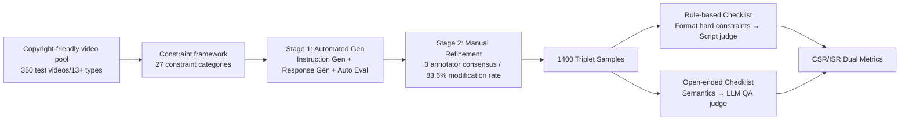

# IF-VidCap: Can Video Caption Models Follow Instructions?

**Conference**: ICLR 2026  
**OpenReview**: [https://openreview.net/forum?id=lBXJexaC8a](https://openreview.net/forum?id=lBXJexaC8a)  
**Code**: [https://if-vidcap.github.io/](https://if-vidcap.github.io/)  
**Area**: Video Understanding / Video Captioning / Instruction Following Evaluation  
**Keywords**: Controllable Video Captioning, Instruction Following, MLLM Evaluation, Benchmark, Constraint Satisfaction Rate  

## TL;DR
This paper proposes IF-VidCap—the first instruction-following evaluation benchmark for "controllable video captioning," featuring 1,400 composite instructions with an average of 6 constraints each. Using a systematic "format correctness + content correctness" dual-dimension automatic evaluation protocol to test 26 MLLMs, it was discovered that models specialized for dense captioning actually underperform general MLLMs under instruction constraints.

## Background & Motivation
**Background**: MLLMs have become powerful in video captioning, but downstream applications (structured captions for video generation, targeted descriptions for video editing, stylized copy for content creation) actually require "producing controlled descriptions according to user instructions" rather than exhaustive, all-encompassing descriptions.

**Limitations of Prior Work**: Existing multimodal evaluations are either QA-based or traditional video captioning benchmarks. The latter only focus on the accuracy and comprehensiveness of descriptions, almost never assessing practical constraints such as output format, length, or specific content requirements/prohibitions. Mature instruction-following evaluation paradigms in the language domain (IFEval, CFBench, ComplexBench, etc.) have remained limited to pure text tasks and have not migrated to fundamental video tasks.

**Key Challenge**: A gap exists between a model's "strong perception capability" and its "low instruction following degree" for complex user commands. Controllable video captioning requires not just understanding the visuals but also coupling reasoning with "constrained generation," which is a blind spot unmeasured by existing benchmarks.

**Goal**: To establish a video captioning benchmark capable of simultaneously assessing instruction fidelity and semantic quality, identifying the real performance gap of mainstream MLLMs under composite constraints.

**Core Idea**: **[Video-Instruction-Checklist Triplets]** Organizes each sample into "Video + Composite Instruction + Executable Checklist," accompanied by a **[Rule + LLM Hybrid Evaluation]** design. Format hard constraints are handled by rule scripts, while semantic content is judged by an LLM in a QA format, thereby decoupling "format correctness" and "content correctness" into two independently statistically measurable dimensions.

## Method

### Overall Architecture
IF-VidCap consists of three components: designing instructions based on a framework of 27 constraint types, utilizing an "automated generation + manual refinement" two-stage pipeline to create Video-Instruction-Checklist triplets for each sample, and finally calculating CSR/ISR metrics through a composite evaluation protocol (rule scripts + LLM-QA). The objective is to make the verification of "whether constraints are satisfied" atomic and deterministic.

### Key Designs

**1. 27 Constraint Categories: Discretizing "controllable captioning" into an enumerable requirement space.** The authors first backward-analyzed the control capabilities required by downstream applications like video editing and content creation. They distilled a blueprint of 27 constraint types covering Format (structure, style, Markdown, length, capitalization, language) and Content (entities, attributes, events, actions, cinematic language, comparison, abstraction level). Each instruction averages 6 constraints, with complex samples reaching over 10. Dependencies such as chaining, nesting, and selection exist between constraints, making "number of constraints" a reliable proxy for complexity to probe combinatorial reasoning.

**2. Video-Instruction-Checklist Triplets and Dual Checklists: Atomizing evaluation.** The checklist for each sample is split into two categories. Rule-based items correspond to hard constraints like format/structure (e.g., "bulleted list starts with `-`" or "exactly two main outfits"). These items involve the LLM performing content extraction followed by deterministic verification via rule scripts, leveraging the LLM's adaptability to complex text while maintaining the determinism of rule execution. Open-ended items correspond to semantic fidelity and are designed as retrieval-based QA: using true/false questions for the LLM to judge semantic correctness and multiple-choice questions to select inferable facts from the description, with all answers aligned to human-annotated ground truth. One constraint can have multiple QA items to control verification granularity. Data processed through a two-stage pipeline achieved an 83.6% modification rate during manual refinement, with consensus required from three annotators.

**3. CSR/ISR Dual Metrics and Rule/Open-ended Split: Decoupling format and content capabilities.** The evaluation utilizes two core metrics: Constraint Satisfaction Rate (CSR) averaged at the constraint level, and Instruction Satisfaction Rate (ISR), which requires all constraints of an instruction to be met to receive a score. The formulas are:

$$\text{CSR}=\frac{1}{m}\sum_{i=1}^{m}\frac{1}{n_i}\sum_{j=1}^{n_i}s_i^{j},\qquad \text{ISR}=\frac{1}{m}\sum_{i=1}^{m}s_i$$

where $s_i^j=1$ indicates the $j$-th constraint of the $i$-th instruction is satisfied, $s_i=1$ indicates all constraints of the $i$-th instruction are satisfied, $m$ is the total number of instructions, and $n_i$ is the number of constraints in the $i$-th instruction. These are further subdivided into Rule-Based CSR/ISR (format only) and Open-Ended CSR/ISR (content only) to separately diagnose "layout ability" versus "visual understanding."

**4. Training Set and IF-Captioner-Qwen: Proving capability transfer.** To demonstrate that instruction-following capabilities can be injected, the authors built a separate training set using a different method from the test set: 11K high-quality video-caption pairs from Vript and ShareGPT4Video were collected. Using a "response-to-instruction" approach, existing captions served as text proxies for video content, allowing DeepSeek-V3.1 to back-synthesize diverse instructions based on the constraint framework. This resulted in 46K video-instruction-response triplets used to fine-tune Qwen2.5-VL-7B-Instruct, yielding IF-Captioner-Qwen.

## Key Experimental Results

### Main Results (Excerpt, Overall / Rule-based / Open-ended ISR/CSR, %)

| Model | Params | Overall ISR | Overall CSR | Rule ISR | Open ISR |
|---|---|---|---|---|---|
| Human | — | 31.89 | 75.57 | 78.25 | 33.93 |
| Gemini-2.5-Pro | — | 27.83 | 74.53 | 74.35 | 35.22 |
| GPT-4o | — | 22.90 | 70.74 | 69.20 | 30.94 |
| Qwen3-VL-Instruct | 235B | 26.41 | 71.65 | 67.16 | 36.39 |
| InternVL-3.5 | 241B | 24.20 | 71.17 | 65.58 | 34.64 |
| Qwen2.5-VL-Instruct | 7B | 10.92 | 58.12 | 52.51 | 18.75 |
| Tarsier2 (Dense Specialized) | 7B | 1.40 | 26.05 | 9.30 | 9.91 |
| ARC-Hunyuan-Video (Specialized) | 7B | 2.32 | 27.78 | 12.23 | 9.11 |
| **IF-Captioner-Qwen (Ours)** | 7B | **14.63** | **62.82** | **59.13** | **21.27** |

### Ablation Study (Key Analysis)

| Dimension | Setting | Observation |
|---|---|---|
| # Constraints | 2-3 → 8-9 | CSR/ISR decrease monotonically as constraints increase; complex instructions significantly degrade following ability. |
| Instruction Length | 0-19 → 60-79 words | Performance likewise decreases with increased length. |
| Video Frames | 8/16/32/64/128 frames | ISR/CSR increases with frame count, peaking at 64, then dropping at 128 (long-sequence capacity limits). |
| Video Resolution | 168² → 784² | At a fixed 32 frames, higher resolution improves both metrics. |
| Eval Consistency | GPT-5-mini/DeepSeek-V3.1/Qwen3-32B | Strong consistency with human annotation, especially with advanced judge models. |

### Key Findings
- **Generalists Outperform Specialists**: Models specialized for dense captioning like Tarsier2 and ARC-Hunyuan-Video saw their ISR drop to 1-2 under instruction constraints, far below general MLLMs. This indicates "descriptive richness" and "instruction fidelity" are distinct capabilities.
- **Closed Source Still Leads but Gap is Closing**: Top-tier open-source models (Qwen3-VL-235B, InternVL-3.5-241B) are approaching Gemini-2.5-Pro/GPT-4o levels.
- **Format is Easier to Control than Content**: All models scored significantly higher on Rule-based metrics than Open-ended ones. Content requires multimodal reasoning, while format is largely a text manipulation task; humans dominate format control via checking and self-reflection, a fact reflected in "Thinking" models and their CoT format self-checks.
- **Fine-tuning is Effective**: IF-Captioner-Qwen substantially outperformed its base Qwen2.5-VL-7B (ISR 10.92→14.63, CSR 58.12→62.82).

## Highlights & Insights
- Systematically ported the "instruction following evaluation" paradigm from language to the fundamental task of video captioning, filling a gap in multimodal evaluation that previously focused only on comprehensiveness rather than controllability.
- The "Rule Script + LLM-QA" hybrid verification maintains determinism for format while using QA to turn semantic fidelity into an atomically measurable item, which is more controlled and reproducible than pure LLM-as-Judge.
- Decoupling "format capability" and "content capability" into two sets of metrics directly exposed that "good layout $\neq$ good understanding," providing highly informative diagnostics for model weaknesses.
- The creation of IF-Captioner-Qwen using back-synthesized data advances the benchmark from "assessment only" to a "train-and-test loop."

## Limitations & Future Work
- The human baseline was derived from the combined results of 10 untrained undergraduates; humans scored lower on open-ended content than top-tier models, indicating limited strength of the human reference.
- Evaluation depends heavily on LLM judges. Although consistency across three judge models was tested, inherent biases of judge models may persist.
- Use of captions as text proxies for video in the training set means the model did not truly "consume" video signals, potentially limiting the upper bound of injected capabilities; absolute scores for IF-Captioner-Qwen remain low.
- Future directions should pursue both "descriptive richness" and "instruction fidelity" simultaneously. How to fuse these within a single model remains an open question.

## Related Work & Insights
- **Text Instruction Following Benchmarks**: IFEval, CELLO, FollowBench, etc. IF-VidCap introduces the video modality and expands in scale (1,400), complexity (6 constraints avg), and content diversity.
- **Video Captioning Benchmarks**: CapsBench, CaReBench, etc. These mostly evaluate via fixed quality standards (accuracy/detail). IF-VidCap shifts the focus from "dense captioning" to "fine-grained instruction following" with longer videos (20.5s).
- **Insight**: Controllable generation evaluation is transitioning from "quality assessment" to "controllability assessment." The hybrid "rule determinism + LLM adaptability" approach is a pragmatic route for handling composite constraints and can be migrated to controllable evaluation for other modalities like image or audio.

## Rating
- **Novelty**: ⭐⭐⭐⭐ First video captioning instruction-following benchmark; systematic migration of the text IF paradigm with decoupled metrics.
- **Experimental Thoroughness**: ⭐⭐⭐⭐ Covers 26 models + human baseline; multi-dimensional analysis of constraints, length, frames, resolution, and judge consistency.
- **Writing Quality**: ⭐⭐⭐⭐ Smooth logic from motivation to framework to metrics to experiments; high information density in charts and tables.
- **Value**: ⭐⭐⭐⭐ Highlights the counter-intuitive collapse of dense specialized models under constraints, offering clear guidance for training objectives.

<!-- RELATED:START -->

## Related Papers

- [\[CVPR 2026\] Time Blindness: Why Video-Language Models Can't See What Humans Can?](../../CVPR2026/video_understanding/time_blindness_why_video-language_models_cant_see_what_humans_can.md)
- [\[ICLR 2026\] Point Prompting: Counterfactual Tracking with Video Diffusion Models](point_prompting_counterfactual_tracking_with_video_diffusion_models.md)
- [\[ICLR 2026\] Video-LevelGauge: Investigating Contextual Positional Bias in Video Language Models](video-levelgauge_investigating_contextual_positional_bias_in_video_language_mode.md)
- [\[CVPR 2026\] SAIL: Similarity-Aware Guidance and Inter-Caption Augmentation-based Learning for Weakly-Supervised Dense Video Captioning](../../CVPR2026/video_understanding/sail_similarity-aware_guidance_and_inter-caption_augmentation-based_learning_for.md)
- [\[ICLR 2026\] ScaleLong: A Multi-Timescale Benchmark for Long Video Understanding](scalelong_a_multi-timescale_benchmark_for_long_video_understanding.md)

<!-- RELATED:END -->
