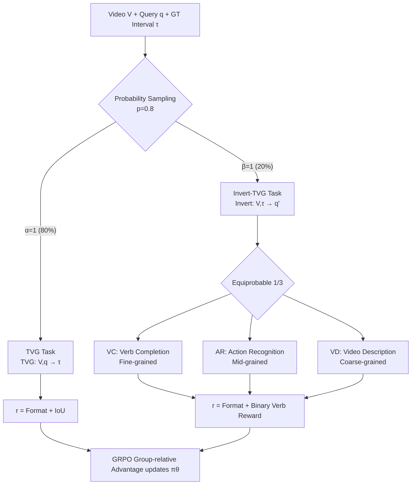

# Invert4TVG: A Temporal Video Grounding Framework with Inversion Tasks Preserving Action Understanding Ability

**Conference**: ICLR 2026  
**OpenReview**: [https://openreview.net/forum?id=QQCrZXWG9s](https://openreview.net/forum?id=QQCrZXWG9s)  
**Code**: Included with supplementary materials (Open source to be confirmed)  
**Area**: video_understanding  
**Keywords**: Temporal Video Grounding, Reinforcement Learning, GRPO, Action Understanding, Self-supervised Auxiliary Tasks

## TL;DR
To address the "action understanding degradation" caused by optimizing only for IoU in Temporal Video Grounding (TVG) models, this paper inverts the input and output of the TVG task to construct three Invert-TVG auxiliary tasks (Verb Completion / Action Recognition / Video Description) that share the same annotations. These tasks are trained alternately with low probability within the GRPO reinforcement learning framework, achieving SOTA localization accuracy while preserving action semantic understanding.

## Background & Motivation
**Background**: Temporal Video Grounding requires a model to output the corresponding time interval $[t_s, t_e]$ given a long video and a natural language query (usually describing a human action). Recent mainstream approaches have shifted from feature engineering and DETR-like networks to Large Vision-Language Models (LVLMs), especially represented by "RL-finetuned LVLMs" like Time-R1 and VideoChat-R1. these use reinforcement learning such as GRPO, combined with format rewards to guide chains of thought and IoU rewards to align temporal boundaries, achieving SOTA on benchmarks like Charades-STA.

**Limitations of Prior Work**: The authors observe that these SOTA methods still frequently produce incorrect localizations, largely due to "misunderstanding the action." A motivating example shows a video where a person unbuttons, undresses, changes clothes, and then buttons up. For the query "a person changes clothes and buttons up," which requires locating the "change" and "button" actions, VideoChat-R1 and Time-R1 locate the segment as "buttoning" simply because they see hands touching buttons, failing to distinguish "unbuttoning" from "buttoning." This indicates they focus on the "button" object but fail to differentiate the actions.

**Key Challenge**: The authors attribute this to "optimizing only for IoU." Statistical experiments (Figure 1, right) show that while Time-R1 improves R1@0.3/0.5/0.7 compared to the Qwen2.5-VL-3B baseline, its performance on three action understanding tasks (VC/VD/AR) actually degrades. **The gain in IoU comes at the expense of action understanding ability, which in turn limits the upper bound of localization accuracy.**

**Goal**: To preserve or even enhance the model's action understanding while training TVG, ensuring this understanding is "specifically tailored for localization" rather than applying generic action recognition/classification tasks (where understanding might not align with precise temporal boundaries).

**Core Idea**: **Inverting the TVG task to create auxiliary tasks**—transforming "given query, find time interval" into "given ground-truth time interval, find action information in the query." The resulting Invert-TVG tasks share the same training data as the original TVG task. By learning both localization and understanding on the same video-query pair, action understanding directly aligns with and benefits the localization objective. These tasks are optimized alternately using GRPO with asymmetric probabilities.

## Method

### Overall Architecture
Invert4TVG is a reinforcement learning framework based on GRPO with Qwen2.5-VL as the backbone. The original TVG task $\text{TVG}(V,q)\to\tau$ predicts a time interval given a video and query. The inverted version, $\text{Invert-TVG}(V,\tau)\to q'$, infers query-related action content given a video segment. During training, each step executes the TVG task (IoU + format reward) with high probability (default 80%) and an Invert-TVG task (action reward + format reward) with low probability. When an Invert-TVG task is selected, one of the three sub-tasks is chosen with equal probability. The overall scheduling logic is shown below:

### Key Designs

**1. Three Multi-granularity Invert-TVG Tasks: Leveraging Localization Annotations for Action Supervision**
This is the core innovation. All three tasks take the ground-truth video segment as input to reconstruct the action in the query, with granularity progressing from fine to coarse. **Verb Completion (VC, fine-grained)** masks the verb in the query ("Person closed the door" $\to$ "Person [ ] the door") and requires the model to fill it based on the segment. **Action Recognition (AR, mid-grained)** requires the model to summarize the segment action with a single verb. **Video Description (VD, coarse-grained)** asks for a full description containing the query action. These tasks leverage existing TVG annotations at zero extra data cost, and the learned understanding naturally serves the localization objective.

**2. Binary Verb Reward based on SpaCy Roots: Stable and Controllable Semantic Signals**
Instead of using continuous semantic similarity scores, the rewards for the three inversion tasks use SpaCy to normalize verbs to their root forms for a strict "hit/miss" binary judgment. VC requires the predicted verb root to equal the ground-truth root:
$$r_{VC}(o)=\begin{cases}0 & \text{SpaCy}(v_{pred})\neq\text{SpaCy}(v_{gt})\\ 1 & \text{SpaCy}(v_{pred})=\text{SpaCy}(v_{gt})\end{cases}$$
AR checks if the predicted verb belongs to the set of query verbs $S_{gt}$ ($r_{AR}=1$ iff $\text{SpaCy}(v_{pred})\in S_{gt}$). VD checks if the ground-truth verb appears in the set of verbs from the generated description $S_{pred}$ ($r_{VD}=1$ iff $\text{SpaCy}(v_{gt})\in S_{pred}$). Tense normalization makes "close/closed/closes" equivalent, tolerating generative randomness while strictly evaluating action understanding. Ablations show this binary reward significantly outperforms cosine similarity rewards, which can assign inflated scores (e.g., 0.2) to unrelated verbs like "run" and "eat," introducing variance and instability.

**3. Asymmetric Probabilistic Alternating Optimization: Resolving Inherent Conflicts between TVG and Invert-TVG**
The authors note that joint training of all tasks simultaneously leads to memory issues, gradient interference, and imbalances due to varying convergence rates. Fundamentally, **TVG and Invert-TVG directly conflict in terms of data flow**: the ground-truth segment predicted by TVG is the input for Invert-TVG, and the query for Invert-TVG is the input for TVG. Thus, they alternate execution using coefficients $\alpha, \beta \in \{0, 1\}$ where $\alpha + \beta = 1$:
$$r(o)=\alpha\, r_{TVG}(o)+\beta\, r_{Invert\text{-}TVG}(o)$$
The joint distribution is $P(\alpha,\beta)=p$ when $(\alpha,\beta)=(1,0)$ and $1-p$ when $(0,1)$. Since localization is the primary goal and understanding is auxiliary, $p=0.8$ is assigned to TVG and $0.2$ to Invert-TVG, allowing auxiliary tasks to provide periodic "reminders" of semantics without dominating. All tasks are updated using group-relative advantages in the GRPO framework, calculated as $r(o_i)$ minus the group mean and divided by the standard deviation, subjects to a KL constraint $\beta D_{KL}(\pi_\theta\|\pi_{ref})$.

## Key Experimental Results

### Main Results
Under the Charades-STA fine-tuning setting (higher R1@m is better):

| Type | Method | Size | R1@0.3 | R1@0.5 | R1@0.7 |
|------|--------|------|--------|--------|--------|
| VLP | 2D-TAN* | - | 57.3 | 45.8 | 27.9 |
| VLP | SnAG* | - | - | 64.6 | 46.2 |
| SFT | TimeSuite* | 7B | 79.4 | 67.1 | 43.0 |
| RL | Time-R1*(3B) | 3B | 78.7 | 64.1 | 36.9 |
| RL | **Invert4TVG (Ours 3B)** | 3B | **80.8** | **69.0** | **44.0** |
| RL | Time-R1*(7B) | 7B | 82.8 | 72.2 | 50.1 |
| RL | **Invert4TVG (Ours 7B)** | 7B | **83.0** | **72.5** | **51.4** |

The 3B version improves R1@0.7 from 36.9 to 44.0 (+7.1) relative to Time-R1*(3B). The 7B version reaches 51.4 at R1@0.7, surpassing Time-R1*(7B)'s 50.1. In **zero-shot** testing on ActivityNet and QvHighlight, Invert4TVG 3B/7B consistently outperforms Time-R1, with a more pronounced advantage on QvHighlight which features more complex action scenes.

### Ablation Study
Ablation of inversion task combinations on Charades-STA (Invert4TVG-3B):

| Method | R1@0.3 | R1@0.5 | R1@0.7 |
|--------|--------|--------|--------|
| Only-TVG (Time-R1) | 78.7 | 64.1 | 36.9 |
| Only-VD | 79.1 | 64.3 | 39.4 |
| Only-AR | 78.2 | 65.2 | 43.8 |
| Only-VC | 78.8 | 68.0 | 42.0 |
| AR+VD | 79.6 | 67.9 | 43.6 |
| VC+AR | 78.8 | 68.1 | 43.8 |
| VC+VD | 80.0 | 68.5 | 42.1 |
| **Invert4TVG (All)** | **80.8** | **69.0** | **44.0** |

Reward form comparison (Table 3): Binary 0/1 rewards (80.8/69.0/44.0) significantly outperform cosine similarity rewards (76.2/62.2/39.8).

### Key Findings
- **Maximizing Multi-task Synergy**: Individual tasks have specific strengths (VD favors context/R1@0.3, AR favors immediate actions/R1@0.7, VC is balanced/R1@0.5), but the combination of all three outperforms any single or dual-task setup across all metrics.
- **Probability Sweet Spot at 20% Invert-TVG**: Increasing Invert-TVG probability from 0 to 20% raises R1@0.7 from 36.9 to 44.0; further increases to 60%-80% cause localization performance to drop below the pure TVG baseline. 100% (inversion task only) performs worst, validating $p=0.8$.
- **Robustness of Binary Rewards**: Continuous similarity rewards introduce noise and optimization instability; the controllability of binary rewards yields consistent gains.

## Highlights & Insights
- **Solid Problem Diagnosis**: Using VC/VD/AR as quantitative metrics transforms the intuition that "IoU-only optimization hurts action understanding" into a provable statistical phenomenon.
- **"Inversion Tasks" as High-Leverage Design**: Without any new data or labels, the method reuses localization annotations as action understanding supervision by inverting inputs/outputs, which is more elegant than concatenating generic action recognition tasks.
- **Multi-granularity Complementarity**: VC/AR/VD cover action semantics at the word, action, and sentence levels. Ablations prove they are complementary rather than redundant.
- **Pragmatic Engineering**: Alternating optimization solves memory issues and input-output conflicts between TVG and Invert-TVG. Binary rewards avoid the noise of semantic similarity.

## Limitations & Future Work
- **Action/Verb Centric**: All three inversion tasks focus on "verbs," offering limited help for queries involving non-action semantics like noun entities, spatial relationships, or attributes.
- **Dependency on SpaCy**: Reward signals rely on the accuracy of NLP tools for verb extraction and normalization. Robustness to complex sentences or non-English scenarios remains under-discussed.
- **Empirical Hyperparameter $p$**: The optimal $p=0.8$ was determined by scanning; it lacks theoretical guidance for different datasets or backbones.
- **High Training Cost**: Each epoch takes ~80 hours. While inversion tasks don't add data, they do increase the training load.
- **Future Work**: Extending this "inversion task" concept to other temporal/alignment tasks (e.g., video retrieval) or non-action semantic dimensions is a natural next step.

## Related Work & Insights
- **Temporal Video Grounding**: Evolution from feature-based (2D-TAN, SnAG) to frame-level LVLM (NumPro, TimeSuite) and RL-tuned models like Time-R1. This work addresses the semantic weakness in the RL-LVLM path.
- **RL in LVLM**: While RLHF (human preference) and RLVR (verifiable rewards like grounding) are mature, long-video tasks remain under-explored due to temporal complexity. This work identifies and fixes the semantic degradation in prior RL-TVG models.
- **Insight**: When a task's supervision signal (e.g., time intervals) covers only "half" of the objective, inverting task inputs/outputs to create self-supervised auxiliary tasks from the same labels is a universal and inexpensive "semantic augmentation" paradigm applicable to other one-way alignment tasks.

## Rating
- **Novelty**: ⭐⭐⭐⭐ — "Inverting TVG tasks for action understanding auxiliary tasks" is a simple yet original perspective, converting a neglected semantic degradation problem into actionable self-supervised design.
- **Experimental Thoroughness**: ⭐⭐⭐⭐ — Comprehensive evidence across three datasets (including two zero-shot), 3B/7B scales, and multi-dimensional ablations. However, it lacks cross-comparison with more 7B RL methods and non-English validation.
- **Writing Quality**: ⭐⭐⭐⭐ — Motivation is supported by both qualitative cases and quantitative statistics. Methodological descriptions are clear with formalized formulas and rewards.
- **Value**: ⭐⭐⭐⭐ — Achieving SOTA with a 7.1-point gain on Charades-STA R1@0.7 (3B) is significant. The paradigm (inversion tasks + asymmetric alternating RL) is highly transferable and useful for the RL-LVLM video understanding community.

<!-- RELATED:START -->

## Related Papers

- [\[ICLR 2026\] VidBridge-R1: Bridging QA and Captioning for RL-based Video Understanding Models with Intermediate Proxy Tasks](vidbridge-r1_bridging_qa_and_captioning_for_rl-based_video_understanding_models_.md)
- [\[CVPR 2026\] SARL-STG: A Spatially Aware Reinforcement Learning Framework for Refining MLLMs in Spatio-Temporal Video Grounding](../../CVPR2026/video_understanding/sarl-stg_a_spatially_aware_reinforcement_learning_framework_for_refining_mllms_i.md)
- [\[ICLR 2026\] HiTeA: Hierarchical Temporal Alignment for Training-Free Long-Video Temporal Grounding](hitea_hierarchical_temporal_alignment_for_training-free_long-video_temporal_grou.md)
- [\[ICLR 2026\] OmniSTVG: Toward Spatio-Temporal Omni-Object Video Grounding](omnistvg_toward_spatio-temporal_omni-object_video_grounding.md)
- [\[AAAI 2026\] StegaVAR: Privacy-Preserving Video Action Recognition via Steganographic Domain Analysis](../../AAAI2026/video_understanding/stegavar_privacy-preserving_video_action_recognition_via_steganographic_domain_a.md)

<!-- RELATED:END -->
