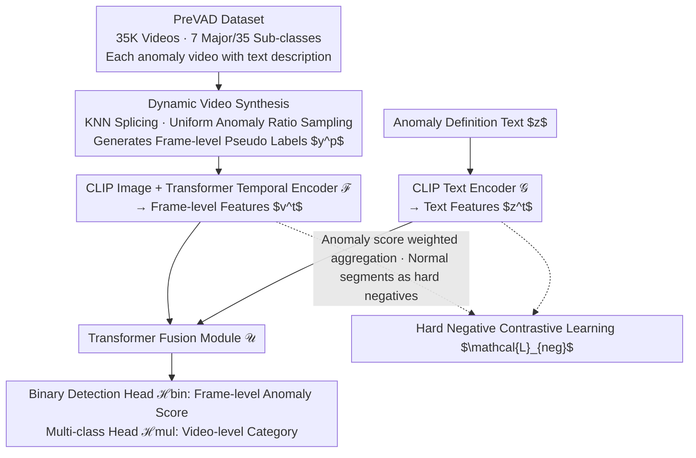

# Language-guided Open-world Video Anomaly Detection under Weak Supervision

**Conference**: ICLR 2026  
**arXiv**: [2503.13160](https://arxiv.org/abs/2503.13160)  
**Code**: [GitHub](https://github.com/Kamino666/LaGoVAD-PreVAD)  
**Area**: Video Generation  
**Keywords**: Video Anomaly Detection, Open World, Language-guided, Concept Drift, Weak Supervision

## TL;DR

Ours proposes LaGoVAD, a language-guided open-world video anomaly detection paradigm. By modeling the anomaly definition as a random variable input in natural language form, and combining it with dynamic video synthesis and contrastive learning regularization strategies, it achieves zero-shot SOTA performance across seven datasets.

## Background & Motivation

1. **Background**: Video Anomaly Detection (VAD) aims to identify video frames that deviate from expected patterns and is widely used in fields like intelligent surveillance. Recently, weakly supervised methods have achieved strong performance in closed-set settings.

2. **Limitations of Prior Work**: Existing methods assume that anomaly definitions are fixed, making them unable to handle open-world scenarios where definitions change according to requirements. For example, not wearing a mask was an anomaly during a flu outbreak but is normal otherwise—this constitutes the "concept drift" problem.

3. **Key Challenge**: While open-set and domain generalization methods can detect new categories of anomalies outside the training set, they still assume static definitions. They cannot handle cases where the label of the same behavior changes across different scenes (e.g., a pedestrian walking on a road is normal in a crime dataset but abnormal in highway surveillance).

4. **Goal**: Propose an open-world VAD paradigm that allows users to dynamically define anomalies via natural language during inference, fundamentally avoiding concept drift.

5. **Key Insight**: Explicitly model the anomaly definition $Z$ as a random variable and condition the prediction on a joint function of the video $V$ and definition $Z$ as $\Phi:(V,Z)\rightarrow Y$. This keeps $P(Y|V,Z)$ constant, theoretically eliminating concept drift.

6. **Core Idea**: Learn a joint mapping of video-text-label triplets by treating the anomaly definition as an input condition, supported by a large-scale diverse dataset to ensure generalization capabilities.

## Method

### Overall Architecture

LaGoVAD treats the anomaly definition $z$ as an input alongside the video $v$, using a dual-branch network to learn the joint mapping of the triplet $(v,z,y)$. The video is processed through a CLIP image encoder and a Transformer temporal encoder to obtain frame-level features $v^t = \mathcal{F}(v)$. The anomaly definition text is processed by a CLIP text encoder to obtain $z^t = \mathcal{G}(z)$. These interact in a Transformer fusion module $\mathcal{U}$ before being fed into a binary detection head $\mathcal{H}^{\text{bin}}$ and a multi-classification head $\mathcal{H}^{\text{mul}}$, outputting frame-level anomaly scores and video-level categories, respectively. Around this backbone, the authors employ dynamic video synthesis to resolve anomaly duration distribution bias, use hard negative contrastive learning to resolve frame-level discrimination ambiguity, and construct the PreVAD dataset to provide sufficiently diverse training triplets.

### Key Designs

**1. Dynamic Video Synthesis: Exposing the model to various anomaly duration ratios**

A hidden danger in weakly supervised VAD is training distribution bias—in crawled anomaly videos, anomalies often occupy most of the duration, whereas in real surveillance, they may last only a few seconds. If the model only sees samples with high anomaly ratios, it tends to treat "constant alarming" as the default behavior, leading to overfitting in real scenarios. Dynamic Video Synthesis stiches videos in real-time during training to break this bias: it first randomly decides if the synthesis is normal or anomalous, determines the number of segments, and then selects semantically similar clips from K-nearest neighbors to sew into new videos of varying lengths. This ensures that the anomaly ratio is uniformly sampled between 0 and 1. During splicing, the anchor positions of anomalous segments are transcribed into frame-level binary pseudo-labels $y^p \in \{0,1\}^L$, supervised directly by the dynamic video synthesis loss $\mathcal{L}_{\text{dvs}}$ to force the model to locate real anomalies under any duration ratio.

**2. Hard Negative Contrastive Learning: Aligning "normal segments" in anomalous videos as counter-examples**

The boundary between normal and anomalous frames in an anomalous video is inherently fuzzy. Combined with the sparsity of the video-text joint space, simple alignment struggles to learn fine-grained discriminative power. The authors aggregate frame-level features into a video-level representation using anomaly scores as weights, ensuring that truly anomalous frames dominate the vector. Crucially, normal segments with low scores within the same anomalous video are explicitly treated as hard negatives against the anomaly description—meaning "this footage should not match this anomaly definition." The contrastive loss $\mathcal{L}_{\text{neg}}$ runs in both text $\rightarrow$ video and video $\rightarrow$ text directions, forcing the model to push apart normal and anomalous distances within the most confusing homologous samples, rather than performing coarse alignment across different videos.

**3. PreVAD Large-scale Pre-training Dataset: The data foundation for the language-guided paradigm**

For the language-guided paradigm to generalize, it must see a sufficient variety of $(v,z,y)$ triplets. Existing datasets at most contain about 5K videos with narrow domains and almost no semantic descriptions. The authors built an extensible data pipeline, aggregating videos from video-text datasets, web resources, and surveillance streams, then automatically cleaning and labeling them using Multimodal Large Language Models (MLLM). This resulted in 35,279 videos covering 7 major and 35 sub-categories of anomalies, each paired with a text description. This richness in scale, domain, and semantic annotation allows the model to respond reasonably to unseen anomaly definition texts during inference.

### Loss & Training

Training is optimized using four joint losses: $\mathcal{L} = \mathcal{L}_{\text{MIL}} + \mathcal{L}_{\text{MIL-align}} + \mathcal{L}_{\text{dvs}} + \mathcal{L}_{\text{neg}}$. Specifically, $\mathcal{L}_{\text{MIL}}$ is the Multiple Instance Learning loss for temporal binary detection; $\mathcal{L}_{\text{MIL-align}}$ is the MIL alignment loss for video-level multi-class classification; $\mathcal{L}_{\text{dvs}}$ uses frame-level pseudo-labels from synthesized videos to supervise the detection head; and $\mathcal{L}_{\text{neg}}$ is the bidirectional contrastive loss with hard negative mining. These four components correspond to the goals of "detecting when an anomaly occurs," "determining the type of anomaly," "locating anomalies of various durations," and "ensuring separable frame-level features," respectively.

## Key Experimental Results

### Main Results

Protocol 1: Zero-shot cross-dataset binary anomaly detection (AUC/AP)

| Dataset | Metric | Ours (LaGoVAD) | Prev. SOTA | Gain |
|--------|------|------|----------|------|
| UCF-Crime | AUC | 82.81 | 82.42 (OVVAD) | +0.39 |
| XD-Violence | AP | 76.28 | 63.74 (OVVAD) | +12.54 |
| MSAD | AUC | 88.09+ | — | — |
| DoTA | AUC | Outperf. all baselines | — | — |
| TAD | AUC | Outperf. all baselines | — | — |

Protocol 2: Concept drift evaluation (drift@5). LaGoVAD remains stable under different anomaly definitions, outperforming VadCLIP and LLM-based methods.

### Ablation Study

| Configuration | Key Metric | Description |
|------|---------|------|
| Full Model | Best | All components working synergistically |
| w/o Dynamic Video Synthesis | Decrease | Overfitting due to lack of anomaly duration diversity |
| w/o Contrastive Learning | Decrease | Reduced quality of feature alignment |
| w/o Text Branch | Significant Decrease | Degenerates to fixed definition mode, unable to handle concept drift |

### Key Findings

- Detection and classification improved by 20% and 32% respectively on XD-Violence, demonstrating the huge advantage of the language-guided paradigm in cross-domain generalization.
- The scale and diversity of PreVAD are crucial for model performance; the 35K video training set is the key to generalization.
- The concept drift evaluation protocol (drift@5) proves the model can effectively handle dynamic changes in anomaly definitions.

## Highlights & Insights

- **Solid Theoretical Contribution**: Formalized the concept drift problem using probability theory, proving that using anomaly definitions as conditional inputs can eliminate concept drift, closely integrating theory and practice.
- **Paradigm Innovation**: A shift from fixed anomaly definitions to dynamic language-guided definitions, pioneering a new paradigm in the VAD field.
- **Large-scale Dataset**: PreVAD is currently the largest and most diverse video anomaly detection dataset, possessing independent evaluation value.
- **High Practicality**: Users can flexibly define anomalies through natural language, adapting to the needs of different scenarios.

## Limitations & Future Work

- Reliance on CLIP as the backbone may inherit its limitations in fine-grained visual understanding.
- Although the dataset is large, it is still primarily composed of web videos, presenting a domain gap with real-world surveillance scenes.
- Inference requires users to provide appropriate anomaly definition text; the quality of the definition directly affects detection performance.
- Consider introducing stronger video understanding models (e.g., VideoLLM) to replace CLIP feature extraction.

## Related Work & Insights

- While open-vocabulary methods like OVVAD can detect new categories, they assume fixed definitions; the "definition as input" approach in this paper is more flexible.
- Compared to LLM-based methods like LAVAD, LaGoVAD achieves better performance while remaining lightweight.
- The concept of Dynamic Video Synthesis can be extended to data augmentation for other video understanding tasks.

## Rating

- Novelty: ⭐⭐⭐⭐⭐ Pioneering formalization of the concept drift problem and proposal of the language-guided VAD paradigm.
- Experimental Thoroughness: ⭐⭐⭐⭐ Very comprehensive zero-shot evaluation across seven datasets + two evaluation protocols.
- Writing Quality: ⭐⭐⭐⭐ Clear logic and rigorous theoretical derivation.
- Value: ⭐⭐⭐⭐⭐ Paradigm-level contribution; the PreVAD dataset also holds independent value.

<!-- RELATED:START -->

## Related Papers

- [\[ICCV 2025\] TOGA: Temporally Grounded Open-Ended Video QA with Weak Supervision](../../ICCV2025/video_understanding/toga_temporally_grounded_open-ended_video_qa_with_weak_supervision.md)
- [\[ICLR 2026\] Steering and Rectifying Latent Representation Manifolds in Frozen Multi-Modal LLMs for Video Anomaly Detection](steering_and_rectifying_latent_representation_manifolds_in_frozen_multi-modal_ll.md)
- [\[CVPR 2026\] Learning from Noisy Supervision: A Denoising-Debiasing Framework for Weakly Supervised Video Anomaly Detection](../../CVPR2026/video_understanding/learning_from_noisy_supervision_a_denoising-debiasing_framework_for_weakly_super.md)
- [\[CVPR 2026\] OmniVTG: A Large-Scale Dataset and Training Paradigm for Open-World Video Temporal Grounding](../../CVPR2026/video_understanding/omnivtg_a_large-scale_dataset_and_training_paradigm_for_open-world_video_tempora.md)
- [\[CVPR 2026\] No Need For Real Anomaly: MLLM Empowered Zero-Shot Video Anomaly Detection](../../CVPR2026/video_understanding/no_need_for_real_anomaly_mllm_empowered_zero-shot_video_anomaly_detection.md)

<!-- RELATED:END -->
