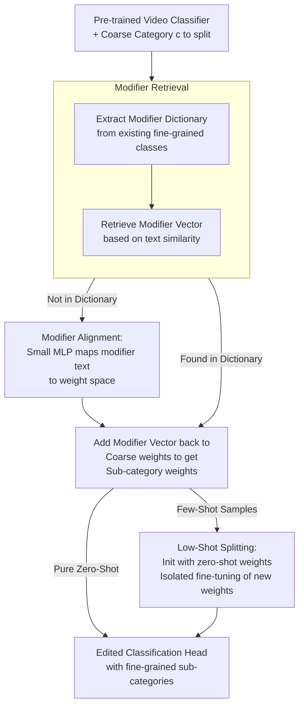

# Let's Split Up: Zero-Shot Classifier Edits for Fine-Grained Video Understanding

**Conference**: ICLR 2026  
**arXiv**: [2602.16545](https://arxiv.org/abs/2602.16545)  
**Code**: [Yes](https://kaitingliu.github.io/Category-Splitting/)  
**Area**: Video Understanding  
**Keywords**: Category Splitting, Zero-Shot Editing, Fine-grained Video Recognition, Classifier Modification, Compositional Structure

## TL;DR

The paper proposes a new task called "Category Splitting," which discovers latent compositional structures within video classifier weights to split coarse-grained action categories into fine-grained sub-categories under zero-shot conditions, requiring no retraining or additional data.

## Background & Motivation

Video recognition models are typically trained on fixed taxonomies that are often too coarse. For instance, an "open" label might encompass distinct actions like "open cupboard," "open by pushing," "open quickly," or "open halfway." As application scenarios evolve, finer distinctions become necessary.

Existing solutions have three major drawbacks:
- **Relabeling + Retraining**: Expensive, requiring large amounts of annotated data and complete training cycles.
- **Vision-Language Models (VLMs)**: Dependent on massive video-text corpora; professional domain data is scarce, and capture of fine-grained temporal cues remains difficult.
- **Continual Learning**: Requires training data for every new class and focuses on entirely new categories rather than the refinement of existing ones.

**Key Insight**: Modern video backbones already encode rich latent structures within their feature spaces, which can be decomposed to distinguish fine-grained variations even without direct supervision.

## Method

### Overall Architecture

The core of the method is **editing only the classification head** while keeping the backbone frozen. It splits a coarse category $c$ into multiple fine-grained sub-categories $\mathcal{S}^c = \{s_1^c, s_2^c, \dots, s_k^c\}$. The updated label space becomes $\mathcal{Y}' = (\mathcal{Y} \setminus \{c\}) \cup \mathcal{S}^c$. The pipeline uses zero video data: first, a **modifier dictionary** is decoded from existing classifier weights; then, a modifier vector for the target sub-category is constructed—either via **retrieval** if available in the dictionary, or via **alignment** using a small MLP from text. Once the modifier vector is obtained and added back to the coarse category weight, the new sub-category weights are generated. If a few labeled samples are available, an additional step of **isolated low-shot fine-tuning** is performed to boost results.

The editing method $E$ must satisfy two properties: **Generality** (correct classification of unseen sub-category samples post-edit) and **Locality** (the edit must not interfere with predictions of other original categories).

### Key Designs

**1. Modifier Retrieval: Treating sub-category weights as vector addition of "coarse concept + modifier"**

To create classification weights for a new sub-category from scratch in a zero-shot manner, the key observation is: a fine-grained sub-category is essentially a "coarse concept wrapped with a modifier," e.g., "pushing left to right" = "pushing" + "left to right." If the weight offset corresponding to the "left to right" modifier can be identified and added to the "pushing" weight, the new sub-category weight is obtained without touching any video data. This involves building a modifier dictionary and retrieving suitable modifiers for transfer.

The dictionary is "decoded" from existing fine-grained categories in the classifier. Fine-grained categories sharing the same base concept are grouped into a "pseudo-coarse category" $\tilde{c}$, whose weight is approximated by the mean of sub-category weights in the group:

$$v_{\tilde{c}} = \frac{1}{|\mathcal{S}^{\tilde{c}}|} \sum_{y \in \mathcal{S}^{\tilde{c}}} w_y$$

Subtracting this shared base from each sub-category weight yields pure modifier vectors $v_m = w_y - v_{\tilde{c}}$. During retrieval, cosine similarity is calculated for the target sub-category using a text encoder $\phi$, considering both modifier text and full label similarity to avoid literal matches that ignore context:

$$v_m^* = \arg\max_{(t_y, t_m, v_m) \in \mathcal{M}_{mod}} \text{sim}(\phi(t_y), \phi(t_s^*)) + \text{sim}(\phi(t_m), \phi(t_m^*))$$

The retrieved modifier is added back to the coarse weight, resulting in the new sub-category weight $w_{s_j^c} = w_c + v_m^*$.

**2. Modifier Alignment: Synthesizing weights from text for modifiers missing from the dictionary**

Retrieval assumes the dictionary contains semantically close modifiers. However, if a new modifier never appeared in the existing classifier, retrieval fails. The alignment module addresses this generalization gap by training a lightweight mapping $g_\psi: \mathbb{R}^n \to \mathbb{R}^m$ that maps any modifier text embedding directly into the classifier weight space, bypassing the "must exist in dictionary" constraint.

Supervision signals are extracted from the existing classifier in two ways: modifier-level pairs $\mathcal{D}_{mod} = \{(\phi(t_m), v_m)\}$ teach the mapping from modifier text to modifier vectors, and category-level pairs $\mathcal{D}_{cat} = \{(\phi(t_y), w_y)\} \cup \{(\phi(t_{\tilde{c}}), v_{\tilde{c}})\}$ teach the mapping from full label/pseudo-coarse text to weights. Training uses MSE loss on a 384-dimensional single-hidden-layer MLP. Only $\psi$ is updated; the classifier and text encoder remain frozen—ensuring this step remains zero-shot and requires no video data.

**3. Low-Shot Category Splitting: Isolated fine-tuning when a few labeled samples are available**

In real-world scenarios, a few annotations (as few as 1 video per sub-category) might be available. This step boosts zero-shot results further but must prevent few-shot samples from biasing the entire classifier or destroying locality for other categories. The approach uses isolated fine-tuning: only the newly added sub-category weights $\theta_{head}'$ are tuned. The backbone and original classification head are frozen, and weights calculated by the zero-shot method serve as initialization. Experiments show this initialization significantly outperforms starting with coarse weights, as zero-shot weights already encode the modifier direction, requiring only minor corrections.

### Loss & Training

- Zero-shot stage: No training data required.
- Alignment module: MSE loss, AdamW optimizer, learning rate $1 \times 10^{-3}$, cosine annealing, batch size 10.
- Low-shot fine-tuning: Cross-Entropy loss, AdamW, learning rate $1 \times 10^{-3}$, weight decay $1 \times 10^{-3}$, batch size 16.
- EMA early stopping ($\beta=0.95$, patience=5, $\delta=1\times10^{-3}$).

## Key Experimental Results

### Main Results

Baseline setup: ViT-Small + MVD pre-training, CLIP ViT-L/14 text encoder. Datasets: SSv2-Split (54 coarse categories) and FineGym-Split (42 coarse categories).

| Method | SSv2-A Gen. | SSv2-A Loc. | FineGym-A Gen. | FineGym-A Loc. |
|------|:-:|:-:|:-:|:-:|
| CLIP | 27.6 | 100.0 | 12.1 | 100.0 |
| FG-CLIP | 30.9 | 100.0 | 19.4 | 100.0 |
| VideoPrism | 28.2 | 100.0 | 21.7 | 100.0 |
| **Ours** | **46.3** | **98.9** | **34.2** | **97.8** |

VLMs show low generality; the proposed method improves generality by nearly 20 percentage points on SSv2.

| Fine-tuning Strategy | Initialization | Generality | Locality | Mean |
|---------|-------|:-:|:-:|:-:|
| Full model (one-shot) | Coarse | 33.6 | 0.0 | 16.8 |
| $\theta_{head}'$ only (one-shot) | Coarse | 48.4 | 98.4 | 73.4 |
| $\theta_{head}'$ only (one-shot) | Modifier alignment | **52.8** | **98.2** | **75.5** |
| Full data fine-tuning | Coarse | 86.7 | 19.2 | 52.9 |

### Ablation Study

- Modifier Retrieval (45.0%) vs. Modifier Alignment (46.3%): Alignment improves generality by 1.3%.
- Zero-shot initialization vs. Random initialization: Generality improves by +7.8%.
- Backbone pre-training: MVD (46.3%) > SIGMA (44.1%) > VideoMAE (42.9%) > From scratch (37.0%).
- Text encoder: CLIP (46.3%) ≈ VideoPrism (46.5%) > RoBERTa (40.9%).

### Key Findings

- Split types involving direction perform best, while those involving object count or intent/success are most challenging.
- Full-data fine-tuning is inferior to one-shot fine-tuning (75.5 vs. 52.9 Mean) because full data introduces a strong bias toward new categories, severely damaging locality.
- Performance is better when similar categories with the same modifiers exist in the original label space, but the method remains effective otherwise.

## Highlights & Insights

1.  **Task Innovation**: Category splitting is a natural but overlooked real-world challenge.
2.  **Internal Structure > VLMs**: Mining the weight structure of video classifiers proves far more effective than VLMs for fine-grained video understanding.
3.  **Minimalist yet Effective**: Edits only the classification head, requires no backbone updates, and operates in a zero-shot regime.
4.  **Counter-intuitive Finding**: Full-data fine-tuning performs worse than one-shot fine-tuning for this task; isolated fine-tuning combined with zero-shot initialization is the optimal strategy.

## Limitations & Future Work

- Reliance on text labels to identify modifiers makes handling purely visual differences (e.g., speed) difficult.
- Zero-shot generality still has room for improvement (46% vs. an ideal 86%+).
- Validation is limited to classification tasks; downstream tasks like detection/segmentation remain unexplored.
- Requires the original classifier to already contain some fine-grained categories to build the modifier dictionary.

## Related Work & Insights

- Directly related to the concept of "Model Editing" in NLP, adopting the evaluation framework of Generality and Locality.
- Inherently linked to Compositional Action Recognition.
- The "transferability" of modifiers is a hypothesis worth validating across more domains.
- Scalable to other vision tasks requiring classification refinement.

## Rating

- Novelty: ⭐⭐⭐⭐⭐ — First to define the task and the zero-shot editing approach.
- Technical Depth: ⭐⭐⭐⭐ — Elegant and simple method with moderate technical complexity.
- Experimental Thoroughness: ⭐⭐⭐⭐⭐ — Built a dedicated benchmark with comprehensive ablations.
- Practical Value: ⭐⭐⭐⭐ — High potential for low-cost classifier updates in production.

<!-- RELATED:START -->

## Related Papers

- [\[CVPR 2026\] Frame2Freq: Spectral Adapters for Fine-Grained Video Understanding](../../CVPR2026/video_understanding/frame2freq_spectral_adapters_for_fine-grained_video_understanding.md)
- [\[ICLR 2026\] CaReBench: A Fine-grained Benchmark for Video Captioning and Retrieval](carebench_a_fine-grained_benchmark_for_video_captioning_and_retrieval.md)
- [\[CVPR 2026\] MA-Bench: Towards Fine-grained Micro-Action Understanding](../../CVPR2026/video_understanding/ma-bench_towards_fine-grained_micro-action_understanding.md)
- [\[CVPR 2026\] Mistake Attribution: Fine-Grained Mistake Understanding in Egocentric Videos](../../CVPR2026/video_understanding/mistake_attribution_fine-grained_mistake_understanding_in_egocentric_videos.md)
- [\[AAAI 2026\] FineVAU: A Novel Human-Aligned Benchmark for Fine-Grained Video Anomaly Understanding](../../AAAI2026/video_understanding/finevau_a_novel_human-aligned_benchmark_for_fine-grained_video_anomaly_understan.md)

<!-- RELATED:END -->
