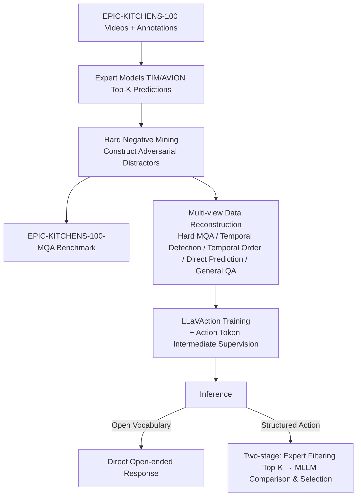

# LLaVAction: Evaluating and Training Multi-modal Large Language Models for Action Understanding

**Conference**: ICLR 2026  
**OpenReview**: [https://openreview.net/forum?id=pPKqLyWiNr](https://openreview.net/forum?id=pPKqLyWiNr)  
**Code**: [https://github.com/AdaptiveMotorControlLab/LLaVAction](https://github.com/AdaptiveMotorControlLab/LLaVAction)  
**Area**: Video Understanding / Multi-modal Large Language Models / Fine-grained Action Recognition  
**Keywords**: MLLM, Action Understanding, EPIC-KITCHENS-100, Hard Negative Mining, Action Token, First-person Video  

## TL;DR
This paper reconstructs EPIC-KITCHENS-100 into a benchmark that rigorously tests fine-grained action discrimination (EPIC-KITCHENS-100-MQA) by using "expert action recognition models to select hard distractors." It proposes LLaVAction—which strengthens visual information utilization via action tokens and a two-stage structured output—enabling general video MLLMs to outperform GPT-4o by 21 points in egocentric action recognition and achieve multiple new SOTA results.

## Background & Motivation
**Background**: Action understanding has long been dominated by specialized vision models (e.g., AVION, TIM). These achieve high accuracy via dataset-specific classification heads but suffer from weak language understanding, poor generalization, and inflexible outputs. Emerging video MLLMs, which use direct text input/output and possess inherent language priors, are expected to be more versatile alternatives.

**Limitations of Prior Work**: When converting action datasets into MLLM training/evaluation formats, the common approach is "direct action naming" or "choosing from several random candidates." This presents two issues: first, **random candidates are too easy**—MLLMs can guess correctly by simply excluding absurd options without comparing fine-grained action differences; second, **free-text output cannot be fairly aligned with specialized models**, as datasets like EPIC-KITCHENS-100 contain approximately 4,000 action categories, making it impossible to fit all candidates into a prompt for selection.

**Key Challenge**: Existing evaluations highly praise "seemingly strong" MLLMs (GPT-4o reaches 87.6% with random candidates), but these high scores mask their **true deficiencies in fine-grained action discrimination**. Once distractors become highly similar in terms of temporal dynamics, objects, or scenes, scores drop precipitously. This distorted evaluation further leads to unfocused training objectives.

**Goal**: Construct an efficient, hard benchmark that does not rely on human annotation or the limitations of closed-source models and use it to train an MLLM truly proficient in fine-grained action understanding.

**Core Idea**: **"Use expert models to create difficulties, then use those difficulties to train a stronger model."** By using the Top-K predictions of SOTA action recognition models (TIM/AVION) as distractors, the method unearths natural challenges like temporal and object similarity. These serve as "adversarial" training signals. Combined with action tokens and a two-stage structured output, the general MLLM is forged into an action expert.

## Method

### Overall Architecture
LLaVAction is built upon the LLaVA series and consists of three integrated components: (1) **Hard negative mining** that reconstructs EPIC-KITCHENS-100 into an MQA benchmark and adversarial training data; (2) **Multi-view action data reconstruction** that extends the same video annotations into various tasks such as hard action recognition, temporal detection, temporal ordering, direct prediction, and general QA; (3) **LLaVAction model design**, which utilizes action tokens to enhance visual information capture and a two-stage pipeline to output structured actions for fair comparison with specialized models.

### Key Designs

**1. Hard negative mining to construct a rigorous benchmark: Exposing "false strength."** Given a video segment $v_i$, the MQA task is formalized as $f:(v_i, Q, O_i)\mapsto[p_1,\dots,p_K]$, where $K$ options $O_i=\{n_i, D_i\}$ consist of the ground-truth narration $n_i$ and $K-1$ distractors. A naive approach uses random sampling $D_i^r=\text{Uniform}(\{n_j\mid c_j\in C\setminus\{a_i\}\})$, which often results in obviously false options. This paper instead uses an action recognition model $g:V\to(0,1)^{|C|}$ to select the $K-1$ classes with the highest confidence scores excluding the ground truth $C_i=\text{TopK}_{-1}(g(v_i)\setminus\{a_i\})$ to sample $D_i^m$. With $K=5$, action narrations rather than labels are used to avoid awkward phrasing. Experimental results show that TIM-generated distractors are the most challenging—all MLLMs drop sharply from random to TIM settings (GPT-4o 87.6%→52.2%), proving their previous high scores were illusions created by simple candidates.

**2. Multi-view action data reconstruction: Extracting multiple capabilities from a single annotation.** Hard MQA alone does not cover the full scope of action understanding. Multiple tasks are derived from the same videos for joint training. **Adversarial Distractors** are constructed using AVION (different from TIM used in evaluation) to ensure OOD (Out-of-Distribution) assessment, preventing the model from "cheating" by memorizing the error distribution of the evaluator. **Temporal Detection** adds random padding of $\delta=3$ seconds to action segments—where $\alpha\sim\text{Uniform}(0,1)$ determines the start offset, resulting in $\hat{s}_i=s_i-\alpha\delta,\ \hat{e}_i=e_i+(1-\alpha)\delta$—requiring the model to predict the start/end times as strings to learn action boundaries. **Temporal Order Learning** exploits the natural continuity of actions, optimizing $\theta^*=\arg\max_\theta\sum_t\log P_\theta(a_t\mid a_{t-1},\dots,a_{t-n})$ (with $n=2$); during training, 30% of MQA tasks include preceding action information, allowing for Sequential Action Prediction (SAP) during inference. Additionally, **Direct Prediction** and **General Video Understanding** tasks (reconstructed via GPT-4o) are included to maintain generalization, though the authors note that relying solely on GPT-4o reconstruction can harm fine-grained performance because GPT-4o itself fails on these hard distractors.

**3. Action Token: Intermediate supervision for visual information.** Training MLLMs solely on language prediction for the next token can lead to decaying importance of visual tokens in deeper layers. This paper inserts a learnable **action token** into the input sequence: "System Prompt → Visual Tokens → Action Token → Instruction Text." Causal attention allows this token to aggregate visual information before serving subsequent language tasks, similar to a ViT CLS token. Given the last-layer hidden states $\langle H_1^q,\dots,H_{l_v}^v, h_a, H_{k+1}^q,\dots\rangle$, three classification heads are attached to $h_a$ to predict nouns, verbs, and actions using cross-entropy. This serves only as an auxiliary learning objective to guide visual feature extraction and **is not used in final prediction**; during inference or when no explicit action label exists (e.g., video description), it degrades to a pure text generation loss. Ablations show this token alone provides a 3.9-point gain, the second largest contribution.

**4. Two-stage structured action output: Fairly aligning free-text with specialized models.** MLLMs output free text, which is difficult to match precisely with 4,000 action categories, and including all categories in a prompt is impractical. LLaVAction designs a two-stage inference pipeline: the first stage uses an action recognition model to retrieve Top-K confidence actions (without forcing ground-truth injection), and the second stage lets the MLLM compare and select from these K candidates. $K$ controls the trade-off between "performance upper bound vs. number of actions to distinguish"—experiments found $K=20$ (using TIM) performs better than $K=5$. This pipeline is only used for datasets/applications requiring structured actions and only during inference; open-vocabulary tasks can still be answered directly.

## Key Experimental Results

### Main Results: EPIC-KITCHENS-100-MQA (8 frames / 16 frames, Accuracy %)

| Method | 8 frames | 16 frames |
|---|---|---|
| zero-shot GPT-4o | 52.2 | N/A |
| zero-shot GPT-4o-mini | 37.4 | N/A |
| zero-shot LLaVA-Video-7B | 35.7 | 34.8 |
| zero-shot LLaVA-OV-7B | 28.9 | 30.5 |
| **LLaVAction: LLaVA-Video-7B** | **71.7** | **73.4** |
| **LLaVAction: LLaVA-OV-7B** | 71.3 | 72.3 |
| LLaVAction: LLaVA-OV-0.5B | 64.8 | 65.4 |

LLaVAction-7B leads GPT-4o (52.2 at 8 frames) by approximately 21 points, and even the 0.5B small model significantly outperforms GPT-4o.

### Contrast of Distractor Difficulty (8 frames, Accuracy %)

| Model | Random-5 (Easy) | AVION-Top5 (Med) | TIM-Top5 (Hard) |
|---|---|---|---|
| GPT-4o | 87.6 | 56.7 | 52.2 |
| GPT-4o-mini | 72.0 | 44.2 | 37.4 |
| LLaVA-Video-7B | 65.0 | 40.0 | 35.7 |

All models drop sharply under hard distractors, confirming that the fine-grained capabilities of current MLLMs are overvalued.

### Ablation Study: Component Stack (LLaVA-Video-7B ⇒ LLaVAction-7B, Accuracy %)

| Configuration | Accuracy |
|---|---|
| Zero-shot | 34.8 |
| + GPT-4o-based Reconstruction | 21.9 (↓ Catastrophic Forgetting) |
| + Random Distractors | 55.0 |
| + Adversarial Distractors (AVION) | 64.4 (+9.4, Max Single Gain) |
| + Temporal Detection | 65.2 |
| + Action Token | 69.1 (+3.9, 2nd Max Gain) |
| + GPT-4o Reconstruction | 71.5 |
| + Direct Prediction | 73.6 |
| + Temporal Ordering (w/ SAP) | 74.1 |
| IID: + Adversarial Distractors (TIM) w/ SAP | 77.0 |

### Action Recognition SOTA (EPIC-KITCHENS-100 Val Top-1)

| Method | Acc. |
|---|---|
| AVION | 54.4 |
| TIM | 56.4 |
| **LLaVAction-7B w/ action label** | 58.3 |
| **LLaVAction-7B w/ action narration** | **63.2** |

### Key Findings
- Purely fine-tuning on GPT-4o-reconstructed data leads to **catastrophic forgetting** of MQA capabilities (35.7→21.9); real gains come from adversarial hard samples.
- Adversarial distractors are the performance engine (+9.4), and action tokens are the structural innovation (+3.9); the two are orthogonally additive.
- Zero-shot generalization on EPFL-Smart-Kitchen-30, MECCANO, and Animal Kingdom significantly exceeds AVION and baseline LLaVA-Video, proving the approach does not just overfit EPIC-KITCHENS.

## Highlights & Insights
- **The "using experts to create questions, then using questions to train experts" loop is clever**: Hard negative mining serves as both a diagnostic tool (exposing false strength) and training fuel (adversarial signals), with a single mechanism serving both evaluation and training.
- **Rigorous OOD Design**: Using AVION for training distractors and TIM for evaluation distractors deliberately prevents "gaming the system" by memorizing evaluator biases, making the 21-point gain more credible.
- **The action token addressing "deep visual information decay"** hits a critical pain point in MLLMs. It is plug-and-play and does not contaminate the final generation.
- **The two-stage pipeline** elegantly resolves the alignment problem between "free-text vs. 4,000 categories," allowing MLLMs to be compared against specialized action recognition models for the first time—and actually win.

## Limitations & Future Work
- **Reliance on external expert models**: Structured output still requires TIM/AVION for Top-K filtering. Performance is capped by the expert's recall (if the truth is not in Top-K, it fails), making it not yet a pure end-to-end MLLM solution.
- **Domain bias toward first-person kitchen tasks**: The core benchmark and training are built on EPIC-KITCHENS-100. While generalization was tested on MECCANO/Animal Kingdom, the universality for open-world, third-person, or multi-person interactions remains to be verified.
- **Distractor quality limited by expert models**: The "difficulty" of distractors is intrinsically tied to the error patterns of action recognition models, which might introduce expert bias rather than pure semantic proximity as perceived by humans.
- **High training cost**: Requires 530K re-annotated samples, 32×GH200 GPUs, and mixing in LLaVA-Video-178K for data replay to prevent overfitting, posing a high barrier for reproduction.

## Related Work & Insights
- **vs. Specialized Action Recognition (AVION, TIM)**: Instead of discarding specialized models, this work uses them as "question setters" and "retrievers," complementing the MLLM's language capabilities.
- **vs. Existing MQA Benchmarks**: Previous distractors relied on manual effort or closed-source MLLMs, limited by labor or performance ceilings. This method uses open-source models to automatically generate harder, uncapped distractors.
- **vs. Other Action MLLMs (InsTALL, HAIC, MotionLLM)**: While others focus on planning, detailed description, or human motion, LLaVAction uniquely emphasizes **fine-grained action contrast**.
- **Insight**: The combination of hard negative mining and intermediate supervision tokens can be transferred to other multi-modal tasks requiring fine-grained discrimination (e.g., fine-grained retrieval, attribute recognition). "Using expert models as distractor generators" is a universal recipe for low-cost, high-difficulty benchmarks.

## Rating
- **Novelty**: ⭐⭐⭐⭐ — The dual-loop of hard negative mining for evaluation and training, action token supervision, and two-stage alignment represents clear innovation in the action MLLM space, despite drawing on established ideas for individual components.
- **Experimental Thoroughness**: ⭐⭐⭐⭐⭐ — Comprehensive coverage across MQA main tables, distractor difficulty comparisons, step-by-step ablation, generalization across four action datasets, and 10 video MLLM benchmarks, with rigorous OOD/IID settings.
- **Writing Quality**: ⭐⭐⭐⭐ — The motivation builds logically, the methodology and formulas are clear, and tables/figures provide strong support. The multi-task reconstruction section is dense and requires careful reading.
- **Value**: ⭐⭐⭐⭐⭐ — It exposes the reality that current MLLM action capabilities are overvalued and provides a reproducible solution that outperforms GPT-4o and sets new specialized SOTA results. Open-sourcing code, data, and models adds significant utility to the community.

<!-- RELATED:START -->

## Related Papers

- [\[ICLR 2026\] Beyond Static Vision: Scene Dynamic Field Unlocks Intuitive Physics Understanding in Multi-modal Large Language Models](beyond_static_vision_scene_dynamic_field_unlocks_intuitive_physics_understanding.md)
- [\[ICLR 2026\] FlashVID: Efficient Video Large Language Models via Training-free Tree-Based Spatiotemporal Token Merging](flashvid_efficient_video_large_language_models_via_training-free_tree-based_spat.md)
- [\[ICCV 2025\] 4D-Bench: Benchmarking Multi-modal Large Language Models for 4D Object Understanding](../../ICCV2025/video_understanding/4dbench_benchmarking_multimodal_large_language_models_for_4d.md)
- [\[ICML 2026\] OmniSIFT: Modality-Asymmetric Token Compression for Efficient Omni-modal Large Language Models](../../ICML2026/video_understanding/omnisift_modality-asymmetric_token_compression_for_efficient_omni-modal_large_la.md)
- [\[ICLR 2026\] Invert4TVG: A Temporal Video Grounding Framework with Inversion Tasks Preserving Action Understanding Ability](invert4tvg_a_temporal_video_grounding_framework_with_inversion_tasks_preserving_.md)

<!-- RELATED:END -->
