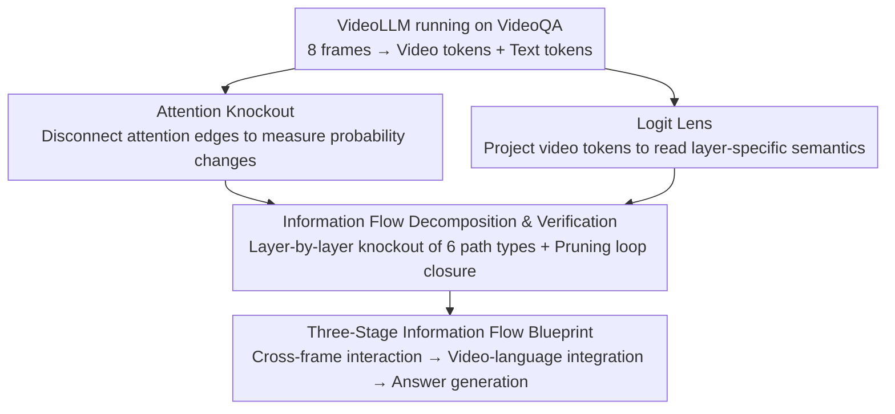

# Map the Flow: Revealing Hidden Pathways of Information in VideoLLMs

**Conference**: ICLR 2026  
**arXiv**: [2510.13251](https://arxiv.org/abs/2510.13251)  
**Code**: [Project Page](https://map-the-flow.github.io)  
**Area**: Video Understanding / Explainable AI  
**Keywords**: VideoLLM, Information Flow Analysis, Mechanistic Interpretability, Attention Pruning, Temporal Reasoning

## TL;DR

This work systematically reverse-engineers the temporal reasoning process of VideoLLMs for the first time using mechanistic interpretability tools (Attention Knockout + Logit Lens). It reveals a three-stage information flow blueprint ("cross-frame interaction in early-middle layers $\to$ video-language integration in middle layers $\to$ answer generation in middle-late layers") and demonstrates that retaining only 42% of attention edges maintains VideoQA performance with almost no loss.

## Background & Motivation

**Background**: The standard paradigm of VideoLLMs is to patchify video frames into token sequences via a visual encoder, concatenate them with text tokens, and feed the combined sequences into a causal-attention LLM for autoregressive generation. Most research in the community has focused on the "external design" of models—such as expanding video instruction-tuning datasets, keyframe selection strategies, and video token compression methods. However, systematic investigations into "how" the model extracts temporal information from the flattened sequence of frame tokens and "where" the semantic integration of video and language occurs within the model remain virtually non-existent.

**Limitations of Prior Work**: While interpretability research on image MLLMs (e.g., Neo 2025) has discovered several structured behavioral patterns, whether these findings can generalize to video scenarios is entirely unknown. Video fundamentally differs from images, as VideoQA requires aggregating temporal information across multiple frames. Specifically, three core questions remain: (1) How do VideoLLMs encode temporal order from a flattened sequence of frame tokens? (2) How do temporal concepts (e.g., "before", "after") propagate from video tokens to text tokens? (3) At which layer does the model "prepare" to generate the correct answer?

**Key Challenge**: After patchifying video frames, they become a one-dimensional token sequence where temporal structure is implicitly encoded in positions. The model must rediscover and utilize these temporal relationships through some internal mechanism, yet existing research focus solely on performance gains, leaving "what happens inside the black box" unexplained. This hinders targeted architectural improvements and inference acceleration.

**Goal**: Provide a comprehensive blueprint of temporal reasoning in VideoLLMs, identifying where information is extracted, which layers integrate it, and at what stage the answer is prepared, thereby verifying whether these key pathways sufficiently represent the model's reasoning process.

**Key Insight**: Based on mechanistic interpretability, the authors employ causal intervention tools (Attention Knockout to sever specific attention edges and measure their impact) and probing tools (Logit Lens to project intermediate layers into the vocabulary space to decode semantics), decomposing the reasoning process of VideoLLMs into testable stages.

**Core Idea**: Reverse-engineer the attention paths of VideoLLMs using Attention Knockout and Logit Lens. The authors discover that temporal reasoning follows a three-stage pattern: "cross-frame interaction $\to$ temporal keyword alignment $\to$ answer generation," and demonstrate that most attention edges are redundant.

## Method

### Overall Architecture

Instead of proposing a new model, this paper performs a "reverse-engineering" of temporal reasoning in VideoLLMs: allowing a model already capable of VideoQA to execute normally, and then cracking open its attention using mechanistic interpretability tools to inspect where information originates, at which layers video and language integration occurs, and at what stage the answer is "prepared". The experimental backbone is LLaVA-NeXT-7B-Video-FT (8 frames sampled, 144 tokens per frame), fine-tuned from LLaVA-NeXT-7B on VideoChat2-IT for 3 epochs. The analysis covers 5 categories of temporal tasks in TVBench (action antonym, action sequence, scene transition, moving direction, and object counting).

The entire analysis pipeline operates as follows: First, **Attention Knockout** is used to actively disconnect specific types of attention edges and measure probability changes to locate which paths are indispensable. Concurrently, **Logit Lens** projects video tokens at each layer to the vocabulary, reading "what words it resembles at each layer" to inspect the semantics flowing along the path. Next, attention edges are categorized into 1 of 6 semantic roles and knocked out layer-by-layer to **summarize a three-stage information flow blueprint**. Finally, end-to-end experiments that retain only key paths and prune the rest are performed to validate this blueprint in reverse. The resulting blueprint indicates: temporal reasoning relies on cross-frame attention to construct spatio-temporal representations in **early-middle layers**, integrates this video information into temporal keywords within the question in **middle layers**, and converges to the final token in **middle-late layers (around layer 20 and beyond)** to initiate answer generation—once this three-stage process finishes, the probability of the correct option rapidly dominates.

### Key Designs

**1. Attention Knockout: Quantifying the Contributions of Attention Pathways via Causal Intervention**

Direct observation of attention weights only reveals "high attention," but high attention does not equate to importance—this is correlation, not causation. Attention Knockout adopts active intervention instead: selectively disconnecting attention links between specific token pairs (setting the corresponding positions in the attention mask to $-\infty$), and measuring the change in the model's prediction probability after the edge is severed. Concretely, for each layer $l$, the target type of attention edges (e.g., cross-frame video-to-video attention) is disconnected simultaneously within a window centered at $k=9$. The impact is measured by the relative probability change $((p_{\text{knockout}} - p_{\text{base}})/p_{\text{base}}) \times 100$. A window of 9 is selected because if the window is too narrow, the blocked information bypasses the intervention through residual connections, failing to measure the true contribution. Compared to observational analysis, this causal intervention directly answers "how the model's behavior changes in the absence of this information path," serving as a standard method in mechanistic interpretability (originating from Geva et al. 2023).

**2. Logit Lens: Decoding What Words Video Tokens "Look Like" at Each Layer**

While Attention Knockout indicates which pathways are important, it does not reveal what information flows along them; Logit Lens is employed to fill this gap. It directly projects the hidden states of video tokens at each layer onto the language model's LM head to obtain logits, decoding which words the token "looks most like" at that layer. On the Action Sequence task of LLaVA-NeXT-13B-Video-FT, the authors statisticalized the frequency and spatial distribution of spatial keywords (objects, colors) and temporal keywords (before, after, first, etc.), thereby revealing starting from which layer and at which positions temporal concepts begin to emerge within video tokens.

**3. Information Flow Decomposition & Verification: Categorizing Attention into 6 Paths and Closing the Loop with Pruning**

To map the complete blueprint, complex attention edges are first categorized by their semantic roles. The authors classify the paths into 6 types: cross-frame video$\to$video, video$\to$question, video$\to$last, question$\to$last, last$\to$last, and question$\to$video. They then perform knockout analysis on each path type and at each layer, plotting the layer-vs-probability change curves to determine which layer ranges each path type operates in. With these roles clarified, the authors reverse-validate their analysis via an end-to-end experiment: only critical paths within key layer ranges are preserved (e.g., L6–15 for cross-frame interactions, L6–20 for video$\to$question, and L16–25 for question$\to$last), while disabling all other paths. If the blueprint is correct, such pruning should lead to almost no drop in performance—establishing a complete loop of "identifying critical paths first, then proving that retaining only them is sufficient."

## Key Experimental Results

### Effective Information Path Pruning — Multi-Model Validation

| Model | Video Token Count | Ratio of Retained Attention Edges | TVBench | TOMATO | vs Full Causal |
|------|------------|----------------|---------|--------|----------------|
| LLaVA-NeXT-7B-Video-FT | 8×12×12 | **42%** (10.8M/25.7M) | 51.2 | 29.2 | -0.3 / -1.0 |
| LLaVA-NeXT-7B-Video-FT (Random Pruning) | Same as above | 42% | 40.1 | 23.1 | -11.4 / -7.1 |
| LLaVA-NeXT-13B-Video-FT | 8×12×12 | **37%** (14.3M/32.2M) | 54.6 | 27.4 | -0.5 / +0.2 |
| Mini-InternVL-4B-Video-FT | 8×16×16 | **40%** (29.6M/74.6M) | 56.0 | 31.2 | 0.0 / -1.0 |
| VideoLLaMA3-7B | 8×12×12 | **58%** (11.4M/19.9M) | 57.2 | 28.7 | +2.0 / +0.7 |

Pruning that retains effective paths consistently holds across four models of different architectures and scales. VideoLLaMA3 even outperforms the baseline post-pruning, indicating that certain attention edges act as disruptive noise.

### Cross-Frame Attention Deactivation Ablation — By Task

| Task | Accuracy Drop after Disabling Cross-Frame Attention in the First Half of Layers | Typical Error |
|------|-------------------------------|---------|
| Action Antonym | -24.1% | "stand up" → "sit on chair" (opposite semantics) |
| Action Sequence | -20.2% | "open bag" → "put bag in microwave" (completely incorrect order) |
| Scene Transition | -18.0% | "bedroom→street" → "street→different location" (reversed direction) |
| Moving Direction | -44.8% | "move right" → "move left" (opposite direction) |
| Object Count | -60.8% | "zero moving objects" → "three" (completely incorrect count) |

This table clearly demonstrates the indispensability of cross-frame attention. After disabling it, the model does not become "uncertain" but rather outputs semantically opposite answers, proving that without cross-frame interaction, the model reverts to static bias.

### Key Findings

- **Unique Contribution of VideoQA Fine-Tuning**: By comparing an ImageLLM and a VideoLLM of the same base architecture, it is verified that cross-frame attention interaction is a learned capability unique to video fine-tuning; the early-middle layer cross-frame interaction pattern only emerges after video fine-tuning. This answers the fundamental question of "what video fine-tuning actually teaches."
- **"Emergence" of Temporal Concepts**: Temporal concepts within video tokens are not directly produced by the visual encoder, but instead emerge spontaneously within the middle layers of the LLM. Spatial concepts stabilize first (foreground tokens) followed by the emergence of temporal concepts (remaining tokens); the two concepts do not overlap in the token space.
- **"Information Checkpoint" Role of Temporal Keywords**: Temporal keywords in the query (action verbs and temporal adverbs in the options) act as information integration checkpoints. Across different tasks, the pathways through which video information reaches these checkpoints differ: simple tasks utilize direct pathways (video$\to$option), whereas tasks requiring object identification employ indirect pathways (video$\to$non-option question$\to$option).
- **Mechanistic Diagnosis of Failure Cases**: Analyzing incorrectly predicted samples reveals that their cross-modality integration pathways (middle $\to$ late layers) match those of correct samples, indicating that the source of failure lies in earlier video representation stages. This is either because spurious cross-frame attention biased the representation (Case 1) or because the model reverted to static scene bias (Case 2).

## Highlights & Insights

- **Comprehensive Three-Stage Reasoning Blueprint**: The dark-box reasoning process of VideoLLMs is decomposed into three testable and actionable stages. This is not merely a descriptive analysis; the end-to-end validation of "retaining only key pathways" establishes a closed loop of analysis-hypothesis-verification, outstandingly reinforcing the reliability of the findings.
- **58% of Attention Edges Safely Pruned**: This finding directly points to practical applications, enabling the construction of more efficient VideoLLM inference pipelines. Unlike heuristic token-compression methods, this work explains why these token interactions are redundant from a mechanistic perspective, offering a theoretical foundation for attention sparsification.
- **The Discovery of "Temporal Concept Emergence" is Particularly Inspiring**: When video frames are processed by spatial encoders, the tokens do not directly contain temporal semantics. However, during LLM processing, temporal concepts spontaneously emerge at non-foreground token positions in the intermediate layers. This implies that the self-attention mechanism of the LLM has the capacity to "invent" temporal semantics from positional encoding sequences.
- **Two Distinct Failure Mechanisms**: Disambiguating Case 1 (spurious cross-frame attention) and Case 2 (static bias reversion) provides paths for targeted improvements: the former calls for higher-quality cross-frame interactions, whereas the latter requires mitigating static scene bias in the training data.

## Limitations & Future Work

- **Limited Task Coverage**: The analysis is mainly conducted on TVBench (multiple-choice QA). Although the Appendix includes open-ended QA and long videos, the information flow pattern may differ fundamentally in generative tasks such as video captioning or video summarization.
- **Model Scale Limitations**: The largest model analyzed has 13B parameters. Do 70B+ models follow the same three-stage pattern, or do deeper networks exhibit more complex information routing?
- **Granularity of the Attention Knockout Window**: A layer window of $k=9$ is used to prevent residual bypassing, which leads to coarser layer precision in the analysis. Finer-grained causal interventions (e.g., single-layer + MLP analysis) might reveal more subtle mechanisms.
- **Heuristically Defined Pruning Layer Ranges**: The layer ranges for effective pathways (e.g., L6–15 for cross-frame interactions) are manually determined based on analytical observations. Adaptive learning of the optimal path range for each sample could further improve pruning efficiency.
- **Static Analysis Lacks Dynamic Adaptivity**: The current analysis yields dataset-level statistical patterns, but the optimal path may vary for each video sample. Developing sample-adaptive path selection could be a worthy research direction.

## Related Work & Insights

- **vs. Image MLLM Interpretability (Neo 2025, Zhang 2025c)**: These prior works identified structured vision-language information flow patterns in image MLLMs. This work extends the analytical paradigm to the video domain and reveals a completely new capability—cross-frame temporal interaction. The key contribution of this work is demonstrating that video fine-tuning introduces new computational steps that do not exist during image pre-training.
- **vs. Token Compression Methods (FastV, LLaVA-PruMerge, etc.)**: While these methods heuristically prune video tokens to improve efficiency, this work explains *why* certain token interactions can be safely removed from a mechanistic perspective—namely, they do not lie on critical information pathways. The two paradigms can be combined: using the findings of this paper to guide more principled token/attention compression.
- **vs. Early Exit Strategies (Elbayad 2020, Schuster 2022)**: This work finds that the answer is prepared after the middle layers, directly implying the feasibility of early exit—a large proportion of computation in middle-late layers is redundant. Unlike traditional confidence-based early exits, this work provides a structural foundation for early exits based on the completeness of information flows.

## Rating

- Novelty: ⭐⭐⭐⭐⭐ First systematic of mechanistic analysis of temporal reasoning in VideoLLMs, filling the gap of explainable AI in the video domain.
- Experimental Thoroughness: ⭐⭐⭐⭐ 5 tasks and 4 models validated, with a complete analysis-hypothesis-verification loop, though tasks are mainly restricted to multiple-choice QA.
- Writing Quality: ⭐⭐⭐⭐⭐ The research questions are clearly decomposed, the diagrams are intuitive (especially the process blueprint in Fig. 1), and findings are presented progressively with strong narrative logic.
- Value: ⭐⭐⭐⭐ Offers direct guidelines for VideoLLM architectural design, attention sparsification, and inference acceleration, where failure mode analysis highlights clear paths for improvement.

<!-- RELATED:START -->

## Related Papers

- [\[CVPR 2026\] FlowFM: Advancing Dark Optical Flow Estimation with Flow Matching](../../CVPR2026/video_understanding/flowfm_advancing_dark_optical_flow_estimation_with_flow_matching.md)
- [\[CVPR 2025\] Video Streaming Thinking: VideoLLMs Can Watch and Think Simultaneously](../../CVPR2025/video_understanding/video_streaming_thinking_videollms_can_watch_and_think_simultaneously.md)
- [\[AAAI 2026\] ReaSon: Reinforced Causal Search with Information Bottleneck for Video Understanding](../../AAAI2026/video_understanding/reason_reinforced_causal_search_with_information_bottleneck_for_video_understand.md)
- [\[CVPR 2026\] TLMA: Mitigating the Impact of Weakly Labeled Information for Video Anomaly Detection](../../CVPR2026/video_understanding/tlma_mitigating_the_impact_of_weakly_labeled_information_for_video_anomaly_detec.md)
- [\[AAAI 2026\] Causality Matters: How Temporal Information Emerges in Video Language Models](../../AAAI2026/video_understanding/causality_matters_how_temporal_information_emerges_in_video_language_models.md)

<!-- RELATED:END -->
