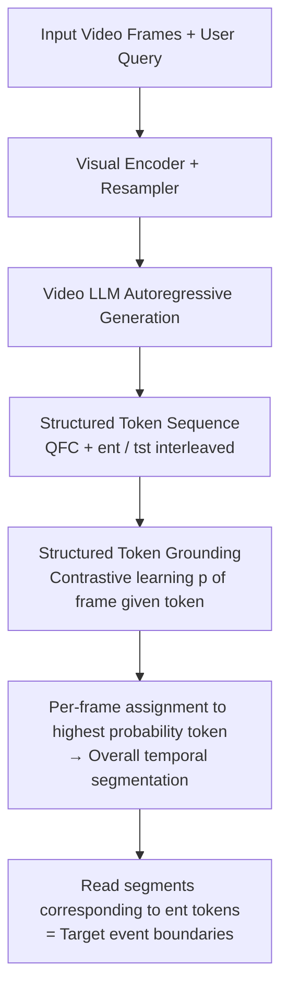

# Measure Twice, Cut Once: A Semantic-Oriented Approach to Video Temporal Localization with Video LLMs

**Conference**: ICLR 2026  
**OpenReview**: [https://openreview.net/forum?id=d6vMek58Zv](https://openreview.net/forum?id=d6vMek58Zv)  
**Code**: [https://github.com/pangzss/MeCo](https://github.com/pangzss/MeCo)  
**Area**: Video Understanding / Video Temporal Localization / Video LLM  
**Keywords**: Temporal Localization, Video LLM, Structured Tokens, Contrastive Learning, Query-focused Captioning  

## TL;DR
MeCo abandons the mainstream paradigm of "letting Video LLMs directly output boundary timestamps" in favor of a semantic-driven approach using structured tokens + query-focused captioning + contrastive grounding. By reframing video temporal localization as "understanding semantic structure before cutting segments," it consistently outperforms timestamp-generation methods across 9 tasks.

## Background & Motivation
- **Background**: Video temporal localization (moment retrieval, action localization, video summarization, dense captioning, etc.) is shifting from specialized models to unified treatment using Video LLMs. Current mainstream approaches fine-tune pre-trained Video LLMs as "boundary timestamp generators"—directly outputting the start and end seconds of events—and focus on designing LLM-friendly timestamp representations (learnable digit tokens, specialized timestamp codecs, boundary matching tokens, etc.).
- **Limitations of Prior Work**: Timestamp outputs are essentially **digit strings devoid of semantic information**. LLMs acquire the capability to map "visual input → text output with specific semantic meaning" during pre-training. Multiple studies have shown that LLMs struggle when handling highly uninformative outputs (pure digits, numerous newly added tokens). Forcing the LLM to perform internal semantic understanding while only exposing bare timestamps wastes its strongest pre-training capabilities.
- **Key Challenge**: Localizing event boundaries inherently **requires semantic judgment**—one must both judge the relevance of segments to the query and distinguish the target event from adjacent ones. Existing paradigms compress this semantic reasoning into a black box, leaving only the "impoverished" timestamp interface, which prevents the LLM from leveraging its semantic advantages.
- **Goal**: Construct a **completely timestamp-free** semantic-oriented framework, allowing Video LLMs to perform localization using their strengths in "generating and retrieving semantics" rather than fitting digits.
- **Core Idea**: **Measure Twice, Cut Once**—first use a generation task to decompose the video into a structured token sequence of "event segments / transition segments" and write fine-grained captions for each event (measure twice: global structure + local details), then use contrastive learning to ground these tokens back to the corresponding frames to cut all target segments at once (cut once).

## Method

### Overall Architecture
MeCo jointly trains three tasks on a Video LLM (based on E.T.Chat / QWen2VL): **Structured Token Generation** (autoregressively writing the video as a sequence of `<ent>`/`<tst>` tokens), **Query-focused Captioning** (writing a query-focused caption before each event token), and **Structured Token Grounding** (aligning the hidden states of each token to its corresponding video frames via contrastive learning). The first two are generative tasks that leverage the LLM's autoregressive capabilities to compress segment semantics into token hidden states; the third is a discriminative task that maps hidden states back to the timeline to read the boundaries of event segments. No timestamps are generated during inference.

### Key Designs

**1. Structured Token Generation: Reformulating "Timestamp Regression" as "Sequence Classification and Generation."** MeCo adds two special tokens to the LLM vocabulary—event token `<ent>` and transition token `<tst>`. The model is required to autoregressively write the video as a chronologically ordered sequence of structured tokens $\{ST(i)\}_{i=1}^{M+K}$ based on the query, where segments belonging to the query event output `<ent>` and background transition segments output `<tst>`. Supervision data is constructed from GT boundaries $\{(t^s_i, t^e_i)\}_{i=1}^{M}$ of existing localization data by filling in adjacent transition segments to create $M+K$ segments. A key design choice: `<tst>` is not always mechanically sandwiched between `<ent>` tokens—events may occur at the start/end of a video or appear consecutively without transitions. These "non-trivial arrangements" force the model to truly perceive whether a transition exists in the video rather than following a template. Each token must attend to its corresponding segment during autoregressive generation, thereby compressing the segment's semantics into its hidden state to facilitate grounding.

**2. Query-focused Captioning: Providing "Measure Twice" Detailed Captions for Event Tokens.** Similar to how humans review segments to confirm details, MeCo inserts a fine-grained caption $[QFC]_i$ targeted at the query before each `<ent>` token. This transforms the output into an interleaved sequence of captions and structural tokens $X=\{CAP(i), ST(i)\}_{i=1}^{M+K}$ (transitions are not captioned). Through causal attention, the subsequent `<ent>` token can attend to this caption, effectively applying the Chain-of-Thought concept—"write intermediate reasoning before the final answer"—to localization, using more accessible captions instead of reasoning chains. Textual answers for all captioning/QA tasks are unified into the QFC format. The two generative tasks are combined into a single language modeling loss:

$$\mathcal{L}_{LM} = -\frac{1}{N}\sum_{n=1}^{N} \log p(X_n \mid \{F_t\}_{t=1}^{T}, \{q_l\}_{l=1}^{L}, X_{<n})$$

Since QFC is a new task without existing data, the authors extract event clips using GT timestamps from E.T.Instruct and feed them into a video captioning model to automatically generate detailed captions.

**3. Structured Token Grounding: Pinning Tokens to the Timeline via "Asymmetric" Contrastive Learning.** Generating token sequences is insufficient; they must be mapped to specific frames for localization. MeCo applies MLP projectors to frame hidden states $\{H_t\}$ and structural token hidden states $\{s_i\}$, using a contrastive loss to pull each token closer to its corresponding segment frames:

$$\mathcal{L}_{ST} = -\frac{1}{M+K}\sum_{i=1}^{M+K} \sum_{t=t^s_i}^{t^e_i} \frac{\log p(h_t \mid s_i)}{t^e_i - t^s_i}, \quad p(h_t \mid s_i)=\frac{\exp(s_i\cdot h_t/\tau)}{\sum_{t'=1}^{T}\exp(s_i\cdot h_{t'}/\tau)}$$

The softmax is normalized **across all frames** (identifying which frames are most similar to a given token). The authors specifically note **not to add a symmetric term** $p(s_i\mid h_t)$: because the number of frames (~100) far exceeds the number of tokens (~3), the denominator for a softmax over tokens would have too few negative samples, hindering contrastive learning. This is confirmed by ablation studies where adding the symmetric term or switching to segment-level features resulted in performance drops. The final loss is $\mathcal{L}=\mathcal{L}_{LM}+\mathcal{L}_{ST}$. During inference, structural tokens are generated autoregressively, then $p(h_t\mid s_i)$ is calculated for each frame to assign it to the token with the highest probability, resulting in a global temporal segmentation. The frame intervals covered by `<ent>` tokens directly constitute the target event boundaries—no timestamps are ever outputted.

## Key Experimental Results

### Main Results (E.T. Bench Zero-shot, Selection)
Comparison with boundary-centric methods under identical E.T.Instruct fine-tuning settings (F1 / Similarity / Recall, higher is better):

| Model | TVG(F1) | TAL(F1) | VHD(F1) | DVC(F1) | TEM(Rec) | GVQ(Rec) |
|------|---------|---------|---------|---------|----------|----------|
| TimeChat 7B | 24.3 | 17.7 | 43.0 | 39.4 | 19.1 | 0.8 |
| TRACE 7B | 18.5 | 22.3 | 38.2 | 39.0 | 12.5 | 1.4 |
| E.T.Chat 3.8B | 38.6 | 30.8 | 62.5 | 38.4 | 16.5 | 3.7 |
| **Ours (ETChat 3.8B)** | 59.1 | 32.6 | 66.9 | 43.4 | 23.6 | 9.6 |
| **Ours (ETChat 7B)** | **62.5** | **35.1** | 66.3 | 43.4 | 19.1 | 9.9 |
| **Ours (QWen2VL 7B)** | 59.0 | 34.2 | **67.9** | 41.5 | 15.4 | **15.1** |

Even with a smaller 3.8B backbone and fewer training steps, MeCo significantly outperforms timestamp-based methods trained with larger models and more data across nearly all tasks (TVG from 38.6→59.1, GVQ from 3.7→9.6).

### Charades-STA / QVHighlights
In zero-shot settings (E.T.Instruct fine-tuned), MeCo (QWen2VL 7B) achieves R@0.3=71.1 / R@0.5=50.1 on Charades-STA. On QVHighlights for saliency detection, it reaches mAP=37.2 and HIT@1=57.9, far exceeding digit token methods like TRACE (mAP 16.4). After dataset-level fine-tuning, MeCo achieves mAP 45.3 / HIT@1 75.1 on QVHighlights, even surpassing specialized models like CG-DETR and UniVTG, making it the only method to maintain a good balance between temporal localization and saliency detection.

### Ablation Study

| Configuration | F1_gnd | F1_cap | Sim_cap | Rec_com |
|------|--------|--------|---------|---------|
| Only `<ent>` | 26.7 | 15.0 | 14.2 | 9.4 |
| `<ent>` + `<tst>` | 38.1 | 33.8 | 20.5 | 14.5 |
| `<ent>` + QFC | 40.4 | 32.0 | 19.9 | 14.9 |
| `<ent>` + Query Copying | 26.6 | 15.2 | 14.3 | 9.5 |
| **`<ent>` + `<tst>` + QFC** | **40.6** | **35.4** | 20.3 | **16.6** |

In grounding loss variants, using only $p(h_t\mid s_i)$ (40.6) is significantly better than adding the symmetric term $p(s_i\mid h_t)$ (39.9) or using segment-level features $p(h^{seg}_i\mid s_i)$ (23.2), confirming that sufficient negative samples are key to effective contrastive learning.

### Key Findings
- **Semantic Methods are Inherently Stronger**: Pure contrastive vision-language models (CLIP/SIGLIP) are competitive in grounding without training, and Video LLMs further amplify this semantic advantage.
- **Global Structure + Local Details are Both Essential**: `<tst>` (global structure) and QFC (local details) have limited impact individually, but their combination is optimal. Replacing QFC with an uninformative "query copying" task causes performance to regress to the level of using only `<ent>`.
- **QFC Only Complements Semantic Methods**: Boundary-centric strategies (positional embedding, interleaving, boundary matching) actually show decreased performance when paired with QFC. Only structured tokens can effectively utilize fine-grained semantic cues.

## Highlights & Insights
- **Paradigm Reformulation**: Rewriting "Temporal Localization = Timestamp Regression" as "Temporal Localization = Semantic Structural Segmentation" allows the LLM to perform tasks it is naturally suited for (generation + retrieval). This is more fundamental than simply redesigning timestamp tokens.
- **CoT Migration**: Query-focused captioning migrates the CoT idea of "reason before answering" to localization, using easily obtainable captions as a surrogate for reasoning chains, which is more practical for engineering.
- **Asymmetric Contrastive Insight**: The explicit identification of "asymmetric softmax due to more frames than tokens" and the explanation of performance drops via negative sample count provide persuasive engineering insights.
- **Seamless Saliency Detection**: The continuous similarity used for grounding naturally serves as a saliency score, allowing the model to dominate digit token methods on QVHighlights without additional design.

## Limitations & Future Work
- **Weaknesses in Fine-grained Boundaries**: MeCo shows limited gains in high IoU metrics (e.g., R@0.7) because it prioritizes capturing the semantic difference between "query relevance vs. background" rather than precisely modeling phase-in/phase-out boundary patterns—an inherent trade-off between the strong generalization of semantic methods and the precise localization of boundary methods.
- **Not Intended to Replace Boundary Methods**: The authors state that boundary-centric methods are naturally compatible with LLM generative modeling and can directly fit boundary patterns. Future directions involve **integrating both** rather than choosing one.
- **Components are Not the Only Solution**: The three tasks represent one implementation of the semantic-oriented route; the authors believe other design spaces exist.
- **Dependency on Captioning Models**: QFC training data is generated by external captioning models, so the ceiling of its quality depends on the richness of the generated semantic details.

## Related Work & Insights
- **Timestamp Generation Route**: TimeChat, VTG-LLM (learnable digit tokens), TRACE (specialized timestamp codecs), VideoChat-T (temporal adaptive positional encoding), E.T.Chat (boundary matching tokens)—MeCo acts as a rebellion against this mainstream path.
- **Contrastive Vision-Language Models**: CLIP, SIGLIP, EVA, etc., are sources of inspiration for the grounding module's contrastive learning and evidence that semantic similarity itself can achieve localization.
- **Insight**: When a task is habitually formulated as "regressing numbers," one should ask if the numbers can be derived from a more semantic intermediate representation. MeCo's strategy of using "structural tokens + grounding" instead of "direct digits" can be migrated to other tasks requiring precise numeric output from language models (e.g., counting, coordinate localization, temporal reasoning).

## Rating
- **Novelty**: ⭐⭐⭐⭐ Proposes a "timestamp-free semantic-oriented" anti-paradigm in a track dominated by timestamp generation; the combination of structured tokens + QFC + asymmetric contrastive grounding is quite unique.
- **Experimental Thoroughness**: ⭐⭐⭐⭐ Covers 9 tasks / 3 benchmarks, multiple backbones (3.8B/7B, ETChat/QWen2VL), and both zero-shot and dataset-level fine-tuning settings. Ablations separately verify each component and loss variant.
- **Writing Quality**: ⭐⭐⭐⭐ The "Measure Twice, Cut Once" theme is clear; the motivation-method-ablation logic is coherent with good illustrations, though some equations are slightly dense.
- **Value**: ⭐⭐⭐⭐ Provides a new route for subsequent work to integrate or extend; methodologically inspiring for structured prediction using LLM semantic capabilities, though fine-grained boundary weakness limits the plug-and-play ceiling.

<!-- RELATED:START -->

## Related Papers

- [\[ICLR 2026\] Divid: Disentangled Spatial-Temporal Modeling within LLMs for Temporally Grounded Video Understanding](divid_disentangled_spatial-temporal_modeling_within_llms_for_temporally_grounded.md)
- [\[ICLR 2026\] SPIKE-RL: Video-LLMs Meet Bayesian Surprise](spike-rl_video-llms_meet_bayesian_surprise.md)
- [\[ICLR 2026\] RIVER: A Real-Time Interaction Benchmark for Video LLMs](river_a_real-time_interaction_benchmark_for_video_llms.md)
- [\[NeurIPS 2025\] Enhancing Temporal Understanding in Video-LLMs through Stacked Temporal Attention in Vision Encoders](../../NeurIPS2025/video_understanding/enhancing_temporal_understanding_in_videollms_through_stacke.md)
- [\[NeurIPS 2025\] TempSamp-R1: Effective Temporal Sampling with Reinforcement Fine-Tuning for Video LLMs](../../NeurIPS2025/video_understanding/tempsampr1_effective_temporal_sampling_with_reinforcement_fi.md)

<!-- RELATED:END -->
