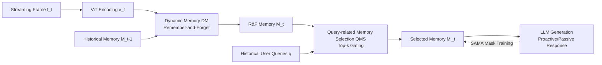

# Memento: Toward an All-Day Proactive Assistant for Ultra-Long Streaming Video

**Conference**: ICLR 2026  
**OpenReview**: [https://openreview.net/forum?id=FtdbdoGbk3](https://openreview.net/forum?id=FtdbdoGbk3)  
**Code**: To be confirmed  
**Area**: Video Understanding / Online Streaming Video / Multi-modal Large Language Models  
**Keywords**: Streaming video, proactive interaction, dynamic memory, long-term memory, vision-language models  

## TL;DR
Memento utilizes "Dynamic Memory + Query-related Memory Selection + Step-Aware Memory Attention" to liberate online video LLMs from the predicament where "tokens accumulate until OOM within minutes." It achieves bounded memory usage and all-day proactive assistant capabilities on ultra-long video streams of up to 7 hours.

## Background & Motivation
**Background**: Multi-modal Large Language Models (MLLMs) have shown strong performance in offline video understanding. Recent online video LLMs (e.g., VideoLLM-online) have introduced "proactive interaction," where the model decides whether to speak without being explicitly questioned. This is a critical step from "passive response" toward a "proactive assistant."

**Limitations of Prior Work**: Existing online models are almost entirely **token-based**—concatenating visual tokens into the context as each frame arrives. Consequently, GPU memory expands linearly over time. VideoLLM-online hits the 80.5 GB memory limit and suffers from OOM at approximately 25 minutes, losing all memory thereafter. Even though subsequent works used MoE token routing (VideoLLM-MoD, LION-FS) or patch dropping (TimeChat-online) to extend the duration to dozens of minutes, frame tokens still inherently accumulate. While fixed-length memory banks (MovieChat, MA-LMM) have bounded memory, their capacity is fixed and they cannot interact proactively, making them unsuitable for all-day scenarios.

**Key Challenge**: To build an "all-day proactive assistant," two conflicting requirements must be met: **proactive interaction** (online response without waiting for questions) and **ultra-long-term memory** (remembering events hours ago). Token-based approaches satisfy the former but fail on duration, while fixed memory banks satisfy memory constraints but fail to capture long-range critical information or act proactively. No existing approach covers both ends.

**Goal**: Construct the first proactive vision-language framework for ultra-long video streams, enabling the model to act like the protagonist in the movie *Memento* who requires external memory—remembering long-term behavioral monitoring such as "whether the user already had an insulin injection hours ago" and proactively reminding them at the appropriate moment.

**Core Idea**: **[Abandon token accumulation in favor of dynamic memory representation]** Instead of concatenating per-frame features into token sequences for the LLM, the model maintains a set of memory slots that evolve over time. Capacity grows with content significance rather than time. Coupled with query-related sparse retrieval and a specially designed training attention mask, it achieves "bounded memory + long-term proactive understanding."

## Method

### Overall Architecture
Given a streaming video $V=\{f_1,\dots,f_T\}$, Memento first encodes each frame using a ViT to obtain features $v_t$ containing [CLS] and spatial tokens. The key modification is: instead of projecting $v_t$ directly into the language space, it is fed into **Dynamic Memory (DM)**. A "Remember-and-Forget" strategy merges $v_t$ with historical memory $M_{t-1}$ to form $M_t$. Then, **Query-related Memory Selection (QMS)** filters the most relevant subset $M'_t$ based on historical user queries to feed into the LLM for response generation. During training, **Step-Aware Memory Attention (SAMA)** restricts attention to memory truly visible at each time step, allowing the supervision objectives from the token-based era to be reused directly.

### Key Designs

**1. Dynamic Memory (DM): Using similarity gating to decide whether to remember or merge.** This is the foundation for the framework to escape token accumulation. For each new frame, DM calculates two correlation scores: a **short-term score** $\delta$, representing the cosine similarity between the current frame $v_t$ and the last memory slot $m_{t-1}$ to capture short-term redundancy (where adjacent frames are nearly identical); and a **long-term score** $\sigma$, obtained by calculating the sum of cross-attention of $v_t$ over all historical memories passed through a sigmoid: $\sigma=\psi\big((\mathrm{Attn}(v_t,M_{t-1})\cdot(M_{t-1}W_v))W_o\big)$, to capture long-term redundancy (such as repeating scenes/actions from hours ago). A fixed threshold $\epsilon$ determines the fate of the frame: if $\delta>\epsilon$, it is judged as local redundancy and merged into the last memory slot via $\tilde m_{t-1}=m_{t-1}\cdot(1-\mathrm{sum}(w))+w^\top v_t$; if $\delta\le\epsilon$ but $\sigma>\epsilon$, it is judged as semantically aligned with long-range memory, and $M_{t-1}$ is updated across all relevant slots; if both are $\le\epsilon$, it is judged as entirely new content and appended as a new slot: $M_t=\mathrm{Concat}(M_{t-1},v_t)$. This ensures memory grows only when "something new appears," avoiding the unbounded expansion of token-based routes while allowing dynamic expansion for new content unlike fixed banks.

**2. Query-related Memory Selection (QMS): Feeding only query-relevant memories into the LLM.** While DM controls how much memory is "stored," QMS controls how much is "used" for generation. After flattening $M_t$, cross-attention is performed using historical user tokens $Q$ as keys/values to assign a relevance score $R\in\mathbb R^{N_t}$ to each memory frame. Then, top-k gating selects $k=r_{qms}\cdot N_t$ most relevant memories $M'_t=\mathrm{TopK}(M_t,R,k)$ for the LLM. This ensures that only sparse memory "relevant to the current question" undergoes full attention during generation, slashing overhead for ultra-long sequences. Experiments show $r_{qms}=50\%$ provides the best trade-off between recall and memory.

**3. Step-Aware Memory Attention (SAMA): Providing temporal supervision for memory without frame-by-frame alignment.** This is the key to training DM and the paper's most subtle contribution. Token-based models naturally accumulate by frame and use causal attention for step-by-step supervision. However, Memento's memory is dynamically merged, lacking a "frame-to-token" alignment. Standard causal attention would allow a token to attend to "future memory" not yet visible at its time step, leading to input misalignment and failed training. SAMA uses a binary mask $A\in\{0,1\}^{L\times L}$ to fix visibility: token $x_i$ can only attend to memory/queries/text that were effective at step $s=\mathrm{step}(x_i)$ (given $i\ge j$ and $x_j\ne$[EOS]). Position IDs are also reordered so that tokens within the same frame share a base offset. With this alignment, VideoLLM-online's training objective is reused:
$$L=\frac1N\sum_{j=1}^N\Big(\underbrace{-\log l_{j+1}P^{[\mathrm{Txt}_{j+1}]}_j}_{\text{LM Loss}}\underbrace{-\log f_j P^{[\mathrm{EOS}]}_j}_{\text{Streaming Loss}}\Big)$$
The LM Loss supervises verbal responses, while the Streaming Loss utilizes $f_j$ (deciding whether to stay silent or trigger a response) to teach the model "when to speak." The same mask structure is used during inference, with only dialogue tokens stored in the KV cache for efficient streaming decoding.

## Key Experimental Results

Implementation uses SigLIP-ViT-L/384 (2 FPS, $h_p=w_p=3$) + LLaMA-3.1-8B-Instruct, fine-tuned with LoRA for 1 epoch on 4×A100(80G). Defaults: $\epsilon=0.7$, $u=0.2$, $r_{qms}=50\%$.

### Main Results
Comparison on MementoBench against VideoLLM-online (VideoLLM-online* is a version trained equally with Memento-54k):

| Method | Sp. Recall↑ | Temp. Recall↑ | Long(>25min)↑ | Avg. Recall↑ | Score↑ | Redund.↓ |
| :--- | :--- | :--- | :--- | :--- | :--- | :--- |
| VideoLLM-online | 6.1% | 11.8% | 0.1% | 8.1% | 1.40 | 56.4% |
| VideoLLM-online* | 7.9% | 11.6% | 0.3% | 8.9% | 5.32 | 21.3% |
| **Ours** | **45.9%** | **51.3%** | **35.2%** | **47.5%** | 4.22 | 64.5% |

Regarding GPU memory: VideoLLM-online OOMs at ~25 minutes (peak 80.5 GB), while Memento stays stable at $\le45.3$ GB throughout a 4-hour stream. VideoLLM-online* shows low redundancy (21.3%) and high score (5.32) simply because it rarely speaks, leading to near-zero recall.

### Ablation Study
**Mechanism** (Fixed Bank vs. Dynamic Memory):

| Scheme | Avg. Recall↑ | Temp. Recall↑ | Redund.↓ |
| :--- | :--- | :--- | :--- |
| Fixed Len=8 | 16.9% | 22.1% | 55.5% |
| Fixed Len=128 | 29.0% | 31.2% | 52.7% |
| Dynamic ϵ=0.7 | 40.4% | 46.7% | 56.2% |
| Dynamic ϵ=0.8 | 44.7% | 46.6% | 61.4% |

Dynamic Memory improves Temporal tasks (requiring long-term memory) from 31.2% (fixed bank) to 46.7%. $\epsilon=0.8$ consumes nearly 10× more memory than 0.7 for marginal gains; hence $\epsilon=0.7$ is selected.

**Frame Token Configuration**: $1+3\times3$ achieved the highest recall of 68.9% (Score 3.78), outperforming $1+2\times2$ (40.4%) and $1+4\times4$ (60.9%).

**QMS top-k Ratio**: $r_{qms}=50\%$ provides the best compromise with 56.1% recall and 45.19 GB memory; using 100% actually drops recall to 40.4% while increasing memory to 55.44 GB.

### Key Findings
- Compared to fixed memory banks, dynamic memory not only has bounded memory but also **naturally expands** with video duration, which is the root cause of its significant lead in long-range recall.
- Memento's high Redundancy (64.5%) is the cost of its "prefer alerting over missing" strategy. The authors argue that in ultra-long online scenarios, ensuring timely and consistent responses is more important than minimizing redundancy.

## Highlights & Insights
- **Paradigm Shift rather than Patching**: Directly addresses the fundamental flaw of online video LLMs (unbounded token accumulation) by eradicating it at the architectural level using dynamic memory, rather than delaying OOM via MoE or patch dropping.
- **SAMA Solves the Hard Problem**: The lack of frame-by-frame token alignment in dynamic memory is a side effect of its memory efficiency and the reason it is hard to train. SAMA uses masks and position ID reordering to align visibility, allowing mature streaming supervision objectives to be reused.
- **Data-Benchmark Synergy**: Memento-54K (based on Ego4D, 5 min–7 h) and MementoBench (using TimeRecall/Score/Redundancy metrics) fill the gap in training and evaluating long-term proactive interaction.

## Limitations & Future Work
- **High Redundancy**: 64.5% redundancy means many responses fall outside the target window; as an "all-day assistant," it might be too intrusive. Better "when to stay silent" controls are needed.
- **Limited Evaluation Scale**: The test set contains only 40 videos (though with 13k+ responses), and the data originates entirely from Ego4D (first-person view). Generalization across domains (surveillance, in-car, desktop) is not yet verified.
- **Scoring Depends on Closed-source Models**: Scores are evaluated using GPT-3.5-turbo, and QAs are generated by GPT-4o, affecting the consistency and reproducibility based on external APIs.
- **Comparison Scope**: Primarily compared with VideoLLM-online as it is the only baseline with open-source online inference code; comparison with fixed memory methods was only indirect in ablations.

## Related Work & Insights
- **Long Video Understanding**: Token-based routes (LLaMA-VID) vs. fixed memory bank routes (MovieChat, MA-LMM). The former's cost scales with frames, while the latter's memory is fixed and non-proactive.
- **Online Video LLMs**: VideoLLM-online first proposed Streaming-EOS for response timing. VideoLLM-MoD/LION-FS and TimeChat-online attempted to extend duration but did not eliminate frame token accumulation. Memento is the first to merge "proactive interaction" and "long-term memory."
- **Insight**: When a new efficient representation (dynamic memory) breaks the "position-wise alignment" assumption, rather than abandoning mature training objectives, one should design an alignment mask to "graft" the old objectives back. This "change representation, keep supervision" approach has migration value for other compressed/memory-based architectures.

## Rating
- **Novelty**: ⭐⭐⭐⭐ First proactive framework for ultra-long streaming; the combination of dynamic memory and SAMA is a true architectural innovation.
- **Experimental Thoroughness**: ⭐⭐⭐ Comprehensive ablations, but fewer main baselines and a limited/single-domain test set (Ego4D).
- **Writing Quality**: ⭐⭐⭐⭐ Clear motivation (the *Memento* analogy is apt); three modules solve distinct problems with a complete logical chain.
- **Value**: ⭐⭐⭐⭐ Targets the highly practical direction of "all-day proactive AI assistants"; the accompanying dataset and benchmark are strong contributions to the community.

## Related Papers

- [\[NeurIPS 2025\] LiveStar: Live Streaming Assistant for Real-World Online Video Understanding](../../NeurIPS2025/video_understanding/livestar_live_streaming_assistant_for_real-world_online_video_understanding.md)
- [\[ICCV 2025\] VideoLLaMB: Long Streaming Video Understanding with Recurrent Memory Bridges](../../ICCV2025/video_understanding/videollamb_long_streaming_video_understanding_with_recurrent_memory_bridges.md)
- [\[CVPR 2026\] StreamReady: Learning What to Answer and When in Long Streaming Videos](../../CVPR2026/video_understanding/streamready_learning_what_to_answer_and_when_in_long_streaming_videos.md)
- [\[CVPR 2026\] MuKV: Multi-Grained KV Cache Compression for Long Streaming Video Question-Answering](../../CVPR2026/video_understanding/mukv_multi-grained_kv_cache_compression_for_long_streaming_video_question-answer.md)
- [\[ICLR 2026\] FOCUS: Efficient Keyframe Selection for Long Video Understanding](focus_efficient_keyframe_selection_for_long_video_understanding.md)

<!-- RELATED:END -->

<!-- RELATED:START -->

## Related Papers

- [\[ICLR 2026\] QueryStream: Advancing Streaming Video Understanding with Query-Aware Pruning and Proactive Response](querystream_advancing_streaming_video_understanding_with_query-aware_pruning_and.md)
- [\[NeurIPS 2025\] LiveStar: Live Streaming Assistant for Real-World Online Video Understanding](../../NeurIPS2025/video_understanding/livestar_live_streaming_assistant_for_real-world_online_video_understanding.md)
- [\[ICCV 2025\] VideoLLaMB: Long Streaming Video Understanding with Recurrent Memory Bridges](../../ICCV2025/video_understanding/videollamb_long_streaming_video_understanding_with_recurrent_memory_bridges.md)
- [\[CVPR 2026\] StreamReady: Learning What to Answer and When in Long Streaming Videos](../../CVPR2026/video_understanding/streamready_learning_what_to_answer_and_when_in_long_streaming_videos.md)
- [\[CVPR 2026\] MuKV: Multi-Grained KV Cache Compression for Long Streaming Video Question-Answering](../../CVPR2026/video_understanding/mukv_multi-grained_kv_cache_compression_for_long_streaming_video_question-answer.md)

<!-- RELATED:END -->
