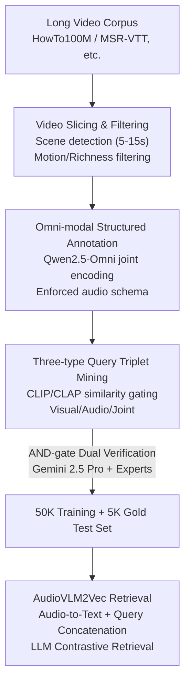

# OmniCVR: A Benchmark for Omni-Composed Video Retrieval with Vision, Audio, and Text

**Conference**: ICLR 2026  
**OpenReview**: [https://openreview.net/forum?id=KxxR7emO5K](https://openreview.net/forum?id=KxxR7emO5K)  
**Data**: https://huggingface.co/datasets/Jun-Yang/OmniCVR  
**Area**: Video Understanding / Multimodal Retrieval / Benchmark  
**Keywords**: Composed Video Retrieval, Audio-Visual Multimodal, Benchmark Construction, Audio Semantics, Contrastive Retrieval

## TL;DR
To address the neglect of audio in existing "Composed Video Retrieval" (CoVR) benchmarks, this paper constructs OmniCVR—the first large-scale CoVR benchmark treating vision, audio, and text as first-class modalities (50K triplets / 5K gold standard test set). It proposes AudioVLM2Vec, which converts audio into textual descriptions for VLM embedding, boosting R@1 from 12.4 to 77.2 on audio-centric queries.

## Background & Motivation

**Background**: Video retrieval has evolved from low-level visual features to text-to-video retrieval driven by large-scale Vision-Language Models (VLMs) like CLIP. Benchmarks such as MSR-VTT, VATEX, and YouCook2 have advanced video-language alignment. Recently, "Composed Video Retrieval (CoVR)" emerged as a more challenging paradigm, where a model retrieves a target video based on a source video and a text modification instruction (e.g., "same cooking scene but with different ingredients"), requiring fine-grained compositional reasoning.

**Limitations of Prior Work**: All mainstream CoVR benchmarks (WebVid-CoVR, Dense-WebVid-CoVR, EgoCVR) treat video as a "pure vision + text" medium, **completely ignoring audio streams**. However, audio carries semantics comparable to vision—speech conveys intent, background music sets the tone, and ambient sound defines the scene. Critical scenes like "cheering crowds in a stadium" cannot be fully described by visuals alone. More importantly, no existing framework supports retrieval tasks that involve "simultaneous modification of vision and audio."

**Key Challenge**: Real-world videos are integrated wholes of vision, audio, and text. Existing benchmarks compress them into single visual channels, resulting in "all-modality" retrieval models that are never tested on or capable of learning audio-related transitions. When the discriminative basis for retrieval lies in non-visual information (changing music, modifying dialogue), current SOTA models fail.

**Goal**: (1) Create a large-scale CoVR benchmark that treats audio as a first-class citizen and supports three types of queries: visual-centric, audio-centric, and joint visual-audio modifications; (2) quantify the performance gap of existing models in the audio dimension; (3) provide a retrieval model capable of addressing the audio deficiency.

**Key Insight**: The authors observe that while current VLM embedding models possess strong text understanding, they lack the ability to project "heard content" into the semantic space. Rather than training a native audio tower from scratch, it is more effective to **translate audio into dense natural language descriptions** first, allowing the powerful language backbone to encode acoustic semantics.

**Core Idea**: Use "Audio-as-Text" instead of "native audio tokens" to explicitly inject acoustic semantics into the embedding pipeline, thereby anchoring CoVR queries in both visual and audio modalities.

## Method

The paper follows two main lines: the **benchmark construction** (a scalable three-stage automated data pipeline + dual-gate verification) and the **accompanying retrieval model, AudioVLM2Vec**.

### Overall Architecture

OmniCVR represents each sample as a triplet `(source video, modification text, target video)`. The data pipeline consists of three steps: first, collecting long videos from public datasets (HowTo100M, MSR-VTT, etc.) and using scene detection to slice them into 5–15s (average 11.8s) semantically coherent clips filtered by motion intensity and scene richness; second, using Qwen2.5-Omni to jointly encode video and audio for "omni-modal structured annotation," enforcing a schema for audio covering paralinguistic features, lexical content, environment levels, and temporal dynamics; finally, mining pairs and generating modification text via three strategies (visual-centric / audio-centric / joint), followed by dual verification using Gemini 2.5 Pro and human experts to produce a 5K gold standard test set. For retrieval, AudioVLM2Vec converts audio into text descriptions, concatenates them with the query, and feeds them into an LLM backbone for contrastive retrieval.

### Key Designs

**1. Three Types of Query Tasks: Elevating Audio to a Retrievable, Modifiable Modality**
This is the fundamental design differentiating OmniCVR from previous CoVR benchmarks. Queries are categorized into: **Visual-centric** (modifying actions/objects/scenes while keeping audio constant to isolate visual reasoning), **Audio-centric** (changing music/sound effects/speech while maintaining high visual similarity), and **Joint** (simultaneous visual and audio changes). Joint queries dominate (Visual:Audio:Joint = 22.82%:20.00%:57.18%) as modifications in the real world are rarely isolated. To uniquely specify transitions in both domains, OmniCVR queries average 52.6 words, significantly longer than pure visual benchmarks.

**2. Three-stage Data Generation Pipeline: Mining Hard Samples via Similarity Gating**
To ensure visual-centric samples isolate vision and audio-centric samples isolate audio, the authors use **cross-modal similarity as hard constraints**. Audio-centric pairs are identified by filtering for video CLIP cosine similarity $>0.9$ (ensuring near-identical visuals) and audio embedding (CLAP) cosine similarity $<0.3$ (ensuring significant acoustic differences). Visual-centric triplets use different segments from the same source while retaining audio. Modification texts are generated by an LLM reading structured annotations of the source and target.

**3. AND-gate Dual Verification: Ensuring Gold Standard Quality**
To guarantee semantic fidelity in the 5K test set, a **concurrent dual-gate protocol** is used: Gemini 2.5 Pro and human experts independently judge whether the paired videos and modification text are consistent. A triplet is only accepted if **both approve** (the AND gate). This logic is stricter than single-reviewer audits, effectively blocking model hallucinations and human oversight.

**4. AudioVLM2Vec and Audio-as-Text: Translating Hearing into Semantic Space**
AudioVLM2Vec extends VLM2Vec: visual content is encoded via a pre-trained image encoder and projection layer, while the audio track is fed to Qwen2-Audio-7B-Instruct to **generate fine-grained acoustic natural language descriptions**. This audio text is concatenated with the user query and visual tokens, then passed to the LLM backbone. This allows the model to jointly process both modalities in the same high-dimensional semantic space, learning synergies like aligning the text "lips are moving" with corresponding visual tokens.

### Loss & Training

The retrieval model employs a contrastive learning objective, pulling `(query, target video)` positive pairs closer and pushing negative pairs in the batch further apart. During evaluation, the candidate pool is **shuffled 5 times and averaged** to mitigate variance. The training set includes over 45K triplets and 160K unique video segments.

## Key Experimental Results

### Main Results

AudioVLM2Vec ranks first across all categories and K values.

| Setting | Model | Backbone | R@1 | R@10 |
|---------|-------|----------|-----|------|
| Overall | CLIP | CLIP | 27.54 | 62.62 |
| Overall | OmniEmbed-v0.1| Qwen2.5-Omni | 31.90 | 64.00 |
| Overall | VLM2Vec | Qwen2-VL | 38.44 | 66.60 |
| Overall | **AudioVLM2Vec** | Qwen2-Audio+Qwen2-VL | **66.98** | **84.40** |
| Audio-centric | VLM2Vec | Qwen2-VL | 12.4 | 42.3 |
| Audio-centric | **AudioVLM2Vec** | Qwen2-Audio+Qwen2-VL | **77.2** | **94.2** |

The Overall R@1 is +28.5 points higher than VLM2Vec; in audio-centric settings, it jumps from 12.4 to 77.2 (+64.8 points). VLM2Vec’s collapse on audio-centric tasks reveals the catastrophic failure of current baselines in audio compositionality.

### Ablation Study

| Ablation | Key Result | Explanation |
|----------|------------|-------------|
| Audio-as-Text vs. Native Token | R@1 13.6 → 32.7 (+19.1) | Replacing the native audio tower with text conversion on the same backbone. |
| Removing Source Video | R@1 77.2 → 28.1 (−49.1) | Proves modification text is a relative instruction requiring source context. |
| Split by Audio Category | Speech +85.23 / Music +70.36 | Text conversion yields the highest gains for structured speech/music. |

### Key Findings
- **Audio is a blind spot**: Current "all-modality" systems fail (R@1 12.4) when retrieval depends on sound, indicating they do not truly "listen" to voice or environment.
- **Audio-as-Text is the primary driver**: Simply replacing an audio tower with text descriptions on the same backbone yields a 2.4× gain, proving explicit text is more effective for acoustic semantics than latent tokens.
- **Source video is indispensable**: Without the source video, performance on audio-centric tasks drops by 49.1 points, confirming the benchmark tests "relative modification" rather than simple text-to-video retrieval.

## Highlights & Insights
- **Control variables via similarity gating**: Using CLIP $>0.9$ and CLAP $<0.3$ to find "visual identity + audio difference" pairs is a scalable way to build hard samples.
- **AND-gate dual verification**: Requiring both LLM and human approval is a high-yield quality guardrail.
- **Counter-intuitive success of Audio-as-Text**: Translating signals into dense text to leverage LLM semantic power outperforms end-to-end latent tokens, suggesting "text as a universal interface" is a viable shortcut for niche modalities.

## Limitations & Future Work
- **Inference Latency**: The audio-to-text step increases latency from 1.72s to 4.77s. Future work aims to use lightweight adapters or distillation.
- **Information Loss**: Converting sound to text is inherently lossy; gains for ambient sounds are lower than for speech, indicating difficulty in describing non-lexical, continuous acoustic events.
- **Scale**: The benchmark uses 5–15s clips; long-form video retrieval with larger candidate pools remains an open challenge.

## Related Work & Insights
- **vs. WebVid-CoVR**: Previous work focused on pure vision; OmniCVR introduces audio as a modifiable dimension.
- **vs. OmniEmbed / VLM2Vec**: While these use large multimodality, the Audio-as-Text approach provides significantly higher audio-centric gains (2.4×) on the same backbone, questioning whether native audio towers are the optimal path for semantic injection.

## Rating
- Novelty: ⭐⭐⭐⭐⭐ First CoVR benchmark treating audio as a first-class modality.
- Experimental Thoroughness: ⭐⭐⭐⭐ Strong baselines and multifaceted ablations.
- Writing Quality: ⭐⭐⭐⭐ Clear motivation and pipeline explanation.
- Value: ⭐⭐⭐⭐⭐ Exposes the audio blind spot in current retrieval and provides a scalable, ready-to-use benchmark.

## Related Papers

- [\[CVPR 2025\] Learning Audio-Guided Video Representation with Gated Attention for Video-Text Retrieval](../../CVPR2025/video_understanding/learning_audio-guided_video_representation_with_gated_attention_for_video-text_r.md)
- [\[ICLR 2026\] CaReBench: A Fine-grained Benchmark for Video Captioning and Retrieval](carebench_a_fine-grained_benchmark_for_video_captioning_and_retrieval.md)
- [\[ICLR 2026\] OmniSTVG: Toward Spatio-Temporal Omni-Object Video Grounding](omnistvg_toward_spatio-temporal_omni-object_video_grounding.md)
- [\[CVPR 2026\] Hear What Matters! Text-conditioned Selective Video-to-Audio Generation](../../CVPR2026/video_understanding/hear_what_matters_text-conditioned_selective_video-to-audio_generation.md)
- [\[ICLR 2026\] ScaleLong: A Multi-Timescale Benchmark for Long Video Understanding](scalelong_a_multi-timescale_benchmark_for_long_video_understanding.md)

<!-- RELATED:END -->

<!-- RELATED:START -->

## Related Papers

- [\[ICLR 2026\] CaReBench: A Fine-grained Benchmark for Video Captioning and Retrieval](carebench_a_fine-grained_benchmark_for_video_captioning_and_retrieval.md)
- [\[ICLR 2026\] ScaleLong: A Multi-Timescale Benchmark for Long Video Understanding](scalelong_a_multi-timescale_benchmark_for_long_video_understanding.md)
- [\[ICLR 2026\] Beyond Static Vision: Scene Dynamic Field Unlocks Intuitive Physics Understanding in Multi-modal Large Language Models](beyond_static_vision_scene_dynamic_field_unlocks_intuitive_physics_understanding.md)
- [\[ICLR 2026\] Video-LevelGauge: Investigating Contextual Positional Bias in Video Language Models](video-levelgauge_investigating_contextual_positional_bias_in_video_language_mode.md)
- [\[ICLR 2026\] A Training-Free Framework for Long Video Understanding via Video-Query-Options Similarity](a_training-free_framework_for_long_video_understanding_via_video-query-options_s.md)

<!-- RELATED:END -->
