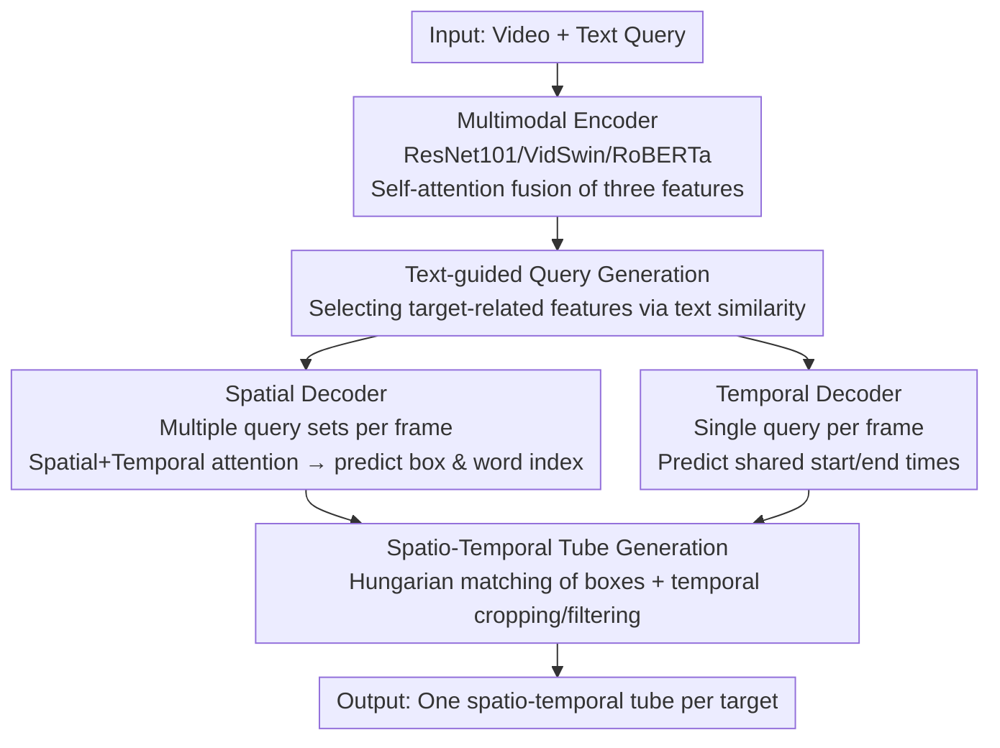

# OmniSTVG: Toward Spatio-Temporal Omni-Object Video Grounding

**Conference**: ICLR 2026  
**OpenReview**: [https://openreview.net/forum?id=azcQJtcYTE](https://openreview.net/forum?id=azcQJtcYTE)  
**Code**: https://jellyyao3000.github.io/OmniSTVG/ (Project Page)  
**Area**: Video Understanding / Multimodal Video Grounding  
**Keywords**: Spatio-Temporal Video Grounding, Multi-Object Grounding, BOSTVG, OmniTube, Transformer

## TL;DR
This paper extends the classic task of "Spatio-Temporal Video Grounding (STVG) grounding only a single target" to OmniSTVG—grounding **all** targets (including interacting objects) mentioned in a text query. It proposes the first large-scale benchmark BOSTVG (10,018 videos, 287 categories, 1–10 targets) and a DETR-based method, OmniTube, which outperforms existing STVG methods adapted for this task across all metrics.

## Background & Motivation
**Background**: Spatio-Temporal Video Grounding (STVG) requires localizing a "target" both spatially (bounding box per frame) and temporally (start and end times) given a free-form text query, outputting a spatio-temporal tube. Recent mainstream methods leverage DETR, adopting a single-stage Transformer approach to predict a tube end-to-end, showing superior performance over earlier two-stage "detect-then-match" approaches.

**Limitations of Prior Work**: Existing STVG only grounds a **single** target per query. However, in reality, a query often involves multiple targets—for example, "The man holding a basketball jumps up as the elephant steps on the seesaw" contains two objects: the elephant and the man. This leads to two issues: first, poor scalability, as the model must be run multiple times in multi-target scenarios; second, objects are rarely isolated, yet existing methods ignore "interacting objects," losing the context necessary for event understanding.

**Key Challenge**: The output structure of STVG is constrained by the "single-target tube" prior, assuming a query corresponds to only one grounded object. True video understanding requires simultaneously grounding **every** object mentioned in the query (regardless of quantity or category, including interactants).

**Goal**: Define and solve a new task—simultaneously grounding all targets mentioned in a query across space and time, outputting an independent spatio-temporal tube for each object, where the number of objects is arbitrary (1 to many) and categories can differ.

**Key Insight**: The authors draw an analogy to Segment Anything (SA)—while SA "segments any region in an image," this work "grounds any object mentioned in a query within an untrimmed video," migrating the "omni-coverage" concept to spatio-temporal grounding.

**Core Idea**: Learn **multiple sets of object queries** (instead of a single set) per frame within a DETR-style decoder to ground all targets at once. Use text to guide the selection of target-related features from the video to generate these queries, and finally use a simple matching and filtering strategy to string per-frame detection results into spatio-temporal tubes for each target.

## Method

### Overall Architecture
OmniSTVG aims to solve "one query, multiple targets, each with a spatio-temporal tube." The proposed method, OmniTube, follows the DETR encoder-decoder paradigm and splits the pipeline into three parts: first, a **multimodal encoder** fuses 2D appearance, 3D motion, and text into a unified multimodal feature $\tilde{\mathcal{F}}$; then, a **spatio-temporal decoder** (spatial and temporal branches) learns the spatial position (boxes per frame) for each object and a shared temporal boundary; finally, a **spatio-temporal tube generation module** matches and filters boxes across frames to form tubes. The primary difference from existing STVG is that the spatial decoder learns **multiple sets of queries** per frame ($N_q$ sets per frame) to ground an arbitrary number of objects simultaneously.

### Key Designs

**1. OmniSTVG Task and BOSTVG Benchmark: From "Single Target" to "All Targets"**

The fundamental contribution is the redefinition of the task itself. While classic STVG grounds one object, OmniSTVG grounds all targets mentioned (including interacting ones) into independent tubes. To support this, the authors built BOSTVG—the first and largest OmniSTVG benchmark: 10,018 videos, 10.2 million frames, and 287 categories Organized into a coarse-to-fine hierarchy. Each video includes a free-form query with 1 to 10 targets (average 2.4). Videos were collected from YouTube (CC license) and filtered from an initial 15K+ set. Annotations include temporal boundaries and frame-by-frame boxes for each object, following a "annotation → three-expert verification → return if inconsistent" strategy (sampled validation yielded an IoU of 0.90). Compared to concurrent work DVD-ST, BOSTVG is superior in "grounding all objects (not just some)," "supporting different categories (not just the same class)," and scale (10K vs 2.75K).

**2. Text-guided Query Generation: Seeding Queries with Target Clues**

Traditional DETR object queries are randomly initialized and target-agnostic, which slows convergence in multi-target scenes. This work uses text to "pick" target-related features for query initialization. Specifically, fused features are decomposed back to $[\tilde{\mathcal{F}}_a, \tilde{\mathcal{F}}_m, \tilde{\mathcal{F}}_t]$, and text features are average-pooled to $\bar{\mathcal{F}}_t$. The spatial branch calculates similarity with appearance features, taking the Top-$M$ most similar features and average-pooling them to generate initial spatial queries per frame:

$$q^0_{i,j} = \text{AvgPooling}(\text{Top}M(\text{Sim}(\tilde{\mathcal{F}}_a, \bar{\mathcal{F}}_t)))$$

Generating $N_q$ sets of queries per frame is key to supporting multi-object grounding. The temporal branch follows suit but uses motion features $\tilde{\mathcal{F}}_m$ for a single temporal query $p^0_i$ per frame, as all targets share the same temporal boundaries. This renders queries target-aware from the start.

**3. Spatio-Temporal Decoder: Modeling Intra-frame/Inter-frame Relationships**

To model both the spatial relations of multiple objects within a frame and the temporal consistency of an object across frames, the spatial decoder applies two attention blocks: a Spatial Attention Block (SAB) for self-attention among $N_q$ query sets in the same frame ($\{\hat{q}^{k-1}_{i,j}\}=\text{SABlock}(\{q^{k-1}_{i,j}\})$), and a Temporal Attention Block (TAB) for self-attention across frames for the same object. This is followed by cross-attention between queries and multimodal features: $Q_k = \text{CrossAttBlock}(\tilde{Q}_{k-1}, [\tilde{\mathcal{F}}_a, \tilde{\mathcal{F}}_t])$. The spatial head predicts boxes $B\in\mathbb{R}^{N_v\times N_q\times 4}$ and a "word index" $G$—mapping each box to a word in the query to determine its object identity. The temporal decoder uses TAB and cross-attention to predict start/end probabilities $H_s, H_e$.

**4. Spatio-Temporal Tube Generation: Matching, Cropping, and Filtering**

The spatial branch provides $N_q$ boxes per frame, which must be linked into tubes. A two-step strategy is used: (i) **Tubelet Matching**—associating boxes across frames into $N_q$ tubelets using Hungarian matching on spatial positions and predicted categories; (ii) **Tubelet Filtering**—cropping tubelets using the temporal boundaries and **filtering out tubelets whose predicted categories do not appear in the query text**. This ensures only the requested targets are output.

### Loss & Training
The model predicts spatial boxes and temporal boundaries with joint optimization. During training: 2D and text backbones and multimodal encoders are initialized with pretrained MDETR; the 3D backbone (VidSwin) is frozen, and other modules are trained end-to-end. The Adam optimizer is used with a backbone learning rate of 1e-5 and 1e-4 elsewhere. Frame sampling is FPS=2, with text length $N_t=30$ and channel dimension $D=256$. Loss weights are $\lambda_h=2, \lambda_k=1$.

## Key Experimental Results

### Main Results
In the absence of existing OmniSTVG methods, the authors adapted three single-target STVG frameworks (TubeDETR, STCAT, CG-STVG) for comparison on BOSTVG.

| Subset | Metric | OmniTube | STCAT† | CG-STVG† | TubeDETR† |
|---|---|---|---|---|---|
| Full | m tIoU | **35.83** | 33.31 | 32.09 | 31.05 |
| Full | m vIoU | **9.47** | 8.03 | 7.66 | 7.52 |
| Full | vIoU@0.3 | **6.17** | 3.35 | 3.56 | 3.14 |
| Low (1-3 objects) | m vIoU | **10.11** | 8.52 | 8.29 | 7.99 |
| Medium (4-6) | m vIoU | **7.24** | 6.20 | 5.30 | 5.81 |
| High (≥7) | m vIoU | **4.42** | 4.36 | 3.22 | 3.91 |

OmniTube leads across all density levels and metrics. The advantage is particularly evident in stricter metrics like vIoU@0.3 (6.17 vs. 3.56). Additionally, performance drops as target density increases (Low→High), highlighting the challenge of multi-object grounding.

### Ablation Study

Spatial Decoder (Tab. 4):

| Config | m tIoU | m vIoU | Description |
|---|---|---|---|
| None | 34.33 | 8.25 | w/o TG-SQG/SAB/TAB |
| +SAB+TAB | 34.13 | 9.00 | Adding intra/inter-frame attention |
| +TG-SQG+TAB | 34.98 | 8.89 | Text-guided query |
| +TG-SQG+SAB | 35.42 | 9.15 | |
| Full | **35.83** | **9.47** | All components |

Temporal Decoder (Tab. 5):

| Config | m tIoU | m vIoU | Description |
|---|---|---|---|
| None | 26.06 | 6.66 | w/o TG-TQG/TAB |
| +TAB | 35.00 | 8.98 | Temporal attention only |
| +TG-TQG | 26.00 | 6.82 | Text-guided query only |
| Full | **35.83** | **9.47** | Both components |

### Key Findings
- **TAB in the temporal branch is critical for timing**: Adding TAB alone increases m tIoU from 26.06 to 35.00, whereas TG-TQG alone provides negligible gains, showing that text-guided queries require temporal modeling to function correctly.
- **Text-guided Queries (TG-SQG) provide discriminative clues**: In the spatial decoder, combining TG-SQG with either SAB or TAB improves scores, indicating it helps queries specialize for specific targets.
- **Increasing density raises difficulty**: m vIoU decreases monotonically across Low→Medium→High splits; BOSTVG's high box density (avg. 516.2 per video) is a significant challenge.

## Highlights & Insights
- **Task redefinition is the major contribution**: Opening STVG from "single object" to "all mentioned objects" is a simple yet inspiring shift, migrating the "omni-coverage" paradigm to video grounding.
- **Asymmetric "Multi-query spatial vs. Shared-query temporal" design**: Recognizing that objects vary spatially but share temporal boundaries in this task simplifies the temporal branch significantly.
- **Using "Word Indices" to map boxes to text**: Borrowing from MDETR to map boxes to query words provides a natural way to filter out irrelevant objects in multi-target scenarios.
- **Transferability**: The "Top-M similarity for query initialization" method, which anchors visual queries with language, could be transferred to other open-vocabulary or multi-target video tasks.

## Limitations & Future Work
- The method is intentionally simple; tube generation relies on Hungarian matching and heuristic filtering rather than end-to-end tube modeling. Performance remains low in high-density scenes (vIoU@0.5 near 0).
- The assumption that all targets share the same start/end times is too strong for scenarios where different objects appear at different times within the same query.
- BOSTVG only considers cases where targets are present in the video, lacking negative samples where a query mentions an object not in the scene.

## Related Work & Insights
- **vs. Classic STVG (TubeDETR / STCAT / CG-STVG)**: These ground single targets; this work adapts them to multi-target settings and outperforms them using multi-query learning and text-guided initialization.
- **vs. DVD-ST (Concurrent Work)**: DVD-ST supports multiple targets but only of the **same category** and ignores interactants; OmniSTVG grounds **all** mentioned objects across categories at a larger scale (10K vs 2.75K videos).
- **vs. Segment Anything (Conceptual Inspiration)**: While SA segments any region, OmniSTVG grounds any object mentioned in a query, applying the "omni" paradigm to spatio-temporal localization.

## Rating
- Novelty: ⭐⭐⭐⭐⭐ Redefines the task + first large-scale benchmark.
- Experimental Thoroughness: ⭐⭐⭐⭐ Solid baselines and ablation, though absolute performance remains low.
- Writing Quality: ⭐⭐⭐⭐ Clear motivation and visual aids.
- Value: ⭐⭐⭐⭐⭐ Dataset + Task + Baseline triplet provides a foundation for future work.

<!-- RELATED:START -->

## Related Papers

- [\[CVPR 2026\] OmniGround: A Comprehensive Spatio-Temporal Grounding Benchmark for Real-World Complex Scenarios](../../CVPR2026/video_understanding/omniground_a_comprehensive_spatio-temporal_grounding_benchmark_for_real-world_co.md)
- [\[CVPR 2026\] SARL-STG: A Spatially Aware Reinforcement Learning Framework for Refining MLLMs in Spatio-Temporal Video Grounding](../../CVPR2026/video_understanding/sarl-stg_a_spatially_aware_reinforcement_learning_framework_for_refining_mllms_i.md)
- [\[ICLR 2026\] OmniCVR: A Benchmark for Omni-Composed Video Retrieval with Vision, Audio, and Text](omnicvr_a_benchmark_for_omni-composed_video_retrieval_with_vision_audio_and_text.md)
- [\[ICLR 2026\] Invert4TVG: A Temporal Video Grounding Framework with Inversion Tasks Preserving Action Understanding Ability](invert4tvg_a_temporal_video_grounding_framework_with_inversion_tasks_preserving_.md)
- [\[CVPR 2026\] T2SGrid: Temporal-to-Spatial Gridification for Video Temporal Grounding](../../CVPR2026/video_understanding/t2sgrid_temporal-to-spatial_gridification_for_video_temporal_grounding.md)

<!-- RELATED:END -->
