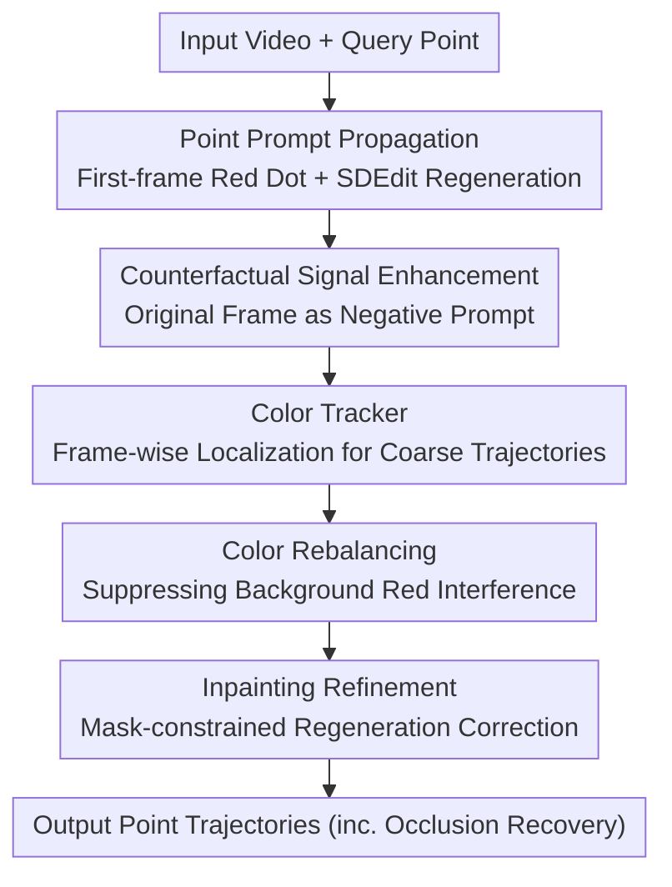

# Point Prompting: Counterfactual Tracking with Video Diffusion Models

**Conference**: ICLR 2026  
**OpenReview**: [https://openreview.net/forum?id=6FFQ007qLX](https://openreview.net/forum?id=6FFQ007qLX)  
**Project Page**: https://point-prompting.github.io  
**Code**: TBD  
**Area**: Video Understanding / Point Tracking / Video Diffusion Models  
**Keywords**: Point Tracking, Video Diffusion Models, Counterfactual Modeling, Zero-shot, SDEdit

## TL;DR
This paper discovers that pre-trained image-conditioned video diffusion models possess inherent "zero-shot point tracking" capabilities. By painting a conspicuous red dot on the target point in the first frame and regenerating subsequent frames using SDEdit, the red dot is propagated through each frame to trace a trajectory. Combined with "counterfactual enhancement using the original frame as a negative prompt," this method outperforms all zero-shot baselines on TAP-Vid, approaches self-supervised methods, and can track through occlusions.

## Background & Motivation
**Background**: Trackers and video generators solve mirror problems—the former analyzes motion, while the latter synthesizes it. Extensive work has leveraged this connection (using trackers to supervise/control video generation or using "trackability" to evaluate generation quality), but the direction has almost exclusively been "tracking helping generation."

**Limitations of Prior Work**: Conversely, the zero-shot route of "generation helping tracking" has been difficult. Unlike high-level tasks such as object recognition that can be described with text captions, tracking is hard to induce with text prompts. Existing zero-shot correspondence methods (DIFT, SD-DINO) treat pre-trained diffusion models as feature extractors, extracting internal features for frame-to-frame matching. This is essentially pair-wise matching and cannot handle occlusions. Another route, counterfactual world models (CWM, Opt-CWM), requires specialized training of masked autoencoders and auxiliary optical flow modules, making them not "off-the-shelf."

**Key Challenge**: Video generators clearly possess object permanence (objects persist through occlusion), a capability highly desired for tracking. However, this capability is "locked" within generative networks without an interface to read it out without training or feature extraction.

**Goal**: To "ask" high-quality long-range point trajectories directly from off-the-shelf image-conditioned video diffusion models without any training or reliance on specific architectures, while maintaining robustness to occlusion.

**Key Insight**: The authors draw inspiration from counterfactual modeling—carefully perturbing input and observing how the generation responds. Here, the perturbation is "painting a dot on the query point," and the response is "the position where the generative model propagates this dot in subsequent frames."

**Core Idea**: Using a visual prompt (red dot on the first frame) + SDEdit regeneration treats point tracking as "letting the generative model draw markings for me on every frame," followed by simple color detection to extract the trajectory.

## Method

### Overall Architecture
The method reformulates "tracking a point" as "generating a video with a marker": the input is a real video + pixel coordinates of a query point, and the output is the position of that point in each frame. The process is: paste a pure red circular dot at the query point in the first frame (interpretable as part of the object surface); apply SDEdit by adding intermediate noise to the video and denoising to let the model "propagate" the red dot; enhance the counterfactual signal by using the original unedited first frame as a negative prompt to prevent the model's strong prior from discarding the "unnatural" red dot; use a minimalist color-based tracker to locate the red dot frame-by-frame for a coarse trajectory; finally, perform coarse-to-fine refinement using inpainting and video color rebalancing to avoid background interference.

### Key Designs

**1. Point Prompt + SDEdit Propagation: Turning Tracking into "Generator Markers"**

Addressing the pain point that tracking cannot be induced by text prompts, the authors use visual prompts: painting a pure red dot at the query point in the first frame. This edited frame is fed as a condition, and SDEdit adds intermediate noise $x_t = \sqrt{\bar\alpha_t}x_0 + \sqrt{1-\bar\alpha_t}\epsilon$ (for $1<t<T$) before reverse denoising. Since video diffusion models preserve the coarse structure of the original video while changing fine-grained details, the red dot is treated as part of the object surface and moves with it. This step allows the generative model's inherent object permanence to directly serve tracking—the red dot can reappear after occlusions, which pair-wise matching methods cannot achieve.

**2. Counterfactual Signal Enhancement: Negative Prompting to Force Retention**

The strong prior of generative models often deems the "red dot unnatural" and erases it within a few frames, causing propagation failure. The authors use a negative prompt to suppress the probability of the "result looking like the original video." At each denoising step, two first-frame conditions are used to estimate noise—one with the red dot $\phi(c_I)$ and one original $c_I$. Weighted subtraction is then applied:
$$\tilde\epsilon_\theta(x_t, c_I) = (\lambda+1)\cdot\epsilon_\theta(x_t, \phi(c_I)) - \lambda\cdot\epsilon_\theta(x_t, c_I).$$
Following the correspondence between denoising and scores, this is equivalent to shifting the sampling score away from the "unedited condition" within a classifier-free guidance framework, pushing the generation toward samples "containing the red dot." Unlike CWM which subtracts two generated images ($\mathbb{E}_{p(x|\phi(c_I))}[x]-\mathbb{E}_{p(x|c_I)}[x]$), this method places the contrastive constraint inside the sampler as guidance. The authors found that direct image subtraction introduces artifacts due to small shifts in object positions between samples, whereas guidance is more stable. Ablations show AJ drops from 48.60 to 22.03 without this component, making it the most critical part of the pipeline.

**3. Color Tracker + Color Rebalancing: Minimalist and Robust Localization**

Once the red dot moves with the object in the generated video, locating it requires no complex model. The tracker searches for red pixels in HSV space within a radius $r$ window around the previous position $(u_{k-1}, v_{k-1})$, taking the stable center of nearby red dots. If no red dot is found, it determines occlusion, maintains the last known position, and gradually expands $r$ until the dot reappears. To handle background interference from naturally red objects, color rebalancing is performed: decreasing saturation in red regions of the original video before generation so that the red marker is the unique tracking cue. This significantly reduces false detections during occlusion (removing it drops AJ from 48.60 to 34.86).

**4. Coarse-to-Fine Inpainting Refinement: Correcting Pixel Misalignment**

Precise tracking requires pixel-perfect alignment between generated and original videos. However, SDEdit regeneration often introduces slight drifts. The authors leverage the inpainting capability of diffusion models: after obtaining a coarse trajectory, a spatiotemporal binary mask $m$ is constructed with radius $r$ around the tracked point. Using the inpainting formula:
$$x_{t-1} = m\odot\tilde x_{t-1} + (1-m)\odot x_{t-1}^{\text{original}}$$
the generation is rerun, allowing only the area near the tracking point to change while keeping the rest of the frame identical. This refines the red dot position while preserving the background (removing refinement drops AJ from 48.60 to 42.70).

### Loss & Training
The method is entirely zero-shot with no training. All video models use 50 denoising steps, a noise strength of 0.5, and empty text prompts. The optimal query point radius is 2 pixels. An additional "distillation" branch was tested: pseudo-label trajectories were generated for 1000 unlabeled Kinetics videos to train a CoTracker from scratch, resulting in a feed-forward tracker that is orders of magnitude faster with performance approaching the teacher.

## Key Experimental Results

### Main Results
Evaluated on TAP-Vid using position accuracy $<\delta^x_{\text{avg}}$, occlusion accuracy OA, and average Jaccard AJ.

| Method | Supervision | DAVIS AJ↑ | DAVIS OA↑ | Kinetics AJ↑ |
|------|---------|-----------|-----------|--------------|
| CoTracker3 | Supervised | 64.45 | 90.90 | 54.35 |
| Opt-CWM | Self-supervised | 47.53 | 80.87 | 44.85 |
| GMRW | Self-supervised | 36.47 | 76.36 | 25.70 |
| DINOv2+NN | Zero-shot | 15.19 | 61.81 | 12.69 |
| DIFT | Zero-shot | 21.51 | 69.71 | 15.10 |
| SD-DINO | Zero-shot | 29.68 | 69.71 | 16.47 |
| **Ours (Wan2.1-14B)** | Zero-shot | **42.21** | **82.90** | 27.36 |

Ours achieves an AJ of 42.21 on DAVIS, surpassing all zero-shot baselines and even the self-supervised GMRW. The occlusion accuracy of 82.90 is higher than both zero-shot and self-supervised methods, approaching supervised levels, highlighting the generative model's object permanence. Using original high-resolution DAVIS frames, AJ reaches 48.60, outperforming the self-supervised Opt-CWM.

### Ablation Study

| Configuration | DAVIS AJ↑ | Description |
|------|-----------|------|
| Full Model | 48.60 | All components |
| w/o Refinement | 42.70 | Removed inpainting refinement, position accuracy drops |
| w/o Counterfactual Enhancement | 22.03 | Removed negative prompt, tracking lost after 5-6 frames |
| w/o Color Rebalancing | 34.86 | Increased false detections from background red |
| tracker only | 11.26 | Direct tracking of original pixel colors without propagation |

Video model ablation: Wan2.1-14B (48.60) > Wan2.1-1.3B (44.58) > CogVideoX (24.15). Stronger generative models directly result in better tracking.

### Key Findings
- Counterfactual enhancement is the lifeline: Without it, AJ halves to 22.03 as the model erases the red dot almost immediately.
- Performance stems from "point propagation" rather than the tracker itself: The tracker-only baseline is only 11.26, indicating the key is the model's ability to reliably transport the red dot with the object.
- Generation quality ∝ Tracking quality: Larger models and higher resolutions (closer to training distribution) yield more accurate tracking.
- Hyperparameter sensitivity: Noise strength of 0.5 and a query radius of 2 pixels are optimal.

## Highlights & Insights
- Reformulating "tracking" as "asking the generator to draw markers" bypasses the fundamental difficulty that tracking cannot be induced by text prompts—an elegant problem transformation.
- Using the original unedited frame as a negative prompt to combat the generative prior of "ignoring unnatural perturbations" is a crucial engineering insight for counterfactual modeling with strong generators. Incorporating the contrast into sampler guidance is more stable than subtracting generated images.
- The pipeline is architecture-agnostic and zero-training, making it plug-and-play for any image-conditioned video diffusion model, benefiting automatically as generators improve.
- The distillation branch proves that temporal reasoning capabilities of generative models can be transferred into lightweight feed-forward trackers, providing a reusable paradigm for "slow generator → fast tracker."

## Limitations & Future Work
- Authors acknowledge high computational overhead: Tracking a single point requires generating an entire video (approx. 30 minutes for Wan2.1-14B). Efficiency is the main drawback, potentially mitigatable via distillation, one-step sampling, or multi-point tracking.
- The generative model sometimes fails to interpret the red dot as "attached to the object surface," particularly for computer-generated (potentially OOD) videos.
- Failure modes exist such as "stationary points" (red dot treated like dust on the lens) and "symmetric mis-propagation" (point on right foot propagated to the left foot).
- Performance is lower on synthetic TAP-Vid Kubric since video models are primarily trained on real-world footage.

## Related Work & Insights
- **vs DIFT / SD-DINO (Zero-shot feature matching)**: These involve extracting internal features for pair-wise matching and cannot handle occlusions. Ours "prompts" the model to visually draw the trajectory, which is architecture-agnostic and leverages object permanence for occlusion.
- **vs Opt-CWM / CWM (Counterfactual world models)**: These require specialized training of masked autoencoders for future frame prediction plus auxiliary optical flow modules. Ours is fully frozen and relies on prompting existing video diffusion models with zero training.
- **vs Nam et al. (Concurrent video feature extraction)**: That work involves complex, architecture-dependent layer analysis for feature selection and does not handle occlusion. Ours is architecture-agnostic and explicitly handles occlusion.

## Rating
- Novelty: ⭐⭐⭐⭐⭐ Elegant reformulation using visual prompts for tracking.
- Experimental Thoroughness: ⭐⭐⭐⭐ Extensive ablation on models and resolutions, but only tested on TAP-Vid; efficiency analysis is sparse.
- Writing Quality: ⭐⭐⭐⭐⭐ Clear and self-consistent explanation of motivation, methodology, and counterfactual derivation.
- Value: ⭐⭐⭐⭐ Reveals hidden tracking capabilities of generative models; highly heuristic and inspiring, though current utility is limited by efficiency.

<!-- RELATED:START -->

## Related Papers

- [\[CVPR 2026\] MotionEnhancer: Leveraging Video Diffusion for Motion-Enhanced Vision-Language Models](../../CVPR2026/video_understanding/motionenhancer_leveraging_video_diffusion_for_motion-enhanced_vision-language_mo.md)
- [\[CVPR 2026\] Generative Point Tracking and Forecasting](../../CVPR2026/video_understanding/generative_point_tracking_and_forecasting.md)
- [\[ECCV 2024\] DINO-Tracker: Taming DINO for Self-Supervised Point Tracking in a Single Video](../../ECCV2024/video_understanding/dino-tracker_taming_dino_for_self-supervised_point_tracking_in_a_single_video.md)
- [\[CVPR 2026\] MV-TAP: Tracking Any Point in Multi-View Videos](../../CVPR2026/video_understanding/mv-tap_tracking_any_point_in_multi-view_videos.md)
- [\[CVPR 2026\] Real-World Point Tracking with Verifier-Guided Pseudo-Labeling](../../CVPR2026/video_understanding/realworld_point_tracking_with_verifierguided_pseud.md)

<!-- RELATED:END -->
