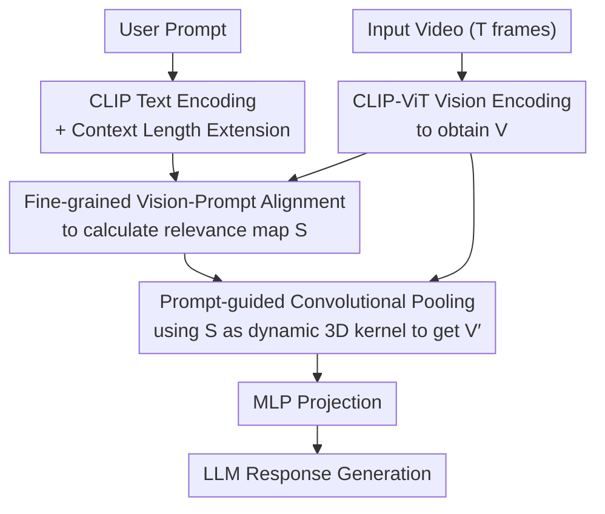

# PPLLaVA: Varied Video Sequence Understanding With Prompt Guidance

**Conference**: ICLR 2026  
**OpenReview**: [https://openreview.net/forum?id=LOLhTA51tr](https://openreview.net/forum?id=LOLhTA51tr)  
**Code**: TBC  
**Area**: Video Understanding / Multimodal VLM  
**Keywords**: Video LLM, Visual token compression, Prompt-guided pooling, CLIP, Long video understanding

## TL;DR
To address the inefficiency caused by excessive visual tokens in Video LLMs, PPLLaVA utilizes a "prompt-video relevance map" calculated by CLIP as a dynamic 3D convolution kernel to compress tokens. This approach reduces visual sequences by up to 1/18 while preserving key information relevant to user instructions, achieving both speedup and performance gains across seven video understanding benchmarks.

## Background & Motivation

**Background**: The mainstream approach for recent Video LLMs (e.g., LLaVA-Video, Qwen2.5-VL, InternVL3) is to feed all visual tokens from every frame into the LLM, relying on ultra-long contexts (often 16k+) to model temporal sequences for long video understanding.

**Limitations of Prior Work**: This "full-token" approach incurs massive computational overhead—vast numbers of visual tokens lead to slow inference and high memory consumption, making deployment difficult in real-time or resource-constrained scenarios. To alleviate this, existing methods use token compression: early methods used temporal average pooling (which loses temporal dynamics); long-video approaches introduced visual memory or keyframe selection (which are inflexible for short videos and slow due to frame-by-frame searching); conditional token pooling is more general, but **pooling inevitably led to performance degradation**, forcing existing models to conservatively compress by only 4x, compromising between efficiency and performance.

**Key Challenge**: Can much more aggressive compression be achieved without performance loss? The authors argue the key lies in the **redundancy of videos**—critical information is often concentrated in a few frames, and user instructions usually only concern a small part of the video (Fig 1(a): the same video has different key segments for different questions). Much content is irrelevant to the current query. If only instruction-relevant visual features are preserved during compression, it should be possible to save tokens without losing (or even while gaining) performance.

**Key Insight**: While Q-Former achieves "token compression + instruction interaction," modern MLLMs have shifted toward simpler linear projections or MLPs for better training efficiency and faster inference. The authors pose a **Core Problem**: Can a pooling strategy be designed that maintains the token efficiency and instruction alignment of Q-Former while retaining the simplicity and scalability of current mainstream models?

**Core Idea**: Use "prompt-video token relevance weights" calculated by CLIP as a **dynamic 3D convolution kernel** for weighted pooling. This concentrates information from high-weight (instruction-relevant) frames while compressing visual tokens to any target size.

## Method

### Overall Architecture

Like most Video LLMs, PPLLaVA consists of a "vision encoder + mapping layer + LLM," but it adds a **text encoder** (CLIP-text) paired with the vision encoder. Given a $T$-frame video, the CLIP-ViT vision encoder extracts visual features $V \in \mathbb{R}^{T \times W \times H \times D}$. Simultaneously, the user query is fed into the CLIP text encoder to obtain text features $c$. These enter the core **Prompt-guided Pooling** module: first, fine-grained relevance scores $S$ between each video token and the text are calculated; then, $S$ is used as a convolution kernel weight to compress $V$ into $V' \in \mathbb{R}^{T' \times W' \times H' \times D}$ (reducing tokens by over 90%). $V'$ is projected via an MLP and fed to the LLM. $V'$ contains significantly fewer tokens than $V$ and concentrates information relevant to the user's instructions.

The process is a clear pipeline: "Dual vision/text encoding → Alignment & weight calculation → Prompt-guided pooling compression → Projection → LLM generation":

### Key Designs

**1. Fine-grained Vision-Prompt Alignment: Calculating Relevance via CLIP Dual Towers**

To "preserve only instruction-relevant frames," the model must identify which video tokens relate to the text. The authors reuse the original CLIP dual encoders: the user query is fed into the CLIP text encoder, taking the CLS token $c \in \mathbb{R}^D$. Then, for each position $(t,w,h)$, the attention score between the video token and the text is calculated and normalized across all spatio-temporal positions using softmax:

$$s_{(t,w,h)} = \frac{\exp(\tau\, c \cdot f_{clipv}(v_{(t,w,h)}))}{\sum_{t}\sum_{w}\sum_{h} \exp(\tau\, c \cdot f_{clipv}(v_{(t,w,h)}))}$$

Where $\tau$ is the CLIP temperature coefficient and $f_{clipv}$ is the CLIP vision projection. A key detail: $v_{(t,w,h)}$ uses patch tokens from the penultimate layer of CLIP. Applying $f_{clipv}$ still maps patch tokens into the text-interaction space. The resulting relevance map $S=\{s_{(t,w,h)}\}$ serves as the pooling "blueprint," calculating fine-grained weights in a single forward pass without adding extra parameters compared to frame-searching methods.

**2. Prompt-guided Convolutional Pooling: Dynamic 3D Convolution via Relevance Maps**

After obtaining token-level weights, how should they be compressed? Traditional contrastive learning uses 1D features, but this task requires **preserving the 3D spatio-temporal structure** for LLM temporal modeling. The authors use a 3D convolution-like pooling approach. Let the spatio-temporal kernel and stride be $(k_t, k_w, k_h)$ and $(d_t, d_w, d_h)$. The output size is:

$$T' = \frac{T-k_t}{d_t}+1,\quad W' = \frac{W-k_w}{d_w}+1,\quad H' = \frac{H-k_h}{d_h}+1$$

The key difference is that the kernel parameters are **dynamic weights from the relevance map $S$** rather than fixed learned weights. As the kernel slides across $V$, weights are pulled from the corresponding locations in $S$. The feature at output position $(t,w,h)$ is the weighted sum of video features within the kernel window:

$$v'_{(t,w,h)} = \sum_{i=0}^{k_t-1}\sum_{j=0}^{k_w-1}\sum_{k=0}^{k_h-1} v_{(t\cdot d_t+i,\, w\cdot d_w+j,\, h\cdot d_h+k)} \cdot s_{(t\cdot d_t+i,\, w\cdot d_w+j,\, h\cdot d_h+k)}$$

Adjustable kernel sizes and strides allow for controlled output dimensions, supporting various video lengths and joint image training (e.g., $(1,3,3)$ for images and $(2,3,3)$ for videos). Ablations (Table 5) show that "weighted average preserving 3D structure" significantly outperforms spatio-temporal decoupled pooling (which drops to 44.1 due to structural loss), max pooling, and TOME-style token merging.

**3. CLIP Context Length Extension: Asymmetric Positional Encoding Interpolation**

The CLIP-text encoder is the only added component, but it has a fixed short context length (77 for CLIP, 64 for SigLIP), which is insufficient for long prompts or multi-turn dialogues. The authors use **asymmetric positional encoding extension**. Instead of random initialization or standard linear interpolation at a ratio $r$:

$$P'_i = P_{\lfloor j \rfloor} + (j-\lfloor j \rfloor)\cdot(P_{\lfloor j \rfloor+1}-P_{\lfloor j \rfloor}),\quad j = i\cdot r$$

The authors found that **linear interpolation performed worse than random tail initialization** because uniform interpolation disrupts the well-trained prefix information of CLIP. Since CLIP is trained primarily on short sentences, earlier positional encodings are more robust. They adopted **asymmetric interpolation**: using a larger $r$ for the early segment (to preserve prefix information) and a smaller $r$ for the tail (to extend the range). In practice, $r=1$ for $i<20$ and $r=0.25$ for $i\geq 20$. This maximizes the retention of CLIP pre-training knowledge while extending the context, improving long video understanding (Table 3).

### Loss & Training

PPLLaVA supports **plug-and-play migration** from image-based or unified MLLMs. Initializing from pre-trained MLLMs allows skipping expensive alignment pre-training and moving directly to instruction fine-tuning. In this stage, the LLM, MLP projection, and CLIP text encoder are fully fine-tuned. Training data includes multi-turn/single-turn dialogues across images, videos, and multi-image inputs. **Interleaved training** is used (mixing data types within the same batch) to help the model adapt across varied sequence lengths. Videos are sampled at 32 frames with a $(2,3,3)$ pooling kernel/stride, compressing tokens by 18x (much more aggressive than the 4x in Qwen-VL or LLaVA-Video). Training takes approximately 36 hours on 16x A100 or 32x 910B NPUs. For the InternVL3 version, which uses a heavily post-trained InternViT-300M, the authors performed one contrastive pre-training pass on 10 million pairs from LAION + Wukong to align the vision-text encoders.

## Key Experimental Results

### Main Results

On seven video understanding benchmarks, PPLLaVA consistently improves performance when applied to three different bases (image-domain LLaVA-Next, video-domain LLaVA-Video, and general InternVL3), demonstrating generalization across encoders (CLIP / SigLIP / InternViT).

| Model | NextQA | EgoSchema | A-Net | VCG-Bench | MVBench | L-V-Bench | VideoMME(Overall) |
|------|--------|-----------|-------|-----------|---------|-----------|-------------------|
| LLaVA-OneVision | 79.4 | 60.1 | 56.6 | 3.49 | 56.7 | 56.4 | 58.2 |
| LLaVA-Video | 82.2 | 57.3 | 56.5 | 3.52 | 58.4 | 58.2 | 63.2 |
| InternVL3 | - | - | - | - | 75.4 | 58.8 | 66.2 |
| **PPLLaVA (LLaVA-Video)** | 84.1 | 61.6 | 59.7 | 3.66 | 58.8 | 60.4 | 64.5 |
| **PPLLaVA (InternVL3)** | 86.8 | 63.9 | 60.3 | 3.61 | 75.6 | 60.3 | 67.1 |

Compared to LLaVA-OneVision, PPLLaVA (LLaVA-Video) improves by 4.7% / 1.5% / 3.1% / 4% / 6.3% on NextQA / EgoSchema / ActivityNet / LongVideoBench / VideoMME respectively. On long videos exceeding 30 minutes, it outperforms LLaVA-Video by 3.7% despite using significantly fewer tokens, highlighting its efficiency in extracting key information from highly redundant footage.

### Ablation Study

Component ablation (Table 3, VideoMME w/ subs, TP = seconds/video):

| Configuration | Context Length | VCG-Bench Avg | VideoMME Overall | TP |
|------|-----------|---------------|------------------|----|
| LLaVA-Next (Avg Pooling) | 576 | 3.09 | 43.4 | 2.9 |
| LLaVA-Next (No Pooling, Full tokens) | 4608 | 3.20 | 47.4 | 15.0 |
| + Prompt-guided Pooling | 1024 | 3.21 | 48.9 | 4.6 |
| + CLIP Context Extension | 1024 | 3.32 | 50.0 | 4.6 |

Average pooling is fastest but performs worst. Full tokens perform well but have extremely low throughput (15.0s/video). Prompt-guided pooling compresses tokens to 1024, restores throughput to 4.6s, and outperforms the full-token version (48.9 vs 47.4). Adding CLIP context extension further boosts performance to 50.0.

### Key Findings
- **Prompt-guided pooling is the core gain source**: It improves both efficiency and performance. Outperforming the "full token" baseline with 1024 tokens suggests that many visual tokens are redundant or even harmful.
- **Preserving 3D spatio-temporal structure is critical**: Ablations (Table 5) show decoupled pooling drops to 44.1, while weighted average (53.6) > max pooling (52.0) > token merging (51.9).
- **Spatio-temporal pooling asymmetry**: Increasing spatial kernel/stride significantly improves efficiency with minimal performance loss (Fig 3), whereas temporal compression yields smaller efficiency gains and more noticeable performance drops (Fig 4). Thus, $(2,3,3)$ is chosen as a compromise.
- **Image tasks also benefit**: On MMMU / MathVista / MMB, PPLLaVA maintains or exceeds LLaVA-Next performance while compressing tokens by 1/9, showing potential for lightweight MLLMs.

## Highlights & Insights
- **Using relevance maps directly as convolution kernels** is the most clever step: relevance scores are no longer just scalars for filtering or frame selection but represent dynamic 3D convolution weights, enabling alignment and compression in a single operator with minimal parameters.
- **Quantifying video redundancy**: Drawing on the concept of "certificate length" (the minimum segment needed to answer a question), the authors used CLIP to measure per-frame similarity to the query, providing empirical proof that many visual tokens are unnecessary.
- **Plug-and-play, no re-training**: Unlike Q-Former requiring three-stage pre-training, PPLLaVA is introduced during instruction tuning, allowing seamless migration from SOTA MLLMs with flexible output sizes.
- The insight that "user instructions determine which video parts are important" is transferable: any task with redundant inputs and sparse queries can benefit from query-guided weighted aggregation over blind downsampling.

## Limitations & Future Work
- Pooling depends on the CLIP text encoder; when **user queries have low information** (e.g., generic summarization or captioning), the relevance map becomes nearly uniform, reducing the advantage of prompt guidance.
- Temporal pooling degrades performance more than spatial pooling, indicating that **temporal information is more fragile**. Aggressive temporal compression remains a bottleneck for heavy temporal reasoning tasks.
- The asymmetric interpolation for CLIP-text context ($i<20, r=1; i\geq20, r=0.25$) is empirical and lacking a systematic design framework.
- The InternVL3 version required an additional 10 million image-text pairs for contrastive pre-training, meaning the "no pre-training" claim varies depending on the base model's alignment state.

## Related Work & Insights
- **vs Q-Former (BLIP/InstructBLIP)**: Both do compression and interaction, but PPLLaVA has < 1/10 the parameter/compute overhead, avoids three-stage pre-training, and offers flexible query counts rather than fixed outputs.
- **vs Average Pooling / PLLaVA (AdaptiveAvgPool)**: The former is non-parametric but loses instruction relevance and is limited to ~4x compression; PPLLaVA allows 18x compression while retaining key frames through prompt weighting.
- **vs Keyframe Selection (VideoAgent / VideoTree / LVNet)**: These search for keyframes frame-by-frame, incurring high runtime costs as a filtering strategy. PPLLaVA is a model framework that calculates fine-grained weights in one pass, improving both efficiency and benchmarks like NextQA and EgoSchema.

## Rating
- Novelty: ⭐⭐⭐⭐ The perspective of using relevance maps as dynamic 3D kernels is novel and effective, though rooted in weighted pooling extensions.
- Experimental Thoroughness: ⭐⭐⭐⭐⭐ Comprehensive coverage across 7 video benchmarks, 3 backbones, image tasks, and multidimensional ablations.
- Writing Quality: ⭐⭐⭐⭐ Clear logic from motivation to method. Effective use of formulas and redundancy analysis.
- Value: ⭐⭐⭐⭐⭐ 18× token compression balancing performance and efficiency has direct utility for long video understanding and lightweight deployment.

<!-- RELATED:START -->

## Related Papers

- [\[CVPR 2026\] FlashMotion: Few-Step Controllable Video Generation with Trajectory Guidance](../../CVPR2026/video_understanding/flashmotion_fewstep_controllable_video_generation.md)
- [\[CVPR 2026\] Learning from Synthetic Data via Provenance-Based Input Gradient Guidance](../../CVPR2026/video_understanding/learning_from_synthetic_data_via_provenance-based_input_gradient_guidance.md)
- [\[CVPR 2026\] SAM2Text: Towards Prompt-Free and Multi-Resolution Video Scene Text Segmentation](../../CVPR2026/video_understanding/sam2text_towards_prompt-free_and_multi-resolution_video_scene_text_segmentation.md)
- [\[ICLR 2026\] ScaleLong: A Multi-Timescale Benchmark for Long Video Understanding](scalelong_a_multi-timescale_benchmark_for_long_video_understanding.md)
- [\[ICLR 2026\] FOCUS: Efficient Keyframe Selection for Long Video Understanding](focus_efficient_keyframe_selection_for_long_video_understanding.md)

<!-- RELATED:END -->
