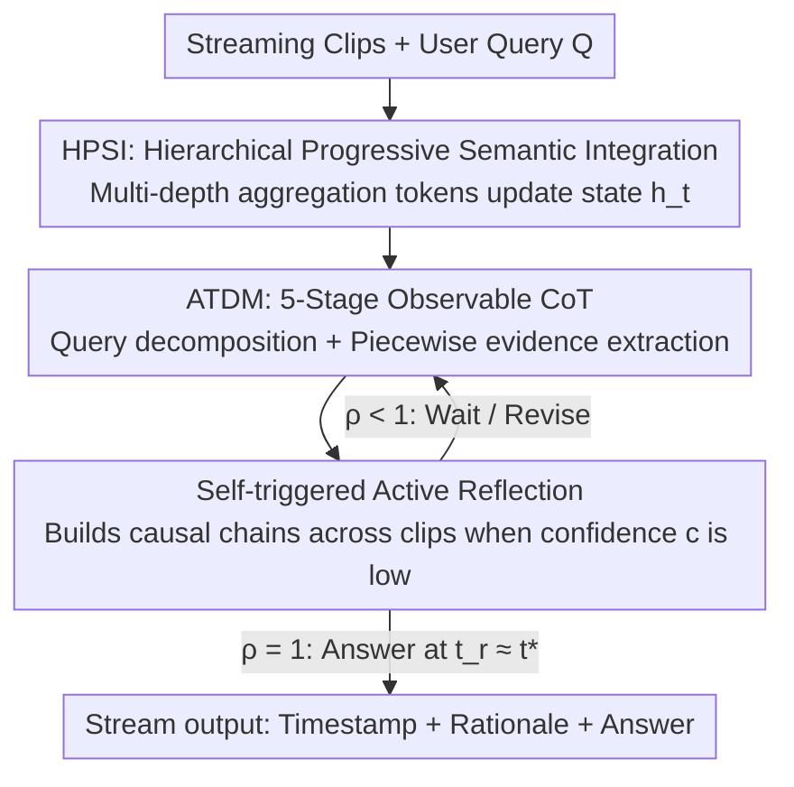

# Progressive Online Video Understanding with Evidence-Aligned Timing and Transparent Decisions

**Conference**: ICLR 2026  
**OpenReview**: [https://openreview.net/forum?id=oKB0CacHaM](https://openreview.net/forum?id=oKB0CacHaM)  
**Area**: Video Understanding / Multimodal VLM  
**Keywords**: Online Video Understanding, Streaming Inference, Evidence-Aligned Timing, Transparent Decisions, Hierarchical Memory

## TL;DR
Addressing the issue of "when exactly to answer in an online streaming video"—a question often neglected by offline evaluations—this paper proposes the Thinking-QwenVL framework. It utilizes an Active Thought Decision Maker (ATDM) that externalizes progress $\rho$ and confidence $c$ to align the response timing with the "first sufficient evidence" moment $t^\star$. Additionally, it maintains global causal states within token budgets through Hierarchical Progressive Semantic Integration (HPSI) tokens propagated across clips, improving the StreamingBench SOTA from 67.63% to 71.60%.

## Background & Motivation
**Background**: Mainstream large video models (VideoLLaMA3, InternVL3, Qwen2-VL, etc.) are almost exclusively evaluated under "offline" ideal settings—where the entire video is pre-loaded, frames can be repeatedly retrieved and re-encoded, and the model performs global reasoning before generating an answer. This approach excels at compressing massive visual tokens and performing QA on long videos.

**Limitations of Prior Work**: In real-world scenarios, a user may ask a question at time $t_q$, but the "first sufficient evidence" required to answer often does not appear until $t^\star$. Offline pipelines bypass the most critical requirement of interactive scenarios: evidence-aligned response timing. Existing streaming methods fall into two unsatisfactory categories: (1) Fixed-timing methods (StreamBridge, Flash-VStream, VideoLLM-Online, etc.) directly set $t_r = t_q$, answering as soon as the question is asked without judging evidence sufficiency. (2) Timing-decision methods (e.g., Dispider uses a binary "answerable/unanswerable" head; Timechat-Online binds answerability to scene changes) collapse timing decisions into a black-box switch. Users cannot see timestamps, intermediate conclusions, or progress, and these models lack reasonable stopping criteria, often getting stuck in an "unanswerable" state, appearing frozen.

**Key Challenge**: In online settings, three issues become critical simultaneously: decision transparency (black-box 0/1 gates destroy controllability and trust), response timing alignment (minimizing $\delta = |t_r - t^\star|$ without sacrificing accuracy), and global causal updates under tight budgets (revising hypotheses and propagating spatio-temporal constraints as new clips arrive, rather than myopic local updates that break causal consistency). All three share a root cause: coupling "inference control" and "memory integration" within an unobservable process.

**Goal**: To decouple online video understanding into two independently solvable sub-problems: (1) Aligning response timing with evidence while making the decision process visible and auditable to users. (2) Maintaining a compact cognitive state that is continuously refined with the stream and preserves cross-clip relationships within token/latency budgets.

**Key Insight**: Transparency should not be a post-hoc explanation but a first-class objective. Replacing an opaque gate with a multi-stage, observable decision process allows the externalization of evidence-aligned timestamps, progress $\rho$, concise rationales, and estimated response times $t_r$. When confidence $c$ is low, it can self-trigger cross-clip reflection.

**Core Idea**: Decouple "inference control" from "memory integration." Use a transparent thinking controller (ATDM) that externalizes $(\rho, c)$ to determine when to answer, and a set of Hierarchical Progressive Semantic Integration (HPSI) tokens propagated across clips to maintain global causal states. Together, they achieve online responses that occur "as soon as evidence appears, with a clear explanation of why."

## Method

### Overall Architecture
Thinking-QwenVL formalizes online video understanding as follows: given a set of visible clips $V_t = \{v_1, \dots, v_t\}$ and a compact cognitive state $h_t$, for each new clip $v_{t+1}$, the HPSI first updates the state $h_{t+1} = U(h_t, v_{t+1})$. Then, ATDM decomposes the "evidence-aligned response timing decision" on top of $h_{t+1}$ into a sequence of sub-goals $S$, maintaining time-indexed triples $(a_s(t), c_s(t), \rho_s(t))$ (sub-answer, confidence, progress). It decides whether to answer now (output $t_r$) or continue waiting/reflecting. When all sub-goals are confidently resolved ($\rho(t_i)=1$), the model provides the final answer at $t_r = t_i \approx t^\star$, with timestamps and intermediate conclusions streamed to the user in real-time.

The pipeline is decoupled into a "memory side (HPSI) + control side (ATDM)" and progresses clip-by-clip:

### Key Designs

**1. HPSI: Maintaining Propagatable Global Causal States within Fixed Budgets**

This design targets the "global causal update under tight budget" pain point. Naive approaches either cram all visual tokens into the context (exploding the budget) or use single-layer average pooling (losing hierarchy and temporal relations). HPSI distributes "compression" across different depths of the transformer: at each clip's visual token sequence $I = \text{concat}(w, v, w)$, learnable aggregation tokens $p^{(j)}_{\text{clip}_i}$ are inserted at depths $\ell_j \in \{0, L/3, 2L/3\}$ for three levels $j \in \{1,2,3\}$. The token ratios are $3\times : 2\times : 1\times$, progressively compressing the dense visual stream into fewer, semantically denser tokens. Each aggregation token is initialized via adaptive average pooling: $p^{(j)}_{\text{clip}_i} = \text{AdapterPool}(p^{(j-1)}_{\text{clip}_i}, (4-j)N_{vc})$.

The key is a structured sparse attention mask that enforces "hierarchical visibility": level $j$ tokens can only see the previous level's tokens, ensuring unidirectional semantic convergence. Text tokens only causally attend to the highest-level aggregation tokens at each layer, while the first-frame token of each clip is preserved as an anchor. This allows shallow layers $[0, L/3]$ to integrate raw visual evidence, middle layers $[L/3, 2L/3]$ to integrate the previous level, and deep layers $[2L/3, L]$ to refine high-level semantics. Training includes a progressive integration objective: $\min T_{\text{integration}} = \sum_l \sum_j (\|p^{(j)(l)}_{\text{clip}_i} - \text{Pool}(v_{\text{clip}_i})\|^2 + \|p^{(j)(l)}_{\text{clip}_i} - p^{(j-1)(l)}_{\text{clip}_i}\|^2)$. These $p$ tokens are carried forward across clips as part of $h_t$, enabling global updates without budget overflow.

**2. ATDM: Online Responding as an Externalized 5-Stage Observable CoT**

This design addresses "decision transparency + timing alignment." Instead of an opaque 0/1 gate, it factorizes the timing decision $t_r = \min\{t \mid F(h_t, Q) = A\}$ into a compact Chain-of-Thought with explicit telemetry:

$$\text{Part-1 Query-guided Captioning Instruction} \to \text{Part-2 Query Decomposition} \to \text{Part-3 Clip Captioning} \to \text{Part-4 Sub-answer Filling} \to \text{Part-5 Active Thought}$$

Part-1 analyzes the query to generate an "observation checklist" $CI_q$, focusing captions on query-relevant elements. Part-2 decomposes the query into verifiable sub-questions $\{S_q\}$ (e.g., objects, actions, spatial relations) to quantify progress. Part-3 generates captions $\{C_q\}$ guided by $CI_q$. Part-4 answers sub-questions using $\{C_q\}$, providing $(value, c)$ and progress $\rho$, feeding the state back for cross-frame tracking. When all sub-answers are confident, the model responds at $t_r \approx t^\star$. A modular scheduler parallelizes evidence extraction and sub-answer updates across adjacent clips.

**3. Self-triggered Active Reflection: Upgrading Binary Decisions to History-Aware Control**

This addresses the "myopic updates breaking causal consistency" issue. ATDM monitors the confidence of each sub-answer. If scores drop or remain low (e.g., $\le 0.50$), or if a major semantic shift occurs, it triggers "Active Thought"—reviewing prior captions $\{C_q\}$, detecting temporal drift, and building explicit causal chains across clips (identifying if new evidence supports, contradicts, or refines hypotheses). The continuous $(\rho, c)$ signal carries much more information than a binary gate, allowing "evidence sufficiency" to be a history-aware judgment rather than an isolated yes/no.

### A Complete Example
Using the visualization example: A question is asked at 0:02:06—"What text is visible on the right side of the street?" (Options: Excavator / CRANE / WEST NEW YORK / Loader). Part-1 sets observation requirements: text on the right, candidate objects, and context signs. Part-2 decomposes sub-questions: Is there text? What is it? Are there other objects? Part-3 generates captions for the clip 0:01:04–0:02:08 describing the NYC street, construction barriers, "WEST NEW YORK" signs, and an excavator. Part-4 fills sub-answers: "WEST NEW YORK" (c=0.95), "excavator..." (c=0.85), pushing progress $\rho$ to 100%. At 0:01:36, active thought was triggered to maintain the state. Once $\rho=1$, the model answers, aligning $t_r$ with the first appearance of sufficient evidence $t^\star$.

### Loss & Training
The core training objective for HPSI is the progressive integration loss $T_{\text{integration}}$ (Eq. 5), encouraging tokens to faithfully integrate clip evidence while refining smoothly across layers. The implementation uses a Qwen-VL-style vision-language decoder with a single-pass streaming paradigm.

## Key Experimental Results

### Main Results
Thinking-QwenVL achieves strong results across multiple online benchmarks while maintaining competitive performance on long videos.

| Dataset | Metric | Ours | Prev. SOTA | Description |
|--------|------|------|----------|------|
| StreamingBench | Acc | **71.60%** | 67.63% | Real-time visual understanding, +3.97 |
| OVOBench | Acc | 46.9% | — | Online video understanding |
| OVBench | Acc | 35.6% | — | Online video understanding |
| RTVBench | Acc | 35.9% | — | Real-time video |
| VideoMME | Acc | 67.7% | — | Long video, remains competitive |
| MLVU | Acc | 68.3% | — | Long video, remains competitive |

On StreamingBench, it significantly outperforms open-source offline long video models (e.g., LongVA, Video-CCAM typically score 50–54) and approaches proprietary models like Gemini 1.5 Pro (75.69) and GPT-4o (73.28).

### Ablation Study

| Configuration | Key Capability | Description |
|------|---------|------|
| Full (ATDM + HPSI) | Transparent Decision + Global Causal Memory | Complete model, best evidence-aligned timing |
| w/o ATDM | Lost transparent $(\rho,c)$ and timing alignment | Degrades to fixed/black-box timing, increases $\delta$ |
| w/o HPSI | Lost cross-clip causal state | Decreased performance on long videos and cross-clip relations |

### Key Findings
- The two modules are complementary: ATDM drives evidence-aligned timing and streaming interpretability, while HPSI supports cross-clip causal relationships.
- Transparent $(\rho, c)$ is more than just UI-friendly; it improves decision quality by compressing the history of intermediate judgments into the context.
- Self-triggered reflection is particularly effective for scenarios with semantic shifts, correcting story-line breakages caused by myopic updates.

## Highlights & Insights
- **Transparency as a First-Class Objective**: Unlike works that treat interpretability as a post-hoc byproduct, this paper makes the decision process (timestamps, progress, rationales) explicit, serving both user interaction and decision quality.
- **Aggregation by Transformer Depth**: HPSI assigns shallow/middle/deep layers to preserve local evidence, integrate patterns, and refine high-level semantics, respectively.
- **$(\rho, c)$ as a Transferable Control Signal**: Upgrading "when to stop" from a binary judgment to a continuous historical signal is a concept transferable to any streaming agent (audio, sensor streams, robotics).
- **Formalization of Timing $(t_q, t_r, t^\star, \delta)$**: Provides a clear, optimizable target for "at which frame a model should answer."

## Limitations & Future Work
- Evaluation relies on benchmarks where $t^\star$ annotation can be subjective; "first sufficient evidence" is hard to define for complex queries.
- The 5-stage CoT introduces additional token and inference overhead; its feasibility on low-latency/compute-constrained edge devices needs more discussion.
- Confidence $c$ is self-assessed, potentially leading to over/under-confidence and timing shifts. Robustness of thresholds (e.g., 0.50) across tasks requires further study.
- Portability of the method to other backbones or pure audio-video streams remains to be verified.

## Related Work & Insights
- **vs. Fixed-timing Streaming (StreamBridge / Flash-VStream)**: These focus on streaming read/alignment/memory but set $t_r = t_q$; Ours aligns $t_r$ to $t^\star$ to avoid answering in an "evidence vacuum."
- **vs. Timing Decision (Dispider)**: Dispider uses a binary head with no transparency or stopping criteria; Ours uses an observable multi-stage decision process.
- **vs. Timechat-Online**: It binds answerability to scene changes, which are not always synonymous with evidence sufficiency; Ours uses "sub-question resolution" as a more semantic criterion.
- **vs. Offline Long Video (LongVA / VideoRAG)**: These assume full video visibility; HPSI performs progressive hierarchical integration under streaming constraints.

## Rating
- Novelty: ⭐⭐⭐⭐⭐ Formalizes timing and transparency as first-class goals; effectively decouples control from memory.
- Experimental Thoroughness: ⭐⭐⭐⭐ Strong SOTA across 6 benchmarks; however, $\delta$ analysis for $t^\star$ could be more granular.
- Writing Quality: ⭐⭐⭐⭐ Progression of motivation is logical; HPSI details are dense but clear.
- Value: ⭐⭐⭐⭐⭐ Online video agents are a high-demand direction; the transparent decision paradigm is highly transferable.

<!-- RELATED:START -->

## Related Papers

- [\[CVPR 2026\] PyraTok: Language-Aligned Pyramidal Tokenizer for Video Understanding and Generation](../../CVPR2026/video_understanding/pyratok_language-aligned_pyramidal_tokenizer_for_video_understanding_and_generat.md)
- [\[AAAI 2026\] FineVAU: A Novel Human-Aligned Benchmark for Fine-Grained Video Anomaly Understanding](../../AAAI2026/video_understanding/finevau_a_novel_human-aligned_benchmark_for_fine-grained_video_anomaly_understan.md)
- [\[ICML 2026\] VideoSEAL: Mitigating Evidence Misalignment in Agentic Long Video Understanding by Decoupling Answer Authority](../../ICML2026/video_understanding/videoseal_mitigating_evidence_misalignment_in_agentic_long_video_understanding_b.md)
- [\[ICLR 2026\] ARFlow: Auto-regressive Optical Flow Estimation for Arbitrary-Length Videos via Progressive Next-Frame Forecasting](arflow_auto-regressive_optical_flow_estimation_for_arbitrary-length_videos_via_p.md)
- [\[NeurIPS 2025\] LiveStar: Live Streaming Assistant for Real-World Online Video Understanding](../../NeurIPS2025/video_understanding/livestar_live_streaming_assistant_for_real-world_online_video_understanding.md)

<!-- RELATED:END -->
