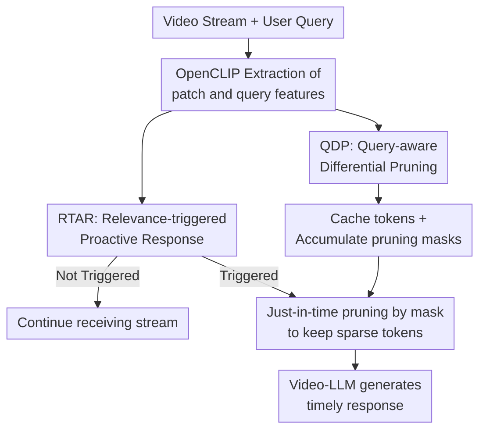

# QueryStream: Advancing Streaming Video Understanding with Query-Aware Pruning and Proactive Response

**Conference**: ICLR2026  
**OpenReview**: [https://openreview.net/forum?id=738HjJEbml](https://openreview.net/forum?id=738HjJEbml)  
**Code**: https://github.com/Zhangkr2003/QueryStream  
**Area**: Video Understanding / Streaming Video Understanding  
**Keywords**: Streaming Video Understanding, Query-Aware Pruning, Proactive Response, Video-LLM, Visual Token Compression

## TL;DR
QueryStream integrates user queries directly into token pruning and response scheduling for streaming video. It utilizes Query-aware Differential Pruning (QDP) to filter irrelevant or redundant visual tokens and employs RTAR to proactively trigger the Video-LLM at "relevant and informative" moments. This approach attains or exceeds strong online baselines while retaining only 30%-57% of tokens.

## Background & Motivation
**Background**: Video understanding is transitioning from offline Q&A to online interaction. In scenarios like autonomous driving, embodied AI, live monitoring, and real-time editing, models must process unbounded video streams and determine which content to retain and when to respond, rather than waiting for the video to end. While current Video-LLMs are powerful, most still follow offline batch processing logic, treating sequences as finite frame sets.

**Limitations of Prior Work**: The primary difficulty in streaming video is not comprehension of a single frame, but the continuous growth of highly redundant information. Sending full visual tokens to a Video-LLM every second causes computational and latency explosions. Conversely, standard change detection often misidentifies camera cuts, black frames, or background motion as significant events. Methods like TimeChat-Online rely on a "change-is-important" assumption that conflates visual dynamics with actual semantic relevance to the user.

**Key Challenge**: Online video understanding must simultaneously address "what to watch" (retaining new query-related information within a continuous stream) and "when to speak" (avoiding interruptions during irrelevant changes while not missing brief, critical events). Relying solely on visual changes leads to false triggers, while focusing only on query relevance may cause repetitive responses to static but relevant scenes.

**Goal**: The authors aim to construct a lightweight, training-free, plug-and-play streaming video understanding module for existing Video-LLMs. It must reduce useless context at the token level and proactively select response timing at the interaction level without relying on a retrained specialized scheduler.

**Key Insight**: Redundancy in video streams is relative to user intent rather than absolute. A frame with dramatic changes should be pruned if it is irrelevant to the query; a frame with slow movement should be retained and potentially trigger a response if it directly relates to the query.

**Core Idea**: Token retention is determined by both query-aware semantic relevance and temporal novelty under a dynamic history. Proactive response is triggered by the conjunction of a relevance gate and an information density gate.

## Method

### Overall Architecture
QueryStream acts as an intelligent gateway between the raw video stream and the backbone Video-LLM. It does not modify backbone models like Qwen2.5-VL or TimeChat-Online. Instead, it uses a lightweight OpenCLIP encoder to continuously monitor video frames and user queries, caching visual tokens in memory while generating pruning masks and response triggers for each frame.

The process consists of two parallel paths: QDP generates masks for "which patch tokens are worth retaining" per frame, while RTAR judges "whether the Video-LLM should generate a response now." Only when RTAR triggers does the system perform just-in-time pruning on cached tokens using QDP masks before feeding them with the query into the Video-LLM.

A critical detail is that QDP determines masks without immediately sending all tokens to the Video-LLM; the backbone is only activated by RTAR at the appropriate moment. This decouples "continuous low-cost observation" from "infrequent high-cost inference," satisfying requirements for low latency and computation in streaming scenarios.

### Key Designs
**1. QDP Dual-Condition Pruning: Retaining tokens that are both relevant and novel**

Traditional differential pruning focuses on frame changes, assuming higher change equals higher importance. QueryStream's QDP filters each patch token through two criteria: semantic relevance to the query and temporal novelty relative to a dynamic history. For the $i$-th patch of the $t$-th frame, OpenCLIP extracts patch feature $v_t^i$ and query embedding $q$. The semantic mask uses the mean similarity within the current frame as an adaptive threshold:

$$
M_{sem}(t,i)=I\left( sim(q,v_t^i)>\frac{1}{N}\sum_{j=1}^{N}sim(q,v_t^j)\right)
$$

This threshold is not constant; it fluctuates with the frame's overall similarity. In complex scenes, it demands patches be more distinctive; in simple scenes, it prevents total deletion due to low absolute similarity.

Temporal novelty is compared against a dynamic smoothed history $\bar v_{dsh,t-1}^i$ for each patch position:

$$
M_{temp}(t,i)=I\left(sim(v_t^i,\bar v_{dsh,t-1}^i)<\tau_{temp}\right)
$$

The final pruning mask is the intersection of both conditions:

$$
M_{QDP}(t,i)=M_{sem}(t,i)\land M_{temp}(t,i)
$$

Consequently, a token enters the downstream only if it is query-relevant and brings new information. Irrelevant visual changes (cuts, background motion) do not trigger token retention, while slow, query-relevant actions are identified as useful info as they deviate from the history.

**2. Dynamic Smoothed History (DSH): Replacing fragile adjacent differences with mid-term memory**

Adjacent frame differencing is fragile in streaming video. Noise or jitters cause spikes, while slow actions may be ignored. QueryStream maintains a DSH for each patch position using exponential smoothing:

$$
\bar v_{dsh,t}^i=\alpha\cdot v_t^i+(1-\alpha)\cdot \bar v_{dsh,t-1}^i
$$

Using $\alpha=0.1$ ensures the history neither stalls in the distant past nor fluctuates with single-frame noise. Sensitivity experiments show that $\alpha=1.0$ (approximating adjacent frames) performs poorly due to noise sensitivity, while a very small $\alpha$ adapts too slowly. This mid-term history effectively distinguishes "transient visual shocks" from "sustained semantic changes."

**3. RTAR Dual-Gated Response: Relevance for "can speak," Density for "worth speaking"**

RTAR identifies the timing for responses without a trained EOS predictor. It uses two logic gates. The relevance condition $R_t$ compares the frame's mean visual feature $\bar v_t$ with query $q$; the topic is considered relevant if similarity exceeds $\tau_{rel}$:

$$
R_t=I(sim(q,\bar v_t)>\tau_{rel})
$$

The information density condition $D_t$ measures how many patches passed the QDP filter. If the keep rate exceeds $\tau_{den}$, sufficient new query-relevant information has arrived:

$$
D_t=I\left(\frac{1}{N}\sum_{i=1}^{N}M_{QDP}(t,i)>\tau_{den}\right)
$$

The trigger signal is $T_t=R_t\land D_t$. This avoids false triggers from irrelevant changes and prevents redundant answers on static relevant frames.

**4. Plug-and-Play Training-Free Module: Deferring high-cost inference**

QueryStream uses lightweight encoders (e.g., OpenCLIP-ViT-L/14) for front-end judgment, allowing the backbone (e.g., Qwen2.5-VL-7B) to be used as-is. Masks accumulate during streaming, while raw tokens stay in a buffer. The backbone is only called when RTAR triggers. This modularity allows QDP to be applied even to offline models as a context de-noising module, improving performance on VideoMME with roughly half the tokens.

### A Complete Example
If a user asks, "Remind me when someone picks up the red cup," traditional change-based methods might trigger on background lighting or camera movement. QueryStream filters out patches unrelated to "red cup" via semantic relevance and checks if remaining patches show new changes via DSH. As a hand approaches and picks up the cup, the relevant patches become both semantically relevant and temporally novel, causing the QDP keep rate to rise. When $R_t$ and $D_t$ are both met, the system prunes the cached tokens and prompts the Video-LLM to respond.

### Loss & Training
QueryStream is a training-free logic module. It uses OpenCLIP-ViT-L/14 for features and sets $\alpha=0.1$. Thresholds ($\tau_{temp}=0.90, \tau_{rel}=0.60, \tau_{den}=0.15$) were selected on an OVO-Bench validation set and fixed for all major experiments. All results are zero-shot plug-and-play.

## Key Experimental Results

### Main Results
The paper evaluates both online streaming and offline long video understanding.

| Dataset | Setting | Ours (QueryStream) | Comparison Method | Gain / Conclusion |
|--------|------|------------------|--------------|-------------|
| StreamingBench | 1 fps, keep 57.2% | 75.32 | TimeChat-Online keep 55.8%: 74.32 | +1.00 at same budget; near full-token baseline (75.36) |
| StreamingBench | 1 fps, keep 29.6% | 74.04 | TimeChat-Online keep 33.0%: 72.96 | +1.08 with fewer tokens |
| OVO-Bench | 1 fps, keep 52.9% | 49.4 | TimeChat-Online full-token: 46.7 | New SOTA; +2.7 over full-token baseline |
| OVO-Bench | 1 fps, keep 20.0% | 47.5 | TimeChat-Online keep 15.2%: 45.6 | Maintains lead under aggressive pruning |
| VideoMME | QDP keep 52.4% | 63.8 | TimeChat-Online keep 53.7%: 63.3 | +0.5 on offline long video |
| LongVideoBench | QDP keep 16.6% | 58.0 | TimeChat-Online keep 15.0%: 57.7 | Aggressive filtering aids high-redundancy tasks |

### Ablation Study
| Configuration | Keep Rate / Metric | Result | Note |
|------|------------------|------|------|
| No Pruning baseline | 100.0% keep | 75.36 (SB) | Reference upper bound |
| Visual Pruning Only | 63.4% keep | 74.76 | prunes useful semantics |
| Semantic Pruning Only | 61.7% keep | 74.52 | fails to distinguish old/new info |
| Full QDP | 57.2% keep | 75.32 | Best balance; near full-token performance |
| Density-Only trigger | OVO FAR Score 29.5 | Lowest | Triggered by irrelevant dynamics |
| Relevance-Only trigger | FAR Acc 40.3 / Score 30.2 | High Acc, Low Timing | Repeats answers on static frames |
| Full RTAR | FAR Acc 40.2 / Score 34.6 | Best Timing | Triggers only when info arrives |

### Key Findings
- QDP conditions are complementary: using only one leads to performance drops, while their intersection approaches full-token performance with much fewer tokens.
- DSH smoothing is critical: $\alpha=1.0$ is too sensitive to noise, while $\alpha=0.1$ distinguishes transient shocks from sustained changes.
- RTAR's advantage lies in timeliness: The dual-gate doesn't necessarily improve accuracy but significantly improves response timing scores.
- Offline experiments suggest QueryStream acts as context purification, as QDP allowed Qwen2.5-VL to outperform its full-token baseline by removing query-irrelevant noise.

## Highlights & Insights
- QueryStream redefines "importance" as query-relative rather than video-intrinsic.
- The shared signaling between QDP and RTAR creates a cohesive design where keep rates serve as information density signals.
- DSH provides a simple, effective mid-term memory without heavy modules.
- Query-aware pruning as context purification is a valuable insight for long-context multimodal retrieval and agent memory management.
- Training-free deployment makes it highly practical for real-world Video-LLM systems.

## Limitations & Future Work
- Dependency on CLIP: Representational limits of CLIP might lead to mis-pruning for fine-grained or abstract queries.
- Static Query Assumption: Real interaction involves evolving intents, requiring a dynamic query state not yet addressed.
- Fixed Thresholds: Different video domains or camera motions might require adaptive thresholds beyond the current validation-set tuning.
- Simulation Protocol: Response evaluation involved offline identification of triggers due to benchmark limitations at the time.
- Patch-History Alignment: Fixed spatial patch history may fail during heavy camera motion or frame re-ranking.

## Related Work & Insights
- **vs TimeChat-Online**: Moves beyond query-agnostic differential pruning to avoid being misled by irrelevant visual changes.
- **vs VideoLLM-online / StreamBridge**: Replaces trained schedulers with logic gates for better plug-and-play capability and lower cost.
- **Related Work**: Similar to offline query-aware pruning (e.g., Q-Frame) but optimized for incremental streaming without re-calculating history.
- **Insights**: Online multimodal systems should define "information density" around user intent to optimize token usage and memory management.

## Rating
- Novelty: ⭐⭐⭐⭐☆ Accurate problem framing using query-aware mechanisms for streaming.
- Experimental Thoroughness: ⭐⭐⭐⭐☆ Covers online/offline tasks and threshold analyses.
- Writing Quality: ⭐⭐⭐⭐☆ Logic is clear, though some tables are dense.
- Value: ⭐⭐⭐⭐⭐ Practical, training-free, and improves both efficiency and response timing.

<!-- RELATED:START -->

## Related Papers

- [\[ICLR 2026\] Memento: Toward an All-Day Proactive Assistant for Ultra-Long Streaming Video](memento_toward_an_all-day_proactive_assistant_for_ultra-long_streaming_video.md)
- [\[ICLR 2026\] A Training-Free Framework for Long Video Understanding via Video-Query-Options Similarity](a_training-free_framework_for_long_video_understanding_via_video-query-options_s.md)
- [\[CVPR 2026\] FluxMem: Adaptive Hierarchical Memory for Streaming Video Understanding](../../CVPR2026/video_understanding/fluxmem_adaptive_hierarchical_memory_for_streaming_video_understanding.md)
- [\[ICCV 2025\] Q-Frame: Query-aware Frame Selection and Multi-Resolution Adaptation for Video-LLMs](../../ICCV2025/video_understanding/q-frame_query-aware_frame_selection_and_multi-resolution_adaptation_for_video-ll.md)
- [\[CVPR 2026\] StreamingTOM: Streaming Token Compression for Efficient Video Understanding](../../CVPR2026/video_understanding/streamingtom_streaming_token_compression_for_efficient_video_understanding.md)

<!-- RELATED:END -->
