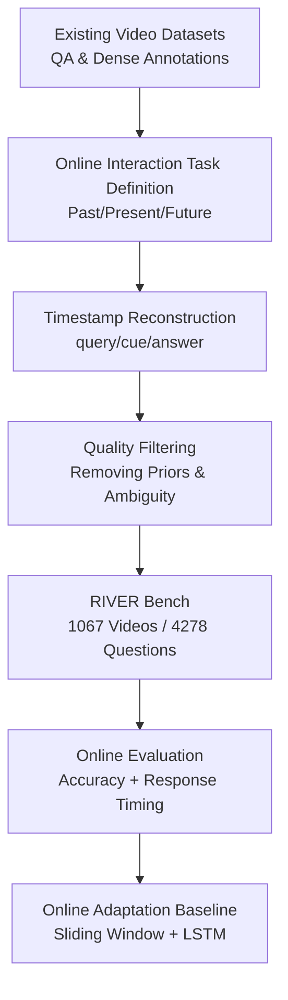

# RIVER: A Real-Time Interaction Benchmark for Video LLMs

**Conference**: ICLR2026  
**OpenReview**: [https://openreview.net/forum?id=xmtvHH62Ic](https://openreview.net/forum?id=xmtvHH62Ic)  
**Code**: https://github.com/OpenGVLab/RIVER  
**Area**: Video Understanding  
**Keywords**: Real-time video understanding, Video LLM, Online interaction, Long-short term memory, Proactive response

## TL;DR
RIVER Bench decomposes the online interaction capabilities of video LLMs into three categories: recalling the past, understanding the present, and proactively responding after waiting for future events. By utilizing timestamped QA and response timing metrics, it demonstrates that traditional offline Video LLMs, despite performing well in offline QA, significantly lack memory and timing judgment in authentic streaming interactions. Long-short term memory and specialized proactive training can yield substantial improvements.

## Background & Motivation
**Background**: Multimodal video LLMs can already answer long video questions in offline settings. The typical approach involves sampling a complete video into frames or segments, inputting them into the model simultaneously, and generating an answer. This paradigm is suitable for "understanding after watching the entire video," which has fostered offline benchmarks like MVBench, Video-MME, and LongVideoBench.

**Limitations of Prior Work**: Real interaction scenarios do not function this way. AR navigation, robot supervision, first-person assistants, or real-time companionship systems require the model to receive a video stream while remembering past events, answering questions about the current frame, and alerting the user when future conditions are met. While existing online/streaming benchmarks have introduced timestamps or online QA, they often remain variants of "querying at a specific time point," lacking fine-grained characterization of response timing, memory decay over time, and the waiting/triggering of future events.

**Key Challenge**: Offline video understanding aims to maximize the use of complete context, whereas online interaction requires "viewing only information prior to the current moment and responding at the appropriate time." This leads to two contradictions: first, the model cannot infinitely cache all video tokens without exceeding memory limits during long-term operation; second, the model must not only be accurate but also timely—especially in proactive responses, where premature alerts are false positives and late alerts lose interactive value.

**Goal**: The authors aim to establish a benchmark that distinguishes these capabilities: it must measure whether the model can remember events across different past time spans, understand the current short window, and continuously observe the video stream to respond when the target event occurs. Additionally, the paper provides a general online adaptation strategy to observe the performance gains of existing Video LLMs when integrated with long-short term memory and interaction training.

**Key Insight**: Instead of simplifying online video understanding into standard QA, the paper defines tasks based on the relationship between "cue occurrence time, query time, and response output time." By clearly labeling these three points, the model's memory capability, real-time perception, and future-waiting capability can be analyzed separately rather than being conflated in a single accuracy metric.

**Core Idea**: Redefine online interaction evaluation for Video LLMs using the RIVER Bench with precise temporal semantics, and demonstrate the main bottlenecks and improvement directions for real-time video assistants through long-short term memory and streaming response training.

## Method
RIVER consists of two parts: the benchmark itself, which defines online interaction tasks, constructs timestamped data, and designs evaluation metrics; and a general baseline that transforms offline Video LLMs into online inference models to verify if the issues revealed by the benchmark can be mitigated.

### Overall Architecture
The core input of RIVER is not a single query after a complete video, but a video stream progressing over time, a user query at a specific moment, and potential model responses generated at subsequent time points. The paper decomposes tasks into Retro-Memory, Live-Perception, and Pro-Response based on the location of the event cue relative to the current time. Fine-grained analysis is then performed on samples reconstructed from existing datasets with annotated query, cue, and answer times.

Formally, the paper represents online interaction as a window-based video-text-to-text task: the model generates a response $r_t$ at time $t$. The visible video is limited to the current window $V_{t':t}$, and the model also relies on historical modeling $h_{<t'}$, user query $q$, and prior responses $r_{<t}$. The training objective is $L=-\log P_\theta(r_t|V_{t':t},q,h_{<t'},r_{<t})$. Crucially, the response sequence can contain multiple EOS tokens to simulate silence, pausing, or waiting in real-time dialogue, rather than forcing the model to speak at every frame.

### Key Designs
**1. Three Online Interaction Tasks: Decoupling Memory, Perception, and Waiting**

RIVER's most significant design is the decomposition of online video interaction based on the relationship between the event cue time $t_V$ and the current visible window $[t',t]$. **Retro-Memory** focuses on past events where $t_V < t'$; users ask questions like "Where did I put the bag just now?" requiring the model to rely on history. **Live-Perception** focuses on information within the current or short-term window where $t' \le t_V \le t$, similar to real-time VQA but requiring immediate understanding of dynamics. **Pro-Response** focuses on future events where $t_V > t$; after a user poses a condition, the model must wait for the cue to appear before responding. 

**2. Data Reconstruction with Timestamps: Transforming Offline Labels into Interaction Scripts**

RIVER reuses existing sources such as Vript-RR, LVBench, LongVideoBench, Ego4D, and QVHighlights, reconstructing them into an online interaction format. Each sample specifies when the question is asked, when the visual cue occurs, and when the model should respond. For Retro-Memory, intervals are categorized as short, medium, long, and very long (up to 3600s). For Pro-Response, key events are selected from dense annotations to generate "remind me when you see X" type questions.

**3. Time-Sensitive Metrics: Penalizing Early and Late Responses**

While Retro-Memory and Live-Perception use accuracy, the **Response Accuracy Metric** for Pro-Response is more specialized. It defines a tolerance window $w$ around the true trigger time $t_g$. Responses within the window receive full points; premature responses receive 0 (equivalent to false positives); late responses decay linearly to 0 as interactive value diminishes.

**4. Long-Short Term Memory Adaptation: Enabling Offline Models to Run Continuously**

To enable offline Video LLMs for online evaluation, a general framework is proposed: processing the stream at 1fps using a sliding window. The current window tokens serve as short-term memory, while prior information is compressed into fixed long-term memory slots. When slots are full, $M$ memory slots are maintained by averaging the most similar adjacent segments, controlling memory costs to a constant level.

### Loss & Training
The training goal combines standard language modeling loss with streaming-specific loss. The model uses SigLIP-Large-Patch16 as the visual encoder and a two-layer MLP projecting into the LLaMA3-8B space, with LoRA applied to all linear layers. Proactive training data uses randomly sampled query timestamps to ensure the model learns to wait from any point in time.

## Key Experimental Results

### Main Results
The benchmark evaluates four types of models: closed-source commercial models, native online models, standard offline models, and adapted models.

| Model / Setting | Frames | Retro-Memory MC | Live-Perception MC | Pro-Response Instant | Streaming OE | Loc |
|:---|:---|:---:|:---:|:---:|:---:|:---:|
| GPT-4o | 50 | 59.56 | 61.05 | N/A | N/A | 1.63 |
| Gemini-1.5-pro | 50 | 36.35 | 52.19 | N/A | N/A | 1.51 |
| LLaVA-Video Offline | 16 | 46.00 | 41.00 | N/A | N/A | 4.25 |
| LLaVA-Video Online | 1fps | 42.71 | 51.38 | 19.50 | 27.55 | 6.21 |
| VideoChat-Flash Online| 1fps | 45.75 | 56.35 | 20.24 | 35.90 | 6.21 |

Key finding: Offline models possess some memory but lack proactive capabilities. Specialized RIVER training improved the "Instant" proactive score by approximately 11.28%.

### Ablation Study
Ablation results highlight the memory curve across distances. Most models exhibit performance decay as the interval from short to very long increases, but models with explicit online memory modules are more stable at medium-to-long distances.

| Cue Type | Best Group Result | Meaning |
|:---|:---|:---|
| Fine-grained | LLaVA-Video Offline 53.16 | Perception relies on strong encoding/sampling. |
| Causal Cues | VideoChat-Flash Online 40.92| Significantly weaker across all models; a key bottleneck. |
| Background | VideoChat-Flash Online 54.10| Relatively easier; memory helps maintain context. |

### Key Findings
- Strong offline performance does not automatically translate to online proficiency. GPT-4o is strong in perception but lacks native proactive streaming logic.
- Standard Video LLMs can gain proactive capabilities via online adaptation, but scores remain low (around 20%), indicating real-time assistants are far from solved.
- Causal cues are the most difficult, suggesting that future work must model event relationships and intentions rather than just increasing frame rates.

## Highlights & Insights
- RIVER's task definition captures the essence of online interaction through temporal constraints between queries, cues, and responses.
- The 0-score penalty for premature responses in Pro-Response reflects real-world requirements where false alarms damage trust.
- The emphasis on "memory curves" provides a more nuanced analysis than average accuracy, revealing whether a model simply forgets fast or lacks baseline perception.

## Limitations & Future Work
- **Audio Absence**: Real-time cues (e.g., alarms, door knocking) are often auditory; omitting audio limits the benchmark's coverage of real assistants.
- **Scenario Diversity**: While quality-controlled, the data relies on existing datasets. Future iterations should include more first-person robotic or AR navigation tasks.
- **Evaluation Bias**: Relying on LLMs for open-ended assessment may introduce bias; future metrics could incorporate fine-grained semantic event matching.

## Related Work & Insights
- **vs OV-Bench/OVO-Bench**: RIVER provides stricter definitions for response timing and finer granularity in memory distance evaluation.
- **vs StreamingBench**: RIVER focuses specifically on the interactive "handshake" between user queries and video cues.
- **vs LongVideoBench**: While those measure long-context understanding, RIVER evaluates the ability to process that context in a streaming, memory-constrained manner.

## Rating
- **Novelty**: ⭐⭐⭐⭐☆ (Strong task formalization, though builds on online understanding trends)
- **Experimental Thoroughness**: ⭐⭐⭐⭐☆ (Covers diverse model types and detailed error analysis)
- **Writing Quality**: ⭐⭐⭐⭐☆ (Concepts are well-defined; metrics are motivated)
- **Value**: ⭐⭐⭐⭐⭐ (Essential for the transition from "video analysis" to "video assistants")

<!-- RELATED:START -->

## Related Papers

- [\[ICML 2026\] ProAct-VL: A Proactive VideoLLM for Real-Time AI Companions](../../ICML2026/video_understanding/proact-vl_a_proactive_videollm_for_real-time_ai_companions.md)
- [\[CVPR 2026\] StreamRAG: Enhancing Real-Time Video Understanding with Retrieval Augmentation](../../CVPR2026/video_understanding/streamrag_enhancing_real-time_video_understanding_with_retrieval_augmentation.md)
- [\[ICLR 2026\] V2P-Bench: Evaluating Video-Language Understanding with Visual Prompts for Better Human-Model Interaction](v2p-bench_evaluating_video-language_understanding_with_visual_prompts_for_better.md)
- [\[CVPR 2026\] OmniGround: A Comprehensive Spatio-Temporal Grounding Benchmark for Real-World Complex Scenarios](../../CVPR2026/video_understanding/omniground_a_comprehensive_spatio-temporal_grounding_benchmark_for_real-world_co.md)
- [\[ICLR 2026\] CaReBench: A Fine-grained Benchmark for Video Captioning and Retrieval](carebench_a_fine-grained_benchmark_for_video_captioning_and_retrieval.md)

<!-- RELATED:END -->
