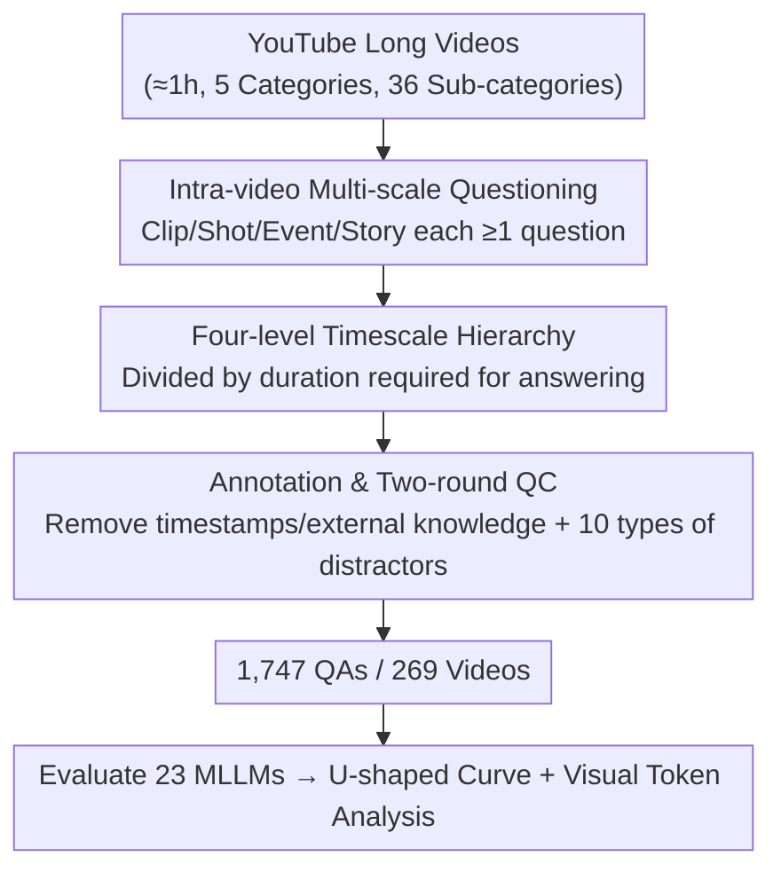

# ScaleLong: A Multi-Timescale Benchmark for Long Video Understanding

**Conference**: ICLR 2026  
**OpenReview**: [https://openreview.net/forum?id=95sD6KKq51](https://openreview.net/forum?id=95sD6KKq51)  
**Code**: https://github.com/multimodal-art-projection/ScaleLong  
**Area**: Video Understanding  
**Keywords**: Long Video Understanding, Multi-Timescale, MLLM Evaluation, Intra-video QA, U-shaped Curve

## TL;DR
ScaleLong proposes the first benchmark that embeds questions across four timescales—Clip, Shot, Event, and Story—**into the same long video**. This allows for a direct comparison of MLLM capabilities across different temporal granularities while keeping content fixed, revealing a consistent U-shaped performance curve (high at both ends, collapsed in the middle) across 23 models.

## Background & Motivation
**Background**: With the progress of MLLMs in image-text and short video tasks, numerous video understanding benchmarks (MVBench, Video-MME, MLVU, LongVideoBench, etc.) have emerged. Truly understanding a long video requires seamlessly integrating information across multiple temporal scales, from identifying momentary actions to grasping the entire narrative arc.

**Limitations of Prior Work**: Existing benchmarks for evaluating "multi-timescale capability" suffer from structural flaws. They either use isolated short segments (failing to examine long-range temporal dependencies) or scatter questions of different timescales **across completely different videos**—using Video A for Clip tasks and Video B for Story tasks.

**Key Challenge**: When temporal granularity and video content are coupled as variables, it is **impossible to disentangle the "model's true capability at a certain timescale" from its "adaptability to specific content."** If a model scores high on Story questions, is it because it excels at long-range reasoning or simply because those specific videos were easier? Existing benchmarks cannot answer this.

**Goal**: Design a benchmark that can diagnose MLLM temporal capabilities scale-by-scale with fine granularity while **controlling for content variables**.

**Key Insight**: The authors observe that since content variation is a confounding factor, one should **anchor questions of all four timescales to the same video content** (within-content / intra-video). By asking both Clip and Story questions within the same narrative, any performance gap between scales can only be attributed to the temporal granularity itself.

**Core Idea**: Replace "cross-video scattered questioning" with "intra-video embedded four-level timescale QA" to decouple temporal granularity from content, enabling a pure measurement of multi-timescale capabilities in MLLMs.

## Method

### Overall Architecture
ScaleLong is a **purely human-annotated** diagnostic benchmark (emphasizing quality over quantity rather than training data). It consists of 269 YouTube long videos (averaging 86 minutes) covering 5 major categories and 36 sub-categories, totaling 1,747 high-quality QAs. The core mechanism involves three layers: ① Defining **four hierarchical timescales: Clip, Shot, Event, and Story** for each video, ensuring at least one question per scale; ② Assigning 4–8 questions per video across 5 task types (Causal Reasoning, Object Recognition, Action Understanding, Information Summarization, Counting); ③ Utilizing an annotation pipeline (video filtering → Q/A/Distractor design → two-round quality control) to systematically remove reliance on absolute timestamps and external knowledge, forcing models to rely solely on video content. Finally, 23 MLLMs are evaluated to observe performance patterns across scales.

### Key Designs

**1. Intra-video Multi-timescale Questioning: Decoupling Temporal Granularity from Content**

This is the fundamental design that distinguishes ScaleLong from existing benchmarks, directly addressing the coupling of temporal granularity and content variables. For **every** long video, questions are designed for four different timescales, ensuring that both second-level Clip questions and full-length Story questions exist within the same narrative. Thus, when comparing a model's score difference between Clip and Event, the delta is cleanly attributed to "the difference in capability to handle different temporal spans," rather than "varying difficulty of different video contents." In Table 1, the authors mark this as IV-MTS (Intra-Video Multi-Timescale). ScaleLong is the only one to fulfill this—even if Video-MME / MLVU support multi-timescale (MTS), they still use cross-video questioning.

**2. Four-level Timescale Hierarchy: Defining Granularity by "Duration + Information Distribution"**

To make "timescale" operational and annotatable, the authors define levels based on the **video duration required to answer a question and the distribution of key information across frames**, rather than intuitive labels:

- **Clip**: Answerable by analyzing a few continuous frames, spanning only a few seconds ($\le 3s$), targeting instantaneous actions, immediate visual details, or simple objects.
- **Shot**: Requires integrating frames within a single continuous shot, roughly 4–15s, examining short-term dynamics, simple actions, or character interactions.
- **Event**: Significant events spanning multiple continuous shots, from 16s to 10 minutes, requiring multi-scene integration and understanding of event sequences and causal chains.
- **Story**: Covers the entire or most of the video (typically $>10$ minutes), requiring a global understanding of overall narrative logic, character development, themes, and long-range dependency reasoning.

This definition ensures a strict temporal progression, providing semantic support for findings like the "U-shaped curve," where the performance dip corresponds specifically to the middle "Shot/Event" ranges.

**3. Strict Annotation and Two-round Quality Control: Forcing Pure Content Understanding**

The credibility of a benchmark depends on annotation quality. The authors maintain this through a multi-stage pipeline. On the video side, 269 videos are filtered from YouTube based on clarity, information density, and duration. On the question side, annotators **must watch the entire video first**, then design questions for each of the four scales while balancing task types. Each question includes 1 correct answer and 3 distractors constructed from **10 predefined categories** (e.g., missing information, spatial replacement, temporal replacement), increasing challenge and enabling error attribution. QC is divided into two rounds: the first ensures correctness/clarity and **replaces absolute timestamps with descriptive clues**, forcing content-based reasoning. The second round eliminates confounding factors—any question answerable via common sense or external priors without relying on video-specific details is rewritten or removed. This "de-timestamping + de-external knowledge" design ensures the human baseline remains nearly consistent across scales (~91%), confirming that observed model fluctuations are due to model deficiencies rather than uneven question difficulty.

## Key Experimental Results

### Main Results
23 MLLMs (4 closed-source, 19 open-source, 7B–78B) were evaluated at 240p resolution with their maximum tested frame counts. The core finding is a **cross-scale U-shaped curve**: performance is high at the ends (Clip, Story) and collapses in the middle (Shot, Event).

| Model | Clip | Shot | Event | Story | Overall |
|------|------|------|-------|-------|---------|
| Human | 92.8 | 91.3 | 88.9 | 91.0 | 91.0 |
| Gemini 1.5 Pro | 71.5 | 62.8 | 68.0 | 69.0 | **67.9** |
| Doubao 1.5-VL Pro | 66.4 | 52.8 | 55.2 | 60.2 | 58.7 |
| InternVL2.5-78B | 65.2 | 54.3 | 53.4 | 61.5 | 58.6 |
| GPT-4o | 61.8 | 50.7 | 51.0 | 58.0 | 55.4 |
| Gemini 2.0 Flash | 65.7 | 52.4 | 48.4 | 53.4 | 55.0 |
| LLaVA-Mini (Weakest) | 29.7 | 25.3 | 28.8 | 25.2 | 27.3 |

- **Ubiquity of the U-shape**: Gemini 1.5 Pro scores 71.5% on Clip and 69.0% on Story, but drops to 62.8% on Shot. This indicates MLLMs are good at capturing instantaneous details and overall narratives but struggle with temporal coherence in medium-length segments.
- **Human Performance is Nearly Flat**: (92.8 / 91.3 / 88.9 / 91.0), proving that question difficulty is consistent across the four scales and model fluctuations stem from internal capability flaws.
- **Closed-source > Open-source, but all far below Human**: The strongest model, Gemini 1.5 Pro (67.9%), is 23.1 percentage points lower than humans (91.0%). The largest gap is in Shot (Human 91.3% vs. GPT-4o 50.7%, a 40.6 point difference).
- **Task Type Divergence**: Object Recognition (OR) is generally the highest, while Counting (CP) is the lowest—Doubao 1.5-VL Pro shows a 23.7 point gap between OR and CP, and GPT-4o shows a 26.6 point gap, exposing MLLM weaknesses in precise numerical grounding.

### Ablation Study
Ablations were conducted on the "total visual tokens" and their "frame count vs. resolution" allocation.

| Configuration | Key Observation | Description |
|------|---------|------|
| Fixed resolution, increase frames | General improvement across scales, Clip gains the most | Event peaks at 64 frames then introduces redundancy; Story gains are limited |
| Fixed frames, increase resolution | Moderate gains, weaker than increasing frames, non-monotonic | Clip slightly decreases at 480p as excessive spatial detail introduces noise |
| Fixed token budget, adjust allocation | Optimal allocation depends on target scale | Clip prefers "many low-res frames," Story prefers balanced config; no single optimal setup |

### Key Findings
- **Increasing total visual tokens consistently improves performance across all scales**, providing a feasible (though not curative) path to mitigate the U-shaped defect; increasing frames is more effective than resolution.
- **No universal solution for token allocation**: Short-span Clip relies on high temporal density (many low-res frames), while long-span Story peaks at balanced configurations and shows diminishing returns with excessive frames.
- **Error patterns concentrate on two distractor types**: Missing information and spatial replacement have the highest failure rates (Gemini 1.5 Pro incorrectly accepts them 53% and 46.6% of the time, respectively). This suggests models are insensitive to "evidence completeness" and weak in spatial relationship reasoning in complex videos. Conversely, they are more resistant to frequency/quantitative distractors (misjudgment only 13–29%).

## Highlights & Insights
- **"Content-controlled variables" is a brilliant experimental philosophy**: Anchoring four timescales to the same video acts as a controlled experiment—fixing content and varying only temporal granularity allows the U-shaped curve to be identified as a model flaw rather than question noise. This approach is transferable to any evaluation scenario seeking to isolate confounding factors.
- **The U-shaped curve is a counter-intuitive yet replicable diagnostic signal**: One might assume "longer is harder," but models are weakest in the middle (Shot/Event). This points to a systemic bottleneck in current architectures: "strong local feature extraction + global summarization, but lacking medium-range temporal coherence."
- **Using human baseline flatness to validate question balance**: Proving humans perform consistently across scales before attributing model fluctuations to the models themselves makes the chain of reasoning highly credible.
- **10 Distractor Categories + Error Attribution**: Deconstructing failures into specific distractor types directly identifies "evidence completeness" and "spatial relationships" as the weakest links, which is more instructive than raw accuracy.

## Limitations & Future Work
- **Small Scale**: With 269 videos and 1,747 QAs, the authors chose "quality over quantity" (benchmarking against GPQA), but small samples may limit statistical breakdowns and coverage of long-tail capabilities.
- **Single Data Source**: Videos are 1-hour segments from YouTube. While covering 36 sub-categories, the distribution may still differ from real-world long video ecosystems like surveillance, first-person view, or ultra-long cinematic content.
- **Diagnostic rather than Prescriptive**: The paper reveals the U-shaped defect and counting weaknesses but leaves the design of architectures for medium-range coherence to future work; visual token expansion is a mitigation, not a cure.
- **Comparability Caveat**: Different models were tested at their respective maximum frame counts at 240p. Frame budgets are not perfectly aligned across models, so absolute scores should be interpreted with this in mind.

## Related Work & Insights
- **vs. Video-MME / MLVU (MTS support but cross-video)**: They also label multiple timescales but scatter questions across different videos, preventing intra-video scale comparison. ScaleLong's IV-MTS (Intra-Video Multi-Timescale) is uniquely designed to decouple content variables.
- **vs. ALLVB (Large-scale model-synthesized benchmark)**: ALLVB achieves 250k QAs via model synthesis but is prone to bias and quality fluctuations. ScaleLong takes the opposite path, prioritizing quality via human annotation and QC.
- **vs. LVBench / HourVideo (Hour-long videos)**: While they handle hour-long durations, they do not treat "timescale" as an independent, controllable axis. ScaleLong provides a "scale-sliced" diagnostic tool rather than just increasing duration.

## Rating
- Novelty: ⭐⭐⭐⭐⭐ First within-content design to embed four-level timescales in a single video and decouple content variables.
- Experimental Thoroughness: ⭐⭐⭐⭐ 23 models + human baseline + frame/resolution/token allocation ablations + error attribution; comprehensive but small scale.
- Writing Quality: ⭐⭐⭐⭐ Clear motivation and reasoning chain; U-shaped conclusion supported by human baseline evidence.
- Value: ⭐⭐⭐⭐⭐ Provides a replicable multi-timescale diagnostic tool, with U-shaped defects and counting gaps guiding future architectural designs.

<!-- RELATED:START -->

## Related Papers

- [\[ICLR 2026\] FOCUS: Efficient Keyframe Selection for Long Video Understanding](focus_efficient_keyframe_selection_for_long_video_understanding.md)
- [\[ICML 2026\] Video-MTR: Reinforced Multi-Turn Reasoning for Long Video Understanding](../../ICML2026/video_understanding/video-mtr_reinforced_multi-turn_reasoning_for_long_video_understanding.md)
- [\[ICLR 2026\] FLoC: Facility Location-Based Efficient Visual Token Compression for Long Video Understanding](floc_facility_location-based_efficient_visual_token_compression_for_long_video_u.md)
- [\[CVPR 2026\] Seeing the Scene Matters: Revealing Forgetting in Video Understanding Models with a Scene-Aware Long-Video Benchmark](../../CVPR2026/video_understanding/seeing_the_scene_matters_revealing_forgetting_in_video_understanding_models_with.md)
- [\[CVPR 2025\] MLVU: Benchmarking Multi-task Long Video Understanding](../../CVPR2025/video_understanding/mlvu_benchmarking_multi-task_long_video_understanding.md)

<!-- RELATED:END -->
