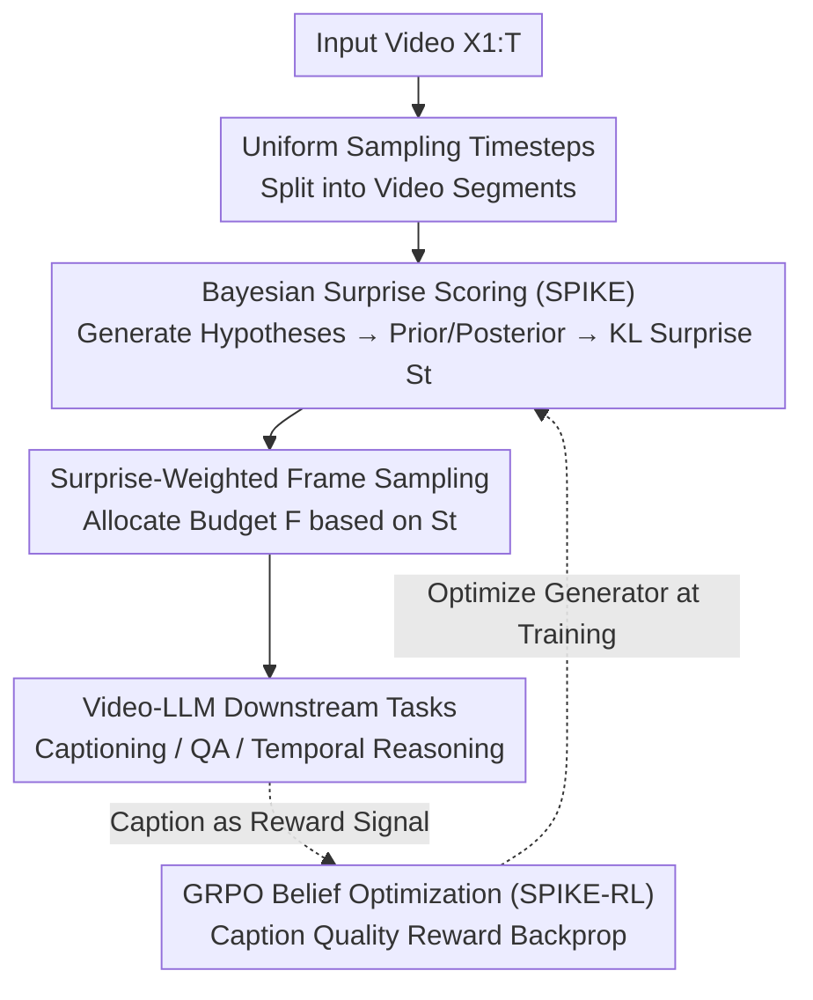

# SPIKE-RL: Video-LLMs Meet Bayesian Surprise

**Conference**: ICLR 2026  
**OpenReview**: [https://openreview.net/forum?id=QLiXtWEAkq](https://openreview.net/forum?id=QLiXtWEAkq)  
**Code**: https://github.com/sahithyaravi/SPIKE-RL  
**Area**: Video Understanding  
**Keywords**: Video-LLM, Bayesian Surprise, Belief Tracking, Frame Sampling, GRPO

## TL;DR
This paper quantifies unexpected moments in videos into an interpretable score using "Bayesian Surprise." By tracking the KL divergence of a Video-LLM's belief distribution regarding "what happens next" before and after seeing new frames, it locates surprise segments and allocates more frame budget to these key moments via surprise-weighted sampling. Furthermore, it employs GRPO (SPIKE-RL) to optimize belief hypotheses using video captioning quality as a reward, achieving consistent improvements across five downstream video understanding tasks.

## Background & Motivation
**Background**: Current mainstream Video-LLMs (such as GPT-4o, Qwen2.5-VL, VideoLLaMA) treat videos as a "bag of frames," typically applying **uniform sampling** to select a subset for the model while discarding the rest.

**Limitations of Prior Work**: Real-world videos often consist of long, mundane routines interrupted by occasional, memorable surprises (e.g., Mr. Bean suddenly falling). Uniform sampling statistically captures a high volume of frequent, mediocre moments and is likely to miss rare but defining events that constitute the video narrative, leading to models being overwhelmed by redundant information.

**Key Challenge**: Humans are not passive observers but active predictors; the brain continuously builds and updates internal models of the world, using the "deviation between expectation and reality (surprise)" as a primary signal for attention allocation. Current Video-LLMs lack a **belief system that evolves with the video**, making them unable to determine which parts are worth more attention. Existing retrieval-based frame selection methods (retrieving keyframes based on text queries) face another issue: in open-world scenarios, one does not know what questions will be asked beforehand. Identifying surprise needs to be **query-agnostic and prospective**.

**Goal**: (1) Enable Video-LLMs to actively track and update beliefs as new visual evidence arrives, similar to humans; (2) Verify whether "detecting semantic surprise prospectively and independently of downstream queries" truly improves video understanding.

**Key Insight**: Formalize surprise as Bayesian belief updating—representing beliefs as a probability distribution over a set of **human-readable text hypotheses** about "what happens next." The magnitude of change (information gain) in this distribution before and after seeing new frames defines surprise.

**Core Idea**: Use the "KL divergence from prior to posterior belief distributions triggered by new frames" as the surprise score. This score guides surprise-weighted frame sampling, and RL is used to refine the belief hypotheses themselves.

## Method

### Overall Architecture
SPIKE is an **inference-time** framework: given a video, it first selects uniform time steps to segment the video. At the end of each segment, the Video-LLM generates a set of text hypotheses for "what happens next." The method calculates the prior probabilities of these hypotheses **before seeing the new frames** of the segment and the posterior probabilities **after seeing them**. The KL divergence between these two distributions is the surprise score for that segment. After obtaining scores for all segments, a fixed frame budget $F$ is distributed via **weighted sampling** (softmax) based on the surprise scores—more frames are allocated to high-surprise segments. These frames are then fed to the Video-LLM for downstream tasks like captioning or QA. SPIKE-RL adds a training loop: using GRPO with the similarity between the final caption and ground truth as a reward to optimize the "hypothesis generator," producing belief hypotheses that support more accurate captions.

### Key Designs

**1. Bayesian Surprise Scoring: Quantifying "Unexpectedness" as KL Divergence**

This design addresses the issue that models lack evolving beliefs. At time step $t$, the context is constructed from three inputs: a **prior window** $W_t = X_{t-W:t-1}$ (recent $W$ frames), a **historical text summary** $H_t$ from earlier content, and a **new observation frame** $O_t = X_t$. The Video-LLM generates $N$ diverse text hypotheses $B_t = \{b_{t,1},\dots,b_{t,N}\}$ conditioned on $H_t, W_t$ using nucleus sampling.

The credibility of each hypothesis is measured by its negative log-likelihood (NLL), normalized via softmax. **Before** seeing the new frame, the prior distribution is $P_{prior}(b_{t,i}\mid H_t, W_t) \propto \exp(-\tfrac{1}{\tau}\,\mathrm{NLL}(b_{t,i}\mid H_t, W_t))$. After adding $O_t$ to the context, the posterior $P_{post}(b_{t,i}\mid H_t, W_t, O_t)$ is obtained. Following Itti & Baldi (2005), information gain is the KL divergence from posterior to prior:

$$S_t = D_{KL}\big(P_{post}(\cdot\mid H_t,W_t,O_t)\,\|\,P_{prior}(\cdot\mid H_t,W_t)\big) = \sum_{i=1}^{N} P_{post}(b_{t,i})\log\frac{P_{post}(b_{t,i})}{P_{prior}(b_{t,i})}.$$

This yields a scalar surprise score $S_t$ per step while maintaining a **human-readable** hypothesis set. This allows users to see "what the model expected vs. what was revealed," making surprise naturally interpretable. This differs from zero-shot prompting ("is this frame surprising?"), which lacks belief tracking and achieved only about 1/10th the accuracy of SPIKE in experiments.

**2. Surprise-Weighted Frame Sampling: Allocating Budget to Surprising Segments**

Processing all frames is impractical, requiring Video-LLMs to sample within a budget $F$. This design first samples $K \le F$ segments and calculates surprise scores $S_1,\dots,S_K$. The sampling probability is defined by the softmax of scores: $p_i = \exp(s_i/\tau_s) / \sum_j \exp(s_j/\tau_s)$.

Subsequently, segments are sampled repeatedly with replacement based on $p_i$ within budget $F$. **High-surprise segments contribute more frames**. The temperature $\tau_s$ (set to 0.7) controls concentration. This process is **query-agnostic**, making it suitable for open-world requirements. Complexity $O(F \cdot N)$ is linear relative to the budget and can be reduced to $O(F)$ via parallelizing hypothesis evaluation.

**3. GRPO Belief Optimization (SPIKE-RL): Using Caption Quality as Reward**

The performance of SPIKE depends on the accuracy and diversity of hypotheses. However, general VLMs are not trained for belief tracking across frame windows and have no incentive to refine intermediate hypotheses. Explicitly collecting ground-truth hypotheses for supervision is unscalable. This design realizes that **good final captions are built upon accurate intermediate beliefs**, transforming downstream supervision into feedback for internal reasoning.

Using GRPO: For each video, $M$ trajectories $\{\tau^{(r)}\}$ are sampled. Each follows the SPIKE pipeline to generate a final caption $c^{(r)}$. An LLM-Match reward $R^{(r)}$ (scoring similarity to ground truth) is computed and normalized into an advantage $A^{(r)} = (R^{(r)}-\mu_R)/\sigma_R$. Treating the set of hypotheses as sequence-level actions, the objective is:

$$\mathcal{L}(\theta) = -\frac{1}{M}\sum_{r=1}^{M} A^{(r)} \sum_t \sum_{k=1}^{K} \log p_\theta\big(b_{t,k}^{(r)}\mid H_t^{(r)}, W_t^{(r)}\big).$$

The training set includes 2,000 videos (30% surprise from Oops!/unintentional errors and 70% mundane from ActivityNet), exposing the policy to both stable and shifting belief scenarios. The model used is Qwen2.5-VL-7B-Instruct with Olmo-7B as the reward model.

### Loss & Training
The primary training objective is the belief optimization loss $\mathcal{L}(\theta)$ using GRPO with sequence-level actions and group Z-score advantages. Rewards are derived from LLM-Match scores comparing generated captions to ground truth. Training involves 2,000 video segments. All downstream evaluations use a maximum budget of $F=64$.

## Key Experimental Results

### Main Results (Surprise Localization)
Evaluated on Oops! (unintentional human errors), FunQA (surprising segments), and a self-built Mr. Bean dataset (using laughter tracks as silver standard):

| Dataset | Metric | Qwen2.5-VL Zero-shot | Best Specialized Baseline | SPIKE | SPIKE-RL | Human |
|--------|------|------|------|------|------|------|
| Oops! | Acc@0.25s | 6.6 | 39.5 (F2C2V) | 60.0 | **62.9** | 62.1 |
| Oops! | Acc@1s | 9.6 | 69.5 (F2C2V) | 67.3 | 69.1 | 88.0 |
| FunQA | IoU | 11.6 | 62.3 (LLaVA-NeXT-CR) | 65.7 | **68.2** | – |
| Mr. Bean | IoU | 13.8 | – | 54.8 | **61.1** | – |

SPIKE-RL reaches 62.9% Acc@0.25s on Oops!, approaching human performance (62.1%) and outperforming the zero-shot version by nearly **tenfold**. It also outperforms the specialized F2C2V by 23.4% in precision.

### Ablation Study (Sampling Strategy Comparison, Fixed 64 Frames)
Replacing uniform sampling in Qwen2.5-VL with SPIKE/SPIKE-RL and comparing against query-agnostic baselines:

| Sampling Strategy | BlackSwan | FunQA | ExFunTube | VideoMME-S | NextQA |
|------|------|------|------|------|------|
| Uniform | 67.2 | 66.8 | 68.7 | 59.8 | 68.6 |
| RGB Histogram | 49.6 | – | – | 55.4 | – |
| Optical Flow | 58.6 | – | – | 58.1 | – |
| Katna | 54.6 | – | – | 57.4 | – |
| SPIKE | 68.8 | 70.3 | 73.2 | 60.8 | 69.8 |
| **SPIKE-RL** | **69.5** | **71.4** | **75.7** | **62.5** | **70.3** |

Gains are most significant on surprise-heavy videos: ExFunTube +7.0, FunQA +4.6. Improvements are also stable for general QA (VideoMME-S +2.7).

### Key Findings
- **Shot Boundary Detection (SBD) methods (RGB Histogram, Katna, Flow) perform worse than uniform sampling**: They rely on pixel changes sensitive to camera motion and cuts, which rarely map to semantic importance. Bayesian surprise provides a more effective inductive signal.
- **RL improves belief diversity**: SPIKE-RL hypothesis diversity is 40.3% vs. 33.5% for SPIKE, indicating that caption rewards effectively encourage conceptual diversity.
- **Surprise scores correlate with human judgment**: Spearman correlation with human-rated surprise reached 0.87 for SPIKE-RL.
- **Fine-grained surprise**: In the Mr. Bean dataset, where surprise stems from subtle expressions, SPIKE-RL showed a significant IoU gain (+6.3).

## Highlights & Insights
- **Interpretable Beliefs**: Using text-based probability distributions makes surprise natively explainable compared to black-box scalar values like optical flow.
- **Query-Agnostic Prospective Prior**: sidesteps the open-world problem of unknown future queries by concentrating compute on critical moments without increasing frame budgets.
- **Weak Supervision Transformation**: Converting "final results are good $\Rightarrow$ intermediate beliefs are accurate" into a training signal via GRPO is a clever way to handle unannotated reasoning steps.

## Limitations & Future Work
- Dependent on the quality of hypotheses generated by the Video-LLM; accuracy drops when surprises come from extremely subtle cues.
- Reward bias: Rewards from LLM-Match might inherit biases from the judge LLM.
- Inference overhead: Generating $N$ hypotheses and two likelihood evaluations adds cost, though it remains linear. Latency in real-time streaming requires further validation.
- Training distribution: The 2,000-segment training set focused heavily on "unintentional errors," which may limit generalization to other surprise types.

## Related Work & Insights
- **vs. Retrieval/Query-conditioned Selection**: Those methods select frames after a query is known; SPIKE identifies surprise prospectively and query-agnostically.
- **vs. Visual Change Sampling (SBD, Flow)**: Those are pixel-based; SPIKE is semantic-based, avoiding being misled by camera movement but incurring higher LLM costs.
- **vs. NLP Belief Tracking**: Shares roots with Theory of Mind-based hypothesis weighting, but applies it to segment-wise surprise quantification in video streams.

## Rating
- Novelty: ⭐⭐⭐⭐⭐ Formalizing Bayesian surprise into Video-LLM belief tracking is a fresh perspective.
- Experimental Thoroughness: ⭐⭐⭐⭐ Solid results across 3 localization benchmarks and 5 downstream tasks with multiple baselines.
- Writing Quality: ⭐⭐⭐⭐⭐ Clear motivation, formulas, and qualitative examples.
- Value: ⭐⭐⭐⭐ A plug-and-play, query-agnostic sampling improvement with high potential for streaming or robotics.

<!-- RELATED:START -->

## Related Papers

- [\[CVPR 2026\] SpikeTrack: A Spike-driven Framework for Efficient Visual Tracking](../../CVPR2026/video_understanding/spiketrack_a_spike-driven_framework_for_efficient_visual_tracking.md)
- [\[ICLR 2026\] Measure Twice, Cut Once: A Semantic-Oriented Approach to Video Temporal Localization with Video LLMs](measure_twice_cut_once_a_semantic-oriented_approach_to_video_temporal_localizati.md)
- [\[CVPR 2026\] An Empirical Study on How Video-LLMs Answer Video Questions](../../CVPR2026/video_understanding/an_empirical_study_on_how_video-llms_answer_video_questions.md)
- [\[ICLR 2026\] Steering and Rectifying Latent Representation Manifolds in Frozen Multi-Modal LLMs for Video Anomaly Detection](steering_and_rectifying_latent_representation_manifolds_in_frozen_multi-modal_ll.md)
- [\[AAAI 2026\] R-AVST: Empowering Video-LLMs with Fine-Grained Spatio-Temporal Reasoning in Complex Audio-Visual Scenarios](../../AAAI2026/video_understanding/r-avst_empowering_video-llms_with_fine-grained_spatio-temporal_reasoning_in_comp.md)

<!-- RELATED:END -->
