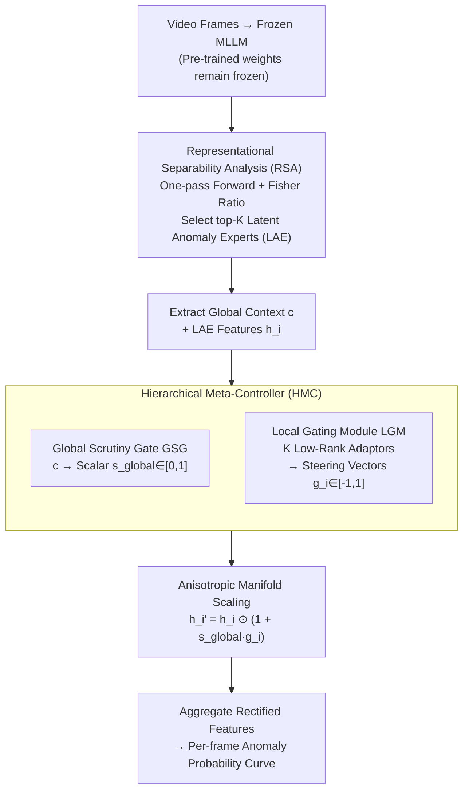

# Steering and Rectifying Latent Representation Manifolds in Frozen Multi-Modal LLMs for Video Anomaly Detection

**Conference**: ICLR 2026  
**arXiv**: [2602.24021](https://arxiv.org/abs/2602.24021)  
**Code**: To be released  
**Area**: Multimodal / Video Understanding  
**Keywords**: Video Anomaly Detection, Multi-modal Large Language Models, Representation Manifold Steering, Tuning-free, Attention Head Analysis

## TL;DR

The SteerVAD framework is proposed to identify "Latent Anomaly Expert" (LAE) attention heads within a completely frozen Multi-modal Large Language Model (MLLM) and dynamically steer their representation manifolds using a hierarchical meta-controller. It achieves SOTA performance in tuning-free video anomaly detection using only 1% of the training data.

## Background & Motivation

Video Anomaly Detection (VAD) aims to identify events deviating from normal patterns, which is critical in scenarios such as intelligent surveillance, industrial inspection, and autonomous driving. Traditional VAD methods (supervised/weakly supervised/unsupervised) rely on large-scale training data, involving high computational and annotation costs and limited generalization.

Recent studies have turned to utilizing frozen MLLMs for tuning-free VAD, but these methods suffer from two fundamental flaws:

**Representational Bias**: MLLMs are pre-trained on web-scale corpora, and their feature spaces are optimized for frequent prototypical concepts, exhibiting low sensitivity to rare and subtle patterns like anomalous events.

**Contextual Ambiguity**: Passively relying on isolated features leads to confused representations—visually similar but semantically distinct events (e.g., normal running vs. escaping) cannot be effectively distinguished.

The authors reinterpret these two issues as geometric problems based on the manifold hypothesis: the representation manifolds of normal and abnormal events are too close or even locally entangled in high-dimensional feature space, and passive feature reading cannot resolve this structural deficiency.

## Method

### Overall Architecture

SteerVAD transforms tuning-free VAD from "passively reading features of a frozen MLLM" to "actively intervening in its internal representation manifolds": it first identifies a few "Latent Anomaly Experts" (LAEs) that best distinguish normal/abnormal samples from all attention heads without gradients, then uses a lightweight Hierarchical Meta-Controller (HMC) to dynamically perform anisotropic geometric transformations on these heads' features based on the current global context of the video. Finally, the rectified features are aggregated into an anomaly probability curve. The entire process does not modify any pre-trained parameters of the MLLM, with only about 520,000 trainable parameters.

### Key Designs

**1. Representational Separability Analysis (RSA): Gradient-free localization of the most discriminative attention heads.**

The challenge lies in the fact that MLLMs contain hundreds of attention heads, but only a few are sensitive to anomalies. Per-head fine-tuning is both expensive and disruptive to pre-training. RSA adopts the idea of the Fisher Discriminant Ratio, defining "discriminative power" as the ratio of inter-class dispersion to intra-class variance of normal/abnormal samples within each head: $S_{RSA}(l,k) = \frac{\|\mathbf{\mu}_{anom}^{(l,k)} - \mathbf{\mu}_{norm}^{(l,k)}\|_2^2}{\sigma_{anom}^2(l,k) + \sigma_{norm}^2(l,k)}$. This metric is purely linear and extremely insensitive to data volume: the LAEs selected with 1% data are identical to those with 100% data, and 10 random seeds consistently lock onto the same 4 heads (L18H4, L23H24, L21H21, L22H7), ensuring reproducibility.

**2. Hierarchical Meta-Controller (HMC): Decoupling "whether to rectify" and "how to rectify" into two layers.**

A single lightweight model directly outputting high-dimensional steering vectors is prone to overfitting local noise. Thus, HMC is divided into two levels. The upper "Global Scrutiny Gate (GSG)" reads the hidden state $\mathbf{c}$ of the first generated token from the MLLM and compresses it into a scalar $s_{global}\in[0,1]$ via a small MLP, representing the anomaly likelihood of the entire video—remaining silent when near 0 and triggering strong rectification when near 1. The lower "Local Gating Module (LGM)" consists of K parallel low-rank adaptors, each taking the global context $\mathbf{c}$ as input to generate dimension-wise steering vectors $\mathbf{g}_i\in[-1,1]^{d_{head}}$ for the corresponding LAE via a low-rank bottleneck. Global context determines intensity while local gates determine direction, preserving context-awareness while suppressing parameter count.

**3. Anisotropic Manifold Scaling: Reshaping rather than destroying feature manifolds via residual modulation.**

The actual geometric intervention occurs in the step: $\mathbf{h}_i' = \mathbf{h}_i \odot (1 + s_{global} \cdot \mathbf{g}_i)$. When $s_{global}\approx 0$, it degrades to an identity transformation, leaving normal scenes undisturbed; when $s_{global}\approx 1$, the positive components of $\mathbf{g}_i$ amplify and negative components suppress corresponding dimensions, pushing the overly close normal and abnormal manifolds apart in high-dimensional space. The multiplicative residual form offers a theoretical advantage: when all scaling factors are non-zero, this transformation is a diffeomorphism that reshapes the manifold while preserving topology; if some factors are zero, it degrades into a singular projection, equivalent to context-aware feature selection that can directly eliminate dimensions strongly correlated with pre-training bias.

### Loss & Training

There are only two training objectives. The primary loss is the frame-wise binary cross-entropy $\mathcal{L}_{BCE} = -[y \log(p_t) + (1-y) \log(1-p_t)]$. To prevent the controller from fluctuating on normal videos, an L2 sparsity penalty is added to the global signal of normal samples: $\mathcal{L}_{reg} = \frac{1}{|\mathcal{B}_{norm}|} \sum_{j \in \mathcal{B}_{norm}} (s_{global}^{(j)})^2$, forcing it to output near 0 on normal inputs to reduce false positives. These are combined into $\mathcal{L}_{total} = \mathcal{L}_{BCE} + \lambda_{reg} \mathcal{L}_{reg}$, where $\lambda_{reg}=0.1$. Since only approximately 520,000 parameters are trained, the entire training process takes about 27 seconds for 1000 epochs on a single RTX A6000.

## Key Experimental Results

### Main Results

| Dataset | Metric | SteerVAD | HiProbeVAD | VERA | Holmes-VAD (Fine-tuned) |
|--------|------|----------|------------|------|------------------------|
| UCF-Crime | AUC (%) | **87.15** | 86.72 | 86.55 | 89.51 |
| XD-Violence | AP (%) | **83.02** | 82.15 | 70.54 | 90.67 |

- Achieved SOTA among tuning-free methods with only ~520k trainable parameters (~1MB).
- Compared to Holmes-VAD, which requires full fine-tuning of 7B parameters, the gap on UCF-Crime is only 2.36%.

### Ablation Study

| Configuration | AUC (%) | Description |
|------|---------|------|
| Full Model | 87.15 | All components |
| w/o Global Gate | 85.94 | -1.21%, lacks global signal control |
| Additive instead of Multiplicative | 85.02 | Anisotropic scaling outperforms addition |
| w/o LGM (Static Scaling) | 84.21 | -2.94%, requires dynamic context |
| Linear Probing (No Rectification) | 81.33 | -5.82%, proves necessity of rectification |
| Random Head Selection | 69.57 | RSA significantly outperforms random baseline |

### Key Findings

1. **Extreme Data Efficiency**: Increasing data from 1% (approx. 16 videos) to 100% only yields a 0.27% AUC Gain, while training time grows from <1 minute to 49 minutes.
2. **Cross-dataset Generalization**: UCF training → XD evaluation (AP 71.31%); XD training → UCF evaluation (AUC 81.04%).
3. **Cross-model Generalization**: Effective for LLaVA-OV (81.52%) and Qwen2.5-VL (84.11%).
4. **Category Performance Variance**: Assault (95.17%) is highest, while Abuse (68.84%) is lowest—the latter due to "contextual mimicry," where it is visually highly similar to normal behavior.

## Highlights & Insights

1. **Paradigm Innovation**: For the first time, transforms "passive feature reading" into "active geometric intervention," reshaping the feature space without modifying any pre-trained parameters.
2. **Solid Theoretical Foundation**: Starting from the manifold hypothesis, it rigorously argues the topological properties of representation manifolds (compactness, piecewise path-connectedness, local Euclidean structure), providing mathematical support for intervention operations.
3. **Elegant Stability of RSA**: Simple linear metrics (Fisher ratio) identify the exact same expert heads as expensive non-linear indicators (Silhouette, k-NN Purity), while being 49x faster.
4. **High Practicality**: 520k parameters, 27-second training, 1% annotation data—deployment friendly.
5. **Interpretability**: Post-hoc submission of anomalous frames to the MLLM for text explanations enhances trustworthiness.

## Limitations & Future Work

1. **"Contextual Mimicry" anomalies remain difficult**: e.g., burglary vs. normal entry are visually almost indistinguishable, potentially requiring longer-range temporal reasoning.
2. **Dependence on MLLM backbone's video understanding**: If the MLLM itself has limited understanding of video content, rectification may not compensate.
3. **Task Specificity**: The framework has only been validated for the VAD task; its generality across other video understanding tasks remains to be verified.
4. **Anomaly Definition Constraints**: Heavily relies on a small amount of labeled data to define "anomalies." Although open-set detection of new anomaly types is theoretically promising (72.21% AUC on UBnormal), there is room for improvement.

## Related Work & Insights

- **Mechanistic Interpretability**: This work treats internal attention heads of the LLM as "functional circuits" for analysis and intervention, aligning with the philosophy of mechanistic interpretability.
- **Model Editing**: Unlike knowledge editing, this method does not modify weights but dynamically rectifies during inference.
- **Inspiration**: The core idea of "identifying key internal modules + dynamic context-aware rectification" can be generalized to other downstream tasks requiring adaptation of frozen large models.

## Rating

- Novelty: ⭐⭐⭐⭐⭐ — Paradigm innovation, first to introduce geometric intervention to VAD with frozen MLLMs.
- Experimental Thoroughness: ⭐⭐⭐⭐⭐ — Comprehensive ablation, detailed stability analysis across 10 seeds/datasets/models.
- Writing Quality: ⭐⭐⭐⭐⭐ — Clear exposition of theory and experiments, extremely detailed appendix.
- Value: ⭐⭐⭐⭐ — Highly practical but currently limited to VAD scenarios.

<!-- RELATED:START -->

## Related Papers

- [\[CVPR 2026\] Alert-CLIP: Abnormality-aware Latent-Enhanced Representation Tuning of CLIP for Video Anomaly Detection](../../CVPR2026/video_understanding/alert-clip_abnormality-aware_latent-enhanced_representation_tuning_of_clip_for_v.md)
- [\[ICLR 2026\] Language-guided Open-world Video Anomaly Detection under Weak Supervision](language-guided_open-world_video_anomaly_detection_under_weak_supervision.md)
- [\[AAAI 2026\] HeadHunt-VAD: Hunting Robust Anomaly-Sensitive Heads in MLLM for Tuning-Free Video Anomaly Detection](../../AAAI2026/video_understanding/headhunt-vad_hunting_robust_anomaly-sensitive_heads_in_mllm_.md)
- [\[ICLR 2026\] UniTrack: Differentiable Graph Representation Learning for Multi-Object Tracking](unitrack_differentiable_graph_representation_learning_for_multi-object_tracking.md)
- [\[CVPR 2026\] No Need For Real Anomaly: MLLM Empowered Zero-Shot Video Anomaly Detection](../../CVPR2026/video_understanding/no_need_for_real_anomaly_mllm_empowered_zero-shot_video_anomaly_detection.md)

<!-- RELATED:END -->
