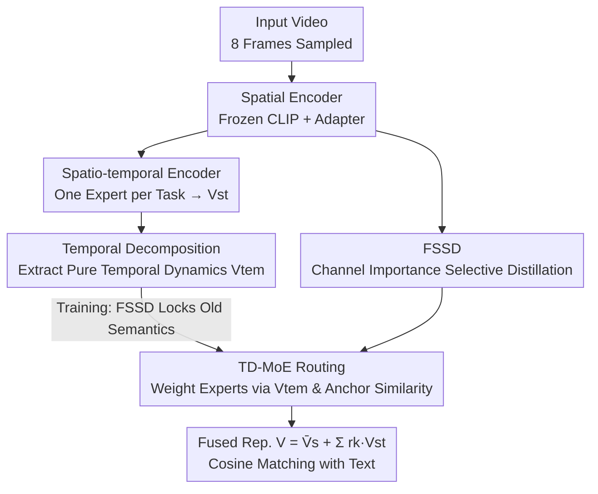

# StPR: Space-Time Preserving and Routing for Exemplar-Free Video Class-Incremental Learning

**Conference**: ICLR 2026  
**OpenReview**: [https://openreview.net/forum?id=VAn2YVMuZC](https://openreview.net/forum?id=VAn2YVMuZC)  
**Code**: None  
**Area**: Video Understanding / Class-Incremental Learning  
**Keywords**: Video Class-Incremental Learning, Catastrophic Forgetting, Exemplar-Free, Temporal Decomposition, Mixture of Experts

## TL;DR
StPR explicitly decomposes video features into two branches: "inter-frame shared semantics" and "temporal dynamics." It utilizes Frame-Shared Semantic Distillation (FSSD) to lock important semantic channels to prevent forgetting and a Temporal Decomposition-based Mixture of Experts (TD-MoE) to weight task-specific experts during inference based on temporal dynamics. Without storing any old exemplars, StPR performs video class-incremental learning and outperforms all previous methods (including those requiring exemplars) on UCF101, HMDB51, SSv2, and Kinetics400.

## Background & Motivation

**Background**: Class-Incremental Learning (CIL) enables models to continuously learn new classes from a sequence of tasks without forgetting old ones. Applying this to the video domain results in Video Class-Incremental Learning (VCIL) for action recognition—scenarios such as surveillance, driver monitoring, and robotics all require the continuous identification of new actions.

**Limitations of Prior Work**: Existing VCIL methods fall into two categories, both with significant drawbacks. One category is **exemplar-based** (e.g., TCD, FrameMaker, HCE), which mitigates forgetting by storing a portion of old videos, frames, or compressed features. However, storing exemplars incurs memory and privacy overhead, and these methods often focus on frame-level learning without explicitly modeling temporal dynamics. The other category involves **transferring image CIL** methods (e.g., LwF, STSP), which rely on regularization or subspace projection to avoid storing exemplars. However, these methods flatten video data and barely utilize the temporal structure.

**Key Challenge**: Videos possess a spatio-temporal structure beyond static images—containing both stable shared semantics across frames and varying temporal dynamics between frames. Existing methods either use uniform-weight distillation (treating all channels equally) to suppress updates, thereby sacrificing plasticity, or ignore temporal information entirely. The fundamental issue is that **mitigating forgetting and utilizing spatio-temporal information have not been handled simultaneously and separately**; a good trade-off between stability and plasticity has not been found, and temporal cues are wasted.

**Goal**: Without storing any old exemplars, the goal is to lock key semantics of old tasks (to resist forgetting) while allowing the model to flexibly adapt to new classes based on temporal dynamics, all without relying on task IDs during inference.

**Key Insight**: The authors observe that video features can be decoupled—expressing each frame feature as a "shared static component + temporal residual" $V^s_i = \bar{v} + \epsilon_i$. Shared semantics are responsible for "remembering old knowledge," while temporal dynamics are responsible for "distinguishing tasks and routing experts." Since these have different responsibilities, they should be handled using different mechanisms.

**Core Idea**: Explicitly separate spatio-temporal information—use "Frame-Shared Semantic Distillation" to selectively preserve essential semantic channels for anti-forgetting, and use "Temporal Decomposition + Mixture of Experts" to perform task-ID-free expert routing based on temporal dynamics. These components collaborate to form a unified exemplar-free VCIL framework.

## Method

### Overall Architecture
StPR is built upon a frozen CLIP ViT-B/16: the visual encoder $F(\cdot)$ remains fixed. Only two types of lightweight components are trained—a set of **adapters** for each task (downsample-ReLU-upsample MLPs embedded in transformer residuals) for spatial adaptation, and a **spatio-temporal encoder** $G(\cdot)$ (multi-head self-attention) for each task to perform temporal aggregation. The pipeline processes video by splitting it into two information paths:

- **During Training**: The spatial encoder extracts frame-by-frame features. The FSSD module performs selective distillation from the old model based on channel importance, locking "inter-frame shared, semantically stable" channels while leaving others open to adapt to new classes.
- **During Inference**: Each task's spatio-temporal encoder acts as an "expert." TD-MoE decomposes pure temporal dynamics $V_{tem}$ from the input video and calculates similarity scores against stored temporal anchors for each task to dynamically weight the experts—without requiring task IDs or old exemplars.

The three core components—FSSD, Temporal Decomposition, and TD-MoE routing—correspond to the following key designs.

### Key Designs

**1. FSSD: Selective Distillation by "Channel Semantic Importance" instead of Uniformity**

The limitation is straightforward: uniform-weight distillation in classic CIL constrains the updates of all channels equally. However, in video, the semantic importance and temporal stability of different channels vary significantly. FSSD first calculates a "frame-shared semantic importance" $I_{c,j}$ for each channel and uses it to weight the distillation loss—important channels are strongly constrained, while unimportant ones are released for new tasks.

Importance is derived from two components. First is **semantic sensitivity**: the activations of the $j$-th channel for class $c$ aggregated across frames are approximated as a Gaussian $\bar{V}^s_{c,j}\sim N(\mu_{c,j},\sigma^2_{c,j})$. Using Fisher Information to measure output sensitivity, it is derived that $I(\mu_{c,j})=1/\sigma^2_{c,j}$—smaller variance implies higher stability across frames and a higher priority for preservation. Second is the **classification score**: the channel-level cosine contribution of spatial features to corresponding text features, approximated as $E[\gamma_{c,j}]\approx T_{c,j}\mu_{c,j}/\lambda$. Combining these yields:

$$I_{c,j} = \frac{T_{c,j}\cdot\mu_{c,j}}{\sigma^2_{c,j}}.$$

The distillation loss uses $I$ as a per-channel weight to constrain the difference between the outputs of the spatial encoders for task $b-1$ and task $b$: $L_{FSSD}=\frac{1}{|D_b|d_{vt}}\sum_{c,i,j}I_{b-1,c,j}\cdot\|\bar{V}^s_{b-1,c,i,j}-\bar{V}^s_{b,c,i,j}\|^2_2$.

**2. Temporal Decomposition: Extracting Pure Temporal Dynamics $V_{tem}$ from Spatio-Temporal Features**

To route experts based on temporal information, one must obtain signals containing "only temporal dynamics, not static backgrounds," otherwise background redundancy interferes with routing. Based on the observation that adjacent redundant frames exhibit short-term stationarity, the authors decompose each frame feature into a shared static component plus a temporal residual: $V^s_i=\bar{v}+\epsilon_i$, and the spatial mean $\bar{V}^s=\bar{v}+\bar{\epsilon}$.

The spatio-temporal feature $V_{st}$ is aggregated via attention: $V_{st}\approx\sum_i a_i V^s_i=\bar{v}+\sum_i a_i\epsilon_i$. Since $\bar{v}$ is difficult to estimate, the authors subtract $\bar{V}^s$ from $V_{st}$ to eliminate it:

$$V_{tem}=\sum_{i=1}^{N_f}\Big(a_i-\frac{1}{N_f}\Big)\cdot\epsilon_i.$$

This quantity measures the deviation between "attention-weighted temporal dynamics" and the "uniform temporal mean," effectively removing static semantics and leaving pure temporal changes.

**3. TD-MoE: Per-task Experts with Task-ID-Free Routing via Temporal Anchor Similarity**

Since deep transformers have a strong tendency to forget in VCIL, each task is assigned a dedicated spatio-temporal encoder as an "expert." Without task IDs at inference, TD-MoE uses the $V_{tem}$ from the previous step for routing. After training a task, the mean temporal representation for each class is stored in an **anchor pool** $\bar{V}^{tem}_c$ (using class-level mean vectors only, not samples). During inference, the routing score for each expert $k$ is the maximum cosine similarity between the input's $V_{tem}$ and the anchors belonging to that expert:

$$r_k=\max_{c\in C_k}\cos\big(V^{tem}_k,\bar{V}^{tem}_c\big).$$

The final video representation is defined as $V=\bar{V}^s+\sum_k r_k\cdot V^{st}_k$. Compared to routing methods that are static or feature-independent, TD-MoE explicitly allocates weights based on temporal dynamics.

### Loss & Training
The total loss is: $L=L^{St}_{Cont}+L^{S}_{Cont}+w\cdot L_{FSSD}$. $L^{St}_{Cont}$ is the symmetric contrastive loss between $V_{st}$ and text; $L^{S}_{Cont}$ is the contrastive loss between adapter spatial features $\bar{V}^s$ and text; $L_{FSSD}$ is the anti-forgetting distillation term with weight $w=1\times10^4$. The CLIP ViT-B/16 backbone is frozen. Training uses SGD, learning rate 0.01, batch size 40, for 60 epochs in the first stage and 30 epochs in subsequent stages. 8 frames are sampled per video via TSN.

## Key Experimental Results

### Main Results
Evaluated on TCD benchmarks (UCF101/HMDB51/SSv2) and the vCLIMB benchmark (Kinetics400). Metrics include Average Accuracy (Acc) and Backward Forgetting (BWF). StPR **without storing any samples** outperforms all baselines.

| Dataset / Setting | Metric | StPR | Prev. SOTA | Gain |
|--------|------|------|----------|------|
| UCF101 10×5s | Acc | 94.67 | 86.05 (CoSTEO) | +8.62 |
| UCF101 2×25s | Acc | 88.52 | 86.95 (CoSTEO) | +1.57 |
| HMDB51 5×5s | Acc | 68.12 | 61.70 (CoSTEO) | +6.42 |
| HMDB51 1×25s | Acc | 67.01 | 61.84 (CoSTEO) | +5.17 |
| SSv2 5×18s | Acc | 37.30 | 36.60 (CoSTEO) | +0.70 |
| Kinetics400-10s | Acc | 57.83 | 56.09 (CSTA) | +1.74 |

Notably, StPR is an exemplar-free method that beats several exemplar-based methods. Only on SSv2 10×9s is its performance slightly lower (40.79 vs 41.44).

### Ablation Study
Three components: adapter tuning ($A_b$), FSSD, and TD-MoE.

| Configuration | UCF101 10×5s Acc | HMDB51 25×1s Acc | Note |
|------|------|------|------|
| baseline (Frozen CLIP) | 72.72 | 47.48 | Lowest, no adaptation |
| + $A_b$ | 78.68 | 57.10 | Adapter adaptation only |
| + $A_b$ + FSSD | 82.06 | 60.83 | Added distillation |
| + TD-MoE | 93.47 | 68.88 | Temporal expert routing only |
| + $A_b$ + TD-MoE | 94.14 | 73.02 | High Acc but BWF spikes to 21.72 |
| Full ($A_b$+FSSD+TD-MoE) | 94.67 | 75.07 | Best stability, BWF 7.02 |

### Key Findings
- **TD-MoE is the primary driver of gain**: Adding TD-MoE alone increases UCF101 10×5s accuracy from 72.72 to 93.47, indicating that temporal dynamic routing is the most significant contributor to VCIL.
- **FSSD acts as a stabilizer**: While $A_b$+TD-MoE achieves high accuracy, its BWF reaches 21.72 (severe forgetting). Adding FSSD reduces BWF to 7.02 while slightly improving accuracy.
- **Greater gains for longer task sequences**: Analysis shows that as the number of tasks increases, StPR's lead over the baseline becomes more pronounced.
- **Routing mechanism is critical**: Compared to Avg-MoE, CLIP-MoE, or Adapter-MoE, TD-MoE performs better in both accuracy and stability.

## Highlights & Insights
- **Division of labor between "Memory" and "Discrimination"**: Shared static semantics handle anti-forgetting (via FSSD channel locking), while temporal dynamics handle task routing (via TD-MoE).
- **The $V_{st}-\bar{V}^s$ trick**: While static components $\bar{v}$ are hard to estimate, subtracting the spatial mean from the spatio-temporal feature effectively cancels it out, leaving pure temporal deviation.
- **Importance defined as Sensitivity × Contribution**: Combining "inter-frame stability" (inverse variance) and "classification utility" (cosine similarity with text) provides a clear physical interpretation for distillation weights.
- **Task ID-free inference via Anchor Pools**: By storing only class-level temporal mean vectors (not samples), task-ID-free expert routing is achieved, avoiding reliance on task boundaries typical of prompt-pool methods.

## Limitations & Future Work
- **Scalability of per-task experts**: If the number of tasks increases significantly, the linear growth in the number of experts will increase storage and inference overhead.
- **Higher forgetting in Kinetics400**: BWF is significantly higher than some exemplar-based methods, suggesting that exemplar-free approaches are still weaker at resisting forgetting in large-scale, long-range scenarios.
- **Stationarity assumption boundaries**: Temporal decomposition relies on short-term stationarity; therefore, gains might be smaller for rapid, violent movements or strong temporal dependencies (like SSv2).
- **Dependency on CLIP text alignment**: The classification is based on video-text cosine matching, which is tightly bound to CLIP's feature space.

## Related Work & Insights
- **vs. Exemplar-based VCIL (TCD / FrameMaker / HCE)**: These store frames or features; StPR uses no exemplars yet outperforms them on several benchmarks by explicitly modeling spatio-temporal structures.
- **vs. Image CIL transfers (LwF / STSP)**: These neglect temporal structure; StPR decouples temporal dynamics for expert routing.
- **vs. PEFT-CIL (L2P / S-iPrompts / ST-Prompt)**: These maintain prompts; StPR uses temporal decomposition + MoE for dynamic routing that fits video characteristics better.
- **vs. Other MoE Routing**: TD-MoE scores based on decomposed temporal dynamics, providing better accuracy and stability than static or feature-independent methods.

## Rating
- Novelty: ⭐⭐⭐⭐⭐ 
- Experimental Thoroughness: ⭐⭐⭐⭐ 
- Writing Quality: ⭐⭐⭐⭐ 
- Value: ⭐⭐⭐⭐⭐ 

<!-- RELATED:START -->

## Related Papers

- [\[ICLR 2026\] VideoNSA: Native Sparse Attention Scales Video Understanding](videonsa_native_sparse_attention_scales_video_understanding.md)
- [\[ICLR 2026\] Let's Split Up: Zero-Shot Classifier Edits for Fine-Grained Video Understanding](lets_split_up_zero-shot_classifier_edits_for_fine-grained_video_understanding.md)
- [\[ICLR 2026\] FOCUS: Efficient Keyframe Selection for Long Video Understanding](focus_efficient_keyframe_selection_for_long_video_understanding.md)
- [\[ICLR 2026\] Go Beyond Earth: Understanding Human Actions and Scenes in Microgravity Environments](go_beyond_earth_understanding_human_actions_and_scenes_in_microgravity_environme.md)
- [\[ICLR 2026\] VUDG: A Dataset for Video Understanding Domain Generalization](vudg_a_dataset_for_video_understanding_domain_generalization.md)

<!-- RELATED:END -->
