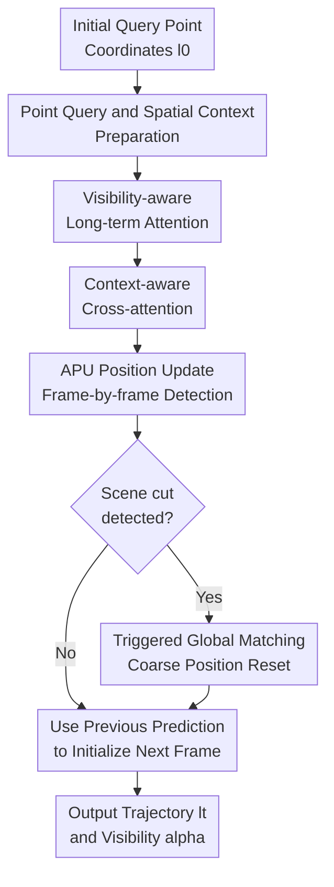

# TAPTRv3: Spatial and Temporal Context Foster Robust Tracking of Any Point in Long Video

**Conference**: ICLR2026  
**OpenReview**: [https://openreview.net/forum?id=N3WAcxTX6J](https://openreview.net/forum?id=N3WAcxTX6J)  
**Code**: To be released  
**Area**: Video Understanding / Point Tracking  
**Keywords**: Long-video Point Tracking, Tracking Any Point, Spatial Context, Long-term Attention, Visibility Modeling

## TL;DR
TAPTRv3 targets any point tracking in long videos. Built upon the DETR-like point query framework of TAPTRv2, it introduces spatial context cross-attention, visibility-aware long-term attention, and scene cut-triggered global matching. These enhancements effectively reduce feature drift under long sequences, occlusions, and camera switches, setting new state-of-the-art results on multiple TAP benchmarks.

## Background & Motivation
**Background**: The Tracking Any Point (TAP) task requires predicting the trajectory and visibility of any query point given in a specific frame of a video. Early strong methods followed the optical flow paradigm, constructing dense cost-volumes between query points and video frames, and regressing trajectories via transformers or iterative updates. While accurate, these methods incur heavy computational costs as the number of points, video length, and resolution increase. TAPTR/TAPTRv2 takes an alternative path: treating each target point as a DETR-like point query and detecting it frame-by-frame as a visual prompt detection task, thereby bypassing the burden of dense cost-volumes.

**Limitations of Prior Work**: While TAPTRv2 is effective for short videos, it reveals two core issues when migrated to long videos. First, spatially, point-level queries and sampled keys are derived from bilinear interpolation, resulting in a very local receptive field. If the target point is located in repeated textures, flat regions, deformations, or local noise, attention weights are easily misled by incorrect local similarities. Second, temporally, TAPTRv2 continuously updates point features in an RNN-like manner. Since training videos are fixed at 24 frames while test videos reach 50 to 1,300 frames, repeated updates over long periods cause features to gradually assimilate ambiguous surrounding textures and noise from occluded frames, leading to feature drift.

**Key Challenge**: Long-video point tracking must satisfy two requirements simultaneously: position initialization should ideally utilize predictions from the previous frame since motion in natural videos is typically continuous; however, point appearance and visibility should not rely solely on recursive states from the previous moment, otherwise occlusions, prolonged disappearances, and scene cuts will continuously amplify historical errors. In other words, the model needs both to maintain reliable anchors for the initial point and to absorb appearance changes from visible historical frames.

**Goal**: The authors decompose the problem into three sub-problems: how to allow point-level cross-attention to see sufficient local context to avoid comparing single-pixel features; how to utilize long-term history without recursively polluting initial point features; and how to quickly re-establish tracking during scene cuts or sudden large displacements without disrupting fine-grained localization in continuous video.

**Key Insight**: The observation in TAPTRv3 is straightforward: although a point itself is a coordinate, determining whether it matches a location should not rely solely on the single-point feature at that coordinate but rather on a small spatial context around it. Similarly, not all frames in the temporal history are trustworthy; features from occluded frames should participate less in updates, while visible frames are more suitable as references for appearance changes.

**Core Idea**: Replace fragile point-level similarity with spatial patch similarity, replace RNN-style feature rolling updates with visibility-reweighted long-term attention, and enable global matching to reset positions only when a scene cut is detected.

## Method

### Overall Architecture
TAPTRv3 maintains the online point query paradigm of TAPTRv2: given initial point coordinates $l_0$ by the user, the model extracts the content feature $f$ and surrounding spatial context $C$ from the initial frame. Subsequently, it receives frame feature maps $X_t$ sequentially, updates the query content and position through a transformer decoder, and outputs the current position $l_t$ and visibility $\alpha_t$. Key changes include: content features are no longer recursively polluted in long videos, spatial attention no longer relies on single-point similarity, and positions can be coarsely reset via global matching during scene cuts.

Specifically, during the point query preparation phase, point-level features $f \in \mathbb{R}^D$ are obtained via bilinear interpolation from $X_0$. Simultaneously, a $N \times N$ grid of context features $C \in \mathbb{R}^{N^2 \times D}$ surrounding $l_0$ is sampled (default $N=3$). During sequential tracking, the current frame feature map serves as keys/values. The point query first aggregates content changes from historical visible frames via Visibility-aware Long-Term Attention (VLTA), then queries spatial features in the current frame via Context-aware Cross-Attention (CCA), and updates the position using the APU. The decoder outputs $l_t$ as the current position, and the output features predict visibility $\alpha_t$ via an MLP.

### Key Designs
**1. Point Query and Spatial Context Preparation: Expanding a Point into a "Point + Neighborhood" Matchable Descriptor**

In TAPTRv2, query content originates from a single bilinear interpolation feature at a coordinate. While sufficient for object detection where object queries have strong semantics, this is fragile for point tracking: a point might land on a solid color area of a car, repeated fish scale textures, or near object boundaries. TAPTRv3 samples not only $f$ but also context $C = Bili(X_0, l_0 + G)$ on a $3 \times 3$ grid $l_0 + G$ in the initial frame, fixing a description of "what the neighborhood looks like."

The value of this design is that it does not regress to dense cost-volumes; instead, it adds minimal local context to sparse point queries. Subsequent CCA and global matching reuse this initial context, allowing the model to compare structural relationships between two small patches when determining if a candidate position in the current frame corresponds to the query point.

**2. Visibility-aware Long-term Attention: Retaining Initial Anchors while Absorbing Appearance Changes from Reliable History**

Recursive feature updates are the most dangerous aspect of long videos: if a point is occluded or similar textures appear in a certain frame, incorrect features are written into the hidden state, drifting further over time. TAPTRv3 no longer treats the updated content of the previous frame as the permanent query for the next. Instead, it always uses the initial feature $f$ as a reliable input and uses long-temporal attention within the current frame decoder to retrieve refined content features from past frames. The model calculates attention between the unrefined current feature $f'_t$ and past features $F_t=[f_0, f_1, \dots, f_{t-1}]^\top$, incorporating RoPE-style frame index embeddings $R_t$ to naturally favor neighboring frames: $d'_t = SoftMax((F_t + R_t) \otimes (f'_t + r_t))$.

Long-term attention alone is insufficient because some points are invisible in past frames, and refined features from occluded frames might primarily describe occluders or backgrounds. VLTA uses past visibility predictions $a_t=[\alpha_0, \alpha_1, \dots, \alpha_{t-1}]^\top$ to perform soft reweighting on attention: $d_t = d'_t \odot a_t / Sum(a_t)$. Temporal residuals are then computed as $\Delta f^T_t = F_t^\top \otimes d_t$ and used to update the query via LayerNorm. This allows the model to degrade to standard attention when uncertain while prioritizing frames that truly observed the target point when visibility is reliable.

**3. Context-aware Cross-attention: Stabilizing Spatial Querying and APU Position Updates with Patch-level Similarity**

CCA targets spatial feature querying. Originally, key-aware deformable attention allowed queries to predict $M$ sampling offsets $O_t$ and aggregate values based on similarity between the query and sampled features. In point-level tasks, both the query and candidate keys are too local, making attention scores susceptible to noise, repeated textures, and minor deformations. CCA retains the sampling offset mechanism but replaces the attention weight calculation with patch-level similarity: for the $m$-th candidate sampling point, context $K^m_t = Bili(X_t, l'_t + o^m_t + G)$ is sampled around $l'_t + o^m_t$ in the current frame. Pairwise similarity matrices $S^m_t = C \otimes {K^m_t}^\top$ are then computed between the initial context $C$ and the current candidate context $K^m_t$.

A crucial detail is that instead of only comparing elements at the same relative position in the patch, the $N^2$ initial context features are compared pairwise with the $N^2$ candidate context features. The flattened similarity matrix is fed into an MLP to obtain sampling point weights $w^m_t$. This makes similarity more robust to rotation, deformation, and sampling position errors. The model then aggregates candidate values using $SoftMax(w_t / \sqrt{D})$ to get spatial residuals $\Delta f^S_t$, while reusing decoupled weights via an MLP for APU position increments $\Delta l_t = O_t^\top \otimes SoftMax(MLP(w_t)/\sqrt{D})$. CCA thus improves both "where to look in the current frame" and "where to move the query position."

**4. Triggered Global Matching: Rescuing Trajectories via Coarse Localization during Scene Cuts**

Motion between adjacent frames in standard video is usually continuous, making initialization via the previous frame's prediction more refined than a global search. However, long videos and public datasets often contain edited cuts; approximately 27% of TAP-Vid-Kinetics videos include scene cuts. If tracking continues near the previous frame's position, the point may have jumped to another area, requiring many frames for the local decoder to catch up or causing complete loss of track. TAPTRv3 uses PySceneDetect to detect scene cuts, enabling global matching only upon trigger.

This global matching is not a primary contribution itself; the key is "when it is used." Upon triggering, the model constructs a global similarity map using the initial spatial context $C$ and current feature map $X_t$. Formally, it computes $H'_t = X_t \otimes C^\top$, merges multiple context similarity maps via an MLP, and obtains the position $l_t$ via SoftArgMax. While its localization is less refined than frame-by-frame prediction, it quickly provides a coarse global position after large displacements, which is then handed over to CCA/APU for local refinement. Ablations show that using global matching every frame is inferior; triggering it only during scene cuts aligns with the labor division between these two localization mechanisms.

### Loss & Training
Supervision follows the core settings of previous work: L1 loss for position prediction and binary cross-entropy (BCE) loss for visibility prediction. The authors note that the position of occluded points is ill-posed; forcing the model to regress to a determined coordinate when invisible leads to training instability and may learn fixed motion biases. Ablations show that "supervising only visible point positions" improved AJ from 49.5 to 51.1, a critical step toward the final model.

Implementation-wise, TAPTRv3 uses ResNet-18 as the backbone instead of ResNet-50 used in TAPTR/TAPTRv2. The transformer encoder uses 2 layers of deformable attention, and the decoder achieves optimal performance with 4 layers. The main model is trained on TAP-Vid-Kubric with videos resized to $384 \times 512$, randomly sampling 800 trajectories per video. The total batch size is 8, with gradient accumulation for 4 steps to approximate a batch size of 32. The AdamW optimizer is used with $\beta_1=0.9, \beta_2=0.999$, and weight decay of $1 \times 10^{-4}$, training for approximately 33,000 iterations on 8 A100 GPUs. The global matching module is trained in a second stage after freezing the main model, converging in about 5,300 iterations.

## Key Experimental Results

### Main Results
Main experiments compare performance on datasets with pronounced long-video characteristics, including TAP-Vid-Kinetics, RGB-Stacking, and RoboTAP. Standard TAP-Vid metrics are used: AJ (Average Jaccard) for comprehensive position and visibility, $<\delta^x_{avg}$ for localization accuracy of visible points, and OA (Occlusion Accuracy) for classification. TAPTRv3 is an online tracker, thus evaluated in the more difficult "First query" mode with resolution limited to $256 \times 256$ for fairness.

| Dataset | Metrics | TAPTRv3 | TAPTRv2 | Track-On | Note |
| :--- | :--- | :--- | :--- | :--- | :--- |
| TAP-Vid-Kinetics | AJ / $<\delta^x_{avg}$ / OA | 54.9 / 67.5 / 88.2 | 49.7 / 64.2 / 85.7 | 53.9 / 67.3 / 87.8 | Kinetics averages ~250 frames with shake and cuts, highlighting robustness |
| RGB-Stacking | AJ / $<\delta^x_{avg}$ / OA | 72.3 / 84.1 / 90.8 | 53.4 / 70.5 / 81.2 | 71.4 / 85.2 / 91.7 | CCA helps with local ambiguity in sparse-texture blocks |
| RoboTAP | AJ / $<\delta^x_{avg}$ / OA | 64.5 / 77.3 / 89.7 | 60.9 / 74.6 / 87.7 | 63.5 / 76.4 / 89.4 | Robot videos up to 1300 frames; TAPTRv3 significantly outperforms TAPTRv2 |

Overall, TAPTRv3 improves by an average of 9.2 AJ over TAPTRv2, despite using a lighter backbone and fewer decoder layers. Compared to the online baseline Track-On, TAPTRv3 maintains a lead of ~1.0 AJ. Notably, several strong baselines use additional real video for internal training (e.g., CoTracker3 uses 15K extra real videos; BootsTAPIR uses ~15M clips). TAPTRv3 remains competitive while training only on Kubric synthetic data.

### Ablation Study
| Configuration | TAP-Vid-Kinetics AJ | Description |
| :--- | :--- | :--- |
| TAPTRv2-style baseline | 44.5 | No LTA, no visibility reweighting, removed sliding window, visible-only supervision, no CCA |
| + Long-Temporal Attention | 47.8 | Replaces RNN-like modeling with attention, +3.3 AJ |
| + Visibility-aware reweighting | 48.8 | Downweights occluded frames in history, +1.0 AJ |
| + Remove sliding window | 49.5 | VLTA covers history; removing window clarifies online initialization |
| + Only supervise visible positions | 51.1 | Reduces ill-posed supervision for occluded points |
| + CCA | 52.9 | Spatial context cross-attention adds +1.8 AJ |

The patch-level similarity in CCA using "every two point" matching yielded 52.9 AJ, outperforming element-wise similarity (51.3 AJ), proving that pairwise patch matching better handles deformation and sampling errors. Whether to update the spatial context is also critical: not updating the initial context (52.9 AJ) was superior to updating via VLTA (51.2 AJ) or MLP (51.7 AJ), indicating that initial local context serves as a more reliable anchor than continuously modified descriptions.

### Key Findings
- VLTA is a primary source of gain for long videos. Adding visibility reweighting to long-term attention provides 4.3 AJ total gain over the baseline. Accuracy increases with memory size (54.9 AJ with "All Past" vs 51.9 AJ with memory size 12).
- CCA benefits point-level spatial ambiguity. A context size of $N^2=9$ is optimal (52.9 AJ). Reducing to $N^2=1$ (vanilla attention) drops AJ to 51.3, while increasing to $N^2=25$ drops it to 52.2, suggesting optimal balance in local context.
- Triggered Global Matching provides a 0.5 AJ boost on scene-cut subsets of Kinetics (55.8 vs 55.3 AJ). It is specifically designed to fix sudden displacements rather than replace local tracking.
- Efficiency remains high. On an RTX 3090, TAPTRv3 reaches 57.2 FPS, surpassing TAPTRv2 (41.9 FPS) and CoTracker (26.4 FPS). Memory consumption stays below 2GB when tracking 100 points with a 512-frame memory.

## Highlights & Insights
- TAPTRv3’s most distinct contribution is re-contextualizing "points." Point tracking outputs a coordinate, but evidence must exceed a single feature. Using small patch pairwise similarity for attention weights introduces cost-volume style context normalization into sparse DETR-like frameworks.
- The design of VLTA addresses the essence of long-video drift: it's not about having more history, but more *credible* history. Visibility prediction is repurposed to filter temporal memory, creating a closed loop between position, appearance, and occlusion.
- The finding that "initial context should not be updated" is counter-intuitive but practical. Content features must adapt to appearance changes, but if spatial context also drifts with incorrect history, the anchor is lost. Separating mutable content from fixed context is key to stability.
- Triggered Global Matching reflects good engineering judgment. Since global matching is less precise, using it every frame hurts performance; however, its value during scene cuts far outweighs its lack of precision. This "anomaly-triggered relocation" logic is transferable to other video tasks.

## Limitations & Future Work
- As an online tracker, the decoder processes one frame at a time, being cost-effective for streaming but less parallelizable than offline methods during batch evaluation.
- Infinite history in VLTA poses memory pressure for extremely long videos. While RoboTAP performance plateaus around a memory size of 512, FIFO memory management is required for practical deployment in multi-thousand-frame videos.
- Scene cut detection relies on external tools (PySceneDetect). While effective, complex transitions might fail to trigger properly. Future work could integrate scene cut judgment into the end-to-end learning process.
- Global matching provides only coarse positions. If targets undergo massive appearance changes or scale shifts after a cut, global similarity maps might still fail. Future directions include multi-candidate relocation or integration of semantic memories.

## Related Work & Insights
- **vs TAPTRv2**: TAPTRv3 preserves the efficiency of the DETR-like framework while fixing structural failures in long videos (spatial point-level fragility and temporal recursive drift).
- **vs TAPIR / LocoTrack**: Unlike these cost-volume methods, TAPTRv3 achieves context normalization benefits through sparse query attention scores rather than dense correlations.
- **vs CoTracker / Track-On**: TAPTRv3 emphasizes the long-term anchoring of initial features and visibility-based memory filtering, proving its competitiveness even when trained only on synthetic data.
- **Inspiration for Future Work**: The distinction between "stable anchors" and "updateable memory" is a valuable heuristic. This division of labor—where content aggregates visible history, position is refined frame-by-frame, and spatial context serves as a persistent identity—is likely applicable to video object segmentation and visual memory in robotics.

## Rating
- Novelty: ⭐⭐⭐⭐☆ Combines CCA, VLTA, and triggered matching accurately to solve TAPTRv2’s long-video failures.
- Experimental Thoroughness: ⭐⭐⭐⭐⭐ Comprehensive coverage across Kinetics, RoboTAP, and PointOdyssey with detailed ablation chains.
- Writing Quality: ⭐⭐⭐⭐☆ Clear motivation and modular explanations, though alignment between formulas and appendices requires attention.
- Value: ⭐⭐⭐⭐⭐ Highly valuable for online and long-video tracking, offering a reusable approach for incorporating context into sparse query frameworks.

<!-- RELATED:START -->

## Related Papers

- [\[CVPR 2025\] ETAP: Event-based Tracking of Any Point](../../CVPR2025/video_understanding/etap_event-based_tracking_of_any_point.md)
- [\[CVPR 2026\] MV-TAP: Tracking Any Point in Multi-View Videos](../../CVPR2026/video_understanding/mv-tap_tracking_any_point_in_multi-view_videos.md)
- [\[ECCV 2024\] Self-Supervised Any-Point Tracking by Contrastive Random Walks](../../ECCV2024/video_understanding/self-supervised_any-point_tracking_by_contrastive_random_walks.md)
- [\[ICLR 2026\] Cambrian-S: Towards Spatial Supersensing in Video](cambrian-s_towards_spatial_supersensing_in_video.md)
- [\[CVPR 2026\] TAPFormer: Robust Arbitrary Point Tracking via Transient Asynchronous Fusion of Frames and Events](../../CVPR2026/video_understanding/ttapformer_robust_arbitrary_point_tracking_via_transient_asynchronous_fusion_of_.md)

<!-- RELATED:END -->
## Related Papers

- [\[CVPR 2025\] ETAP: Event-based Tracking of Any Point](../../CVPR2025/video_understanding/etap_event-based_tracking_of_any_point.md)
- [\[CVPR 2026\] MV-TAP: Tracking Any Point in Multi-View Videos](../../CVPR2026/video_understanding/mv-tap_tracking_any_point_in_multi-view_videos.md)
- [\[ECCV 2024\] Self-Supervised Any-Point Tracking by Contrastive Random Walks](../../ECCV2024/video_understanding/self-supervised_any-point_tracking_by_contrastive_random_walks.md)
- [\[ICLR 2026\] Cambrian-S: Towards Spatial Supersensing in Video](cambrian-s_towards_spatial_supersensing_in_video.md)
- [\[CVPR 2026\] TAPFormer: Robust Arbitrary Point Tracking via Transient Asynchronous Fusion of Frames and Events](../../CVPR2026/video_understanding/ttapformer_robust_arbitrary_point_tracking_via_transient_asynchronous_fusion_of_.md)

<!-- RELATED:END -->
