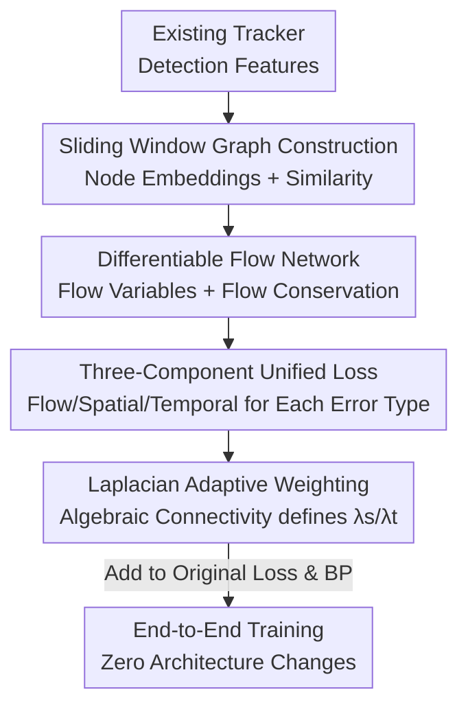

# UniTrack: Differentiable Graph Representation Learning for Multi-Object Tracking

**Conference**: ICLR 2026  
**OpenReview**: [https://openreview.net/forum?id=XpddZpGck9](https://openreview.net/forum?id=XpddZpGck9)  
**Code**: https://github.com/ostadabbas/UniTrack  
**Area**: Video Understanding / Multi-Object Tracking  
**Keywords**: Multi-Object Tracking, Graph Representation Learning, Differentiable Loss, Flow Conservation, Laplacian Adaptive Weighting

## TL;DR
UniTrack models multi-object tracking as a differentiable "graph flow network" and proposes a plug-and-play graph-theoretic loss function. It unifies detection accuracy, identity preservation, and spatiotemporal consistency into an end-to-end trainable objective. Without modifying any model architecture, it can be integrated into 7 existing trackers, reducing ID switches by up to 53% and increasing IDF1 by up to 12% across multiple benchmarks.

## Background & Motivation

**Background**: Mainstream training objectives for Multi-Object Tracking (MOT) optimize "detection" and "association" separately—using IoU/GIoU for detection and cross-entropy for classification, while identity association often relies on separate matching strategies during inference (e.g., confidence matching in ByteTrack or track query supervision in MOTR/TrackFormer). Recently, graph-based MOT methods (Neural Solver, SUSHI, GTR, DiffMOT) have emerged, but they focus on **redesigning tracking network architectures**, altering forward logic and inference pipelines.

**Limitations of Prior Work**: Existing training metrics excel at evaluating "bounding box accuracy" but fail to capture the complex coupling between "temporal stability × spatial awareness × identity preservation." Consequently, models with high detection accuracy often lose identities during occlusions, dense crowds, or fast motion. The authors categorize common errors into three types: **Type 1 ID Switch after occlusion** (losing identity when an object reappears), **Type 2 Temporal Inconsistency** (ID jumps during pose changes), and **Type 3 Inter-subject ID Swap** (identities swapped after two subjects cross).

**Key Challenge**: Detection and association losses are treated as independent objectives, preventing end-to-end joint optimization during training. The information flow between "accurate localization" and "correct identification" is severed. Meanwhile, existing graph methods introduce graph structures at the cost of "architectural rewrites," making them incompatible with established off-the-shelf systems.

**Goal**: Design a **universal training objective** that allows any existing MOT system to jointly optimize detection, spatial consistency, and temporal consistency without architectural changes, specifically targeting the three types of errors.

**Key Insight**: Re-frame tracking as a **flow conservation problem**—objects do not appear or disappear out of thin air; each detection corresponds to at most one ground-truth object over time. This is naturally modeled by a "flow network on a graph," where the Laplacian structure of the graph reflects whether a scene is "spatially coupled" or "motion-intensive," automatically determining the focus of consistency.

**Core Idea**: Instead of building a new architecture, create a **plug-and-play differentiable graph-theoretic loss**. A unified graph structure encodes spatial edges, temporal edges, and flow components, each addressing a specific error type. During training, this is simply added as an additional term to the original loss.

## Method

### Overall Architecture

UniTrack is not a tracking model but a **loss module** integrated into the training pipeline of existing trackers. Given a video segment of $T$ frames, it organizes detection features into a sequence of weighted directed graphs $G=\{G_t=(V_t, E_t, W_t)\}$ within a sliding window ($W=5$ frames). Each node $v_t^i$ represents object $i$ tracked at time $t$, and edges encode spatiotemporal relationships with weights $w_t^{ij}$ representing association strength.

The loss assembly follows three steps: (1) Constructing node embeddings from detection features; (2) Calculating pairwise similarity to form edge weights and flow variables $f_t^{ij}$; (3) Applying flow conservation constraints and optimizing the unified loss. This process is fully differentiable and integrates seamlessly into backpropagation. The unified loss consists of three complementary components, balanced by an adaptive weighting scheme based on the Graph Laplacian, followed by log-normalization for scene scaling.

### Key Designs

**1. Modeling Tracking as a Differentiable Flow Network with Flow Conservation**

The primary limitation addressed is that detection and association are optimized separately, with no mechanism ensuring that "one detection corresponds to exactly one real object over time," leading to identity drift during occlusions. UniTrack introduces a **balance variable** $b_t^i \in \{-1, 0, 1\}$ for each object $i$ at time $t$, representing trajectory birth (new object), continuation, or termination (exit). It also introduces a **flow variable** $f_t^{ij}$ representing the association strength between object $i$ at $t$ and object $j$ at $t+1$. The core constraint is flow conservation at each node:

$$\sum_{j\in N^+(i)} f_t^{ij} - \sum_{k\in N^-(i)} f_{t-1}^{ki} = b_t^i, \quad \forall i \in V_t$$

This ensures that "outflow - inflow = balance," encoding appearance/persistence/disappearance as valid flows. This transforms "identity continuity" from a post-processing matching problem into a physically consistent constraint optimizable during training. The graph computation is differentiable with a complexity of $O(n^2 t)$ (training only, ~5% VRAM increase) and introduces zero overhead during inference.

**2. Three-Component Unified Loss for Specific Error Types**

UniTrack defines three summatory loss terms, each precisely targeting a specific category of tracking errors:

$$L = L_{\text{flow}} + \lambda_s L_{\text{spatial}} + \lambda_t L_{\text{temporal}}$$

**Flow Loss $L_{\text{flow}}$ (Targets Type 1 ID Switch):** Encourages high-confidence associations while adaptively "scaling" trust based on detection quality: $L_{\text{flow}} = -\sum_{(i,j)} w^{ij} f_t^{ij}\cdot \exp\!\big(-\alpha\frac{|FP|}{|P|}-\alpha\frac{|FN|}{|GT|}\big)$. When detections are clean (low FP/FN), the exponential term approaches 1, fully trusting the learned associations. When detection quality degrades, the term decreases, automatically lowering the commitment to uncertain associations. A key engineering trick is treating FP/FN counts as constants during backpropagation (stop-gradient), so gradients only flow to $f_t^{ij}$, avoiding issues with non-differentiable discrete counts.

**Spatial Loss $L_{\text{spatial}}$ (Targets Type 3 Inter-subject ID Swap):** Penalizes associations over large spatial distances: $L_{\text{spatial}}=\sum_{(i,j)} w^{ij}\, d(p_t^i, p_{t+1}^j)\, f_t^{ij}$, where $d(\cdot,\cdot)$ is the geometric distance between cross-frame coordinates and $w^{ij}$ is the learnable spatial attention weight. This enforces consistent associations for objects with similar spatial relationships, preventing identity swaps during crossovers.

**Temporal Loss $L_{\text{temporal}}$ (Targets Type 2 Temporal Inconsistency):** Penalizes sudden velocity changes: $L_{\text{temporal}}=\frac{1}{\Delta t}\sum_i \lVert v_t^i - v_{t-1}^i\rVert_2^2 \sum_{j} f_t^{ij}$. It uses the "persistence confidence" (sum of outgoing flow units) as a weight to encourage smooth motion and suppress ID jumps caused by pose variations. The final loss is log-normalized: $L_{\text{final}}=L\cdot\log(|E|+1)$ to scale the magnitude relative to scene complexity.

**3. Laplacian Adaptive Weighting for Automatic Spatiotemporal Balancing**

Tuning $\lambda_s/\lambda_t$ manually is difficult as crowded scenes favor spatial weights while fast-motion scenes favor temporal weights. UniTrack uses the **algebraic connectivity** (the second smallest eigenvalue $\sigma_2$) of the Graph Laplacian to measure the connectivity strength of the spatial graph $L_s$ and temporal graph $L_t$. Lower connectivity indicates fragmented relationships requiring higher weights to repair:

$$\lambda_s = \frac{\sigma_2(L_s)^{-1}}{\sigma_2(L_s)^{-1}+\sigma_2(L_t)^{-1}}, \quad \lambda_t = \frac{\sigma_2(L_t)^{-1}}{\sigma_2(L_s)^{-1}+\sigma_2(L_t)^{-1}}$$

Crucially, these weights are **not learnable parameters**. Instead, they are recalculated at each training step from the current graph structure. As model parameters $\theta$ and embeddings evolve, the Laplacian and weights refresh, creating an adaptive loop: "parameters → graph → weights → loss → parameters." When spatial relations fragment ($\sigma_2(L_s)$ is small), $\lambda_s$ automatically increases to strengthen spatial consistency.

### Loss & Training

The core loss $L_{\text{final}}$ is added as an **additional term** to the baseline's original loss. All other hyperparameters and protocols follow the baseline. Key hyperparameters include the detection error coefficient $\alpha=0.9$, window size $W=5$, and an initial adaptive weight learning rate of $\eta=0.01$ (decayed per baseline schedule). The authors provide a convergence theorem (Thm 1) demonstrating differentiability and local convergence under standard regularity conditions.

## Key Experimental Results

### Main Results

UniTrack (UT-) was applied to 6 representative architectures across MOT17 / MOT20 / SportsMOT / DanceTrack, covering paradigms like end-to-end transformers, joint detection-tracking, and tracking-by-detection:

| Dataset | Model | MOTA↑ | IDF1↑ | HOTA↑ | IDs↓ |
|--------|------|-------|-------|-------|------|
| MOT17 | GTR | 75.3 | 71.5 | 59.1 | 1445 |
| MOT17 | UT-GTR | **79.1** (+3.8) | **74.8** (+3.3) | **67.9** (+8.8) | **951** (−34%) |
| MOT17 | Trackformer | 62.3 | 57.6 | 52.8 | 643 |
| MOT17 | UT-Trackformer | **65.9** | **66.4** | **56.2** | 705 |
| SportsMOT | GTR | 74.8 | 61.3 | 54.4 | 2364 |
| SportsMOT | UT-GTR | **84.5** (+9.7) | **73.6** (+12.3) | **66.1** (+11.7) | **1092** (−53.8%) |
| DanceTrack | ByteTrack | 88.2 | 51.9 | 47.1 | 3456 |
| DanceTrack | UT-ByteTrack | **91.3** (+3.1) | **56.5** (+4.6) | **49.1** | **2134** (−38.2%) |

Notable highlights: UT-GTR improved MOTA by +9.7% and IDF1 by +12.3% on SportsMOT, while cutting ID switches by 53.8%. UniTrack also helped Trackformer reduce FP by ~47% and FN by ~24%.

### Ablation Study

Component ablation on MOT17 (Trackformer) and weighting strategy comparison (GTR):

| Configuration | MOTA↑ | IDF1↑ | HOTA↑ | IDs↓ | Description |
|---------------|-------|-------|-------|------|-------------|
| Full (flow+spat+temp) | 56.2 | 64.1 | 57.7 | 288 | Full Loss |
| w/o $L_{\text{flow}}$ | 52.9 | 61.3 | 55.3 | 314 | Largest drop in MOTA |
| w/o $L_{\text{spatial}}$ | 54.3 | 62.9 | 56.3 | 213 | - |
| w/o $L_{\text{temporal}}$ | 58.3 | 62.1 | 51.5 | 380 | Significantly worse HOTA/IDs |
| Fixed (λ=0.5) | 76.8 | 72.1 | 65.4 | 1087 | Constant weights |
| Learned (rand) | 77.5 | 73.2 | 66.2 | 1023 | Randomly initialized learnable weights |
| Laplacian (Ours) | **79.1** | **74.8** | **67.9** | **951** | Laplacian Adaptive Weighting |

### Key Findings

- **Component Synergies**: Removing $L_{\text{flow}}$ impacts detection accuracy (MOTA) most severely. Removing $L_{\text{temporal}}$ causes HOTA to drop and IDs to spike, proving temporal consistency is vital for identity stability.
- **Superiority of Laplacian Weighting**: Adaptive weights based on graph connectivity (IDs 951) outperform both fixed (1087) and learned (1023) weights, as they better accommodate varying scene complexities.
- **Higher Gains in Difficult Scenes**: The most significant improvements occurred in SportsMOT (IDF1 +12.3%), characterized by fast motion and frequent occlusions, validating the design's effectiveness against motion abruptness.

## Highlights & Insights

- **Plug-and-play with zero architectural changes** is the primary advantage. By reducing graph theory from an architectural innovation to a training enhancement, UniTrack delivers gains across disparate frameworks without inference overhead.
- **Stop-gradient for non-differentiable statistics**: The use of FP/FN counts as loss coefficients while treating them as constants during backpropagation is a clever trick for incorporating non-differentiable quality metrics into gradient-based optimization.
- **Elegant bridge between spectral graph theory and MOT**: Using the second smallest eigenvalue ($\sigma_2$) to determine spatiotemporal weighting gracefully replaces manual tuning with a mathematically grounded measure of graph connectivity.
- **Physical realization of identity continuity**: By explicitly encoding life cycles via flow conservation ($b_t^i$), the model treats "one detection per object" as an optimizable hard constraint, fundamentally addressing identity drift.

## Limitations & Future Work

- **Training Overhead**: The $O(n^2 t)$ complexity adds ~5% VRAM usage, which could escalate in extremely dense scenes, though this is restricted to the training phase.
- **Dependency on Detection Quality**: Since $L_{\text{flow}}$ relies on FP/FN estimated coefficients, if the baseline detector is extremely poor, the adaptive trust mechanism may over-suppress associations.
- **Metric Trade-offs**: In specific configurations (e.g., Trackformer), certain metrics like IDs might slightly increase while others improve, suggesting inherent trade-offs in consistency enforcement.
- **Future Directions**: Exploring more granular weighting at the object or edge level, or relaxing flow conservation into a soft constraint to better handle heavy detection noise.

## Related Work & Insights

- **vs Graph MOT (Neural Solver, GTR)**: While previous works modify the **inference architecture**, UniTrack focuses on the **training loss**, making it compatible with any architecture.
- **vs End-to-End Transformers (MOTR, TrackFormer)**: While these models use track query matching, UniTrack provides a more holistic graph loss that explicitly couples detection, space, and time.
- **vs ByteTrack**: ByteTrack improves association during inference; UniTrack optimizes the underlying representation during training to handle the same challenges (occlusion/noise).

## Rating
- Novelty: ⭐⭐⭐⭐⭐ Plug-and-play differentiable graph loss with Laplacian adaptation is a highly novel perspective.
- Experimental Thoroughness: ⭐⭐⭐⭐ Validated across 6 architectures and 4 benchmarks, though some trade-offs exist between metrics.
- Writing Quality: ⭐⭐⭐⭐ Clear mapping between error types and loss components.
- Value: ⭐⭐⭐⭐⭐ High practical value due to extremely low integration cost for significant performance gains.

<!-- RELATED:START -->

<!-- RELATED:END -->

## Related Papers

- [\[ICLR 2026\] From Vicious to Virtuous Cycles: Synergistic Representation Learning for Unsupervised Video Object-Centric Learning](from_vicious_to_virtuous_cycles_synergistic_representation_learning_for_unsuperv.md)
- [\[CVPR 2026\] Hypergraph-State Collaborative Reasoning for Multi-Object Tracking](../../CVPR2026/video_understanding/hypergraph-state_collaborative_reasoning_for_multi-object_tracking.md)
- [\[AAAI 2026\] PlugTrack: Multi-Perceptive Motion Analysis for Adaptive Fusion in Multi-Object Tracking](../../AAAI2026/video_understanding/plugtrack_multi-perceptive_motion_analysis_for_adaptive_fusion_in_multi-object_t.md)
- [\[CVPR 2025\] OmniTrack: Omnidirectional Multi-Object Tracking](../../CVPR2025/video_understanding/omnidirectional_multi-object_tracking.md)
- [\[CVPR 2026\] ProgTrack: A Multi-Object Tracking Algorithm with Progressive Matching Strategy](../../CVPR2026/video_understanding/progtrack_a_multi-object_tracking_algorithm_with_progressive_matching_strategy.md)

<!-- RELATED:END -->
