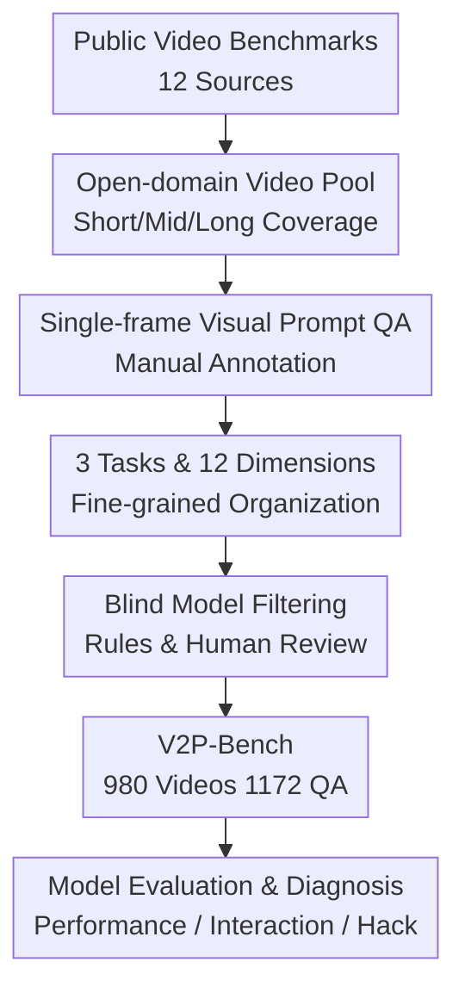

# V2P-Bench: Evaluating Video-Language Understanding with Visual Prompts for Better Human-Model Interaction

**Conference**: ICLR2026  
**OpenReview**: [https://openreview.net/forum?id=l85ODqN0sc](https://openreview.net/forum?id=l85ODqN0sc)  
**Code**: https://github.com/gaotiexinqu/v2p-bench  
**Area**: Video Understanding  
**Keywords**: Video-Language Understanding, Visual Prompts, Human-Model Interaction, Multimodal Evaluation, Spatiotemporal Understanding

## TL;DR
V2P-Bench constructs a human-model interaction evaluation benchmark for video visual prompt understanding. Using 980 videos and 1172 QA samples with manually annotated visual prompt frames, it systematically examines whether LVLMs can perform fine-grained video understanding based on user-indicated "targets/moments." The study finds that while current models exhibit zero-shot understanding of some visual prompts, they significantly lag behind humans in spatiotemporal relations, long videos, and honesty in refusing to answer.

## Background & Motivation
**Background**: Large Video Vision-Language Models (LVLMs) have evolved from early video QA and action recognition to being capable of handling long videos, multi-turn interactions, and complex video reasoning. Benchmarks such as Video-MME, LongVideoBench, LVBench, and MVBench cover various lengths, task types, and open-domain video sources, becoming the primary tools for measuring LVLM video capabilities.

**Limitations of Prior Work**: Most these evaluations still simplify "how humans tell the model where to focus" into text prompts. If a user wants to ask about a specific person, car, or fleeting action in a video, they must use complex language descriptions, such as "the second person from the left in black clothes who just got out of the car." This description is unnatural for users and unstable for models, as the model must first decode the text reference into a visual target before performing localization and reasoning in the video. Multiple targets, similar objects, camera cuts, and long videos amplify this process into systematic errors.

**Key Challenge**: In real human-model interaction, users prefer to directly circle, click, or draw on a target. However, current video evaluations mainly test text-referring capabilities rather than the model's ability to understand visual prompts drawn by users on video frames. While works like INST-IT and VideoRefer have introduced visual prompts, they often rely on video segmentation data where prompts appear on all frames, and the videos are short with limited sources—far from the real interaction of "user labeling once on a keyframe."

**Goal**: The authors aim to redefine the evaluation problem as: "Given a video, a frame with a visual prompt, and a question, can the model answer based on the annotated target?" This requires the benchmark to cover short/medium/long videos, diverse prompt shapes, varied video types, and task dimensions ranging from basic perception to spatiotemporal and high-level reasoning. Furthermore, samples that can be guessed via common sense or text alone must be excluded through filtering and human quality control.

**Key Insight**: The paper views visual prompts as an input form closer to human interaction habits rather than just a data annotation format. A key design is providing only one visual prompt frame per QA: this is lighter than frame-by-frame annotation and better simulates the user action of pausing a video and circling a target on a specific frame.

**Core Idea**: V2P-Bench uses a manually constructed single-frame visual prompt QA benchmark to push video understanding evaluation from "understanding text references" to "understanding objects and moments directly marked by users in videos."

## Method
### Overall Architecture
V2P-Bench does not propose a new model but rather a benchmark construction and diagnostic pipeline. Inputs are derived from 12 existing public video datasets. The authors first reorganize video types and duration distributions, then manually annotate a visual prompt frame for each question, and finally obtain 1172 high-quality multiple-choice QA pairs through blind model filtering, rule checking, and human review. On the evaluation side, sampled video frames, the visual prompt frame, and the question are provided to the LVLM to analyze performance across tasks, video lengths, prompt types, and hack behaviors.

### Key Designs
**1. Single-frame Visual Prompt Evaluation: Embedding User Interaction Constraints**

The most critical constraint of V2P-Bench is that only one visual prompt frame is allowed per QA pair. While this provides less information than frame-by-frame annotation, it closer mimics real interaction: users typically pause at a specific moment and use rectangles, arrows, scribbles, or points to tell the model "I am asking about this." If the benchmark labeled the target in every frame, it would introduce strong supervision trajectories and become unrealistic in terms of user effort.

This design places the difficulty on two levels. First, the model must understand the circled target or region on the visual prompt frame. Second, it must associate this target with the video context, such as determining what the person did before, what happened after, or which direction the object is moving. Thus, V2P-Bench does not just test "understanding a box" but tests whether the model can integrate a local visual reference into a complete video temporal sequence.

**2. Three Tasks and Twelve Dimensions: Deconstructing Video Visual Prompt Understanding**

The paper organizes samples into three major tasks: Basic Perception, Temporal Understanding, and High-level Reasoning, covering twelve dimensions. Basic Perception includes object attributes and human attributes, checking if the model can identify local properties like color, shape, action, and clothing. Temporal Understanding includes forward timing, reverse timing, action sequences, spatial relationships, object directions, feature mapping, and counting. High-level Reasoning covers causal relationships, plot understanding, and counterfactual reasoning.

The value of this dimensional design is that it avoids the misinterpretation caused by a single average score. For instance, if a model scores high on object attributes but low on Object Direction, Spatial Relationship, or Action Sequence, it suggests the model can read the prompt frame but has not mastered spatiotemporal evolution. Subsequent experiments utilize this to find that current models generally exceed 50% in basic perception but struggle with object motion and dynamic spatial relations.

**3. Data Construction & Quality Control: Minimizing "Guessing" via Blind Model Filtering**

V2P-Bench starts from 12 video datasets, covering 20 video types, and organizes samples into short ( < 3 min), medium (3 to 30 min), and long (30 to 120 min) videos, with an average length of 19 minutes. Both QA and visual prompts are manually annotated by researchers fluent in English. Prompt types are predefined into 8 categories: rectangle, mask contour, ellipse, triangle, scribble, point, arrow, and Set-of-Mark. Each prompt must be unique and consistent with the question, avoiding textual descriptions of the target's appearance.

Quality control is vital. The authors had GPT-4o and Gemini-1.5-Pro perform two rounds of low-temperature reasoning using only the text QA without video. Questions answered correctly in both rounds were deemed reliant on common sense or language bias and filtered out. Rule checks and human reviews followed, including removing options with significant length differences, shuffling option orders, and balancing A/B/C/D distributions. The final 1172 QA pairs (from an initial 1747) have a balanced distribution (approx. 28.0%, 23.9%, 25.0%, 23.1%), ensuring evaluation measures capability rather than option bias.

**4. Hack Behavior Diagnosis: Distinguishing "Correct Answers" from "True Understanding"**

The paper analyzes "hack phenomena" specifically. "Hack" refers to models still selecting an option according to instructions even when video information is insufficient or the question does not match the video, inflating MCQ scores via guessing. By randomly shuffling video-question pairs, the authors found that Qwen2.5-VL-7B and MiMo-VL-7B triggered refusal rates of only 6.4% and 3.9%, indicating they continue to answer even without evidence.

To quantify this, the authors required models to output $Z$ when information was insufficient. The results showed the hack ratio increased with video length and decreased as sampling frames decreased. For example, with 4 sampled frames, Qwen2.5-VL-7B's hack ratio for short/medium/long videos reached 11.1%, 23.0%, and 33.8%, respectively. As sampling frames dropped from 128 to 4, the average hack ratio increased from 8.0% to 18.7%. This suggests that benchmark scores under sparse sampling for long videos may contain significant "forced selection" components.

### A Complete Example
Suppose a video shows multiple people in a kitchen, and a user cares about a person pointed to by an arrow in one frame. A traditional text prompt might need to be: "What did the person standing to the left of the table, wearing dark clothes, who just picked up a cup, do next?" The model must parse the target from text then find the person in the video. If multiple people wear dark clothes, the text reference becomes ambiguous.

In the V2P-Bench setting, the user simply points an arrow at the target on a representative frame. The question simplifies to "What did the person pointed to by the arrow do next?" The model receives the video frames, the visual prompt frame, and the question. For a Forward Temporal dimension, the model must locate the person in the prompt frame and track their actions forward in time. For Reverse Temporal, it must look back at what they did before. This illustrates the core mission: visual prompts reduce the textual reference burden without lowering the difficulty of video understanding itself.

## Key Experimental Results

### Main Results
The authors evaluated 15 LVLMs, including 3 closed-source models (o1, GPT-4o, Gemini-1.5-Pro) and 12 open-source models (LLaVA-OneVision, LLaVA-Video, InternVL3, Qwen2.5-VL, etc.). Human experts served as the upper bound.

| Model / Setting | Avg | OA | OD | SR | AS | Main Conclusion |
|--------|------|------|------|------|------|----------|
| Human Performance | 88.3 | 92.2 | 84.8 | 92.0 | 75.4 | Humans still lead significantly in visual prompt video QA |
| o1 | 71.8 | 85.2 | 23.1 | 64.1 | 50.0 | Strongest average among closed-source, weak in object direction |
| Gemini-1.5-Pro | 69.8 | 84.0 | 68.2 | 67.5 | 47.4 | Strong in spatiotemporal direction, weak in counterfactual reasoning |
| GPT-4o | 65.4 | 76.6 | 41.3 | 54.0 | 50.0 | Stable but large gap from humans |
| InternVL3-8B | 61.7 | 73.9 | 39.1 | 69.7 | 61.1 | Strongest overall among open-source models |
| Qwen2.5-VL-72B | 59.8 | 69.7 | 43.5 | 64.1 | 57.9 | Large model scale brings obvious benefits |
| LLaVA-NeXT-7B | 46.0 | 56.6 | 34.8 | 42.0 | 28.1 | Small models are significantly insufficient in complex temporal dimensions |

Comparative experiments between visual and text prompts showed that rewriting visual prompts into text descriptions significantly degrades model performance. User studies also indicated visual prompts are more "user-friendly," leading to faster task completion and higher satisfaction.

| Comparison | Text Prompt | Visual Prompt | Change |
|----------|----------|----------|------|
| GPT-4o Acc | 53.0 | 65.4 | +12.4 |
| Gemini-1.5-Pro Acc | 54.7 | 69.8 | +15.1 |
| User Completion Time | 25.2s | 18.1s | -7.1s |
| User Satisfaction | 5.3 | 7.5 | +2.2 |
| User Preference | 28.5% | 64.5% | Visual prompt significantly preferred |

### Ablation Study
Ablations and analyses focused on prompt types, video length, sampling rates, and hack behavior rather than internal model modules.

| Analysis Setting | Key Metric | Description |
|------|---------|------|
| Text-only Blind Answer | 1.4 - 9.6 | Models fail without video, indicating low linguistic bias |
| o1 Short/Mid/Long | 75.2 / 83.9 / 60.4 | Significant drop in long videos; sparse long-term sampling is a bottleneck |
| Qwen2.5-VL-7B Shuffled | 6.4% trigger ratio | Models rarely refuse to answer even for mismatched pairs |
| 4-frame Sampling Hack Ratio| 11.1 - 33.8 | Longer videos and sparser evidence lead to more guessing |
| Open-ended (OE) Shuffled | 96.7% trigger ratio | Models are more willing to refuse in OE than in MCQ |

Prompt shape experiments revealed that Rectangle often outperforms SoM, while Arrow is the weakest. Hand-drawn "doodle" shapes were slightly lower (0.7-0.8 points) than standard shapes. This suggests models are sensitive to prompt forms commonly seen in training or those with stable boundaries.

### Key Findings
- Visual prompts are both "model-friendly" and "user-friendly": they reduce user effort in constructing complex text and reduce model ambiguity, improving accuracy and interaction efficiency.
- Current LVLMs possess zero-shot visual prompt understanding, but primarily for local attributes. Performance drops sharply for object direction, dynamic spatial relations, and action sequences.
- Closed-source and larger models are generally stronger but do not solve all fine-grained problems. o1 has the highest average but scores only 23.1 in Object Direction.
- MCQ evaluation induces "hacks": models often guess an answer when evidence is scarce. Open-ended QA mitigates this but complicates automatic scoring.
- Models like LLaVA-NeXT-INST-IT, though trained on visual prompts, perform similarly to base versions, likely because training data only covers SoM or specific formats that differ from real-world single-frame interaction.

## Highlights & Insights
- V2P-Bench's positioning is clear: it doesn't just rank general video QA; it treats "how users point things out to models" as the evaluation object.
- The single-frame visual prompt is a clever constraint. It avoids turning the task into a semi-supervised trajectory problem while realistically simulating the user interaction of pausing a video to mark a target.
- The quality control is rigorous: blind model filtering and option balancing effectively reduce the space for "cheating" via language priors.
- The hack phenomena analysis is insightful, reminding us that high MCQ scores do not always equate to true understanding, especially under sparse sampling.

## Limitations & Future Work
- V2P-Bench lacks audio input. Many real-world video tasks require ambient sound or speech, limiting the benchmark's coverage of full interaction scenarios.
- The evaluation focuses on offline videos and single-turn QA, whereas real interaction is often multi-turn and continuous.
- The data scale is moderate (1172 QA pairs). While sufficient for diagnosis, larger scales would be needed for stable training.
- The input protocol (where the visual prompt frame is placed) might affect models differently based on context length and visual token compression methods.
- Defining hack behavior depends on the model's instruction-following for the "output Z" command. Future evaluations could incorporate evidence localization to reduce reliance on final option selection.

## Related Work & Insights
- **vs Video-MME / LongVideoBench**: These emphasize duration and tasks; V2P-Bench adds visual prompts to test fine-grained understanding of user-specified targets.
- **vs INST-IT / VideoRefer**: These often rely on short videos or frame-by-frame prompts; V2P-Bench focuses on open-domain, long-form videos and the single-frame interaction constraint.
- **vs ViP-LLaVA / Set-of-Mark**: While image visual prompts are established, this work extends the concept to the temporal domain, finding that tracking and long contexts introduce new challenges.

## Rating
- Novelty: ⭐⭐⭐⭐☆
- Experimental Thoroughness: ⭐⭐⭐⭐⭐
- Writing Quality: ⭐⭐⭐⭐☆
- Value: ⭐⭐⭐⭐⭐

<!-- RELATED:START -->

## Related Papers

- [\[ICLR 2026\] LLaVAction: Evaluating and Training Multi-modal Large Language Models for Action Understanding](llavaction_evaluating_and_training_multi-modal_large_language_models_for_action_.md)
- [\[ICCV 2025\] DynImg: Key Frames with Visual Prompts are Good Representation for Multi-Modal Video Understanding](../../ICCV2025/video_understanding/dynimg_key_frames_with_visual_prompts_are_good_representation_for_multi-modal_vi.md)
- [\[ICLR 2026\] RIVER: A Real-Time Interaction Benchmark for Video LLMs](river_a_real-time_interaction_benchmark_for_video_llms.md)
- [\[ICLR 2026\] EgoBrain: Synergizing Minds and Eyes For Human Action Understanding](egobrain_synergizing_minds_and_eyes_for_human_action_understanding.md)
- [\[AAAI 2026\] UVLM: Benchmarking Video Language Model for Underwater World Understanding](../../AAAI2026/video_understanding/uvlm_benchmarking_video_language_model_for_underwater_world_understanding.md)

<!-- RELATED:END -->
