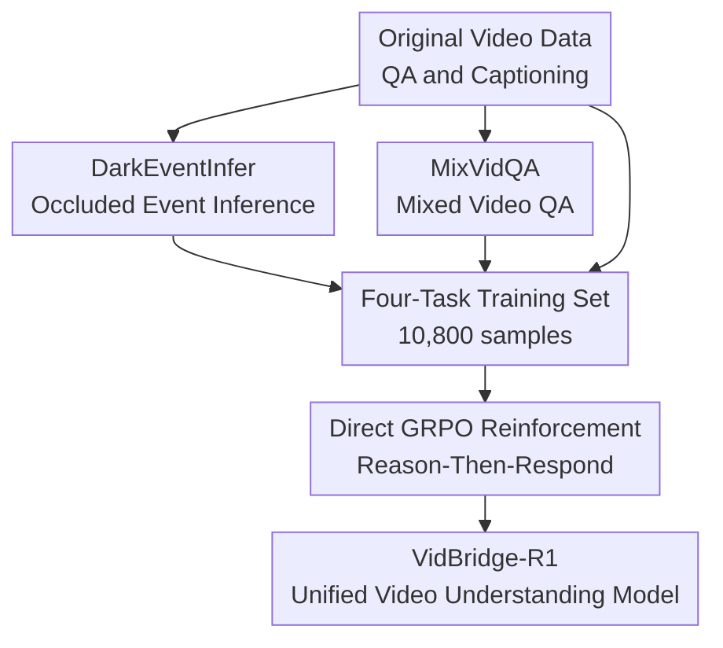

# VidBridge-R1: Bridging QA and Captioning for RL-based Video Understanding Models with Intermediate Proxy Tasks

**Conference**: ICLR 2026  
**OpenReview**: [https://openreview.net/forum?id=K7SdrTobcY](https://openreview.net/forum?id=K7SdrTobcY)  
**Code**: https://github.com/VidBridge-R1/VidBridge-R1  
**Area**: Video Understanding  
**Keywords**: Video Understanding, Reinforcement Learning, Video QA, Video Captioning, Intermediate Proxy Tasks

## TL;DR
VidBridge-R1 discovers a conflict between convergent answering in Video QA and divergent description in video captioning during RL training. It bridges these through two intermediate proxy tasks, DarkEventInfer and MixVidQA, simultaneously enhancing QA, reasoning, and captioning capabilities within a Reason-Then-Respond video model.

## Background & Motivation

**Background**: The Reason-Then-Respond paradigm has extended from pure text models to multimodal models. A common practice is for the model to expand reasoning within `<think>` tags before providing a final response in `<answer>` tags, optimized via reinforcement learning algorithms like GRPO. In image understanding, such training has yielded significant gains in math, geometry, detection, and grounding. Large video models like Video-R1, VideoRFT, and VideoChat-R1 have also emerged, attempting to transfer reasoning-based output to long-temporal, multi-event video scenarios.

**Limitations of Prior Work**: Existing video reasoning models often focus on a single task type. QA-centric models excel at locating a correct option or short answer but struggle to generate comprehensive, detailed video captions. Captioning-centric models strengthen fine-grained description but may sacrifice precise positioning in QA. Furthermore, simply mixing VideoQA and captioning data for RL does not naturally yield a versatile model; experimental results show that naive mixing leads to performance degradation across both tasks.

**Key Challenge**: The authors attribute this phenomenon to the opposing nature of QA and captioning during RL optimization. QA is a convergent task: the model must compress numerous visual cues into a low-entropy, unique, and deterministic answer. Captioning is a divergent task: the model aims for complete coverage of events, actions, scenes, and temporal details, resulting in naturally longer and higher-entropy outputs. Since RL rewards are typically global signals, cramming both objectives into the same optimization process causes the model to struggle between being "concise and accurate" versus "comprehensive and detailed."

**Goal**: This work aims to train a unified video understanding model rather than specialized models for QA and captioning. This model must retain Reason-Then-Respond reasoning capabilities while performing effectively across general understanding, complex reasoning, and fine-grained description. The training process seeks to avoid objective conflicts caused by simply mixing rewards.

**Key Insight**: Instead of directly adjusting the final task formats of QA or captioning, the authors insert proxy tasks that are closer to "comprehensive video understanding." These tasks do not demand a point-like answer (as in QA) nor are they completely open-ended (as in captioning), requiring the model to switch between holistic context understanding and key cue localization.

**Core Idea**: Use DarkEventInfer to train the model to infer occluded video events based on visible context, and MixVidQA to train the model to filter relevant segments from interlaced videos to answer questions. These two intermediate proxy tasks buffer the RL conflict between the convergent reasoning of QA and the divergent description of captioning.

## Method

### Overall Architecture

The training framework of VidBridge-R1 uses Qwen2.5-VL-7B-Instruct as the backbone. It bypasses initial SFT and instead uses GRPO to directly reinforce Reason-Then-Respond outputs on multi-task data. The training data consists of four parts: conventional VideoQA, captioning, DarkEventInfer, and MixVidQA. The former two familiarize the model with downstream task formats, while the latter two are the intermediate proxy tasks designed to bridge the task paradigms.

The process involves constructing two categories of video tasks that lie "between question answering and description" and placing them alongside VideoQA/captioning into the GRPO framework. Multiple responses with `<think>` and `<answer>` tags are sampled for each instance, rewards are calculated based on task types, and the policy model is updated using group-relative advantages. This ensures the model learns to provide unique answers while maintaining comprehensive context modeling of the video.

### Key Designs

**1. DarkEventInfer: Forcing Holistic Context Modeling via Occluded Event Inference**

DarkEventInfer targets the global understanding required for captioning. Instead of free-form description, a segment of the video is replaced with a black screen, requiring the model to infer the occluded event based on the preceding and succeeding visible clips. Utilizing event captions and timestamp annotations from the COIN dataset, an event is randomly selected and masked, and the model must answer "what likely happened during the black screen."

This task compresses divergent understanding into an evaluable inference problem. If the model only identifies individual visual objects, it cannot guess the missing step; it must understand action sequences, contextual causality, and event flows. For example, if fish is being prepared before and put into a pan after the occlusion, the missing event is likely seasoning the fish. This capability is closer to "understanding what a video is about," with rewards that are easier to define than open-ended captioning.

**2. MixVidQA: Training Relevant Segment Selection and Interference Suppression**

MixVidQA targets the precise localization required for QA. Approximately 10-second segments are taken from Kinetics, and two videos are randomly selected and interlaced at 1.5 to 2-second intervals to form a mixed video. Qwen2-VL-72B is then used to generate QA pairs pointing only to one of the original videos, followed by human verification to remove ambiguous or unreliable samples.

This task is more difficult than standard VideoQA because the model cannot simply look for salient objects; it must first determine which video source the question belongs to and ignore the other. The model faces selection at two levels: identifying the relevant stream and finding the answer cue within that stream. This design refines the "convergence to the correct answer" and teaches the model to filter out irrelevant information in complex inputs.

**3. Multi-task Data Filtering: Ensuring Discriminative Samples for GRPO**

GRPO relies on reward differences among multiple sampled responses to construct advantages. If a sample is too simple and all responses are correct, or if rewards are identical, the normalized advantage signal disappears, providing no training momentum. The authors use Qwen2.5-VL-7B to sample 5 responses at temperature 1.0, filtering out non-captioning samples where all responses are correct.

For captioning, the filtering differs because the reward is a continuous quality score. AutoDQ is used to calculate F1 scores for 5 candidate captions. If the F1 variance is less than 0.2, the sample is deemed insufficient for GRPO discrimination and discarded. The final training set includes 1,841 DarkEventInfer, 2,332 MixVidQA, 2,003 VideoQA, and 4,624 captioning samples, totaling 10,800 high-quality instances.

**4. Reward Design: Format Constraints as Task Reward Gates**

Different rewards are used for different tasks. DarkEventInfer uses Qwen2.5-72B as a judge, with scores for "fully correct," "partially correct without errors," and "incorrect" (rewards 2, 1, 0, respectively). MixVidQA and regular VideoQA are treated as discriminative tasks (1 for correct, 0 for incorrect). Captioning combines event-level recall/precision via AutoDQ with keyword rewards.

The caption reward is defined as $R_{AutoDQ}=Recall+\alpha \cdot Precision$ with $\alpha=0.5$. This encourages covering more events while penalizing hallucinations. Keyword rewards $R_{keywords}$ further encourage temporal terms and penalize speculative words, leading to $R_{Caption}=R_{AutoDQ}+\beta \cdot R_{keywords}$ ($\beta=0.2$). Formatting rewards are multiplicative: $R_{total}=R_{format}\cdot(R_{DarkEventInfer}+R_{MixVidQA}+R_{VideoQA}+R_{Caption})$. This prevents reward hacking where the model follows the format but gives wrong answers, or vice versa.

### Loss & Training

The training algorithm uses GRPO. For each question $q$, the old policy $\pi_{\theta_{old}}$ samples $G$ responses $\{o_1,o_2,...,o_G\}$ to obtain rewards $\{r_1,r_2,...,r_G\}$. The advantage for each response is:

$$
A_i=\frac{r_i-mean(\{r_1,r_2,...,r_G\})}{std(\{r_1,r_2,...,r_G\})}
$$

The policy is updated using a PPO-style clipped objective. Notably, no KL divergence term is used ($\lambda=0$), as the authors found that high-quality reasoning data and proxy tasks directly activate reasoning capabilities; additional SFT might compress the model into fixed templates.

Implementation details: Backbone is Qwen2.5-VL-7B-Instruct; 16 frames are sampled per video with a maximum resolution of $196\times28\times28$. GRPO samples 8 responses per question with a temperature of 1.0, learning rate of $1e^{-6}$, and batch size of 32. During inference, QA tasks use 1 fps sampling (max 128 frames), and captioning uses 16 uniform frames with a 2,048 token limit and greedy decoding.

## Key Experimental Results

### Main Results

| Task Category | Dataset / Metric | VidBridge-R1 | Strongest Baseline | Gain |
|--------|------|------|----------|------|
| General Video Understanding | Video-MME overall | 64.3 | 62.2 (VideoRFT) | +2.1 |
| General Video Understanding | LongVideoBench | 59.3 | 57.4 (VideoRFT) | +1.9 |
| Video Description | DREAM-1K F1 | 35.2 | 34.4 (Qwen2.5-VL reasoning) | +0.8 |
| Video Reasoning | MMVU | 54.7 | 52.4 (VideoRFT) | +2.3 |
| Video Reasoning | IntentQA | 97.1 | 94.9 (VideoRFT) | +2.2 |
| Proxy Task Gen. | DarkEventInfer-Test | 117.0 | 80.0 (Qwen2.5-VL-SFT) | +37.0 |
| Proxy Task Gen. | MixVidQA-Test | 49.0 | 33.0 (Qwen2.5-VL-SFT) | +16.0 |

Ours outperforms strong baselines like VideoRFT across Video-MME, LongVideoBench, and MVBench. In captioning, DREAM-1K F1 reaches 35.2 and VidCapBench accuracy hits 12.5, indicating a stable balance between accuracy and completeness.

### Ablation Study

| Task Combination | Video-MME | LongVideoBench | MMVU | DarkEventInfer-Test | DREAM-1K F1 |
|------|---------|------|------|------|------|
| Caption Only | 58.0 | 41.9 | 50.6 | 64.0 | 34.8 |
| VideoQA Only | 63.2 | 56.4 | 53.8 | 60.0 | 31.7 |
| VideoQA + Caption | 54.8 | 54.7 | 52.5 | 69.0 | 30.6 |
| VideoQA + DEI + MixVidQA | 63.8 | 58.6 | 54.1 | 121.0 | 32.2 |
| Full 4-Task Training | 64.3 | 59.3 | 54.7 | 117.0 | 35.2 |

The "VideoQA + Caption" ablation confirms the "objective conflict": mixing these directly results in worse performance than single-task training. Adding DarkEventInfer (DEI) and MixVidQA significantly restores and improves performance, validating their role as a buffer layer.

### Key Findings

- Forcing Qwen2.5-VL to use Reason-Then-Respond in QA without specific training degrades general understanding (e.g., Video-MME drops from 59.4 to 53.4).
- Output token entropy analysis reveals a significant entropy gap between captioning and QA. Naive mixing maintains this gap and pulls QA entropy higher. Proxy tasks successfully narrow this gap.
- VidBridge-R1 achieves a more robust trade-off between recall, precision, coverage, and conciseness in captioning.

## Highlights & Insights

- The work explicitly identifies the conflict between QA and captioning as divergent vs. convergent output entropy during RL.
- DarkEventInfer is a natural yet effective proxy: it possesses deterministic answers while forcing contextual understanding.
- MixVidQA explicitly models interference suppression, which is highly transferable to long-video and multi-subject scenarios.
- The multiplicative format reward gate is a practical design to prevent the model from learning format without substance.
- **Insight**: When two downstream tasks have conflicting reward structures, designing intermediate tasks to share cognitive foundations is often more effective than adjusting loss weights.

## Limitations & Future Work

- Both proxy tasks require sophisticated data construction and manual auditing to ensure validity.
- Reward judges depend heavily on large models (Qwen2.5-72B/GPT-3.5), introducing potential bias and high costs.
- The 7B backbone was validated, but the effectiveness of these proxy tasks across significantly different model scales or encoders remains to be explored.
- Human evaluations for video descriptions would further validate the quality beyond automated metrics like AutoDQ.

## Related Work & Insights

- **vs Video-R1 / VideoRFT**: These enhance QA but do not address the systematic conflict with captioning in RL frameworks.
- **vs VideoCap-R1**: While it focuses on captioning quality, it may not extend well to convergent answering.
- **Insight**: In multimodal RL, naive "reward mixing" often fails when task types are fundamentally different. Intermediate "bridge tasks" are more critical than hyperparameter tuning of reward weights.

## Rating

- Novelty: ⭐⭐⭐⭐☆
- Experimental Thoroughness: ⭐⭐⭐⭐☆
- Writing Quality: ⭐⭐⭐⭐☆
- Value: ⭐⭐⭐⭐⭐

<!-- RELATED:START -->

## Related Papers

- [\[ICLR 2026\] Invert4TVG: A Temporal Video Grounding Framework with Inversion Tasks Preserving Action Understanding Ability](invert4tvg_a_temporal_video_grounding_framework_with_inversion_tasks_preserving_.md)
- [\[ICLR 2026\] SPIKE-RL: Video-LLMs Meet Bayesian Surprise](spike-rl_video-llms_meet_bayesian_surprise.md)
- [\[CVPR 2026\] LongVideo-R1: Smart Navigation for Low-cost Long Video Understanding](../../CVPR2026/video_understanding/longvideo-r1_smart_navigation_for_low-cost_long_video_understanding.md)
- [\[ICLR 2026\] CaReBench: A Fine-grained Benchmark for Video Captioning and Retrieval](carebench_a_fine-grained_benchmark_for_video_captioning_and_retrieval.md)
- [\[ICLR 2026\] VUDG: A Dataset for Video Understanding Domain Generalization](vudg_a_dataset_for_video_understanding_domain_generalization.md)

<!-- RELATED:END -->
