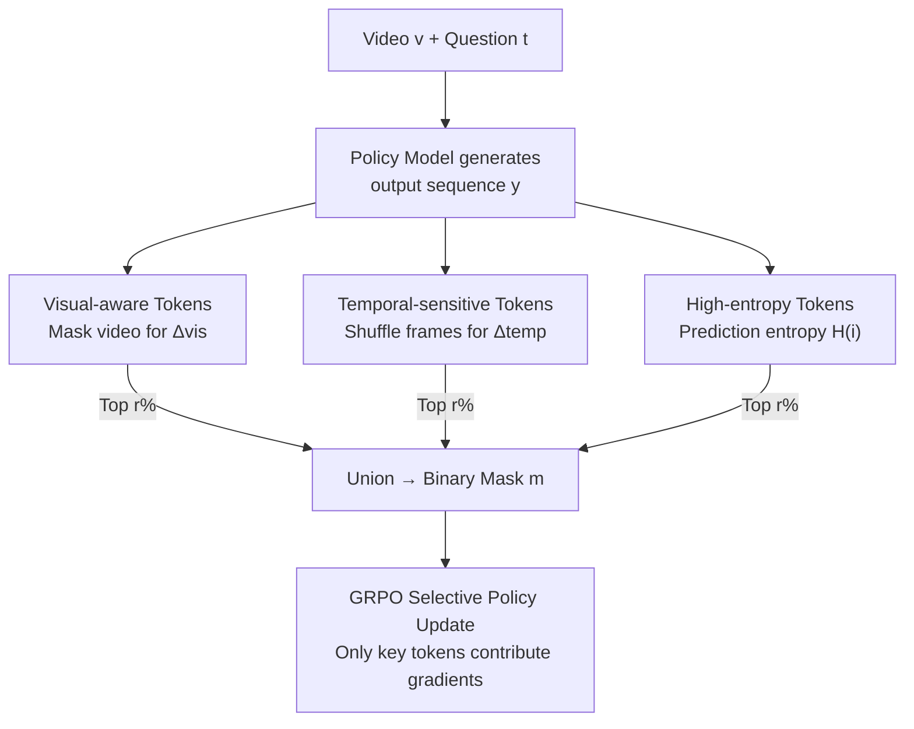

# Video-KTR: Reinforcing Video Reasoning via Key Token Attribution

**Conference**: ICLR 2026  
**arXiv**: [2601.19686](https://arxiv.org/abs/2601.19686)  
**Area**: Video Understanding  
**Keywords**: Video Reasoning, Reinforcement Learning, Token Attribution, Multimodal LLM, GRPO

## TL;DR

Ours proposes Video-KTR, a modality-aware policy shaping framework that identifies three types of key tokens—visual-aware, temporal-sensitive, and high-entropy—through counterfactual analysis. By performing selective reinforcement learning updates only on these tokens, the method achieves SOTA performance on multiple video reasoning benchmarks (42.7% on Video-Holmes, surpassing GPT-4o).

## Background & Motivation

Reinforcement Learning (RL) has shown great potential in enhancing the reasoning capabilities of multimodal LLMs. However, existing video reasoning methods suffer from three key flaws:

**Coarse-grained Rewards**: Dependency on sequence-level rewards fails to precisely guide which tokens require prioritized learning.

**Single Factor Selection**: Token selection based solely on entropy ignores modality-specific dependencies.

**Over-reliance on Language Priors**: Lack of fine-grained semantic alignment between visual inputs and output tokens increases the risk of hallucinations.

Prior methods like T-GRPO introduce temporal constraints (punishing predictions after frame shuffling), but serve as global coarse assumptions that ignore the fact that some tasks can be solved using static cues alone.

## Method

### Overall Architecture

Video-KTR grafts a modality-aware token-level shaping mechanism onto GRPO. First, the policy model generates an output for a given video and question. Then, it performs multi-perspective importance analysis for each output token to determine its dependence on visual features, temporal order, or its role as a point of reasoning uncertainty. Finally, a union of the top $r\%$ tokens from these three signals forms a binary mask. Only the key tokens within this mask participate in policy gradient updates, precisely directing sequence-level reward signals to the critical learning positions.

### Key Designs

**1. Visual-aware Tokens: Isolating "Visual-dependent" words via Counterfactual Masking**

A chronic issue with sequence-level rewards is the inability to distinguish whether the model is "looking" at the video or "fabricating" based on language priors. Video-KTR quantifies this via counterfactual masking: one forward pass is run with the full input, and another with video features zeroed out. The log-probability drop for the same target token $y_i$ is compared: $\Delta^{\text{vis}}_i = |\log \text{softmax}(\mathbf{z}^{\text{full}}_i)_{y_i} - \log \text{softmax}(\mathbf{z}^{\text{masked}}_i)_{y_i}|$. A large drop indicates the token strongly depends on visual evidence (e.g., "person", "door", "blue"), whereas a small drop suggests the word can be inferred via language alone. Prioritizing tokens with high $\Delta^{\text{vis}}_i$ aligns visual input with output semantics, mitigating hallucinations at the source.

**2. Temporal-sensitive Tokens: Capturing "Order-dependent" words via Frame Shuffling**

Many video problems hinge on event order and causality rather than single frames. However, selecting tokens based purely on frame importance misses this structure. Here, a different perturbation is used—shuffling frame order and comparing the log-probability difference: $\Delta^{\text{temp}}_i = |\log \text{softmax}(\mathbf{z}^{\text{ordered}}_i)_{y_i} - \log \text{softmax}(\mathbf{z}^{\text{shuffled}}_i)_{y_i}|$. Tokens with significant confidence drops after shuffling (e.g., "first", "then", "appear") are the true carriers of temporal judgment. This is more granular than the T-GRPO assumption of penalizing the entire sequence, as it acknowledges that some questions are solvable via static cues while focusing penalties only on order-sensitive tokens.

**3. High-entropy Tokens: Identifying Reasoning Decision Points via Uncertainty**

While visual and temporal signals capture "input dependency," certain words in the reasoning process mark points of hesitation or transition. Shannon entropy $\mathcal{H}(i) = -\sum_w p(z_i = w) \log p(z_i = w)$ is used to measure this uncertainty. High entropy suggests the model is swaying between candidates, often at discourse transitions like "however" or "wait." These positions are where reasoning chains most easily deviate and are most worth optimizing. Including them in the update set answers "where the model is thinking," complementing the other two signals.

### Loss & Training

Each of the three signals provides an importance ranking. The union of the top $r\%$ tokens from each path, $\mathcal{S} = \mathcal{S}_{\text{vis}} \cup \mathcal{S}_{\text{temp}} \cup \mathcal{S}_{\text{ent}}$, is used to construct a binary mask $m_{i,t}$ (1 for key tokens, 0 otherwise). This mask is integrated into the GRPO objective:

$$\mathcal{J}_{\text{Video-KTR}}(\theta) = \mathbb{E}\left[\frac{1}{G}\sum_{i=1}^G \frac{1}{|o_i|}\sum_{t=1}^{|o_i|} m_{i,t} \cdot \min(r_{i,t}\hat{A}_{i,t}, \text{clip}(r_{i,t})\hat{A}_{i,t})\right]$$

Only tokens where $m_{i,t}=1$ contribute to the gradient, filtering out low-information tokens like functional words and auxiliary verbs. Hard selection (binary mask) is used instead of soft weighting, as experiments showed the top-20% hard mask consistently outperformed Softmax, Sigmoid, linear, or exponential weighting. This mechanism is plug-and-play and can be attached to any GRPO-based RL training.

## Key Experimental Results

### Main Results: Cross-benchmark Comparison

| Model | Scale | Video-Holmes | VideoMMMU | MMVU(mc) | TempCompass | VideoMME |
|------|------|-------------|-----------|----------|-------------|---------|
| GPT-4o | — | 42.0 | 61.2 | 75.4 | 73.8 | 71.9 |
| GPT-5 | — | 46.7 | 84.6 | 82.6 | 83.3 | 86.7 |
| Video-R1 | 7B | 36.5 | 52.3 | 63.8 | 73.2 | 59.3 |
| TW-GRPO | 7B | 32.9 | 51.3 | 65.8 | 73.3 | 55.1 |
| **Video-KTR** | **7B** | **42.7** | **53.1** | **66.6** | **73.5** | **62.5** |

### Ablation Study: Attribution Signal Combinations

| Strategy | E | V | T | Video-Holmes | VideoMMMU | MMVU | Average |
|------|---|---|---|-------------|-----------|------|------|
| Vanilla GRPO | ✗ | ✗ | ✗ | 38.8 | 49.8 | 64.8 | 51.1 |
| T only | ✗ | ✗ | ✓ | 42.1 | 50.1 | 65.5 | 52.6 |
| V only | ✗ | ✓ | ✗ | 40.5 | 51.9 | 65.1 | 52.5 |
| V+E+T | ✓ | ✓ | ✓ | **41.6** | **52.6** | **65.9** | **53.4** |

### Key Findings

1. **Signal Complementarity**: Using any single signal outperforms vanilla GRPO, but the full combination yields the best results.
2. **Hard Selection > Soft Weighting**: The top-20% binary mask consistently outperformed varied soft weighting schemes.
3. **Linguistic Distribution**: Visual tokens are predominantly nouns (24.8%), temporal tokens are mostly verbs (21.2%), and entropy tokens show a higher proportion of adverbs (8.8%).
4. **Optimal Update Ratio**: A 20% ratio is best; higher ratios introduce noise, while lower ratios provide insufficient signal.

## Highlights & Insights

1. **Effective Use of Counterfactual Analysis**: Decouples visual and temporal dependencies naturally through visual masking and frame shuffling.
2. **Plug-and-play Design**: Video-KTR integrates seamlessly into any GRPO-based RL training process.
3. **7B Model Surpasses GPT-4o**: Achieving 42.7% vs 42.0% on Video-Holmes proves that fine-grained token-level optimization can bridge the gap in model scale.
4. **Analysis of Unselected Tokens**: Filtered low-information tokens are mainly functional words (auxiliaries, pronouns, prepositions), verifying that the attribution mechanism effectively filters redundancy.

## Limitations & Future Work

1. Counterfactual analysis requires extra forward passes (masking + shuffling), increasing training overhead.
2. Validation is limited to 7B scale models; returns on larger models remain unknown.
3. The token selection ratio $r$ is a fixed hyperparameter rather than an adaptive one based on sample difficulty.
4. Frame count is limited to 16-64 frames; performance on ultra-long videos is unverified.

## Rating ⭐⭐⭐⭐⭐

Excellent method design, solid experimental analysis, and significant performance gains. Shifting RL from coarse sequence-level rewards to fine-grained modality-aware token-level updates marks a significant advancement in RL training for video reasoning.

<!-- RELATED:START -->

## Related Papers

- [\[ICLR 2026\] Video-STAR: Reinforcing Open-Vocabulary Action Recognition with Tools](video-star_reinforcing_open-vocabulary_action_recognition_with_tools.md)
- [\[ICLR 2026\] A.I.R.: Adaptive, Iterative, and Reasoning-based Frame Selection For Video Question Answering](air_enabling_adaptive_iterative_and_reasoning-based_frame_selection_for_video_qu.md)
- [\[ICLR 2026\] FLoC: Facility Location-Based Efficient Visual Token Compression for Long Video Understanding](floc_facility_location-based_efficient_visual_token_compression_for_long_video_u.md)
- [\[ICML 2026\] Video-MTR: Reinforced Multi-Turn Reasoning for Long Video Understanding](../../ICML2026/video_understanding/video-mtr_reinforced_multi-turn_reasoning_for_long_video_understanding.md)
- [\[AAAI 2026\] R-AVST: Empowering Video-LLMs with Fine-Grained Spatio-Temporal Reasoning in Complex Audio-Visual Scenarios](../../AAAI2026/video_understanding/r-avst_empowering_video-llms_with_fine-grained_spatio-temporal_reasoning_in_comp.md)

<!-- RELATED:END -->
