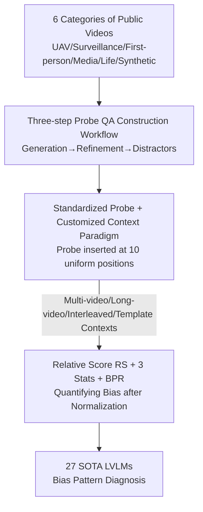

# Video-LevelGauge: Investigating Contextual Positional Bias in Video Language Models

**Conference**: ICLR 2026  
**OpenReview**: [https://openreview.net/forum?id=0V0bQi24YC](https://openreview.net/forum?id=0V0bQi24YC)  
**Code**: https://github.com/Cola-any/Video-LevelGauge (Available)  
**Area**: Video Understanding / Multimodal VLM / Evaluation Benchmark  
**Keywords**: Positional Bias, Video Large Language Models, Evaluation Benchmark, Standardized Probes, Context Length

## TL;DR
This paper proposes Video-LevelGauge, a benchmark specifically designed to evaluate the "contextual positional bias" of Large Video Language Models (LVLMs). By inserting standardized probe clips at different positions within a context, it uses relative scores and bias pattern recognition to quantify whether a model understands the same content consistently across locations. Evaluating 27 SOTA models, it reveals a prevalent preference for the head or near-end positions in open-source models.

## Background & Motivation

**Background**: Large Video Language Models (LVLMs) have advanced rapidly, accompanied by the emergence of numerous evaluation benchmarks (e.g., MVBench, TempCompass, MLVU, LongVideoBench). However, these benchmarks almost exclusively measure the **overall performance** of a model on an **entire video**, such as average accuracy for temporal reasoning or summarization tasks.

**Limitations of Prior Work**: Overall accuracy masks a critical yet neglected behavior: **contextual positional bias**. This refers to the phenomenon where a model's understanding of the same content and question varies simply because it appears at the beginning, middle, or end of a video sequence. As shown in the Figure 1 example: when asking "how many elephants there are," a model might answer correctly when the clip is at the start (100 points), fail to see them in the middle (10 points), and give an incorrect estimate at the end (50 points). Existing benchmarks provide almost no diagnostic information for this issue.

**Key Challenge**: Psychology's "serial position effect" suggests humans remember the start and end of sequences more easily, and LLMs exhibit the famous "lost in the middle" phenomenon. However, in **video understanding**, whether LVLMs (including those with memory modules, long-context training, or multimodal reasoning) possess positional bias, what patterns they follow, and how they behave in interleaved video-text contexts remain unexplored. A model claiming expertise in long video understanding should be verified for consistent and effective perception across the entire sequence.

**Goal**: To construct a diagnostic tool capable of **precise variable control** that cleanly isolates the "position" variable from confounding factors like "task difficulty" or "information leakage," thereby systematically characterizing positional bias.

**Key Insight**: Borrow the "needle-in-a-haystack" concept but use it in reverse. Instead of testing whether a "needle" can be found, a **standardized probe (Probe QA)** is inserted at different positions in the context to observe how the model's accuracy fluctuates. Since the probe itself is fixed, any fluctuation in accuracy can be **uniquely attributed** to its position.

**Core Idea**: Establish a "standardized probe + customized context" paradigm to isolate the position variable, paired with an analysis method involving relative scores and Bias Pattern Recognition (BPR) to specifically quantify contextual positional bias in LVLMs.

## Method

### Overall Architecture

The core paradigm of Video-LevelGauge is **standardized probe + customized context**. A "probe" consists of a carefully selected video clip and a polished question (MCQA or open-ended description) that requires actual video viewing to answer. During evaluation, the same probe is inserted at various positions (10 uniformly distributed positions) within an artificially constructed context. Accuracy differences across positions indicate the severity of positional bias.

The data flow involves: collecting 6 categories of videos from public datasets → constructing probe QAs through a three-step "auto-generation + manual refinement" workflow → inserting probes into 4 types of customized contexts → quantifying bias using Relative Score (RS), three statistical indicators, and Bias Pattern Recognition (BPR). The final benchmark includes 438 manually filtered videos, 1,177 MCQAs, and 120 open-ended descriptions across six tasks: OCR, attribute recognition, object recognition, counting, relationship recognition, and action recognition.

### Key Designs

**1. Standardized Probe + Customized Context Paradigm: Isolating Position from Difficulty**

To address the issue where existing benchmarks have dense questions in natural videos with varying difficulty and potential information leakage, this paper fixes the "needle" (Probe QA) and customizes the "haystack" (Context), changing only the insertion position. This provides: ① **Controlled variables**—eliminating confounding effects from difficulty or leakage; ② **Flexibility**—controllable context length and test positions; ③ **Scenario simulation**—simulating real-world scenarios by varying the "haystack." Four context types are used: Multi-video understanding, Long-video understanding, Multimodal interleaved input (mimicking RAG or multi-turn dialogue), and Template video backgrounds (initialized with ImageNet mean pixels as a control). Contexts consist of 9 videos totaling ~7.2 minutes, with fixed sampling of 6 frames per probe to isolate sampling effects.

**2. Probe QA Construction Workflow: Auto-generation + Manual Refinement**

A high-quality probe must be **visually sensitive**—it cannot be answered by common sense or text alone. The workflow involves: ① **QA Generation**—GPT-4o captions frames, followed by prompt engineering to generate task-related QAs based on manual definitions; ② **QA Refinement**—"Blind filtering" by LLMs to remove text-only answers, GPT-4o filtering for hallucinations, and final manual refinement; ③ **Distractor Construction**—LLMs generate deceptive distractors for MCQAs, verified manually to ensure no obvious patterns. Validation with Qwen2.5-VL-7B and InternVL3-8B showed text-only accuracy near random (25%), proving high reliance on visual perception.

**3. RS, Statistical Indicators, and BPR: Quantifying Severity and Pattern**

To account for inherent model capability differences, the **Relative Score** (RS) normalizes accuracy by the model's baseline performance:

$$RS_i = \frac{S_i}{S_{\text{meta}}}$$

where $S_i$ is the accuracy at position $i$, and $S_{\text{meta}}$ is the accuracy when the probe is input **alone** (the upper bound of understanding). Three **statistical indicators** are used: Position Mean $P_{\text{mean}}$, Position Range $P_{\text{ran}}$, and Position Variance $P_{\text{var}}$. Smaller $P_{\text{ran}}$ and $P_{\text{var}}$ indicate higher stability.

**Bias Pattern Recognition (BPR)** classifies models using polynomial fitting into five types: **Stable (—)**, **Head Preference (↘)**, **Near-end Preference (↗)**, **Lost-in-the-Middle (U)**, and **Violent Fluctuation (W)**.

## Key Experimental Results

### Main Results

27 SOTA LVLMs (6 commercial, 21 open-source) were evaluated. **Commercial models generally exhibit less positional bias than open-source models**, with Gemini 2.5 Pro being the most stable ($P_{\text{ran}}$ 2.0, $P_{\text{var}}$ 0.9).

| Model | Size | $P_{\text{mean}}\uparrow$ | $P_{\text{ran}}\downarrow$ | $P_{\text{var}}\downarrow$ | BPR | $S_{\text{meta}}\uparrow$ |
|------|------|------|------|------|------|------|
| Gemini 2.5 Pro† | - | 98.4 | 2.0 | 0.9 | — Stable | 81.7 |
| GPT-4o-latest | - | 98.1 | 2.9 | 1.4 | — Stable | 79.9 |
| GLM-4.5V† | 108B | 97.8 | 2.7 | 1.0 | — Stable | 79.9 |
| InternVL3 | 78B | 97.1 | 3.9 | 2.8 | — Stable | 74.2 |
| Qwen2.5-VL | 7B | 89.6 | 12.4 | 11.7 | U Lost-in-Middle | 68.2 |
| MiniGPT4-Video | 7B | 84.9 | 9.6 | 15.4 | ↘ Head Pref. | 49.3 |
| LLaMA-VID | 13B | 81.1 | 12.3 | 17.3 | W Fluctuation | 31.2 |

Key Observations: ① $S_{\text{meta}}$ (general capability) **does not correlate** with positional bias. ② Two-stage methods (frame description to LLM) often show the U-shape "lost-in-the-middle." ③ Multimodal reasoning models (GLM-4.5V) show minimal bias, with reasoning modes (†) further mitigating it.

### Analysis Study

| Dimension | Key Finding |
|---------|---------|
| Context Type | Finding 1: Bias is heavier in complex multimodal contexts. **Interleaved video-text and long text cause the most severe bias** due to a lack of training on mixed-modality long-context data. |
| Context Length | Finding 2: Bias scales with length, and patterns shift (e.g., Head Pref. → Lost-in-Middle → Near-end Pref.). |
| Model Scale | Finding 3: Bias significantly mitigates as model size increases (Scaling Law). |
| Tasks | Open-ended tasks show slightly more bias than MCQA as they require more granular perception. |

### Key Findings
- **High Performance ≠ Low Bias**: $S_{\text{meta}}$ is decoupled from positional bias, revealing a hidden dimension in traditional benchmarks.
- **Long-context Training Efficacy**: Models like LongVILA show that performance gains might come from seeing more data rather than improved structural understanding of long sequences.
- **Training Data Bias**: Preferences (e.g., Head Preference in MiniGPT4-Video) are often traceble to biases in training sets like WebVid where early frames are highly representative.

## Highlights & Insights
- **Reversed Needle-in-a-Haystack**: Fixing the probe and varying the context isolates position as the unique independent variable.
- **RS Normalization**: Normalizing by $S_{\text{meta}}$ allows for fair comparison of "consistency" between models of different strengths.
- **Actionable BPR Diagnosis**: Identifies specific failure modes (e.g., Head Preference) pointing toward data-level solutions.
- **Mixed Modality Vulnerability**: Identifies interleaved contexts as a major weakness for current models.

## Limitations & Future Work
- **Limitations**: MCQA may miss some nuances; open-ended questions are limited in number (120). The benchmark covers up to ~7.2 minute contexts, not yet reaching "hour-level" videos. Bias attribution remains somewhat speculative without controlled training experiments.
- **Future Work**: Evaluate bias-mitigation algorithms (e.g., cross-modal context retrieval, token compression). Integrate the probe paradigm into training loops as an online diagnostic signal.

## Related Work & Insights
- **Comparison with NIAH Benchmarks**: While others focus on "retrieval ability" (can you find the needle), this work focuses on "positional consistency" (is understanding uniform across positions).
- **Comparison with General Benchmarks**: This serves as a **complementary diagnostic**, measuring a dimension decoupled from average accuracy.
- **LLM Links**: Confirms that while LVLMs share the U-shape bias, mitigation strategies for LLMs cannot be directly transferred due to unique visual modality biases.

## Rating
- Novelty: ⭐⭐⭐⭐⭐ First systematic study of contextual positional bias in video understanding.
- Experimental Thoroughness: ⭐⭐⭐⭐⭐ 27 SOTA models evaluated across four analysis dimensions.
- Writing Quality: ⭐⭐⭐⭐ Clear motivation and metrics; some attributions are speculative.
- Value: ⭐⭐⭐⭐⭐ Identifies a critical blind spot in current evaluation and guides long-video model improvement.

<!-- RELATED:START -->

## Related Papers

- [\[ACL 2025\] Addressing Blind Guessing: Calibration of Selection Bias in Multiple-Choice Question Answering by Video Language Models](../../ACL2025/video_understanding/addressing_blind_guessing_calibration_of_selection_bias_in_multiple-choice_quest.md)
- [\[ICLR 2026\] LLaVAction: Evaluating and Training Multi-modal Large Language Models for Action Understanding](llavaction_evaluating_and_training_multi-modal_large_language_models_for_action_.md)
- [\[ICLR 2026\] Point Prompting: Counterfactual Tracking with Video Diffusion Models](point_prompting_counterfactual_tracking_with_video_diffusion_models.md)
- [\[ICLR 2026\] FlashVID: Efficient Video Large Language Models via Training-free Tree-Based Spatiotemporal Token Merging](flashvid_efficient_video_large_language_models_via_training-free_tree-based_spat.md)
- [\[ICLR 2026\] IF-VidCap: Can Video Caption Models Follow Instructions?](if-vidcap_can_video_caption_models_follow_instructions.md)

<!-- RELATED:END -->
